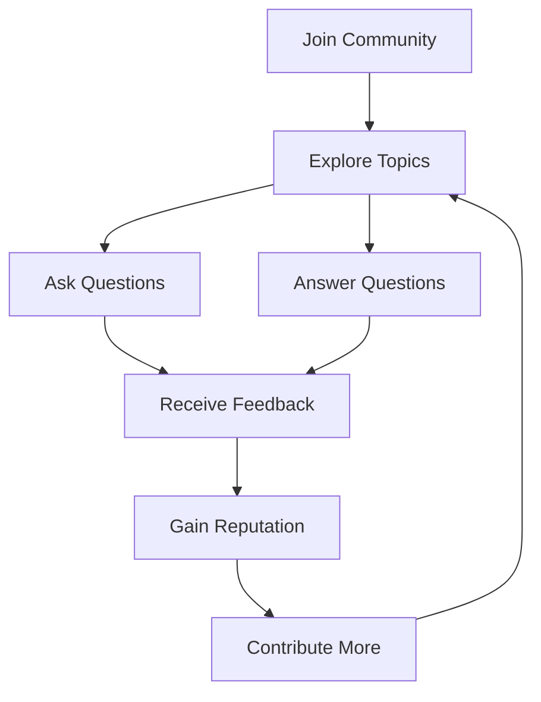

## 29.5 Online Communities and Forums

In the world of PHP development, staying connected with the community is crucial for continuous learning and growth. Online communities and forums provide a platform for developers to share knowledge, solve problems, and stay updated with the latest trends. This section explores various online communities and forums where PHP developers can connect, learn, and share their experiences.

### PHP Community Sites

#### PHP.net Forums

The [PHP.net Forums](https://www.php.net/support.php) are an official resource for PHP developers. These forums are a treasure trove of information, offering support and discussions on a wide range of PHP-related topics. Whether you're a beginner seeking help with basic syntax or an expert looking to discuss advanced topics like design patterns, PHP.net Forums provide a platform to engage with a global community of PHP enthusiasts.

- **Key Features:**
  - Access to official PHP documentation and updates.
  - Discussions on PHP releases, features, and best practices.
  - A platform for reporting bugs and suggesting improvements.

#### Laravel Forums

For developers working with the Laravel framework, the [Laravel Forums](https://laracasts.com/discuss) are an essential resource. These forums are part of the Laracasts platform, which offers a wealth of tutorials and courses on Laravel and PHP development.

- **Key Features:**
  - Community-driven discussions on Laravel-specific topics.
  - Access to Laracasts tutorials and resources.
  - A supportive environment for both beginners and experienced developers.

### Discussion Platforms

#### Reddit PHP

The [r/PHP](https://www.reddit.com/r/PHP/) subreddit is a vibrant community where PHP developers can share news, ask questions, and discuss various topics related to PHP development. With a diverse range of discussions, from beginner questions to advanced topics, Reddit PHP is a great place to stay informed and engage with the community.

- **Key Features:**
  - Community-driven discussions and Q&A.
  - Regular updates on PHP news and events.
  - A platform for sharing projects and seeking feedback.

#### Stack Overflow

Stack Overflow is a go-to platform for developers seeking solutions to specific coding problems. With a vast repository of questions and answers, Stack Overflow is an invaluable resource for PHP developers.

- **Key Features:**
  - A comprehensive database of PHP-related questions and solutions.
  - Community-driven voting system to highlight the best answers.
  - A platform for sharing knowledge and helping others.

### Engaging with the PHP Community

Engaging with online communities and forums is more than just seeking help; it's about contributing to the collective knowledge and growth of the PHP community. Here are some tips for effectively engaging with these platforms:

- **Be Active:** Regularly participate in discussions, ask questions, and provide answers. Active participation helps you stay updated and build a reputation within the community.
- **Share Knowledge:** If you've solved a problem or learned something new, share it with the community. Your insights could help others facing similar challenges.
- **Be Respectful:** Always maintain a respectful and professional tone in your interactions. Remember, these platforms are a place for learning and collaboration.
- **Stay Updated:** Follow discussions on the latest PHP trends, updates, and best practices. Staying informed helps you keep your skills relevant and up-to-date.

### Code Examples and Community Contributions

Online communities and forums are also a great place to share and discover code examples. Many developers contribute code snippets and projects that can serve as learning resources or inspiration for your own work. Here's an example of how you might share a code snippet in a forum:

```php
<?php
// Example of a simple Factory Method pattern in PHP
interface Product {
    public function getName(): string;
}

class ConcreteProductA implements Product {
    public function getName(): string {
        return "Product A";
    }
}

class ConcreteProductB implements Product {
    public function getName(): string {
        return "Product B";
    }
}

abstract class Creator {
    abstract public function factoryMethod(): Product;

    public function someOperation(): string {
        $product = $this->factoryMethod();
        return "Creator: The same creator's code has just worked with " . $product->getName();
    }
}

class ConcreteCreatorA extends Creator {
    public function factoryMethod(): Product {
        return new ConcreteProductA();
    }
}

class ConcreteCreatorB extends Creator {
    public function factoryMethod(): Product {
        return new ConcreteProductB();
    }
}

// Client code
function clientCode(Creator $creator) {
    echo "Client: I'm not aware of the creator's class, but it still works.\n"
        . $creator->someOperation() . "\n";
}

echo "App: Launched with the ConcreteCreatorA.\n";
clientCode(new ConcreteCreatorA());

echo "\n";

echo "App: Launched with the ConcreteCreatorB.\n";
clientCode(new ConcreteCreatorB());
?>
```

- **Explanation:** This code demonstrates the Factory Method pattern, which is a creational design pattern used to create objects without specifying the exact class of object that will be created. Sharing such examples can help others understand design patterns and their implementation in PHP.

### Visualizing Community Interactions

To better understand how online communities and forums function, let's visualize the interaction process using a flowchart:



- **Description:** This flowchart illustrates the cycle of engagement in online communities. By joining a community, exploring topics, asking and answering questions, and receiving feedback, developers can gain reputation and contribute more, creating a continuous cycle of learning and sharing.

### References and Further Reading

For those interested in diving deeper into PHP development and community engagement, here are some additional resources:

- [PHP: The Right Way](https://phptherightway.com/): A comprehensive guide to PHP best practices and standards.
- [PHP.net Documentation](https://www.php.net/docs.php): The official PHP documentation, a must-read for all PHP developers.
- [Laracasts](https://laracasts.com/): A platform offering video tutorials on Laravel and PHP development.

### Knowledge Check

To reinforce your understanding of online communities and forums, consider the following questions:

- What are the benefits of participating in online PHP communities?
- How can sharing code examples in forums enhance your learning experience?
- Why is it important to maintain a respectful tone in online discussions?

### Embrace the Journey

Remember, engaging with online communities and forums is just the beginning of your journey as a PHP developer. As you progress, you'll build connections, gain insights, and contribute to the growth of the PHP community. Keep exploring, stay curious, and enjoy the journey!

## Quiz: Online Communities and Forums



### What is the primary purpose of online PHP communities and forums?

- [x] To share knowledge and solve problems collaboratively.
- [ ] To compete with other developers.
- [ ] To promote personal projects exclusively.
- [ ] To avoid learning new concepts.

> **Explanation:** Online communities and forums are designed to foster collaboration, knowledge sharing, and problem-solving among developers.

### Which platform is known for its comprehensive database of PHP-related questions and solutions?

- [x] Stack Overflow
- [ ] Reddit PHP
- [ ] PHP.net Forums
- [ ] Laravel Forums

> **Explanation:** Stack Overflow is renowned for its extensive repository of questions and answers related to PHP and other programming languages.

### What is a key feature of the Laravel Forums?

- [x] Access to Laracasts tutorials and resources.
- [ ] A platform for reporting PHP bugs.
- [ ] A voting system for answers.
- [ ] A focus on JavaScript development.

> **Explanation:** The Laravel Forums provide access to Laracasts tutorials and resources, making it a valuable platform for Laravel developers.

### How can developers gain reputation in online communities?

- [x] By actively participating in discussions and providing valuable answers.
- [ ] By criticizing others' code.
- [ ] By promoting their own projects.
- [ ] By remaining passive and observing.

> **Explanation:** Active participation and providing valuable contributions help developers gain reputation in online communities.

### What is an important aspect of engaging with online communities?

- [x] Maintaining a respectful and professional tone.
- [ ] Focusing solely on personal gain.
- [ ] Ignoring community guidelines.
- [ ] Avoiding feedback from others.

> **Explanation:** Respectful and professional interactions are crucial for maintaining a positive and collaborative environment in online communities.

### Which of the following is a benefit of sharing code examples in forums?

- [x] Enhancing learning and understanding of concepts.
- [ ] Keeping knowledge to oneself.
- [ ] Avoiding collaboration with others.
- [ ] Promoting personal projects exclusively.

> **Explanation:** Sharing code examples helps enhance learning and understanding by allowing others to provide feedback and insights.

### What is a common feature of the PHP.net Forums?

- [x] Discussions on PHP releases and best practices.
- [ ] A focus on JavaScript frameworks.
- [ ] Exclusive content for paid members.
- [ ] A platform for promoting personal projects.

> **Explanation:** The PHP.net Forums focus on discussions related to PHP releases, features, and best practices.

### What is the role of feedback in online communities?

- [x] To help improve and refine solutions.
- [ ] To criticize and discourage others.
- [ ] To promote personal projects.
- [ ] To avoid learning new concepts.

> **Explanation:** Feedback plays a crucial role in improving and refining solutions, fostering a collaborative learning environment.

### How can developers stay updated with the latest PHP trends?

- [x] By following discussions in online communities and forums.
- [ ] By avoiding online interactions.
- [ ] By focusing solely on personal projects.
- [ ] By ignoring community updates.

> **Explanation:** Engaging with online communities and forums helps developers stay informed about the latest trends and updates in PHP development.

### True or False: Online communities and forums are only beneficial for beginners.

- [ ] True
- [x] False

> **Explanation:** Online communities and forums are beneficial for developers of all levels, providing opportunities for learning, sharing, and collaboration.


