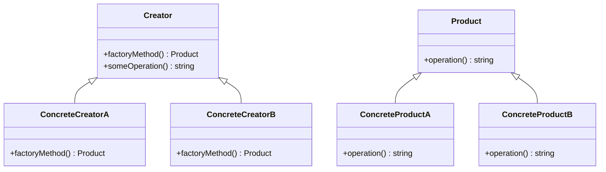

## 29.6 Frequently Asked Questions (FAQ)

Design patterns are a crucial part of software development, offering tried-and-tested solutions to common problems. In this section, we address some of the most frequently asked questions about design patterns in PHP, providing clarity and guidance for developers looking to enhance their understanding and application of these patterns.

### Addressing Common Queries

#### How do I choose between similar design patterns?

Choosing the right design pattern can be challenging, especially when patterns seem similar. Here are some guidelines to help you make an informed decision:

1. **Understand the Intent**: Each design pattern has a specific intent or purpose. For example, both the Factory Method and Abstract Factory patterns deal with object creation, but the Factory Method is used when a class delegates the responsibility of object instantiation to subclasses, while the Abstract Factory is used to create families of related objects without specifying their concrete classes.

2. **Analyze the Problem Context**: Consider the specific problem you are trying to solve. Patterns like Strategy and State might seem similar, but Strategy is used to define a family of algorithms and make them interchangeable, while State is used to allow an object to alter its behavior when its internal state changes.

3. **Evaluate Flexibility and Scalability**: Some patterns offer more flexibility and scalability than others. For instance, the Decorator pattern provides a flexible alternative to subclassing for extending functionality, while the Adapter pattern is used to make incompatible interfaces work together.

4. **Consider Implementation Complexity**: Some patterns are more complex to implement than others. Choose a pattern that balances the complexity with the benefits it provides. For example, the Singleton pattern is simple to implement but can lead to issues with testing and concurrency.

5. **Review Existing Codebase**: If you are working within an existing codebase, consider the patterns already in use. Consistency can reduce complexity and improve maintainability.

#### What's the best way to learn and implement design patterns?

Learning and implementing design patterns effectively requires a structured approach:

1. **Start with the Basics**: Begin by understanding the fundamental principles of object-oriented programming (OOP) in PHP, such as encapsulation, inheritance, and polymorphism. These concepts are the foundation upon which design patterns are built.

2. **Study Classic Patterns**: Familiarize yourself with the classic design patterns described in the "Gang of Four" book. These patterns are widely used and provide a solid foundation for understanding more complex patterns.

3. **Practice with Real-World Examples**: Implement design patterns in small projects or exercises. This hands-on experience will help you understand how patterns work in practice and how they can be adapted to different scenarios.

4. **Explore Modern Patterns**: As you become comfortable with classic patterns, explore modern patterns and practices that have emerged with advancements in PHP and software development.

5. **Leverage Online Resources**: Utilize online resources such as tutorials, forums, and documentation to deepen your understanding. Websites like [SoftwarePatternsLexicon.com](https://SoftwarePatternsLexicon.com) offer comprehensive guides and examples.

6. **Participate in Code Reviews**: Engage in code reviews to see how others implement design patterns. This collaborative learning can provide new insights and techniques.

7. **Experiment and Iterate**: Don't be afraid to experiment with different patterns and iterate on your implementations. Learning from mistakes and successes is a key part of mastering design patterns.

### Clarifications

#### What are the differences between the Singleton and Multiton patterns?

The Singleton and Multiton patterns are both creational patterns that manage the instantiation of objects, but they serve different purposes:

- **Singleton Pattern**: Ensures that a class has only one instance and provides a global point of access to it. This pattern is useful when exactly one object is needed to coordinate actions across the system.

  ```php
  class Singleton {
      private static $instance;

      private function __construct() {
          // Private constructor to prevent direct instantiation
      }

      public static function getInstance() {
          if (self::$instance === null) {
              self::$instance = new self();
          }
          return self::$instance;
      }
  }

  // Usage
  $singleton = Singleton::getInstance();
  ```

- **Multiton Pattern**: Similar to the Singleton pattern, but allows for multiple instances, each identified by a unique key. This pattern is useful when you need to manage a fixed number of instances.

  ```php
  class Multiton {
      private static $instances = [];

      private function __construct() {
          // Private constructor to prevent direct instantiation
      }

      public static function getInstance($key) {
          if (!isset(self::$instances[$key])) {
              self::$instances[$key] = new self();
          }
          return self::$instances[$key];
      }
  }

  // Usage
  $multitonA = Multiton::getInstance('A');
  $multitonB = Multiton::getInstance('B');
  ```

#### How does the Factory Method pattern differ from the Abstract Factory pattern?

Both the Factory Method and Abstract Factory patterns are creational patterns that deal with object creation, but they differ in their approach and use cases:

- **Factory Method Pattern**: Defines an interface for creating an object, but lets subclasses alter the type of objects that will be created. It is used when a class cannot anticipate the class of objects it needs to create.

  ```php
  abstract class Product {
      abstract public function operation();
  }

  class ConcreteProductA extends Product {
      public function operation() {
          return "Result of ConcreteProductA";
      }
  }

  class ConcreteProductB extends Product {
      public function operation() {
          return "Result of ConcreteProductB";
      }
  }

  abstract class Creator {
      abstract public function factoryMethod(): Product;

      public function someOperation() {
          $product = $this->factoryMethod();
          return $product->operation();
      }
  }

  class ConcreteCreatorA extends Creator {
      public function factoryMethod(): Product {
          return new ConcreteProductA();
      }
  }

  class ConcreteCreatorB extends Creator {
      public function factoryMethod(): Product {
          return new ConcreteProductB();
      }
  }

  // Usage
  $creator = new ConcreteCreatorA();
  echo $creator->someOperation();
  ```

- **Abstract Factory Pattern**: Provides an interface for creating families of related or dependent objects without specifying their concrete classes. It is used when a system needs to be independent of how its objects are created.

  ```php
  interface AbstractFactory {
      public function createProductA(): AbstractProductA;
      public function createProductB(): AbstractProductB;
  }

  class ConcreteFactory1 implements AbstractFactory {
      public function createProductA(): AbstractProductA {
          return new ConcreteProductA1();
      }

      public function createProductB(): AbstractProductB {
          return new ConcreteProductB1();
      }
  }

  class ConcreteFactory2 implements AbstractFactory {
      public function createProductA(): AbstractProductA {
          return new ConcreteProductA2();
      }

      public function createProductB(): AbstractProductB {
          return new ConcreteProductB2();
      }
  }

  interface AbstractProductA {
      public function usefulFunctionA(): string;
  }

  class ConcreteProductA1 implements AbstractProductA {
      public function usefulFunctionA(): string {
          return "The result of the product A1.";
      }
  }

  class ConcreteProductA2 implements AbstractProductA {
      public function usefulFunctionA(): string {
          return "The result of the product A2.";
      }
  }

  interface AbstractProductB {
      public function usefulFunctionB(): string;
  }

  class ConcreteProductB1 implements AbstractProductB {
      public function usefulFunctionB(): string {
          return "The result of the product B1.";
      }
  }

  class ConcreteProductB2 implements AbstractProductB {
      public function usefulFunctionB(): string {
          return "The result of the product B2.";
      }
  }

  // Usage
  function clientCode(AbstractFactory $factory) {
      $productA = $factory->createProductA();
      $productB = $factory->createProductB();

      echo $productA->usefulFunctionA() . "\n";
      echo $productB->usefulFunctionB() . "\n";
  }

  clientCode(new ConcreteFactory1());
  ```

#### What is the difference between the Adapter and Decorator patterns?

The Adapter and Decorator patterns are structural patterns that deal with class and object composition, but they serve different purposes:

- **Adapter Pattern**: Allows objects with incompatible interfaces to work together. It acts as a bridge between two incompatible interfaces.

  ```php
  interface Target {
      public function request(): string;
  }

  class Adaptee {
      public function specificRequest(): string {
          return "Specific request.";
      }
  }

  class Adapter implements Target {
      private $adaptee;

      public function __construct(Adaptee $adaptee) {
          $this->adaptee = $adaptee;
      }

      public function request(): string {
          return $this->adaptee->specificRequest();
      }
  }

  // Usage
  $adaptee = new Adaptee();
  $adapter = new Adapter($adaptee);
  echo $adapter->request();
  ```

- **Decorator Pattern**: Adds new functionality to an object dynamically. It provides a flexible alternative to subclassing for extending functionality.

  ```php
  interface Component {
      public function operation(): string;
  }

  class ConcreteComponent implements Component {
      public function operation(): string {
          return "ConcreteComponent";
      }
  }

  class Decorator implements Component {
      protected $component;

      public function __construct(Component $component) {
          $this->component = $component;
      }

      public function operation(): string {
          return $this->component->operation();
      }
  }

  class ConcreteDecoratorA extends Decorator {
      public function operation(): string {
          return "ConcreteDecoratorA(" . parent::operation() . ")";
      }
  }

  class ConcreteDecoratorB extends Decorator {
      public function operation(): string {
          return "ConcreteDecoratorB(" . parent::operation() . ")";
      }
  }

  // Usage
  $simple = new ConcreteComponent();
  echo "Client: I've got a simple component:\n";
  echo $simple->operation() . "\n";

  $decorator1 = new ConcreteDecoratorA($simple);
  $decorator2 = new ConcreteDecoratorB($decorator1);
  echo "Client: Now I've got a decorated component:\n";
  echo $decorator2->operation();
  ```

#### How can I effectively use design patterns in PHP frameworks?

PHP frameworks like Laravel, Symfony, and CodeIgniter often incorporate design patterns to provide structure and organization. Here are some tips for effectively using design patterns in these frameworks:

1. **Understand the Framework's Architecture**: Familiarize yourself with the framework's architecture and the patterns it uses. For example, Laravel uses the MVC (Model-View-Controller) pattern extensively.

2. **Leverage Built-in Patterns**: Use the patterns provided by the framework. For instance, Symfony's service container is an implementation of the Dependency Injection pattern.

3. **Extend with Custom Patterns**: When necessary, extend the framework with custom patterns to meet specific needs. Ensure that these extensions align with the framework's architecture and best practices.

4. **Follow Framework Guidelines**: Adhere to the framework's guidelines and conventions. This ensures consistency and maintainability across the codebase.

5. **Utilize Community Resources**: Engage with the framework's community to learn about best practices and common patterns used by other developers.

6. **Keep Performance in Mind**: Be mindful of the performance implications of using certain patterns, especially in high-traffic applications.

#### What are some common pitfalls when using design patterns?

While design patterns offer many benefits, there are common pitfalls to be aware of:

1. **Overuse of Patterns**: Avoid using patterns for the sake of it. Use them only when they provide a clear benefit.

2. **Misunderstanding the Pattern's Intent**: Ensure you understand the intent and applicability of a pattern before implementing it.

3. **Ignoring Simplicity**: Sometimes, a simpler solution is more effective than a complex pattern. Always consider the simplest solution first.

4. **Lack of Flexibility**: Some patterns can introduce rigidity if not implemented correctly. Ensure that your implementation remains flexible and adaptable.

5. **Neglecting Documentation**: Document your use of patterns to help other developers understand your design decisions.

6. **Inconsistent Application**: Apply patterns consistently across the codebase to avoid confusion and maintainability issues.

### Try It Yourself

To deepen your understanding of design patterns, try modifying the code examples provided. For instance, experiment with creating a new type of product in the Factory Method pattern or adding additional functionality to the Decorator pattern. This hands-on practice will reinforce your learning and help you see how patterns can be adapted to different scenarios.

### Visualizing Design Patterns

To aid in understanding, let's visualize the relationships between classes in the Factory Method pattern using a class diagram:



This diagram illustrates how the `Creator` class defines a `factoryMethod` that is implemented by its subclasses, `ConcreteCreatorA` and `ConcreteCreatorB`, to create different types of `Product`.

### References and Links

For further reading and deeper dives into design patterns, consider the following resources:

- [Design Patterns: Elements of Reusable Object-Oriented Software](https://en.wikipedia.org/wiki/Design_Patterns) by Erich Gamma, Richard Helm, Ralph Johnson, and John Vlissides.
- [PHP: The Right Way](https://phptherightway.com/) - A community-driven initiative to provide best practices for PHP development.
- [Symfony Documentation](https://symfony.com/doc/current/index.html) - Comprehensive documentation for the Symfony framework.
- [Laravel Documentation](https://laravel.com/docs) - Official documentation for the Laravel framework.

### Knowledge Check

To reinforce your understanding, consider the following questions:

- What is the primary purpose of the Singleton pattern?
- How does the Adapter pattern differ from the Decorator pattern?
- When should you use the Factory Method pattern over the Abstract Factory pattern?
- What are some common pitfalls when using design patterns?

### Embrace the Journey

Remember, mastering design patterns is a journey. As you continue to learn and experiment, you'll develop a deeper understanding of how to apply these patterns effectively in your projects. Stay curious, keep experimenting, and enjoy the process of becoming a more skilled PHP developer.

## Quiz: Frequently Asked Questions (FAQ)



### What is the primary purpose of the Singleton pattern?

- [x] To ensure a class has only one instance and provide a global point of access to it
- [ ] To create families of related objects without specifying their concrete classes
- [ ] To allow objects with incompatible interfaces to work together
- [ ] To add new functionality to an object dynamically

> **Explanation:** The Singleton pattern ensures that a class has only one instance and provides a global point of access to it.

### How does the Adapter pattern differ from the Decorator pattern?

- [x] Adapter allows incompatible interfaces to work together, while Decorator adds functionality
- [ ] Adapter adds functionality, while Decorator allows incompatible interfaces to work together
- [ ] Both patterns serve the same purpose
- [ ] Adapter is used for object creation, while Decorator is used for object composition

> **Explanation:** The Adapter pattern allows objects with incompatible interfaces to work together, while the Decorator pattern adds new functionality to an object dynamically.

### When should you use the Factory Method pattern over the Abstract Factory pattern?

- [x] When a class cannot anticipate the class of objects it needs to create
- [ ] When creating families of related objects without specifying their concrete classes
- [ ] When ensuring a class has only one instance
- [ ] When adding new functionality to an object dynamically

> **Explanation:** The Factory Method pattern is used when a class cannot anticipate the class of objects it needs to create, whereas the Abstract Factory pattern is used for creating families of related objects.

### What is a common pitfall when using design patterns?

- [x] Overuse of patterns
- [ ] Using patterns only when necessary
- [ ] Understanding the pattern's intent
- [ ] Documenting the use of patterns

> **Explanation:** A common pitfall is the overuse of patterns, which can lead to unnecessary complexity.

### What is the primary benefit of using design patterns?

- [x] They provide reusable solutions to common problems
- [ ] They make code more complex
- [ ] They are only useful in large projects
- [ ] They eliminate the need for documentation

> **Explanation:** Design patterns provide reusable solutions to common problems, making code more efficient and maintainable.

### Which pattern is used to create families of related objects without specifying their concrete classes?

- [x] Abstract Factory
- [ ] Singleton
- [ ] Adapter
- [ ] Decorator

> **Explanation:** The Abstract Factory pattern is used to create families of related objects without specifying their concrete classes.

### What is the primary purpose of the Decorator pattern?

- [x] To add new functionality to an object dynamically
- [ ] To ensure a class has only one instance
- [ ] To create families of related objects
- [ ] To allow incompatible interfaces to work together

> **Explanation:** The Decorator pattern adds new functionality to an object dynamically, providing a flexible alternative to subclassing.

### How can you effectively use design patterns in PHP frameworks?

- [x] By understanding the framework's architecture and leveraging built-in patterns
- [ ] By ignoring the framework's guidelines
- [ ] By using patterns only in small projects
- [ ] By avoiding community resources

> **Explanation:** Effectively using design patterns in PHP frameworks involves understanding the framework's architecture, leveraging built-in patterns, and engaging with the community.

### What is a benefit of practicing with real-world examples when learning design patterns?

- [x] It helps understand how patterns work in practice
- [ ] It makes learning more theoretical
- [ ] It is only beneficial for advanced developers
- [ ] It eliminates the need for studying classic patterns

> **Explanation:** Practicing with real-world examples helps understand how patterns work in practice and how they can be adapted to different scenarios.

### True or False: The Singleton pattern is used to create multiple instances of a class.

- [ ] True
- [x] False

> **Explanation:** False. The Singleton pattern ensures that a class has only one instance and provides a global point of access to it.


