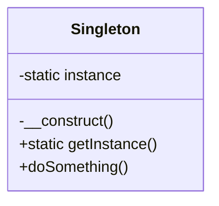
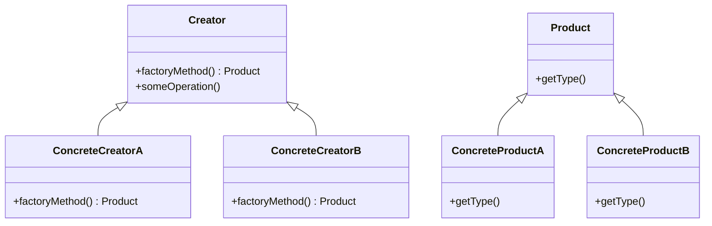

## 29.7 Bibliography and References

In this section, we provide a comprehensive list of resources that have been instrumental in shaping the understanding and application of design patterns in PHP. This bibliography includes academic papers, influential web articles, and standards documents that are essential for any developer looking to deepen their knowledge of PHP design patterns.

### Academic Papers

Academic papers provide a foundational understanding of design patterns, offering insights into their theoretical underpinnings and practical applications. Here are some key papers that have contributed significantly to the field:

1. **"Design Patterns: Elements of Reusable Object-Oriented Software" by Erich Gamma, Richard Helm, Ralph Johnson, and John Vlissides (1994)**
   - Often referred to as the "Gang of Four" book, this seminal work introduced the concept of design patterns to the software engineering community. It provides a catalog of 23 classic design patterns, which have been adapted and extended in PHP development.

2. **"A Pattern Language: Towns, Buildings, Construction" by Christopher Alexander, Sara Ishikawa, and Murray Silverstein (1977)**
   - Although not directly related to software, this book inspired the design pattern movement in software engineering. It introduces the idea of a pattern language, which has been adapted to software design.

3. **"Patterns of Enterprise Application Architecture" by Martin Fowler (2002)**
   - This book explores enterprise application architecture patterns, many of which are applicable to PHP development. It provides a deeper understanding of how design patterns can be used to solve complex architectural problems.

4. **"Refactoring: Improving the Design of Existing Code" by Martin Fowler (1999)**
   - This book discusses the importance of refactoring in maintaining and improving code quality. It includes discussions on how design patterns can be applied during the refactoring process.

5. **"Domain-Driven Design: Tackling Complexity in the Heart of Software" by Eric Evans (2003)**
   - This book introduces the concept of Domain-Driven Design (DDD), which emphasizes the use of design patterns to manage complex software systems. It is particularly relevant for PHP developers working on large-scale applications.

### Web Articles

Web articles offer practical insights and real-world examples of how design patterns are applied in PHP development. Here are some influential articles that have shaped the understanding of PHP design patterns:

1. **"PHP: The Right Way" by Josh Lockhart**
   - This comprehensive guide provides best practices for PHP development, including the use of design patterns. It is an essential resource for PHP developers looking to improve their coding practices.

2. **"Design Patterns in PHP" by Fabien Potencier**
   - Fabien Potencier, the creator of the Symfony framework, provides insights into how design patterns can be effectively used in PHP applications. This article is particularly useful for developers working with Symfony.

3. **"Modern PHP: New Features and Good Practices" by Josh Lockhart**
   - This article explores modern PHP features and how they can be used in conjunction with design patterns to create robust and maintainable code.

4. **"Understanding Design Patterns in PHP" by Brandon Savage**
   - Brandon Savage provides a detailed overview of common design patterns in PHP, including practical examples and use cases.

5. **"The Clean Architecture" by Uncle Bob (Robert C. Martin)**
   - Although not specific to PHP, this article discusses the principles of clean architecture, which are applicable to PHP development. It emphasizes the importance of using design patterns to create maintainable and scalable software.

### Standards Documents

Standards documents provide guidelines and best practices for PHP development, including the use of design patterns. Here are some key standards documents that are relevant to PHP developers:

1. **PHP-FIG (PHP Framework Interop Group) Standards**
   - The PHP-FIG has developed several standards (PSRs) that promote interoperability between PHP frameworks. These standards include guidelines for coding style, autoloading, and more, which are essential for implementing design patterns in PHP.

2. **RFCs (Request for Comments)**
   - RFCs are documents that describe new features and changes to the PHP language. They provide valuable insights into the evolution of PHP and how new features can be used in conjunction with design patterns.

3. **OWASP (Open Web Application Security Project) Guidelines**
   - The OWASP guidelines provide best practices for secure PHP development. They include recommendations for using design patterns to enhance security in PHP applications.

4. **PSR-1: Basic Coding Standard**
   - This standard provides a basic coding style guide for PHP developers, promoting consistency and readability in code.

5. **PSR-2: Coding Style Guide**
   - An extension of PSR-1, this standard provides a detailed coding style guide, which is essential for maintaining clean and consistent code when implementing design patterns.

6. **PSR-4: Autoloading Standard**
   - This standard provides guidelines for autoloading classes in PHP, which is crucial for implementing design patterns that rely on class loading.

### Code Examples and Visualizations

To further illustrate the concepts discussed in the bibliography, let's explore some code examples and visualizations that demonstrate the application of design patterns in PHP.

#### Singleton Pattern Example

The Singleton pattern ensures that a class has only one instance and provides a global point of access to it. Here's a simple implementation in PHP:

```php
<?php

class Singleton {
    private static $instance;

    // Private constructor to prevent direct instantiation
    private function __construct() {}

    // Method to get the single instance of the class
    public static function getInstance() {
        if (self::$instance === null) {
            self::$instance = new Singleton();
        }
        return self::$instance;
    }

    // Example method
    public function doSomething() {
        echo "Singleton instance doing something!";
    }
}

// Usage
$singleton = Singleton::getInstance();
$singleton->doSomething();

?>
```

#### Visualizing the Singleton Pattern



The diagram above illustrates the Singleton pattern, showing the private constructor and the static `getInstance` method that manages the single instance of the class.

#### Factory Method Pattern Example

The Factory Method pattern provides an interface for creating objects in a superclass but allows subclasses to alter the type of objects that will be created. Here's an example in PHP:

```php
<?php

abstract class Product {
    abstract public function getType();
}

class ConcreteProductA extends Product {
    public function getType() {
        return "Type A";
    }
}

class ConcreteProductB extends Product {
    public function getType() {
        return "Type B";
    }
}

abstract class Creator {
    abstract public function factoryMethod(): Product;

    public function someOperation() {
        $product = $this->factoryMethod();
        return "Creator: The same creator's code has just worked with " . $product->getType();
    }
}

class ConcreteCreatorA extends Creator {
    public function factoryMethod(): Product {
        return new ConcreteProductA();
    }
}

class ConcreteCreatorB extends Creator {
    public function factoryMethod(): Product {
        return new ConcreteProductB();
    }
}

// Usage
$creatorA = new ConcreteCreatorA();
echo $creatorA->someOperation();

$creatorB = new ConcreteCreatorB();
echo $creatorB->someOperation();

?>
```

#### Visualizing the Factory Method Pattern



The diagram above illustrates the Factory Method pattern, showing the relationship between the `Creator` and `Product` classes and their concrete implementations.

### References and Links

To further your understanding of PHP design patterns, consider exploring the following resources:

- [PHP: The Right Way](https://phptherightway.com/)
- [Symfony Documentation](https://symfony.com/doc/current/index.html)
- [Laravel Documentation](https://laravel.com/docs)
- [PHP-FIG Standards](https://www.php-fig.org/psr/)
- [OWASP PHP Security Project](https://owasp.org/www-project-php-security-project/)

### Knowledge Check

To reinforce your understanding of the bibliography and references section, consider the following questions:

- What are the key differences between academic papers and web articles in the context of PHP design patterns?
- How do standards documents like PSRs contribute to the implementation of design patterns in PHP?
- Why is it important to refer to both foundational papers and modern web articles when learning about design patterns?

### Embrace the Journey

Remember, this bibliography and references section is just the beginning of your journey into the world of PHP design patterns. As you explore these resources, keep experimenting, stay curious, and enjoy the process of learning and applying design patterns in your PHP projects.

## Quiz: Bibliography and References



### Which book is often referred to as the "Gang of Four" book?

- [x] "Design Patterns: Elements of Reusable Object-Oriented Software"
- [ ] "A Pattern Language: Towns, Buildings, Construction"
- [ ] "Patterns of Enterprise Application Architecture"
- [ ] "Refactoring: Improving the Design of Existing Code"

> **Explanation:** "Design Patterns: Elements of Reusable Object-Oriented Software" is often referred to as the "Gang of Four" book because it was authored by Erich Gamma, Richard Helm, Ralph Johnson, and John Vlissides.

### What is the primary focus of the book "Domain-Driven Design: Tackling Complexity in the Heart of Software"?

- [x] Managing complex software systems using design patterns
- [ ] Improving code quality through refactoring
- [ ] Introducing a pattern language for software design
- [ ] Providing a catalog of classic design patterns

> **Explanation:** "Domain-Driven Design: Tackling Complexity in the Heart of Software" focuses on managing complex software systems using design patterns and domain-driven design principles.

### Which web article provides best practices for PHP development, including the use of design patterns?

- [x] "PHP: The Right Way"
- [ ] "Design Patterns in PHP"
- [ ] "Modern PHP: New Features and Good Practices"
- [ ] "The Clean Architecture"

> **Explanation:** "PHP: The Right Way" is a comprehensive guide that provides best practices for PHP development, including the use of design patterns.

### What is the purpose of PSR-4?

- [x] To provide guidelines for autoloading classes in PHP
- [ ] To define a basic coding style guide for PHP
- [ ] To promote secure PHP development practices
- [ ] To describe new features and changes to the PHP language

> **Explanation:** PSR-4 provides guidelines for autoloading classes in PHP, which is crucial for implementing design patterns that rely on class loading.

### Which of the following is a key feature of the Singleton pattern?

- [x] Ensuring a class has only one instance
- [ ] Providing an interface for creating objects
- [ ] Allowing subclasses to alter the type of objects created
- [ ] Managing complex software systems

> **Explanation:** The Singleton pattern ensures that a class has only one instance and provides a global point of access to it.

### What is the main benefit of referring to both academic papers and web articles when learning about design patterns?

- [x] Gaining both theoretical and practical insights
- [ ] Focusing solely on theoretical understanding
- [ ] Emphasizing only practical applications
- [ ] Avoiding complex theoretical concepts

> **Explanation:** Referring to both academic papers and web articles provides a balanced understanding, offering both theoretical insights and practical applications of design patterns.

### Which standard provides a detailed coding style guide for PHP developers?

- [x] PSR-2
- [ ] PSR-1
- [ ] PSR-4
- [ ] RFC

> **Explanation:** PSR-2 provides a detailed coding style guide for PHP developers, promoting consistency and readability in code.

### What is the focus of the OWASP guidelines?

- [x] Providing best practices for secure PHP development
- [ ] Defining a basic coding style guide
- [ ] Describing new features and changes to the PHP language
- [ ] Promoting interoperability between PHP frameworks

> **Explanation:** The OWASP guidelines focus on providing best practices for secure PHP development, including recommendations for using design patterns to enhance security.

### Which book discusses the importance of refactoring in maintaining and improving code quality?

- [x] "Refactoring: Improving the Design of Existing Code"
- [ ] "Design Patterns: Elements of Reusable Object-Oriented Software"
- [ ] "Patterns of Enterprise Application Architecture"
- [ ] "Domain-Driven Design: Tackling Complexity in the Heart of Software"

> **Explanation:** "Refactoring: Improving the Design of Existing Code" discusses the importance of refactoring in maintaining and improving code quality.

### True or False: The Singleton pattern allows multiple instances of a class.

- [x] False
- [ ] True

> **Explanation:** False. The Singleton pattern ensures that a class has only one instance and provides a global point of access to it.



By exploring these resources and engaging with the quiz, you will deepen your understanding of PHP design patterns and their application in modern software development.
