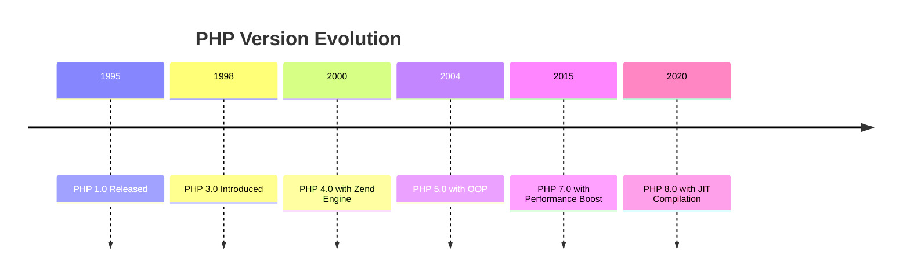

## 29.8 PHP Versions and Compatibility

PHP has undergone significant evolution since its inception, with each version introducing new features, improvements, and sometimes breaking changes. Understanding these changes is crucial for developers aiming to write robust and maintainable code that can adapt to different PHP environments. In this section, we will explore the differences across major PHP versions, provide tips for writing compatible code, and offer guidance on handling deprecations and migrations.

### Version Differences

PHP's journey from its early versions to the present has been marked by several key milestones. Let's delve into the major changes introduced in each version, focusing on those that impact compatibility and design patterns.

#### PHP 5.x

PHP 5 was a significant leap forward, introducing true object-oriented programming capabilities. Key features included:

- **Introduction of OOP**: Classes, objects, inheritance, and interfaces became first-class citizens.
- **Exception Handling**: The introduction of `try`, `catch`, and `finally` blocks.
- **Improved XML Support**: With extensions like SimpleXML and DOM.
- **PDO (PHP Data Objects)**: A consistent interface for accessing databases.

#### PHP 7.x

PHP 7 brought substantial performance improvements and new language features:

- **Scalar Type Declarations**: Allowing for stricter type checking.
- **Return Type Declarations**: Specifying the return type of functions.
- **Null Coalescing Operator (`??`)**: Simplifying null checks.
- **Spaceship Operator (`<=>`)**: For combined comparison.
- **Anonymous Classes**: Enabling quick class definitions.
- **Error Handling**: Introduction of `Throwable` interface and `Error` class.

#### PHP 8.x

PHP 8 continued the trend of innovation with:

- **JIT Compilation**: Just-In-Time compilation for performance boosts.
- **Union Types**: Allowing multiple types for a variable.
- **Attributes**: Native support for annotations.
- **Match Expression**: A more powerful alternative to `switch`.
- **Named Arguments**: Passing arguments by name.
- **Nullsafe Operator (`?->`)**: Simplifying null checks in method calls.

### Compatibility Tips

Ensuring compatibility across different PHP versions can be challenging, especially when maintaining legacy code. Here are some strategies to help:

#### Writing Version-Agnostic Code

1. **Use Feature Detection**: Instead of checking PHP versions, detect the presence of features using `function_exists()` or `defined()`.
2. **Avoid Deprecated Features**: Regularly review the PHP manual for deprecated features and avoid using them in new code.
3. **Leverage Polyfills**: Use libraries like Symfony Polyfill to backport newer features to older PHP versions.

#### Testing Across Versions

1. **Set Up Multiple Environments**: Use Docker or Vagrant to create environments with different PHP versions for testing.
2. **Automated Testing**: Implement CI/CD pipelines that run tests across multiple PHP versions using tools like Travis CI or GitHub Actions.

#### Code Refactoring

1. **Modularize Code**: Break down code into smaller, reusable components that are easier to test and update.
2. **Use Interfaces and Abstractions**: To decouple code from specific implementations that might change across versions.

### Deprecations and Migrations

As PHP evolves, certain features become deprecated, and it's essential to update your codebase to avoid future issues. Here's how to handle deprecations and migrations effectively:

#### Identifying Deprecated Features

1. **Review Release Notes**: Each PHP release comes with detailed notes on deprecated features.
2. **Static Analysis Tools**: Use tools like PHPStan or Psalm to detect deprecated features in your codebase.

#### Migrating Legacy Code

1. **Incremental Updates**: Gradually update your codebase, focusing on one module or feature at a time.
2. **Backward Compatibility**: Use conditional logic to maintain compatibility with older versions during the transition.
3. **Comprehensive Testing**: Ensure that your tests cover all critical paths before and after migration.

#### Example: Migrating from PHP 5 to PHP 7

Let's consider a simple example of migrating a function from PHP 5 to PHP 7, focusing on type declarations.

```php
// PHP 5.x: No type declarations
function add($a, $b) {
    return $a + $b;
}

// PHP 7.x: Adding type declarations
function add(int $a, int $b): int {
    return $a + $b;
}

// Usage
echo add(2, 3); // Outputs: 5
```

In this example, we added type declarations to ensure that the function only accepts integers, leveraging PHP 7's type system for better error checking and code clarity.

### Visualizing PHP Version Evolution

To better understand the evolution of PHP versions and their features, let's visualize the timeline and key changes using a Mermaid.js diagram.



This timeline highlights the major milestones in PHP's development, showcasing the continuous improvement and innovation in the language.

### Knowledge Check

Before we conclude, let's reinforce what we've learned with a few questions:

- What are the key differences between PHP 5 and PHP 7?
- How can you ensure your code is compatible with multiple PHP versions?
- What tools can help identify deprecated features in your codebase?

### Embrace the Journey

Remember, navigating PHP versions and compatibility is an ongoing journey. As you continue to develop and maintain PHP applications, stay curious and keep learning. The PHP community is a valuable resource, offering support and insights to help you along the way.

## Quiz: PHP Versions and Compatibility



### What major feature was introduced in PHP 5?

- [x] Object-Oriented Programming
- [ ] JIT Compilation
- [ ] Union Types
- [ ] Match Expression

> **Explanation:** PHP 5 introduced true object-oriented programming capabilities, including classes, objects, and interfaces.

### Which PHP version introduced scalar type declarations?

- [ ] PHP 5
- [x] PHP 7
- [ ] PHP 8
- [ ] PHP 4

> **Explanation:** PHP 7 introduced scalar type declarations, allowing for stricter type checking in functions.

### What is the purpose of the null coalescing operator (`??`) in PHP?

- [x] To simplify null checks
- [ ] To perform arithmetic operations
- [ ] To handle exceptions
- [ ] To declare variables

> **Explanation:** The null coalescing operator (`??`) is used to simplify null checks by providing a default value if a variable is null.

### How can you detect the presence of a feature in PHP?

- [x] Use `function_exists()` or `defined()`
- [ ] Check the PHP version
- [ ] Use `isset()`
- [ ] Use `echo`

> **Explanation:** Using `function_exists()` or `defined()` allows you to detect the presence of a feature without relying on specific PHP version checks.

### What tool can be used for static analysis in PHP?

- [x] PHPStan
- [ ] Docker
- [ ] Composer
- [ ] PHPUnit

> **Explanation:** PHPStan is a static analysis tool that helps detect errors and deprecated features in PHP code.

### Which PHP version introduced JIT compilation?

- [ ] PHP 5
- [ ] PHP 7
- [x] PHP 8
- [ ] PHP 6

> **Explanation:** PHP 8 introduced Just-In-Time (JIT) compilation for performance improvements.

### What is a recommended practice for migrating legacy code?

- [x] Incremental updates
- [ ] Rewrite everything at once
- [ ] Ignore deprecated features
- [ ] Use only manual testing

> **Explanation:** Incremental updates allow for gradual migration, reducing the risk of introducing errors.

### How can you maintain backward compatibility during migration?

- [x] Use conditional logic
- [ ] Remove old code
- [ ] Only use new features
- [ ] Avoid testing

> **Explanation:** Using conditional logic helps maintain backward compatibility by adapting code behavior based on the PHP version.

### What is the benefit of using polyfills in PHP?

- [x] Backport newer features to older versions
- [ ] Increase code complexity
- [ ] Reduce performance
- [ ] Eliminate the need for testing

> **Explanation:** Polyfills allow you to use newer PHP features in older versions by providing equivalent functionality.

### True or False: Named arguments were introduced in PHP 7.

- [ ] True
- [x] False

> **Explanation:** Named arguments were introduced in PHP 8, allowing arguments to be passed by name rather than position.



By understanding PHP versions and compatibility, you can ensure that your applications remain robust and adaptable in a rapidly evolving landscape. Keep experimenting, stay curious, and enjoy the journey!
