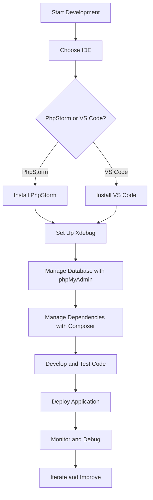

## 29.9 Tools and IDEs for PHP Development

In the world of PHP development, having the right set of tools and integrated development environments (IDEs) can significantly enhance productivity, streamline workflows, and improve code quality. This section delves into the essential tools and IDEs that every PHP developer should consider incorporating into their development toolkit. We will explore popular IDEs, debugging tools, database management solutions, and package management systems that are pivotal for modern PHP development.

### Popular IDEs for PHP Development

Integrated Development Environments (IDEs) are crucial for efficient coding, offering features like syntax highlighting, code completion, debugging, and more. Let's explore some of the most popular IDEs used in PHP development.

#### PhpStorm

**PhpStorm** is a comprehensive IDE specifically designed for PHP development. Developed by JetBrains, it offers a rich set of features tailored to PHP developers, including intelligent code completion, on-the-fly error detection, and powerful refactoring capabilities.

- **Key Features:**
  - **Smart Code Navigation:** Quickly navigate to a class, file, or symbol, and find its usages.
  - **Debugging and Testing:** Integrated with Xdebug and PHPUnit for seamless debugging and testing.
  - **Version Control Integration:** Supports Git, SVN, Mercurial, and more.
  - **Database Tools:** Built-in tools for managing databases and SQL queries.

- **Link:** [PhpStorm](https://www.jetbrains.com/phpstorm/)

```php
<?php
// Example of using PhpStorm's code completion and refactoring features
class User {
    private $name;

    public function __construct($name) {
        $this->name = $name;
    }

    public function getName() {
        return $this->name;
    }
}

$user = new User("John Doe");
echo $user->getName();
?>
```

#### Visual Studio Code

**Visual Studio Code (VS Code)** is a versatile and lightweight code editor developed by Microsoft. With its extensive marketplace of extensions, VS Code can be transformed into a powerful PHP development environment.

- **Key Features:**
  - **Extensions for PHP:** PHP Intelephense, PHP Debug, and more.
  - **Integrated Terminal:** Access the command line directly within the editor.
  - **Customizable Interface:** Tailor the editor to your preferences with themes and settings.
  - **Git Integration:** Built-in support for Git version control.

- **Link:** [VS Code](https://code.visualstudio.com/)

```php
<?php
// Example of using VS Code with PHP Intelephense extension
function greet($name) {
    return "Hello, $name!";
}

echo greet("World");
?>
```

### Debugging Tools

Debugging is an essential part of the development process, allowing developers to identify and fix issues in their code. Let's explore some powerful debugging tools for PHP.

#### Xdebug

**Xdebug** is a powerful debugger and profiler for PHP. It provides stack and function traces, memory allocation, and more, making it an indispensable tool for PHP developers.

- **Key Features:**
  - **Step Debugging:** Allows you to step through your code line by line.
  - **Profiling:** Analyze performance bottlenecks with detailed profiling reports.
  - **Code Coverage Analysis:** Measure how much of your code is covered by tests.

- **Installation:**
  - Install Xdebug via PECL or by downloading the source code.
  - Configure `php.ini` to enable Xdebug.

```php
<?php
// Example of using Xdebug for step debugging
function factorial($n) {
    if ($n <= 1) {
        return 1;
    }
    return $n * factorial($n - 1);
}

echo factorial(5);
?>
```

### Database Management Tools

Managing databases is a critical aspect of PHP development. Here are some popular tools for database management.

#### phpMyAdmin

**phpMyAdmin** is a web-based interface for managing MySQL and MariaDB databases. It provides an intuitive interface for executing SQL queries, managing databases, and more.

- **Key Features:**
  - **User Management:** Easily manage database users and permissions.
  - **SQL Execution:** Run and save SQL queries with ease.
  - **Data Export/Import:** Export and import data in various formats.

- **Link:** [phpMyAdmin](https://www.phpmyadmin.net/)

```sql
-- Example of a SQL query executed in phpMyAdmin
SELECT * FROM users WHERE status = 'active';
```

### Package and Dependency Management

Managing dependencies is crucial for modern PHP applications. Composer is the standard tool for dependency management in PHP.

#### Composer

**Composer** is a dependency manager for PHP that allows you to declare the libraries your project depends on and installs them for you.

- **Key Features:**
  - **Dependency Management:** Automatically manage and install project dependencies.
  - **Autoloading:** Automatically load classes using PSR-4 autoloading.
  - **Version Constraints:** Specify version constraints for dependencies.

- **Installation:**
  - Install Composer globally on your system.
  - Use `composer.json` to define project dependencies.

```json
{
    "require": {
        "monolog/monolog": "^2.0"
    }
}
```

```bash
# Install dependencies using Composer
composer install
```

### Visualizing PHP Development Workflow

To better understand how these tools fit into the PHP development workflow, let's visualize the process using a flowchart.



### Knowledge Check

- **Question:** What are the benefits of using PhpStorm for PHP development?
- **Question:** How does Xdebug enhance the debugging process in PHP?
- **Question:** What role does Composer play in PHP development?

### Try It Yourself

Experiment with the code examples provided in this section. Try modifying the code to see how the tools and IDEs can help you catch errors, refactor code, and manage dependencies. For instance, add new methods to the `User` class in PhpStorm and observe how the IDE assists with code completion and refactoring.

### Embrace the Journey

Remember, mastering these tools and IDEs is just the beginning. As you progress in your PHP development journey, you'll discover more advanced features and techniques that will further enhance your productivity and code quality. Keep experimenting, stay curious, and enjoy the journey!

## Quiz: Tools and IDEs for PHP Development



### Which IDE is specifically designed for PHP development?

- [x] PhpStorm
- [ ] Visual Studio Code
- [ ] Sublime Text
- [ ] Atom

> **Explanation:** PhpStorm is specifically designed for PHP development, offering features tailored to PHP developers.

### What is the primary purpose of Xdebug?

- [x] Debugging and profiling PHP code
- [ ] Managing PHP dependencies
- [ ] Database management
- [ ] Code formatting

> **Explanation:** Xdebug is a powerful debugger and profiler for PHP, providing stack traces, memory allocation, and more.

### Which tool is used for managing MySQL databases via a web interface?

- [x] phpMyAdmin
- [ ] Composer
- [ ] Xdebug
- [ ] PhpStorm

> **Explanation:** phpMyAdmin is a web-based interface for managing MySQL and MariaDB databases.

### What is the role of Composer in PHP development?

- [x] Dependency management
- [ ] Code debugging
- [ ] Database management
- [ ] Code styling

> **Explanation:** Composer is a dependency manager for PHP, allowing developers to declare and manage project dependencies.

### Which feature is NOT provided by PhpStorm?

- [ ] Smart code navigation
- [ ] Integrated terminal
- [ ] Database tools
- [x] Web hosting

> **Explanation:** PhpStorm provides smart code navigation, an integrated terminal, and database tools, but not web hosting.

### What is the benefit of using VS Code for PHP development?

- [x] Extensive marketplace of extensions
- [ ] Built-in PHP compiler
- [ ] Automatic code deployment
- [ ] Integrated database server

> **Explanation:** VS Code has an extensive marketplace of extensions, allowing developers to customize their development environment.

### How does Xdebug assist in code coverage analysis?

- [x] Measures how much of your code is covered by tests
- [ ] Provides syntax highlighting
- [ ] Manages database connections
- [ ] Formats PHP code

> **Explanation:** Xdebug provides code coverage analysis by measuring how much of your code is covered by tests.

### What is the primary function of phpMyAdmin?

- [x] Managing MySQL databases
- [ ] Debugging PHP code
- [ ] Managing PHP dependencies
- [ ] Formatting PHP code

> **Explanation:** phpMyAdmin is used for managing MySQL and MariaDB databases via a web interface.

### Which tool provides PSR-4 autoloading?

- [x] Composer
- [ ] PhpStorm
- [ ] Xdebug
- [ ] phpMyAdmin

> **Explanation:** Composer provides PSR-4 autoloading, allowing for automatic class loading.

### True or False: Visual Studio Code is a lightweight code editor that can be customized for PHP development.

- [x] True
- [ ] False

> **Explanation:** Visual Studio Code is a lightweight and versatile code editor that can be customized with extensions for PHP development.


