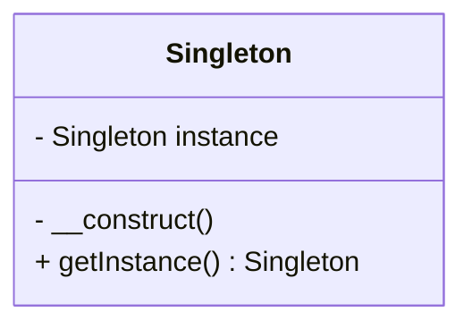
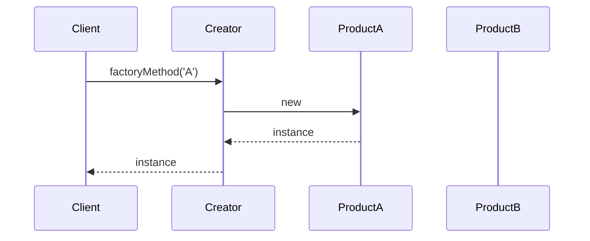

## 3.1 Modern PHP Features (PHP 7 and Beyond)

PHP has undergone significant transformations with the release of PHP 7 and PHP 8, bringing a plethora of new features and improvements that have reshaped the landscape of PHP development. These modern enhancements not only boost performance and efficiency but also influence how we approach design patterns and best practices. In this section, we will delve into the key features introduced in PHP 7 and PHP 8, explore their impact on design patterns, and provide practical examples to illustrate their usage.

### Overview of PHP 7 Features

PHP 7 marked a major milestone in the evolution of PHP, introducing substantial performance improvements and a host of new features. Let's explore some of the most significant enhancements:

#### Performance Improvements and Engine Optimizations

One of the most notable advancements in PHP 7 is the significant performance boost, achieved through the new Zend Engine 3.0. This engine optimization results in faster execution of PHP scripts, reduced memory consumption, and improved overall efficiency. These enhancements make PHP 7 an ideal choice for high-performance applications and large-scale systems.

#### Scalar Type Declarations

PHP 7 introduced scalar type declarations, allowing developers to specify the expected data types for function arguments and return values. This feature enhances code readability and reduces runtime errors by enforcing type safety.

```php
<?php
function addNumbers(int $a, int $b): int {
    return $a + $b;
}

echo addNumbers(5, 10); // Outputs: 15
?>
```

#### Return Type Declarations

In addition to scalar type declarations, PHP 7 also supports return type declarations, enabling developers to define the expected return type of a function. This feature further enhances code clarity and maintainability.

```php
<?php
function getGreeting(): string {
    return "Hello, World!";
}

echo getGreeting(); // Outputs: Hello, World!
?>
```

#### Null Coalescing Operator

The null coalescing operator (`??`) simplifies the process of checking for null values, providing a concise way to handle default values.

```php
<?php
$username = $_GET['user'] ?? 'guest';
echo $username; // Outputs: guest if 'user' is not set
?>
```

#### Spaceship Operator

The spaceship operator (`<=>`) is a three-way comparison operator that returns -1, 0, or 1, depending on the comparison result. It simplifies sorting and comparison operations.

```php
<?php
echo 1 <=> 2; // Outputs: -1
echo 2 <=> 2; // Outputs: 0
echo 3 <=> 2; // Outputs: 1
?>
```

#### Anonymous Classes

Anonymous classes provide a way to create classes without explicitly naming them, useful for one-off objects or simple implementations.

```php
<?php
$logger = new class {
    public function log($message) {
        echo $message;
    }
};

$logger->log('Logging a message'); // Outputs: Logging a message
?>
```

### Overview of PHP 8 Features

Building upon the foundation laid by PHP 7, PHP 8 introduces even more powerful features and improvements. Let's explore some of the key enhancements:

#### JIT Compilation

Just-In-Time (JIT) compilation is a major performance enhancement in PHP 8, translating PHP code into machine code at runtime. This feature significantly boosts execution speed, especially for CPU-intensive tasks.

#### Union Types

PHP 8 introduces union types, allowing functions to accept multiple types for a single parameter. This feature enhances flexibility and reduces the need for complex type-checking logic.

```php
<?php
function processInput(int|string $input) {
    echo $input;
}

processInput(123); // Outputs: 123
processInput("Hello"); // Outputs: Hello
?>
```

#### Named Arguments

Named arguments provide a way to pass arguments to a function based on parameter names, improving code readability and flexibility.

```php
<?php
function createUser($name, $email, $role = 'user') {
    echo "Name: $name, Email: $email, Role: $role";
}

createUser(name: 'Alice', email: 'alice@example.com'); // Outputs: Name: Alice, Email: alice@example.com, Role: user
?>
```

#### Attributes (Annotations)

Attributes, also known as annotations, provide a way to add metadata to classes, methods, and properties, enabling more expressive and flexible code.

```php
<?php
#[Route('/home')]
class HomeController {
    // ...
}
?>
```

#### Match Expression

The match expression is a more powerful and flexible alternative to the switch statement, supporting strict comparisons and returning values.

```php
<?php
$status = 200;

$message = match ($status) {
    200 => 'OK',
    404 => 'Not Found',
    500 => 'Internal Server Error',
    default => 'Unknown Status',
};

echo $message; // Outputs: OK
?>
```

#### Nullsafe Operator

The nullsafe operator (`?->`) simplifies the process of accessing properties and methods on nullable objects, reducing the risk of null reference errors.

```php
<?php
$user = null;
echo $user?->getProfile()?->getName(); // Outputs: nothing, avoids error
?>
```

### How Modern PHP Versions Influence Design Patterns

The introduction of these modern PHP features has a profound impact on design patterns and best practices. Let's explore how these enhancements influence the way we approach design patterns in PHP development:

#### Improved Type Safety and Clarity

With scalar type declarations, return type declarations, and union types, PHP developers can now write more type-safe and self-documenting code. This improvement enhances the clarity and maintainability of design patterns, making it easier to understand and modify complex systems.

#### Enhanced Flexibility and Expressiveness

Features like named arguments, attributes, and match expressions provide developers with more expressive and flexible ways to implement design patterns. These enhancements allow for more concise and readable code, reducing boilerplate and improving overall code quality.

#### Performance Optimization

The performance improvements introduced in PHP 7 and PHP 8, particularly with JIT compilation, enable developers to implement design patterns in a more efficient manner. This optimization is especially beneficial for high-performance applications and systems with demanding resource requirements.

#### Simplified Error Handling

The null coalescing operator and nullsafe operator simplify error handling and reduce the risk of null reference errors. These features make it easier to implement robust and fault-tolerant design patterns, enhancing the reliability of PHP applications.

### Practical Examples and Code Snippets

Let's explore some practical examples and code snippets that demonstrate how modern PHP features can be leveraged to implement design patterns effectively:

#### Singleton Pattern with Type Declarations

The Singleton pattern ensures that a class has only one instance and provides a global point of access to it. With modern PHP features, we can implement this pattern with improved type safety and clarity.

```php
<?php
class Singleton {
    private static ?Singleton $instance = null;

    private function __construct() {}

    public static function getInstance(): Singleton {
        if (self::$instance === null) {
            self::$instance = new Singleton();
        }
        return self::$instance;
    }
}

$instance = Singleton::getInstance();
?>
```

#### Factory Method Pattern with Named Arguments

The Factory Method pattern defines an interface for creating objects but allows subclasses to alter the type of objects that will be created. Named arguments enhance the readability and flexibility of this pattern.

```php
<?php
interface Product {
    public function operation(): string;
}

class ConcreteProductA implements Product {
    public function operation(): string {
        return "Result of ConcreteProductA";
    }
}

class ConcreteProductB implements Product {
    public function operation(): string {
        return "Result of ConcreteProductB";
    }
}

class Creator {
    public function factoryMethod(string $type): Product {
        return match ($type) {
            'A' => new ConcreteProductA(),
            'B' => new ConcreteProductB(),
            default => throw new InvalidArgumentException("Unknown product type"),
        };
    }
}

$creator = new Creator();
$product = $creator->factoryMethod(type: 'A');
echo $product->operation(); // Outputs: Result of ConcreteProductA
?>
```

#### Observer Pattern with Attributes

The Observer pattern defines a one-to-many dependency between objects so that when one object changes state, all its dependents are notified and updated automatically. Attributes can be used to annotate observer methods, enhancing the expressiveness of this pattern.

```php
<?php
#[Attribute]
class Subscribe {}

class Subject {
    private array $observers = [];

    public function attach(object $observer): void {
        $this->observers[] = $observer;
    }

    public function notify(): void {
        foreach ($this->observers as $observer) {
            foreach ((new ReflectionObject($observer))->getMethods() as $method) {
                if ($method->getAttributes(Subscribe::class)) {
                    $method->invoke($observer);
                }
            }
        }
    }
}

class ConcreteObserver {
    #[Subscribe]
    public function update(): void {
        echo "Observer updated!";
    }
}

$subject = new Subject();
$observer = new ConcreteObserver();

$subject->attach($observer);
$subject->notify(); // Outputs: Observer updated!
?>
```

### Visualizing Modern PHP Features

To better understand the impact of modern PHP features on design patterns, let's visualize some of these concepts using Mermaid.js diagrams.

#### Class Diagram: Singleton Pattern



#### Sequence Diagram: Factory Method Pattern



### References and Links

For further reading and deeper dives into modern PHP features, consider exploring the following resources:

- [PHP Manual: What's New in PHP 7](https://www.php.net/manual/en/migration70.new-features.php)
- [PHP Manual: What's New in PHP 8](https://www.php.net/manual/en/migration80.new-features.php)
- [PHP RFCs](https://wiki.php.net/rfc)

### Knowledge Check

To reinforce your understanding of modern PHP features, consider the following questions and exercises:

1. How do scalar type declarations improve code quality in PHP?
2. What are the benefits of using the null coalescing operator?
3. Implement a simple Factory Method pattern using named arguments.
4. How does JIT compilation enhance PHP performance?
5. Create a class that uses union types for its method parameters.

### Embrace the Journey

Remember, mastering modern PHP features is an ongoing journey. As you continue to explore and experiment with these enhancements, you'll discover new ways to optimize your code and implement design patterns more effectively. Keep experimenting, stay curious, and enjoy the journey!

## Quiz: Modern PHP Features (PHP 7 and Beyond)



### What major performance enhancement was introduced in PHP 8?

- [x] JIT Compilation
- [ ] Scalar Type Declarations
- [ ] Null Coalescing Operator
- [ ] Anonymous Classes

> **Explanation:** JIT Compilation is a significant performance enhancement introduced in PHP 8, translating PHP code into machine code at runtime.

### Which operator in PHP 7 simplifies the process of checking for null values?

- [ ] Spaceship Operator
- [x] Null Coalescing Operator
- [ ] Match Expression
- [ ] Nullsafe Operator

> **Explanation:** The null coalescing operator (`??`) simplifies the process of checking for null values by providing a concise way to handle default values.

### What feature in PHP 8 allows functions to accept multiple types for a single parameter?

- [ ] Named Arguments
- [ ] Attributes
- [x] Union Types
- [ ] Return Type Declarations

> **Explanation:** Union types in PHP 8 allow functions to accept multiple types for a single parameter, enhancing flexibility and reducing complex type-checking logic.

### How do named arguments improve code readability?

- [x] By allowing arguments to be passed based on parameter names
- [ ] By enforcing strict type safety
- [ ] By providing default values for parameters
- [ ] By supporting multiple types for a single parameter

> **Explanation:** Named arguments improve code readability by allowing arguments to be passed based on parameter names, making the code more expressive and flexible.

### Which PHP 8 feature provides a more powerful alternative to the switch statement?

- [ ] Nullsafe Operator
- [ ] Anonymous Classes
- [x] Match Expression
- [ ] Scalar Type Declarations

> **Explanation:** The match expression in PHP 8 provides a more powerful and flexible alternative to the switch statement, supporting strict comparisons and returning values.

### What is the purpose of the nullsafe operator in PHP 8?

- [ ] To enforce type safety
- [x] To simplify accessing properties and methods on nullable objects
- [ ] To provide metadata to classes and methods
- [ ] To enhance performance through JIT compilation

> **Explanation:** The nullsafe operator (`?->`) simplifies accessing properties and methods on nullable objects, reducing the risk of null reference errors.

### How do attributes enhance the expressiveness of design patterns?

- [ ] By providing default values for parameters
- [x] By adding metadata to classes, methods, and properties
- [ ] By supporting multiple types for a single parameter
- [ ] By allowing arguments to be passed based on parameter names

> **Explanation:** Attributes enhance the expressiveness of design patterns by adding metadata to classes, methods, and properties, enabling more expressive and flexible code.

### What is the main benefit of using scalar type declarations in PHP?

- [x] Improved type safety and code readability
- [ ] Enhanced performance through JIT compilation
- [ ] Simplified error handling
- [ ] Support for multiple types for a single parameter

> **Explanation:** Scalar type declarations improve type safety and code readability by allowing developers to specify the expected data types for function arguments and return values.

### Which PHP 7 feature provides a concise way to handle default values?

- [ ] Spaceship Operator
- [x] Null Coalescing Operator
- [ ] Match Expression
- [ ] Nullsafe Operator

> **Explanation:** The null coalescing operator (`??`) provides a concise way to handle default values, simplifying the process of checking for null values.

### True or False: JIT Compilation in PHP 8 translates PHP code into machine code at runtime.

- [x] True
- [ ] False

> **Explanation:** True. JIT Compilation in PHP 8 translates PHP code into machine code at runtime, significantly boosting execution speed, especially for CPU-intensive tasks.


