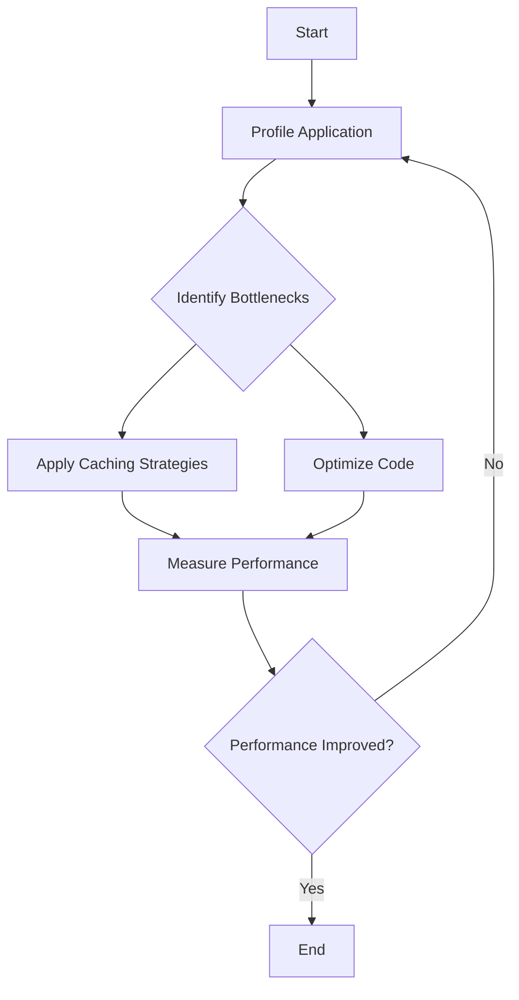

## 3.10 Performance Optimization Techniques

In the world of PHP development, performance optimization is crucial for creating applications that are not only functional but also fast and efficient. This section will guide you through various techniques to enhance the performance of your PHP applications, focusing on profiling, caching strategies, and writing efficient code.

### Profiling PHP Applications to Identify Bottlenecks

Before optimizing, it's essential to understand where your application is spending most of its time. Profiling helps you identify bottlenecks and areas that require improvement.

#### Tools for Profiling

1. **Xdebug**: A powerful tool for debugging and profiling PHP applications. It provides detailed information about function calls, memory usage, and execution time.
   
   ```php
   // Example of enabling Xdebug profiling
   xdebug_start_trace('/path/to/trace/file');
   // Your PHP code here
   xdebug_stop_trace();
   ```

2. **Blackfire**: A modern profiling tool that integrates seamlessly with PHP applications, providing insights into performance bottlenecks.

3. **Tideways**: Offers both profiling and monitoring capabilities, helping you understand the performance characteristics of your application.

#### Analyzing Profiling Data

Once you have profiling data, analyze it to identify slow functions, memory leaks, and inefficient code paths. Focus on optimizing the parts of your code that consume the most resources.

### Caching Strategies

Caching is a powerful technique to improve the performance of PHP applications by storing frequently accessed data in a temporary storage area.

#### Opcode Caching

Opcode caching stores the compiled bytecode of PHP scripts, reducing the need for recompilation on subsequent requests.

- **OPcache**: A built-in opcode cache for PHP that significantly improves performance by caching the compiled script bytecode.

  ```php
  // Example configuration in php.ini
  opcache.enable=1
  opcache.memory_consumption=128
  opcache.interned_strings_buffer=8
  opcache.max_accelerated_files=4000
  ```

#### Data Caching

Data caching involves storing the results of expensive operations, such as database queries or API calls, to reduce the need for repeated processing.

- **Memcached**: A distributed memory caching system that speeds up dynamic web applications by alleviating database load.

- **Redis**: An in-memory data structure store used as a database, cache, and message broker.

  ```php
  // Example of using Redis for caching
  $redis = new Redis();
  $redis->connect('127.0.0.1', 6379);
  $redis->set('key', 'value');
  echo $redis->get('key');
  ```

#### HTTP Caching

HTTP caching leverages browser and proxy caches to reduce server load and improve response times.

- **Cache-Control Headers**: Use these headers to instruct browsers and proxies on how to cache responses.

  ```php
  header('Cache-Control: max-age=3600, public');
  ```

### Writing Efficient Code for High-Performance Applications

Efficient code is the cornerstone of high-performance applications. Here are some best practices to follow:

#### Optimize Algorithms and Data Structures

- **Choose the Right Algorithm**: Select algorithms that are efficient for your specific use case. For example, use quicksort for sorting large datasets.

- **Use Appropriate Data Structures**: Choose data structures that provide optimal performance for your operations, such as arrays for sequential access and hash tables for fast lookups.

#### Minimize Database Queries

- **Batch Queries**: Combine multiple queries into a single query to reduce database round trips.

- **Use Joins and Indexes**: Optimize your database schema with joins and indexes to speed up query execution.

  ```sql
  -- Example of using an index in SQL
  CREATE INDEX idx_user_id ON users (user_id);
  ```

#### Reduce Memory Usage

- **Avoid Unnecessary Variables**: Limit the use of temporary variables and large data structures.

- **Use Generators**: Generators allow you to iterate over data without loading the entire dataset into memory.

  ```php
  // Example of a generator in PHP
  function getNumbers() {
      for ($i = 0; $i < 1000; $i++) {
          yield $i;
      }
  }

  foreach (getNumbers() as $number) {
      echo $number;
  }
  ```

#### Optimize Loops and Iterations

- **Limit Loop Complexity**: Reduce the complexity of loops by minimizing nested loops and unnecessary calculations.

- **Use Built-in Functions**: PHP's built-in functions are often optimized and faster than custom implementations.

  ```php
  // Example of using a built-in function
  $array = [1, 2, 3, 4, 5];
  $sum = array_sum($array);
  ```

### Try It Yourself

Experiment with the following code snippets to see how different optimization techniques can impact performance:

1. **Profile a Simple Script**: Use Xdebug to profile a script and identify bottlenecks.

2. **Implement Caching**: Set up Redis or Memcached to cache database query results.

3. **Optimize a Loop**: Rewrite a complex loop using PHP's built-in functions.

### Visualizing Performance Optimization

To better understand the flow of performance optimization, let's visualize the process using a flowchart:



This flowchart illustrates the iterative process of profiling, identifying bottlenecks, applying optimizations, and measuring performance improvements.

### References and Links

- [PHP OPcache Documentation](https://www.php.net/manual/en/book.opcache.php)
- [Redis Documentation](https://redis.io/documentation)
- [Xdebug Documentation](https://xdebug.org/docs)

### Knowledge Check

- What is the purpose of profiling in performance optimization?
- How does opcode caching improve PHP performance?
- Why is it important to minimize database queries?

### Embrace the Journey

Remember, performance optimization is an ongoing process. As you continue to develop and refine your PHP applications, keep experimenting with different techniques, stay curious, and enjoy the journey of creating high-performance software.

## Quiz: Performance Optimization Techniques



### What is the primary purpose of profiling a PHP application?

- [x] To identify performance bottlenecks
- [ ] To increase code readability
- [ ] To add new features
- [ ] To improve security

> **Explanation:** Profiling helps identify areas in the code that are consuming the most resources, allowing developers to focus their optimization efforts effectively.

### Which tool is commonly used for opcode caching in PHP?

- [x] OPcache
- [ ] Memcached
- [ ] Redis
- [ ] Blackfire

> **Explanation:** OPcache is a built-in opcode cache for PHP that stores compiled script bytecode, reducing the need for recompilation.

### What is the benefit of using data caching in PHP applications?

- [x] Reduces the need for repeated processing of expensive operations
- [ ] Increases the complexity of the code
- [ ] Decreases application security
- [ ] Slows down response times

> **Explanation:** Data caching stores the results of expensive operations, such as database queries, to improve performance by reducing processing time.

### How can you minimize database queries in a PHP application?

- [x] Batch queries and use joins
- [ ] Use more loops
- [ ] Increase the number of queries
- [ ] Avoid using indexes

> **Explanation:** Combining multiple queries into a single query and using joins and indexes can significantly reduce the number of database round trips and improve performance.

### What is a generator in PHP used for?

- [x] Iterating over data without loading the entire dataset into memory
- [ ] Generating random numbers
- [ ] Creating new classes
- [ ] Compiling PHP scripts

> **Explanation:** Generators allow you to iterate over data efficiently by yielding values one at a time, which is useful for handling large datasets.

### Which of the following is a caching strategy for HTTP responses?

- [x] Cache-Control Headers
- [ ] SQL Joins
- [ ] PHP Sessions
- [ ] Xdebug

> **Explanation:** Cache-Control headers are used to instruct browsers and proxies on how to cache HTTP responses, reducing server load and improving response times.

### What is the role of Xdebug in PHP development?

- [x] Debugging and profiling PHP applications
- [ ] Managing database connections
- [ ] Serving static files
- [ ] Compiling PHP code

> **Explanation:** Xdebug is a tool used for debugging and profiling PHP applications, providing insights into function calls, memory usage, and execution time.

### Which data structure is optimal for fast lookups?

- [x] Hash tables
- [ ] Arrays
- [ ] Linked lists
- [ ] Stacks

> **Explanation:** Hash tables provide fast lookup times due to their efficient key-value mapping, making them ideal for scenarios requiring quick data retrieval.

### What is the effect of using built-in functions in PHP?

- [x] Often faster and more optimized than custom implementations
- [ ] Slows down execution
- [ ] Increases memory usage
- [ ] Decreases code readability

> **Explanation:** PHP's built-in functions are typically optimized for performance, making them faster than equivalent custom implementations.

### True or False: Profiling should only be done once during the development process.

- [ ] True
- [x] False

> **Explanation:** Profiling is an ongoing process that should be performed regularly to identify new bottlenecks as the application evolves.


