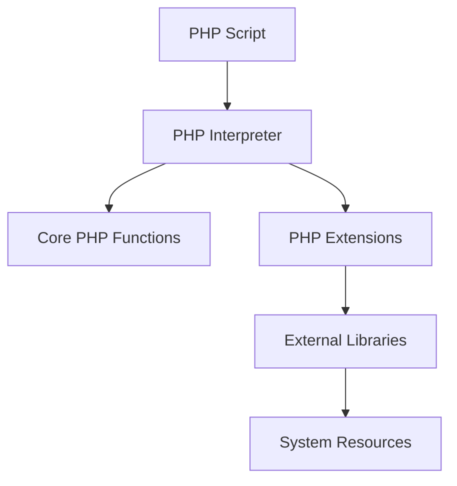

## 3.11 Effective Use of PHP Extensions

PHP extensions are powerful tools that allow developers to extend the core functionality of PHP, optimize performance, and integrate with various systems and services. In this section, we will explore the world of PHP extensions, discuss popular extensions and their use cases, and provide guidance on managing and installing these extensions effectively.

### Introduction to PHP Extensions

PHP extensions are compiled libraries that provide additional functionality to the PHP language. They can be used to enhance performance, add new features, or interface with external systems. Extensions are written in C and are loaded into PHP at runtime, allowing developers to use their functions and classes as if they were part of the core language.

#### Why Use PHP Extensions?

- **Performance Optimization**: Extensions can significantly improve the performance of PHP applications by providing optimized implementations of common tasks.
- **Feature Enhancement**: Extensions can add new features to PHP, such as support for additional data formats, cryptographic functions, or image processing capabilities.
- **Integration**: Extensions can facilitate integration with external systems, such as databases, message queues, or cloud services.

### Popular PHP Extensions and Their Use Cases

Let's explore some of the most popular PHP extensions and their typical use cases.

#### 1. PDO (PHP Data Objects)

**Use Case**: Database Access

PDO provides a consistent interface for accessing different databases in PHP. It supports a wide range of databases, including MySQL, PostgreSQL, SQLite, and more. PDO offers prepared statements, which help prevent SQL injection attacks.

```php
<?php
// Example of using PDO to connect to a MySQL database
$dsn = 'mysql:host=localhost;dbname=testdb';
$username = 'root';
$password = '';

try {
    $pdo = new PDO($dsn, $username, $password);
    $pdo->setAttribute(PDO::ATTR_ERRMODE, PDO::ERRMODE_EXCEPTION);
    echo "Connected successfully!";
} catch (PDOException $e) {
    echo "Connection failed: " . $e->getMessage();
}
?>
```

#### 2. GD and Imagick

**Use Case**: Image Processing

The GD and Imagick extensions are used for image processing in PHP. GD is included with PHP by default and provides basic image manipulation capabilities. Imagick, on the other hand, is a more powerful extension that provides an interface to the ImageMagick library.

```php
<?php
// Example of using GD to create a simple image
$image = imagecreatetruecolor(200, 200);
$background_color = imagecolorallocate($image, 255, 255, 255);
$text_color = imagecolorallocate($image, 0, 0, 0);
imagestring($image, 5, 50, 90, 'Hello, World!', $text_color);
header('Content-Type: image/png');
imagepng($image);
imagedestroy($image);
?>
```

#### 3. cURL

**Use Case**: HTTP Requests

The cURL extension is used to make HTTP requests from PHP. It supports a wide range of protocols, including HTTP, HTTPS, FTP, and more. cURL is commonly used for interacting with APIs and web services.

```php
<?php
// Example of using cURL to make a GET request
$ch = curl_init();
curl_setopt($ch, CURLOPT_URL, "https://api.example.com/data");
curl_setopt($ch, CURLOPT_RETURNTRANSFER, true);
$response = curl_exec($ch);
curl_close($ch);

echo $response;
?>
```

#### 4. APCu (Alternative PHP Cache User)

**Use Case**: Caching

APCu is a caching extension that provides an in-memory key-value store for PHP applications. It is commonly used to cache data and improve application performance.

```php
<?php
// Example of using APCu to cache data
apcu_store('my_key', 'my_value');
$value = apcu_fetch('my_key');
echo $value; // Outputs: my_value
?>
```

#### 5. Memcached

**Use Case**: Distributed Caching

Memcached is a distributed caching system that can be used to cache data across multiple servers. The Memcached extension provides an interface to interact with Memcached servers from PHP.

```php
<?php
// Example of using Memcached to store and retrieve data
$memcached = new Memcached();
$memcached->addServer('localhost', 11211);
$memcached->set('key', 'value');
echo $memcached->get('key'); // Outputs: value
?>
```

#### 6. OpenSSL

**Use Case**: Encryption and Decryption

The OpenSSL extension provides cryptographic functions for PHP applications. It can be used to encrypt and decrypt data, generate cryptographic keys, and create digital signatures.

```php
<?php
// Example of using OpenSSL to encrypt and decrypt data
$data = "Sensitive data";
$encryption_key = openssl_random_pseudo_bytes(32);
$iv = openssl_random_pseudo_bytes(openssl_cipher_iv_length('aes-256-cbc'));

$encrypted_data = openssl_encrypt($data, 'aes-256-cbc', $encryption_key, 0, $iv);
$decrypted_data = openssl_decrypt($encrypted_data, 'aes-256-cbc', $encryption_key, 0, $iv);

echo $decrypted_data; // Outputs: Sensitive data
?>
```

#### 7. Xdebug

**Use Case**: Debugging

Xdebug is a powerful debugging extension for PHP. It provides features such as stack traces, breakpoints, and variable inspection. Xdebug is an essential tool for PHP developers who want to debug their code effectively.

```php
// Xdebug configuration in php.ini
zend_extension=xdebug.so
xdebug.remote_enable=1
xdebug.remote_host=localhost
xdebug.remote_port=9000
```

### Managing and Installing PHP Extensions

Managing and installing PHP extensions can vary depending on the operating system and PHP version you are using. Here are some general guidelines for managing PHP extensions.

#### Installing Extensions on Linux

On Linux systems, PHP extensions are typically installed using the package manager. For example, on Ubuntu, you can use the `apt` command to install extensions.

```bash
# Install the GD extension on Ubuntu
sudo apt-get install php-gd
```

#### Installing Extensions on Windows

On Windows, PHP extensions are usually included with the PHP installation. You can enable or disable extensions by editing the `php.ini` file.

```ini
; Enable the GD extension in php.ini
extension=gd
```

#### Installing Extensions via PECL

PECL (PHP Extension Community Library) is a repository of PHP extensions. You can use the `pecl` command to install extensions from PECL.

```bash
# Install the APCu extension via PECL
pecl install apcu
```

#### Enabling Extensions in `php.ini`

After installing an extension, you need to enable it in the `php.ini` file. This is done by adding the `extension` directive.

```ini
; Enable the APCu extension in php.ini
extension=apcu.so
```

### Best Practices for Using PHP Extensions

- **Evaluate the Need**: Before using an extension, evaluate whether it is necessary for your application. Consider the trade-offs between using an extension and implementing the functionality in PHP.
- **Keep Extensions Updated**: Regularly update your extensions to benefit from performance improvements and security patches.
- **Monitor Performance**: Use profiling tools to monitor the performance impact of extensions on your application.
- **Consider Compatibility**: Ensure that the extensions you use are compatible with your PHP version and operating system.
- **Use Community Resources**: Leverage community resources, such as forums and documentation, to learn more about extensions and troubleshoot issues.

### Visualizing PHP Extensions in Action

To better understand how PHP extensions interact with the PHP runtime, let's visualize the process using a diagram.



**Diagram Description**: This diagram illustrates how a PHP script interacts with the PHP interpreter, which in turn utilizes core PHP functions and extensions. Extensions may interface with external libraries and system resources to provide additional functionality.

### Try It Yourself

Experiment with the code examples provided in this section. Try modifying the examples to suit your needs or explore additional features of the extensions. For instance, you can:

- Modify the PDO example to connect to a different database.
- Use the GD extension to create more complex images.
- Experiment with different cURL options to make various types of HTTP requests.

### Knowledge Check

- What are PHP extensions, and why are they used?
- How can you install a PHP extension on a Linux system?
- What is the purpose of the `php.ini` file in relation to PHP extensions?
- How does the cURL extension facilitate HTTP requests in PHP?

### Summary

In this section, we explored the world of PHP extensions, discussed popular extensions and their use cases, and provided guidance on managing and installing these extensions effectively. PHP extensions are powerful tools that can enhance the functionality, performance, and integration capabilities of your PHP applications. By understanding how to use extensions effectively, you can take your PHP development skills to the next level.

### Embrace the Journey

Remember, mastering PHP extensions is just one step in your journey as a PHP developer. As you continue to learn and grow, you'll discover new ways to leverage extensions to build robust and efficient applications. Keep experimenting, stay curious, and enjoy the journey!

## Quiz: Effective Use of PHP Extensions



### What is the primary purpose of PHP extensions?

- [x] To extend the functionality of PHP
- [ ] To replace the core PHP functions
- [ ] To provide a graphical user interface for PHP
- [ ] To compile PHP code into machine code

> **Explanation:** PHP extensions extend the functionality of PHP by providing additional features and capabilities.

### Which extension is commonly used for database access in PHP?

- [x] PDO
- [ ] GD
- [ ] cURL
- [ ] APCu

> **Explanation:** PDO (PHP Data Objects) is a popular extension used for database access in PHP.

### How can you install a PHP extension on a Linux system?

- [x] Using the package manager (e.g., apt, yum)
- [ ] By downloading the extension from the PHP website
- [ ] By editing the php.ini file
- [ ] By compiling the extension from source

> **Explanation:** On Linux systems, PHP extensions are typically installed using the package manager.

### What is the role of the `php.ini` file in relation to PHP extensions?

- [x] It is used to enable or disable extensions
- [ ] It is used to compile extensions
- [ ] It is used to store extension source code
- [ ] It is used to download extensions from the internet

> **Explanation:** The `php.ini` file is used to enable or disable PHP extensions by adding the `extension` directive.

### Which extension is used for image processing in PHP?

- [x] GD
- [ ] PDO
- [ ] cURL
- [ ] Memcached

> **Explanation:** The GD extension is used for image processing in PHP.

### What is the purpose of the cURL extension in PHP?

- [x] To make HTTP requests
- [ ] To process images
- [ ] To cache data
- [ ] To encrypt data

> **Explanation:** The cURL extension is used to make HTTP requests from PHP.

### How can you enable a PHP extension in the `php.ini` file?

- [x] By adding the `extension` directive
- [ ] By recompiling PHP
- [ ] By downloading the extension
- [ ] By editing the PHP source code

> **Explanation:** You can enable a PHP extension in the `php.ini` file by adding the `extension` directive.

### What is the purpose of the APCu extension?

- [x] To provide in-memory caching
- [ ] To make HTTP requests
- [ ] To access databases
- [ ] To process images

> **Explanation:** The APCu extension provides in-memory caching for PHP applications.

### Which extension provides cryptographic functions in PHP?

- [x] OpenSSL
- [ ] GD
- [ ] PDO
- [ ] Memcached

> **Explanation:** The OpenSSL extension provides cryptographic functions for PHP applications.

### True or False: PHP extensions can only be written in PHP.

- [ ] True
- [x] False

> **Explanation:** PHP extensions are written in C and are compiled into libraries that can be loaded into PHP at runtime.


