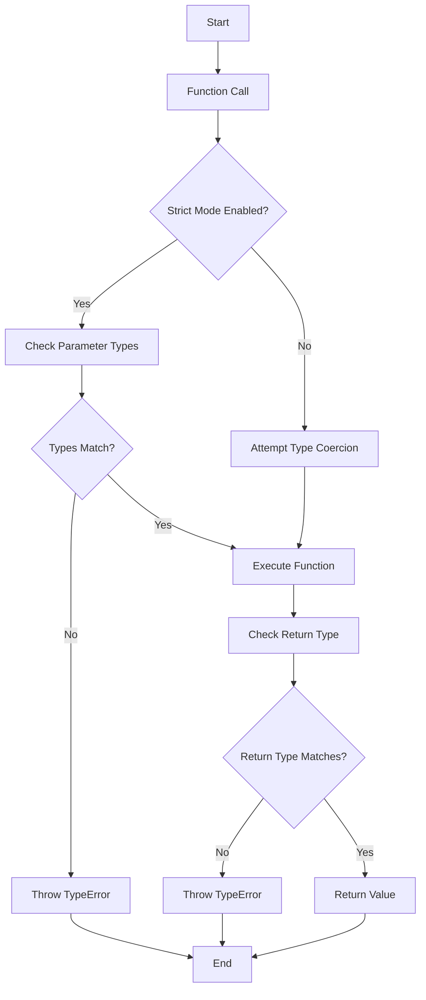

## 3.2 Scalar Type Declarations and Return Types

In modern PHP development, ensuring type safety and predictability in your code is crucial for building robust and maintainable applications. Scalar type declarations and return types are powerful features introduced in PHP 7 that allow developers to specify the expected data types for function parameters and return values. This section will guide you through the concepts, usage, and best practices of scalar type declarations and return types in PHP.

### Understanding Scalar Type Declarations

Scalar type declarations enable you to specify the data type of a function's parameters. This feature helps in catching type-related errors early in the development process, leading to more reliable code. PHP supports several scalar types, including:

- **int**: Represents integer values.
- **float**: Represents floating-point numbers.
- **string**: Represents sequences of characters.
- **bool**: Represents boolean values (true or false).

#### Using Scalar Type Hints for Function Parameters

To use scalar type hints, you simply declare the expected type before the parameter name in your function definition. Here's a basic example:

```php
<?php

function addNumbers(int $a, int $b): int {
    return $a + $b;
}

echo addNumbers(5, 10); // Outputs: 15

?>
```

In this example, the `addNumbers` function expects two integer parameters and returns an integer. If you pass a non-integer value, PHP will attempt to convert it to an integer, unless strict mode is enabled.

### Enabling Strict Mode for Type Enforcement

By default, PHP uses a "coercive" type system, meaning it will attempt to convert values to the expected type if they don't match. However, you can enable strict mode to enforce strict type checking. This is done by adding the `declare(strict_types=1);` directive at the top of your PHP file:

```php
<?php

declare(strict_types=1);

function addNumbers(int $a, int $b): int {
    return $a + $b;
}

echo addNumbers(5, 10); // Outputs: 15
echo addNumbers(5, '10'); // TypeError: Argument 2 passed to addNumbers() must be of the type int, string given

?>
```

With strict mode enabled, passing a string to a parameter expecting an integer will result in a `TypeError`.

### Defining Return Types for Functions and Methods

Return types allow you to specify the expected type of a function's return value. This feature enhances code readability and helps prevent errors by ensuring that functions return values of the correct type.

Here's an example of defining a return type:

```php
<?php

declare(strict_types=1);

function getGreeting(string $name): string {
    return "Hello, " . $name;
}

echo getGreeting("Alice"); // Outputs: Hello, Alice

?>
```

In this example, the `getGreeting` function is expected to return a string. If it returns a value of a different type, PHP will throw a `TypeError`.

### Combining Scalar Type Declarations and Return Types

Scalar type declarations and return types can be combined to create functions that are both type-safe and predictable. This combination ensures that both the input and output of your functions adhere to the expected types.

Consider the following example:

```php
<?php

declare(strict_types=1);

function calculateArea(float $width, float $height): float {
    return $width * $height;
}

echo calculateArea(5.5, 3.2); // Outputs: 17.6

?>
```

In this example, the `calculateArea` function expects two floating-point numbers as parameters and returns a floating-point number. This ensures that the function behaves consistently and predictably.

### Best Practices for Using Scalar Type Declarations and Return Types

1. **Enable Strict Mode**: Always use `declare(strict_types=1);` at the top of your PHP files to enforce strict type checking. This helps catch type-related errors early and improves code reliability.

2. **Use Type Declarations Consistently**: Apply scalar type declarations and return types consistently throughout your codebase to maintain uniformity and readability.

3. **Document Your Functions**: Even with type declarations, it's important to document your functions using PHPDoc comments. This provides additional context and information for other developers.

4. **Test Your Code**: Ensure that your code is thoroughly tested, especially when using strict mode. Write unit tests to verify that your functions handle different types of input correctly.

5. **Refactor Legacy Code**: When working with legacy code, gradually introduce type declarations and return types to improve code quality over time.

### Visualizing Type Declarations and Return Types

To better understand how scalar type declarations and return types work, let's visualize the process using a flowchart:



This flowchart illustrates the process of handling type declarations and return types in PHP, highlighting the importance of strict mode for enforcing type safety.

### Try It Yourself

To solidify your understanding of scalar type declarations and return types, try modifying the examples provided. Experiment with different data types and observe how PHP handles them with and without strict mode enabled.

### References and Further Reading

- [PHP Manual: Type Declarations](https://www.php.net/manual/en/functions.arguments.php#functions.arguments.type-declaration)
- [PHP Manual: Return Type Declarations](https://www.php.net/manual/en/functions.returning-values.php#functions.returning-values.type-declaration)
- [PHP RFC: Scalar Type Hints](https://wiki.php.net/rfc/scalar_type_hints_v5)
- [PHP RFC: Return Type Declarations](https://wiki.php.net/rfc/return_types)

### Knowledge Check

To reinforce your learning, consider the following questions:

1. What are scalar type declarations, and why are they important in PHP?
2. How does enabling strict mode affect type checking in PHP?
3. What happens if a function's return value does not match the declared return type?
4. How can scalar type declarations and return types improve code readability and maintainability?

### Embrace the Journey

Remember, mastering scalar type declarations and return types is just one step in your PHP development journey. As you continue to explore and experiment with these features, you'll gain a deeper understanding of how to write clean, reliable, and maintainable code. Keep pushing your boundaries, stay curious, and enjoy the process of learning and growing as a developer!

## Quiz: Scalar Type Declarations and Return Types



### What is the purpose of scalar type declarations in PHP?

- [x] To specify the expected data type of function parameters
- [ ] To define the structure of a class
- [ ] To enforce coding standards
- [ ] To manage database connections

> **Explanation:** Scalar type declarations allow developers to specify the expected data type of function parameters, enhancing type safety and predictability.

### How do you enable strict mode in PHP?

- [x] By adding `declare(strict_types=1);` at the top of the PHP file
- [ ] By setting a configuration in php.ini
- [ ] By using a special PHP function
- [ ] By including a specific library

> **Explanation:** Strict mode is enabled by adding `declare(strict_types=1);` at the beginning of a PHP file, enforcing strict type checking.

### What happens if a function's return value does not match the declared return type in strict mode?

- [x] A `TypeError` is thrown
- [ ] The value is coerced to the expected type
- [ ] The function returns null
- [ ] The script continues without any error

> **Explanation:** In strict mode, if a function's return value does not match the declared return type, PHP throws a `TypeError`.

### Which scalar types are supported in PHP?

- [x] int, float, string, bool
- [ ] array, object, resource, callable
- [ ] char, double, long, short
- [ ] byte, decimal, binary, octal

> **Explanation:** PHP supports scalar types such as int, float, string, and bool for type declarations.

### What is the default behavior of PHP regarding type checking?

- [x] Coercive type system
- [ ] Strict type system
- [ ] No type checking
- [ ] Dynamic type system

> **Explanation:** By default, PHP uses a coercive type system, attempting to convert values to the expected type if they don't match.

### How can scalar type declarations improve code quality?

- [x] By catching type-related errors early
- [ ] By reducing the number of lines of code
- [ ] By increasing execution speed
- [ ] By simplifying the syntax

> **Explanation:** Scalar type declarations help catch type-related errors early in the development process, improving code quality and reliability.

### What is the benefit of using return type declarations?

- [x] Ensures functions return values of the correct type
- [ ] Increases the speed of function execution
- [ ] Reduces memory usage
- [ ] Simplifies function syntax

> **Explanation:** Return type declarations ensure that functions return values of the correct type, enhancing code readability and preventing errors.

### Can you use scalar type declarations with class methods?

- [x] Yes
- [ ] No

> **Explanation:** Scalar type declarations can be used with both functions and class methods to specify parameter and return types.

### What is the result of calling a function with a mismatched parameter type in strict mode?

- [x] A `TypeError` is thrown
- [ ] The parameter is converted to the expected type
- [ ] The function returns null
- [ ] The script continues without any error

> **Explanation:** In strict mode, calling a function with a mismatched parameter type results in a `TypeError`.

### True or False: Scalar type declarations are only available in PHP 7 and later.

- [x] True
- [ ] False

> **Explanation:** Scalar type declarations were introduced in PHP 7, making them available in PHP 7 and later versions.


