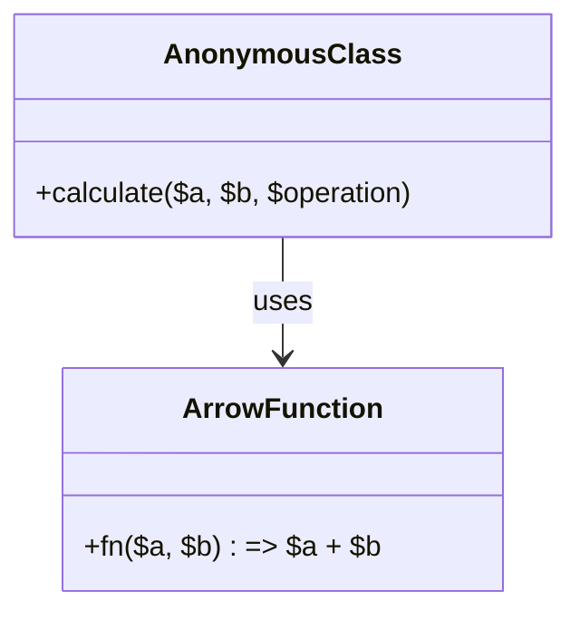

## 3.3 Anonymous Classes and Arrow Functions

In modern PHP development, anonymous classes and arrow functions are powerful tools that allow developers to write more concise and flexible code. These features, introduced in PHP 7 and PHP 7.4 respectively, offer new ways to streamline your codebase and enhance your programming efficiency. In this section, we will delve into the intricacies of anonymous classes and arrow functions, exploring their syntax, use cases, and best practices.

### Understanding Anonymous Classes

Anonymous classes in PHP provide a way to create class instances without formally defining a class. This can be particularly useful for one-off objects or when you need a simple class for a specific task without polluting the global namespace.

#### Creating Anonymous Classes

To create an anonymous class, you use the `new class` syntax. Here's a basic example:

```php
<?php

$greeting = new class {
    public function sayHello() {
        return "Hello, World!";
    }
};

echo $greeting->sayHello(); // Outputs: Hello, World!
```

In this example, we define an anonymous class with a single method `sayHello`. The class is instantiated immediately, and we can call its methods just like any other object.

#### Key Features of Anonymous Classes

- **Encapsulation**: Anonymous classes can encapsulate functionality without the need for a named class.
- **Scope**: They can access variables from the scope in which they are defined, similar to closures.
- **Inheritance**: Anonymous classes can extend other classes and implement interfaces.

#### Use Cases for Anonymous Classes

1. **One-Time Use Objects**: When you need an object for a specific task that doesn't require a named class.
2. **Testing and Mocking**: Useful in unit tests for creating mock objects.
3. **Callbacks and Event Handling**: When you need a quick object with specific methods for callbacks.

#### Example: Anonymous Class with Inheritance

```php
<?php

interface Logger {
    public function log($message);
}

$logger = new class implements Logger {
    public function log($message) {
        echo "Logging message: $message";
    }
};

$logger->log("This is a test message."); // Outputs: Logging message: This is a test message.
```

In this example, the anonymous class implements the `Logger` interface, demonstrating how you can use anonymous classes with interfaces.

### Arrow Functions in PHP

Arrow functions, introduced in PHP 7.4, provide a more concise syntax for writing anonymous functions. They are particularly useful for short, simple functions that are used as callbacks or in array operations.

#### Syntax of Arrow Functions

Arrow functions use the `fn` keyword and have a simplified syntax compared to traditional anonymous functions. Here's a basic example:

```php
<?php

$add = fn($a, $b) => $a + $b;

echo $add(5, 3); // Outputs: 8
```

In this example, the arrow function takes two parameters, `$a` and `$b`, and returns their sum.

#### Key Features of Arrow Functions

- **Concise Syntax**: Arrow functions are more concise than traditional anonymous functions.
- **Implicit Return**: They automatically return the result of the expression.
- **Lexical Scope**: Arrow functions inherit variables from the parent scope, similar to closures.

#### Differences Between Arrow Functions and Closures

While both arrow functions and closures can capture variables from the surrounding scope, there are key differences:

- **Syntax**: Arrow functions use the `fn` keyword and do not require the `use` keyword to capture variables.
- **Return**: Arrow functions have an implicit return, while closures require an explicit `return` statement.
- **Complexity**: Arrow functions are best suited for simple expressions, while closures can handle more complex logic.

#### Example: Using Arrow Functions in Array Operations

```php
<?php

$numbers = [1, 2, 3, 4, 5];
$squared = array_map(fn($n) => $n * $n, $numbers);

print_r($squared); // Outputs: Array ( [0] => 1 [1] => 4 [2] => 9 [3] => 16 [4] => 25 )
```

In this example, we use an arrow function with `array_map` to square each number in the array.

### Combining Anonymous Classes and Arrow Functions

Anonymous classes and arrow functions can be used together to create powerful, concise code. For instance, you might use an anonymous class to define a temporary object with methods that use arrow functions for callbacks.

#### Example: Anonymous Class with Arrow Function

```php
<?php

$calculator = new class {
    public function calculate($a, $b, $operation) {
        return $operation($a, $b);
    }
};

$sum = $calculator->calculate(5, 3, fn($a, $b) => $a + $b);
echo $sum; // Outputs: 8
```

In this example, the anonymous class has a method `calculate` that takes an arrow function as a parameter to perform the operation.

### Visualizing Anonymous Classes and Arrow Functions

To better understand how anonymous classes and arrow functions work together, let's visualize their interaction using a class diagram.



This diagram shows the relationship between the anonymous class and the arrow function, highlighting how the class uses the function to perform operations.

### Best Practices for Using Anonymous Classes and Arrow Functions

1. **Keep It Simple**: Use arrow functions for simple expressions and anonymous classes for lightweight objects.
2. **Readability**: Ensure your code remains readable. Avoid overly complex anonymous classes or arrow functions.
3. **Performance**: While these features are powerful, use them judiciously to avoid performance overhead.

### Try It Yourself

Experiment with the examples provided by modifying the code. Try creating your own anonymous classes and arrow functions to see how they can simplify your code.

### Further Reading

- [PHP Manual: Anonymous Classes](https://www.php.net/manual/en/language.oop5.anonymous.php)
- [PHP Manual: Arrow Functions](https://www.php.net/manual/en/functions.arrow.php)

### Knowledge Check

- What are the benefits of using anonymous classes in PHP?
- How do arrow functions differ from traditional anonymous functions?
- Can anonymous classes implement interfaces? Provide an example.
- Create an arrow function that multiplies two numbers and returns the result.

### Summary

Anonymous classes and arrow functions are valuable additions to PHP, offering developers new ways to write concise and efficient code. By understanding and utilizing these features, you can enhance your PHP development skills and create more maintainable codebases. Remember, this is just the beginning. Keep experimenting, stay curious, and enjoy the journey!

## Quiz: Anonymous Classes and Arrow Functions



### What is the primary advantage of using anonymous classes in PHP?

- [x] They allow for quick object definitions without polluting the global namespace.
- [ ] They are faster than named classes.
- [ ] They can only be used for testing purposes.
- [ ] They replace the need for interfaces.

> **Explanation:** Anonymous classes provide a way to create objects without defining a named class, which is useful for one-off objects and avoiding namespace pollution.

### How do arrow functions differ from traditional anonymous functions in PHP?

- [x] Arrow functions have an implicit return.
- [ ] Arrow functions require the `use` keyword to capture variables.
- [ ] Arrow functions cannot accept parameters.
- [ ] Arrow functions are slower than traditional anonymous functions.

> **Explanation:** Arrow functions automatically return the result of the expression, whereas traditional anonymous functions require an explicit `return` statement.

### Can anonymous classes in PHP implement interfaces?

- [x] Yes
- [ ] No

> **Explanation:** Anonymous classes can implement interfaces, allowing them to adhere to specific contracts and behaviors.

### Which keyword is used to define an arrow function in PHP?

- [x] fn
- [ ] function
- [ ] arrow
- [ ] lambda

> **Explanation:** The `fn` keyword is used to define arrow functions in PHP.

### What is a key feature of arrow functions in PHP?

- [x] Lexical scope inheritance
- [ ] They cannot access variables from the parent scope.
- [ ] They require explicit return statements.
- [ ] They are only available in PHP 8 and above.

> **Explanation:** Arrow functions inherit variables from the parent scope, similar to closures, without needing the `use` keyword.

### What is a common use case for anonymous classes?

- [x] Creating mock objects for testing
- [ ] Replacing all named classes
- [ ] Defining global variables
- [ ] Implementing database connections

> **Explanation:** Anonymous classes are often used to create mock objects for testing purposes, providing a quick and flexible way to define objects.

### Which PHP version introduced arrow functions?

- [x] PHP 7.4
- [ ] PHP 7.0
- [ ] PHP 8.0
- [ ] PHP 5.6

> **Explanation:** Arrow functions were introduced in PHP 7.4, providing a more concise syntax for anonymous functions.

### What is the output of the following code?
```php
$multiply = fn($a, $b) => $a * $b;
echo $multiply(2, 3);
```

- [x] 6
- [ ] 5
- [ ] 8
- [ ] 9

> **Explanation:** The arrow function multiplies the two parameters, resulting in an output of 6.

### True or False: Anonymous classes can extend other classes.

- [x] True
- [ ] False

> **Explanation:** Anonymous classes can extend other classes, allowing them to inherit properties and methods.

### What is the primary use of arrow functions in array operations?

- [x] To provide concise callbacks
- [ ] To replace all array functions
- [ ] To sort arrays
- [ ] To create arrays

> **Explanation:** Arrow functions are often used as concise callbacks in array operations, such as with `array_map` or `array_filter`.


