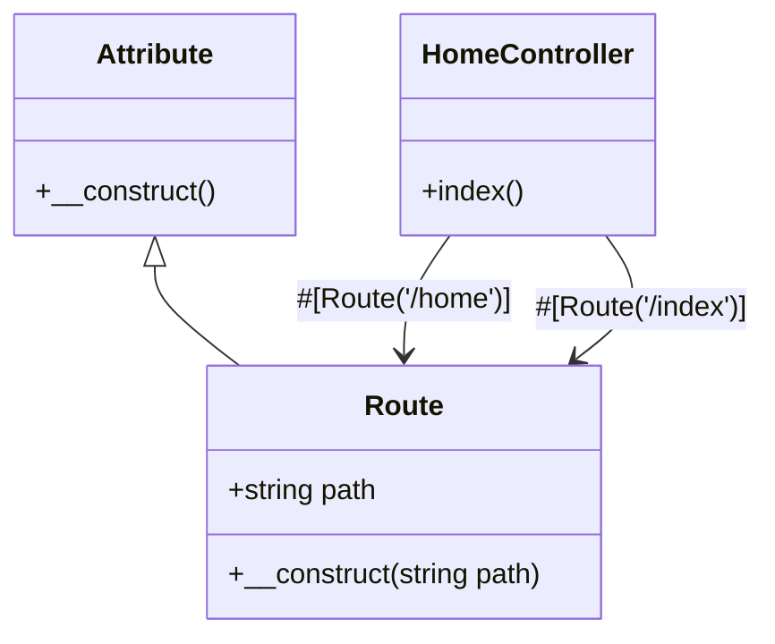

## 3.4 Attributes (Annotations) in PHP 8

Attributes, also known as annotations, are a powerful feature introduced in PHP 8 that allow developers to add metadata to classes, methods, properties, and functions. This metadata can be used to influence the behavior of the code at runtime, provide additional context, or serve as documentation. In this section, we will explore the concept of attributes, how to define and use them, and their practical applications in modern PHP development.

### Introduction to Attributes

Attributes in PHP 8 provide a structured way to add metadata to your code. This metadata can be used by frameworks, libraries, or even your own code to modify behavior, enforce rules, or simply provide additional information. Attributes are a form of declarative programming, where you specify what you want rather than how to achieve it.

#### What Are Attributes?

Attributes are essentially a way to attach metadata to PHP code elements. This metadata can be accessed at runtime using reflection, allowing you to build more dynamic and flexible applications. Attributes can be applied to:

- Classes
- Methods
- Properties
- Functions
- Parameters

#### Why Use Attributes?

Attributes offer several benefits:

- **Readability**: They provide a clear and concise way to specify metadata directly in the code.
- **Flexibility**: Attributes can be used to modify behavior without changing the underlying code.
- **Reusability**: They can be reused across different parts of an application or even across different projects.
- **Integration**: Attributes are widely used in frameworks and libraries to provide configuration and behavior modification.

### Defining and Using Attributes

Let's dive into how to define and use attributes in PHP 8.

#### Defining Attributes

Attributes are defined using the `#[Attribute]` syntax. You can create custom attributes by defining a class and marking it with the `#[Attribute]` attribute. Here's an example:

```php
<?php

#[Attribute]
class Route
{
    public string $path;

    public function __construct(string $path)
    {
        $this->path = $path;
    }
}
```

In this example, we define a `Route` attribute that can be used to specify a path for a route in a web application.

#### Using Attributes

Once you have defined an attribute, you can use it by applying it to a class, method, or property. Here's how you can use the `Route` attribute:

```php
<?php

#[Route('/home')]
class HomeController
{
    #[Route('/index')]
    public function index()
    {
        // Method logic here
    }
}
```

In this example, we apply the `Route` attribute to both a class and a method, specifying different paths for each.

#### Accessing Attributes

To access attributes at runtime, you can use PHP's reflection API. Here's an example of how to retrieve and use attributes:

```php
<?php

$reflectionClass = new ReflectionClass(HomeController::class);
$attributes = $reflectionClass->getAttributes(Route::class);

foreach ($attributes as $attribute) {
    $route = $attribute->newInstance();
    echo "Path: " . $route->path . PHP_EOL;
}
```

This code snippet uses reflection to retrieve the `Route` attributes applied to the `HomeController` class and prints the path specified in each attribute.

### Use Cases for Attributes

Attributes are widely used in frameworks and libraries to provide configuration and behavior modification. Here are some common use cases:

#### Framework Configuration

Many PHP frameworks use attributes to configure routes, middleware, and other components. For example, Symfony and Laravel use attributes to define routes and middleware directly in the code, making it easier to manage and understand.

#### Validation

Attributes can be used to specify validation rules for properties or parameters. This allows you to define validation logic in a declarative way, separate from the business logic.

```php
<?php

#[Attribute]
class Validate
{
    public string $rule;

    public function __construct(string $rule)
    {
        $this->rule = $rule;
    }
}

class User
{
    #[Validate('email')]
    public string $email;
}
```

In this example, the `Validate` attribute is used to specify that the `email` property should be validated as an email.

#### Dependency Injection

Attributes can be used to specify dependencies for classes or methods, allowing for more flexible and configurable dependency injection.

```php
<?php

#[Attribute]
class Inject
{
    public string $service;

    public function __construct(string $service)
    {
        $this->service = $service;
    }
}

class ServiceConsumer
{
    #[Inject('logger')]
    private $logger;
}
```

In this example, the `Inject` attribute is used to specify that a `logger` service should be injected into the `ServiceConsumer` class.

#### Documentation

Attributes can also be used to provide additional documentation or metadata for classes, methods, or properties. This can be useful for generating API documentation or providing additional context for developers.

### Visualizing Attributes in PHP 8

To better understand how attributes work in PHP 8, let's visualize the process of defining, using, and accessing attributes using a class diagram.



In this diagram, we see the `Route` attribute class and its relationship with the `HomeController` class. The `HomeController` class uses the `Route` attribute to specify paths for the class and its `index` method.

### Practical Applications of Attributes

Attributes are a versatile tool that can be used in a variety of ways to enhance your PHP applications. Here are some practical applications:

#### Building a Custom Framework

If you're building a custom framework, attributes can be used to define routes, middleware, and other components directly in the code. This can make your framework more flexible and easier to use.

#### Enhancing Existing Libraries

Attributes can be used to enhance existing libraries by adding metadata that can be used to modify behavior or provide additional context. This can make your libraries more powerful and easier to integrate into different projects.

#### Improving Code Readability

Attributes can improve code readability by providing a clear and concise way to specify metadata. This can make your code easier to understand and maintain, especially in large projects.

### Try It Yourself

To get a better understanding of how attributes work, try modifying the code examples provided in this section. Experiment with different attribute definitions and see how they affect the behavior of your code. Here are some ideas to get you started:

- Create a custom attribute for logging and apply it to methods you want to log.
- Define a validation attribute and use it to specify validation rules for different properties.
- Use attributes to configure dependency injection in a small application.

### References and Further Reading

For more information on attributes in PHP 8, check out the following resources:

- [PHP Manual: Attributes](https://www.php.net/manual/en/language.attributes.php)
- [Symfony Documentation: Attributes](https://symfony.com/doc/current/routing.html#attributes-annotations)
- [Laravel Documentation: Attributes](https://laravel.com/docs/8.x/routing#route-attributes)

### Knowledge Check

To reinforce your understanding of attributes in PHP 8, try answering the following questions:

1. What are attributes in PHP 8, and how are they used?
2. How do you define a custom attribute in PHP 8?
3. What are some common use cases for attributes in PHP frameworks?
4. How can attributes improve code readability and maintainability?
5. What is the role of reflection in accessing attributes at runtime?

### Embrace the Journey

Remember, attributes are just one of the many powerful features introduced in PHP 8. As you continue to explore and experiment with attributes, you'll discover new ways to enhance your applications and improve your development workflow. Keep learning, stay curious, and enjoy the journey!

## Quiz: Attributes (Annotations) in PHP 8



### What is the primary purpose of attributes in PHP 8?

- [x] To add metadata to classes, methods, and properties
- [ ] To replace comments in the code
- [ ] To improve performance
- [ ] To enforce security

> **Explanation:** Attributes are used to add metadata to code elements, which can be accessed at runtime to modify behavior or provide additional context.

### How do you define a custom attribute in PHP 8?

- [x] By creating a class and marking it with the `#[Attribute]` attribute
- [ ] By using a special keyword in the function signature
- [ ] By adding a comment above the class or method
- [ ] By using a configuration file

> **Explanation:** Custom attributes are defined by creating a class and marking it with the `#[Attribute]` attribute, allowing it to be used as metadata.

### Which PHP feature is used to access attributes at runtime?

- [x] Reflection
- [ ] Serialization
- [ ] Namespaces
- [ ] Autoloading

> **Explanation:** Reflection is used to access attributes at runtime, allowing you to retrieve and use the metadata defined by attributes.

### What is a common use case for attributes in PHP frameworks?

- [x] Defining routes and middleware
- [ ] Improving database performance
- [ ] Enhancing security
- [ ] Managing sessions

> **Explanation:** Attributes are commonly used in frameworks to define routes and middleware, providing a declarative way to configure these components.

### How can attributes improve code readability?

- [x] By providing a clear and concise way to specify metadata
- [ ] By reducing the number of lines of code
- [ ] By eliminating the need for comments
- [ ] By enforcing a specific coding style

> **Explanation:** Attributes improve readability by providing a clear and concise way to specify metadata directly in the code, making it easier to understand.

### Can attributes be applied to function parameters in PHP 8?

- [x] Yes
- [ ] No

> **Explanation:** Attributes can be applied to function parameters, allowing you to specify metadata for individual parameters.

### What is the syntax used to define an attribute in PHP 8?

- [x] `#[Attribute]`
- [ ] `@Attribute`
- [ ] `// Attribute`
- [ ] `/* Attribute */`

> **Explanation:** The syntax `#[Attribute]` is used to define attributes in PHP 8.

### What is the benefit of using attributes for validation?

- [x] They allow you to define validation rules in a declarative way
- [ ] They improve performance
- [ ] They enhance security
- [ ] They reduce code complexity

> **Explanation:** Attributes allow you to define validation rules in a declarative way, separate from the business logic, making the code cleaner and more maintainable.

### Can attributes be reused across different projects?

- [x] Yes
- [ ] No

> **Explanation:** Attributes can be reused across different projects, making them a versatile tool for adding metadata to your code.

### Are attributes a form of declarative programming?

- [x] True
- [ ] False

> **Explanation:** Attributes are a form of declarative programming, where you specify what you want rather than how to achieve it.




