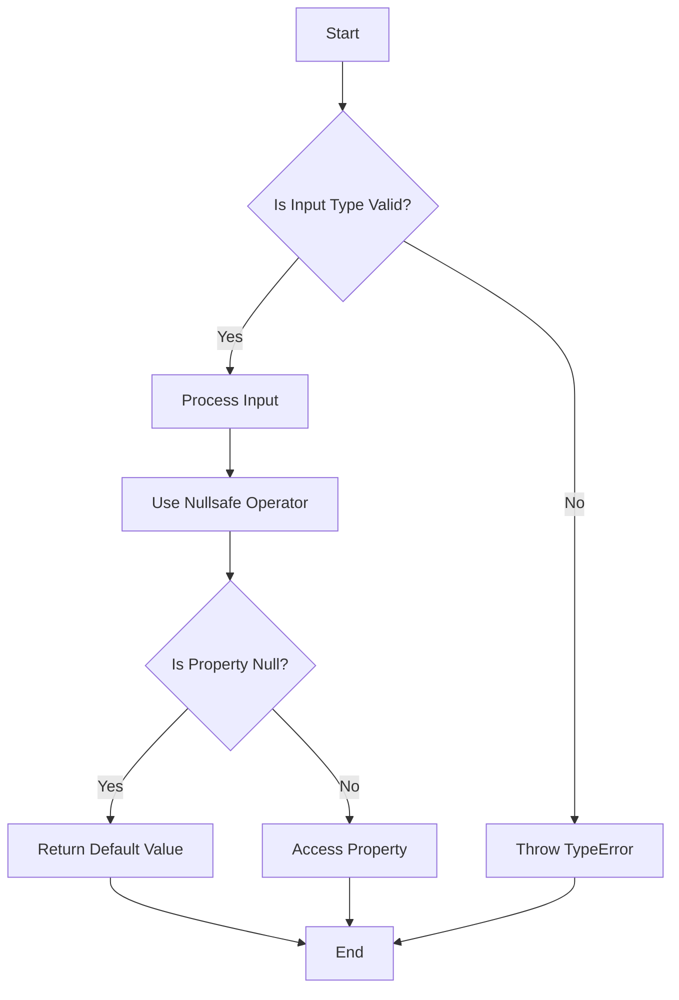

## 3.5 Union Types and Nullsafe Operator

In the ever-evolving landscape of PHP, the introduction of union types and the nullsafe operator in PHP 8 has brought significant improvements to type safety and code readability. These features empower developers to write more flexible and robust code, reducing the likelihood of runtime errors and simplifying null checks. In this section, we will delve into the concepts of union types and the nullsafe operator, explore their benefits, and provide practical examples to illustrate their usage.

### Understanding Union Types

Union types allow a variable to accept multiple types, providing greater flexibility in function signatures and class properties. This feature is particularly useful in scenarios where a function or method can handle different types of input, enhancing code reusability and reducing the need for type casting.

#### Implementing Union Types

To declare a union type, you simply list the possible types separated by a pipe (`|`) symbol. Let's explore how to implement union types in PHP:

```php
<?php

function processValue(int|float $value): void {
    echo "Processing value: $value\n";
}

processValue(10);    // Valid
processValue(10.5);  // Valid
// processValue("10"); // Invalid, will cause a TypeError

?>
```

In this example, the `processValue` function accepts either an integer or a float. Attempting to pass a string will result in a `TypeError`, ensuring type safety.

#### Union Types in Class Properties

Union types can also be used in class properties, allowing for more flexible object design:

```php
<?php

class Product {
    public int|string $id;
    public float|int $price;

    public function __construct(int|string $id, float|int $price) {
        $this->id = $id;
        $this->price = $price;
    }
}

$product = new Product(123, 19.99);
echo "Product ID: {$product->id}, Price: {$product->price}\n";

?>
```

Here, the `Product` class can have an `id` that is either an integer or a string, and a `price` that can be a float or an integer, providing flexibility in how these properties are used.

### Simplifying Null Checks with the Nullsafe Operator

The nullsafe operator (`?->`) is a powerful addition to PHP 8 that simplifies null checks when accessing properties or methods of an object. It helps prevent `NullPointerException` by safely navigating through potentially null objects.

#### Using the Nullsafe Operator

Consider the following example where we use the nullsafe operator to access a property:

```php
<?php

class User {
    public ?Profile $profile = null;
}

class Profile {
    public ?string $bio = null;
}

$user = new User();

// Without nullsafe operator
if ($user->profile !== null) {
    echo $user->profile->bio;
}

// With nullsafe operator
echo $user->profile?->bio ?? 'No bio available';

?>
```

In this example, the nullsafe operator (`?->`) allows us to access the `bio` property of the `profile` object without explicitly checking if `profile` is null. If `profile` is null, the expression evaluates to null, and the `??` operator provides a default value.

### Practical Examples of Union Types and Nullsafe Operator

Let's explore some practical scenarios where union types and the nullsafe operator can be effectively utilized.

#### Example 1: Handling Multiple Input Types

Suppose we have a function that processes different types of user input:

```php
<?php

function handleInput(int|string|array $input): void {
    if (is_int($input)) {
        echo "Integer input: $input\n";
    } elseif (is_string($input)) {
        echo "String input: $input\n";
    } elseif (is_array($input)) {
        echo "Array input: " . implode(', ', $input) . "\n";
    }
}

handleInput(42);
handleInput("Hello, World!");
handleInput(['apple', 'banana', 'cherry']);

?>
```

This function can handle integers, strings, and arrays, demonstrating the versatility of union types.

#### Example 2: Safe Navigation in Object Hierarchies

Consider a scenario where we need to access nested properties in an object hierarchy:

```php
<?php

class Address {
    public ?string $city = null;
}

class Customer {
    public ?Address $address = null;
}

$customer = new Customer();

// Without nullsafe operator
if ($customer->address !== null && $customer->address->city !== null) {
    echo $customer->address->city;
}

// With nullsafe operator
echo $customer->address?->city ?? 'City not available';

?>
```

The nullsafe operator simplifies the process of accessing the `city` property, reducing the need for multiple null checks.

### Visualizing Union Types and Nullsafe Operator

To better understand the flow of using union types and the nullsafe operator, let's visualize the process with a flowchart:



This flowchart illustrates the decision-making process when using union types and the nullsafe operator, highlighting the checks and actions taken at each step.

### Best Practices for Using Union Types and Nullsafe Operator

- **Use Union Types Judiciously**: While union types provide flexibility, overusing them can lead to complex code. Use them when it genuinely enhances code readability and functionality.
- **Combine with Type Declarations**: Use union types in conjunction with type declarations to ensure consistency and prevent runtime errors.
- **Leverage the Nullsafe Operator**: Use the nullsafe operator to simplify null checks, especially in deeply nested object structures.
- **Provide Default Values**: When using the nullsafe operator, consider providing default values using the null coalescing operator (`??`) to handle null cases gracefully.

### Try It Yourself

Experiment with the code examples provided in this section. Try modifying the types in the union type declarations or adding additional properties to the classes. Observe how the nullsafe operator simplifies null checks in different scenarios.

### Further Reading and Resources

For more information on union types and the nullsafe operator, consider exploring the following resources:

- [PHP Manual: Union Types](https://www.php.net/manual/en/language.types.declarations.php#language.types.declarations.union)
- [PHP Manual: Nullsafe Operator](https://www.php.net/releases/8.0/en.php#nullsafe-operator)
- [MDN Web Docs: Type Systems](https://developer.mozilla.org/en-US/docs/Glossary/Type_system)

### Summary

Union types and the nullsafe operator are powerful features in PHP 8 that enhance type flexibility and simplify null checks. By understanding and utilizing these features, developers can write more robust and maintainable code. Remember, this is just the beginning. As you progress, you'll build more complex and interactive applications. Keep experimenting, stay curious, and enjoy the journey!

## Quiz: Union Types and Nullsafe Operator



### What is the primary benefit of using union types in PHP?

- [x] They allow a variable to accept multiple types, enhancing flexibility.
- [ ] They enforce strict type checking, reducing flexibility.
- [ ] They automatically convert types at runtime.
- [ ] They eliminate the need for type declarations.

> **Explanation:** Union types allow a variable to accept multiple types, providing greater flexibility in function signatures and class properties.

### How do you declare a union type in PHP?

- [x] By listing possible types separated by a pipe (`|`) symbol.
- [ ] By using a comma-separated list of types.
- [ ] By using a semicolon-separated list of types.
- [ ] By using a colon-separated list of types.

> **Explanation:** Union types are declared by listing the possible types separated by a pipe (`|`) symbol.

### What does the nullsafe operator (`?->`) do?

- [x] It simplifies null checks when accessing properties or methods of an object.
- [ ] It converts null values to empty strings.
- [ ] It throws an exception if a null value is encountered.
- [ ] It automatically initializes null properties.

> **Explanation:** The nullsafe operator simplifies null checks by safely navigating through potentially null objects.

### In which version of PHP were union types and the nullsafe operator introduced?

- [x] PHP 8
- [ ] PHP 7
- [ ] PHP 5
- [ ] PHP 4

> **Explanation:** Union types and the nullsafe operator were introduced in PHP 8.

### What happens if you use the nullsafe operator on a null object?

- [x] The expression evaluates to null.
- [ ] An exception is thrown.
- [ ] The object is automatically initialized.
- [ ] A warning is issued.

> **Explanation:** When the nullsafe operator is used on a null object, the expression evaluates to null.

### Can union types be used in class properties?

- [x] Yes, they can be used to allow properties to accept multiple types.
- [ ] No, they are only applicable to function parameters.
- [ ] No, they are only applicable to return types.
- [ ] Yes, but only for scalar types.

> **Explanation:** Union types can be used in class properties to allow them to accept multiple types.

### Which operator can be used with the nullsafe operator to provide default values?

- [x] The null coalescing operator (`??`)
- [ ] The ternary operator (`?:`)
- [ ] The assignment operator (`=`)
- [ ] The increment operator (`++`)

> **Explanation:** The null coalescing operator (`??`) can be used with the nullsafe operator to provide default values.

### What is a potential downside of overusing union types?

- [x] It can lead to complex and less readable code.
- [ ] It enforces strict type checking.
- [ ] It reduces code flexibility.
- [ ] It increases runtime errors.

> **Explanation:** Overusing union types can lead to complex and less readable code, so they should be used judiciously.

### How can you handle null cases gracefully when using the nullsafe operator?

- [x] By providing default values using the null coalescing operator (`??`).
- [ ] By initializing all properties to non-null values.
- [ ] By avoiding the use of nullable properties.
- [ ] By using exception handling.

> **Explanation:** Providing default values using the null coalescing operator (`??`) helps handle null cases gracefully.

### True or False: The nullsafe operator can be used to access methods as well as properties.

- [x] True
- [ ] False

> **Explanation:** The nullsafe operator can be used to access both methods and properties, simplifying null checks in both cases.


