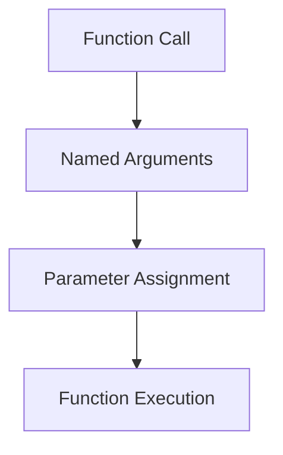
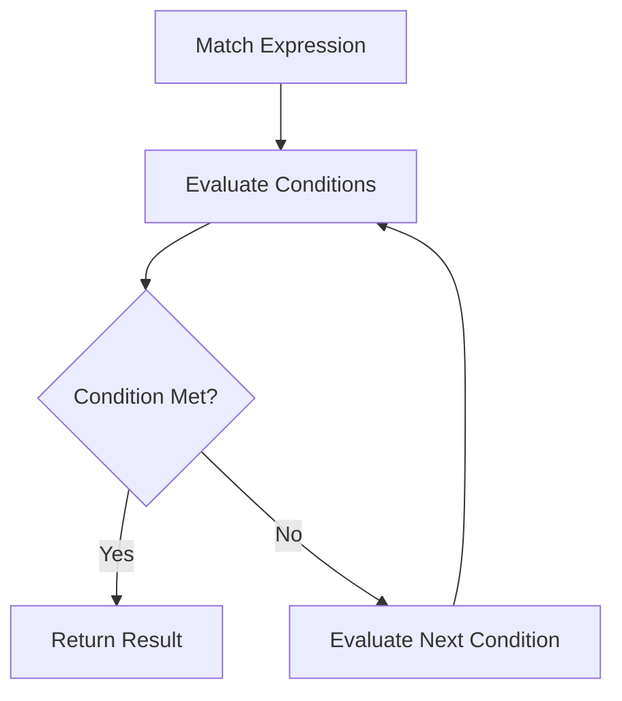

## 3.6 Named Arguments and Match Expressions

In the ever-evolving landscape of PHP, the introduction of named arguments and match expressions marks a significant step forward in enhancing code readability and control flow. These features, introduced in PHP 8, offer developers more expressive and maintainable ways to write code. In this section, we will delve into the concepts of named arguments and match expressions, explore their benefits, and provide practical examples to illustrate their usage.

### Understanding Named Arguments in PHP

Named arguments allow you to pass arguments to a function based on the parameter name rather than the parameter position. This feature enhances code readability and reduces the likelihood of errors, especially in functions with multiple parameters or default values.

#### Benefits of Named Arguments

1. **Improved Readability**: Named arguments make it clear what each argument represents, reducing the need for comments or documentation.
2. **Flexibility**: You can specify only the arguments you need, skipping optional ones without worrying about their order.
3. **Reduced Errors**: By naming arguments, you minimize the risk of passing values in the wrong order.

#### Syntax of Named Arguments

The syntax for named arguments is straightforward. You specify the parameter name followed by a colon and the value you want to assign.

```php
function createUser($name, $email, $role = 'user') {
    // Function implementation
}

// Using named arguments
createUser(name: 'Alice', email: 'alice@example.com', role: 'admin');
```

In this example, the `createUser` function is called with named arguments, making it clear which value corresponds to each parameter.

#### Named Arguments with Default Values

Named arguments work seamlessly with default parameter values. You can skip arguments with default values if they are not needed.

```php
// Skipping the 'role' argument
createUser(name: 'Bob', email: 'bob@example.com');
```

Here, the `role` parameter is omitted, and its default value is used.

#### Order Independence

Named arguments allow you to pass arguments in any order, as long as you specify the parameter names.

```php
// Changing the order of arguments
createUser(email: 'carol@example.com', name: 'Carol', role: 'editor');
```

This flexibility is particularly useful when dealing with functions that have many optional parameters.

### Exploring Match Expressions

Match expressions provide a more concise and expressive alternative to switch statements. They allow you to match a value against a set of conditions and return a result based on the first matching condition.

#### Advantages of Match Expressions

1. **Conciseness**: Match expressions reduce boilerplate code compared to switch statements.
2. **Expression-Based**: Unlike switch, match is an expression, meaning it returns a value.
3. **Strict Comparison**: Match uses strict comparison (`===`), reducing unexpected behavior.
4. **No Fallthrough**: Each case in a match expression is independent, eliminating fallthrough issues.

#### Syntax of Match Expressions

The basic syntax of a match expression involves specifying the value to match, followed by a series of cases and corresponding results.

```php
$result = match ($status) {
    'success' => 'Operation was successful.',
    'error' => 'An error occurred.',
    'pending' => 'Operation is pending.',
    default => 'Unknown status.',
};
```

In this example, the `$status` variable is matched against several cases, and the corresponding message is returned.

#### Using Match Expressions with Multiple Conditions

Match expressions can handle multiple conditions by separating them with commas.

```php
$result = match ($status) {
    'success', 'completed' => 'Operation was successful.',
    'error', 'failed' => 'An error occurred.',
    default => 'Unknown status.',
};
```

Here, both `'success'` and `'completed'` result in the same message, as do `'error'` and `'failed'`.

#### Match Expressions with Complex Logic

You can use match expressions to handle more complex logic by returning the result of a function or expression.

```php
$result = match (true) {
    $value < 0 => 'Negative',
    $value === 0 => 'Zero',
    $value > 0 => 'Positive',
};
```

In this example, the match expression evaluates conditions based on the value of `$value`.

### Code Examples and Practical Applications

Let's explore some practical examples to demonstrate the power of named arguments and match expressions in real-world scenarios.

#### Example 1: Configuring a Database Connection

Consider a function that configures a database connection with several optional parameters.

```php
function configureDatabase($host, $port = 3306, $username = 'root', $password = '') {
    // Configuration logic
}

// Using named arguments for clarity
configureDatabase(host: 'localhost', username: 'admin', password: 'secret');
```

Named arguments make it clear which values are being set, improving code readability.

#### Example 2: Handling HTTP Status Codes

Match expressions are ideal for handling HTTP status codes and returning appropriate messages.

```php
function getHttpStatusMessage($code) {
    return match ($code) {
        200 => 'OK',
        404 => 'Not Found',
        500 => 'Internal Server Error',
        default => 'Unknown Status Code',
    };
}

echo getHttpStatusMessage(404); // Outputs: Not Found
```

This concise match expression replaces a verbose switch statement.

#### Example 3: Processing User Input

Named arguments can simplify functions that process user input with multiple optional parameters.

```php
function processInput($input, $sanitize = true, $validate = true, $log = false) {
    // Processing logic
}

// Using named arguments to specify only needed options
processInput(input: $userInput, log: true);
```

By specifying only the necessary options, the code becomes more readable and maintainable.

### Visualizing Named Arguments and Match Expressions

To better understand the flow and structure of named arguments and match expressions, let's visualize these concepts using Mermaid.js diagrams.

#### Named Arguments Flow



**Diagram Description**: This flowchart illustrates the process of calling a function with named arguments, assigning values to parameters, and executing the function.

#### Match Expressions Flow



**Diagram Description**: This flowchart depicts the evaluation process of a match expression, checking conditions sequentially and returning the result of the first matching condition.

### References and Further Reading

For more information on named arguments and match expressions, consider exploring the following resources:

- [PHP Manual: Named Arguments](https://www.php.net/manual/en/functions.arguments.php#functions.named-arguments)
- [PHP Manual: Match Expressions](https://www.php.net/manual/en/control-structures.match.php)
- [MDN Web Docs: Switch Statement](https://developer.mozilla.org/en-US/docs/Web/JavaScript/Reference/Statements/switch)

### Knowledge Check

To reinforce your understanding of named arguments and match expressions, consider the following questions:

1. What are the benefits of using named arguments in PHP?
2. How do match expressions differ from switch statements?
3. Can you use named arguments with functions that have default parameter values?
4. How does PHP handle multiple conditions in a match expression?
5. What are some practical applications of named arguments and match expressions?

### Embrace the Journey

Remember, mastering named arguments and match expressions is just one step in your PHP development journey. As you continue to explore these features, you'll discover new ways to write more expressive and maintainable code. Keep experimenting, stay curious, and enjoy the journey!

### Quiz: Named Arguments and Match Expressions



### What is a key benefit of using named arguments in PHP?

- [x] Improved code readability
- [ ] Increased execution speed
- [ ] Reduced memory usage
- [ ] Enhanced security

> **Explanation:** Named arguments improve code readability by making it clear what each argument represents.

### How do match expressions differ from switch statements?

- [x] Match expressions use strict comparison
- [ ] Match expressions allow fallthrough
- [ ] Match expressions are slower
- [ ] Match expressions require more code

> **Explanation:** Match expressions use strict comparison (`===`) and do not allow fallthrough, unlike switch statements.

### Can you skip optional parameters when using named arguments?

- [x] Yes
- [ ] No

> **Explanation:** Named arguments allow you to skip optional parameters by specifying only the arguments you need.

### What does a match expression return?

- [x] A value based on the first matching condition
- [ ] A boolean indicating success or failure
- [ ] An array of all matching conditions
- [ ] A string representation of the expression

> **Explanation:** A match expression returns a value based on the first matching condition.

### How are multiple conditions handled in a match expression?

- [x] By separating them with commas
- [ ] By using logical operators
- [ ] By nesting match expressions
- [ ] By using a loop

> **Explanation:** Multiple conditions in a match expression are separated by commas.

### What happens if no conditions match in a match expression?

- [x] The default case is executed
- [ ] An error is thrown
- [ ] The first case is executed
- [ ] The expression returns null

> **Explanation:** If no conditions match, the default case is executed.

### Can named arguments be used with functions that have default values?

- [x] Yes
- [ ] No

> **Explanation:** Named arguments can be used with functions that have default values, allowing you to skip those parameters.

### Which PHP version introduced named arguments and match expressions?

- [x] PHP 8
- [ ] PHP 7.4
- [ ] PHP 7.3
- [ ] PHP 5.6

> **Explanation:** Named arguments and match expressions were introduced in PHP 8.

### What is the main advantage of using match expressions over switch statements?

- [x] Conciseness and strict comparison
- [ ] Faster execution
- [ ] Greater compatibility
- [ ] More features

> **Explanation:** Match expressions are more concise and use strict comparison, making them a better choice in many cases.

### True or False: Named arguments require you to pass all arguments in the order they are defined.

- [ ] True
- [x] False

> **Explanation:** Named arguments allow you to pass arguments in any order, as long as you specify the parameter names.


