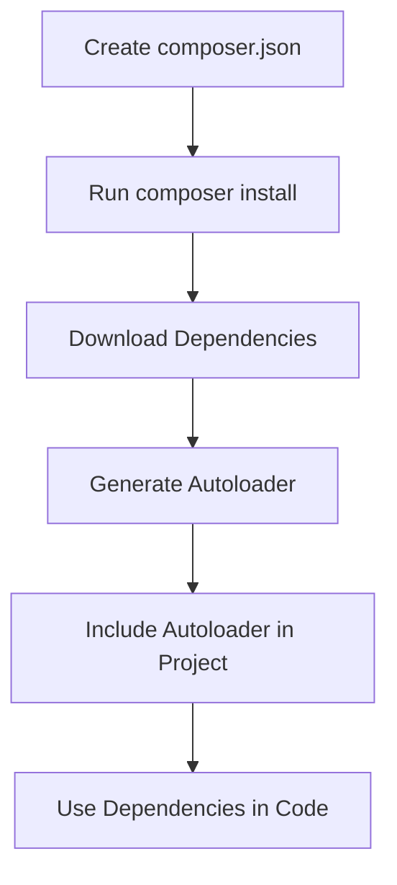

## 3.7 Composer and Dependency Management

In the world of PHP development, managing dependencies efficiently is crucial for building robust and maintainable applications. Composer, a dependency manager for PHP, has become an indispensable tool for developers. It simplifies the process of managing libraries, packages, and dependencies, allowing you to focus on writing code rather than worrying about compatibility issues. In this section, we will delve into the intricacies of Composer and dependency management, exploring how to set up `composer.json`, use Packagist, and leverage Composer's autoloader for seamless class loading.

### Understanding Composer

Composer is a tool for dependency management in PHP. It allows you to declare the libraries your project depends on and manages (installs/updates) them for you. Composer is not a package manager in the same sense as Yum or Apt are. Yes, it deals with "packages" or libraries, but it manages them on a per-project basis, installing them in a directory (e.g., `vendor`) inside your project. By default, it does not install anything globally.

#### Key Features of Composer

- **Dependency Management**: Automatically handles dependencies for your project, ensuring compatibility and version control.
- **Autoloading**: Provides an autoloader for your classes, eliminating the need for manual `require` or `include` statements.
- **Packagist Integration**: Integrates with Packagist, the default package repository for Composer, to find and install packages.
- **Version Constraints**: Allows you to specify version constraints for your dependencies, ensuring stability and compatibility.

### Setting Up Composer

Before you can start using Composer, you need to install it on your system. Composer can be installed globally or locally within a project. Here, we'll cover the steps for both methods.

#### Installing Composer Globally

1. **Download Composer Installer**: Open your terminal and run the following command to download the Composer installer:

    ```bash
    php -r "copy('https://getcomposer.org/installer', 'composer-setup.php');"
    ```

2. **Verify the Installer**: It's a good practice to verify the installer to ensure it hasn't been tampered with. You can find the latest SHA-384 hash on the [Composer Public Keys / Signatures](https://composer.github.io/pubkeys.html) page.

    ```bash
    php -r "if (hash_file('sha384', 'composer-setup.php') === 'HASH') { echo 'Installer verified'; } else { echo 'Installer corrupt'; unlink('composer-setup.php'); } echo PHP_EOL;"
    ```

    Replace `HASH` with the latest hash from the Composer website.

3. **Install Composer**: Run the installer script to install Composer globally.

    ```bash
    php composer-setup.php --install-dir=/usr/local/bin --filename=composer
    ```

4. **Remove the Installer**: Clean up by removing the installer script.

    ```bash
    php -r "unlink('composer-setup.php');"
    ```

5. **Verify Installation**: Check if Composer is installed correctly by running:

    ```bash
    composer --version
    ```

#### Installing Composer Locally

If you prefer to install Composer locally within a project, follow these steps:

1. **Navigate to Your Project Directory**: Use the terminal to navigate to your project's root directory.

2. **Download Composer Installer**: Run the following command to download the Composer installer:

    ```bash
    php -r "copy('https://getcomposer.org/installer', 'composer-setup.php');"
    ```

3. **Run the Installer**: Execute the installer script to install Composer locally.

    ```bash
    php composer-setup.php
    ```

4. **Remove the Installer**: Clean up by removing the installer script.

    ```bash
    php -r "unlink('composer-setup.php');"
    ```

5. **Verify Installation**: Check if Composer is installed correctly by running:

    ```bash
    php composer.phar --version
    ```

### Creating and Configuring `composer.json`

The `composer.json` file is the heart of your Composer-managed project. It defines the dependencies your project requires and other metadata. Let's explore how to create and configure this file.

#### Basic Structure of `composer.json`

A typical `composer.json` file looks like this:

```json
{
    "name": "vendor/package",
    "description": "A brief description of the package",
    "type": "project",
    "require": {
        "php": ">=7.4",
        "monolog/monolog": "^2.0"
    },
    "autoload": {
        "psr-4": {
            "App\\": "src/"
        }
    }
}
```

- **name**: The name of your package, typically in the format `vendor/package`.
- **description**: A brief description of your package.
- **type**: The type of package (e.g., `library`, `project`).
- **require**: Specifies the dependencies and their version constraints.
- **autoload**: Defines the autoloading configuration for your project.

#### Specifying Dependencies

In the `require` section, you can specify the dependencies your project needs. Composer supports various version constraints, such as:

- **Exact Version**: `"monolog/monolog": "2.0.0"`
- **Range**: `"monolog/monolog": ">=2.0 <3.0"`
- **Caret Operator**: `"monolog/monolog": "^2.0"` (compatible with 2.x versions)
- **Tilde Operator**: `"monolog/monolog": "~2.0"` (compatible with 2.0.x versions)

#### Autoloading with Composer

Composer provides an autoloader that follows the PSR-4 standard, allowing you to autoload classes without manually including them. This is achieved through the `autoload` section in `composer.json`.

##### PSR-4 Autoloading

PSR-4 is a standard for autoloading classes from file paths. It maps namespaces to directory paths. Here's how you can configure PSR-4 autoloading:

```json
"autoload": {
    "psr-4": {
        "App\\": "src/"
    }
}
```

In this example, the `App` namespace is mapped to the `src` directory. This means that a class like `App\Controller\HomeController` would be located at `src/Controller/HomeController.php`.

##### Generating the Autoloader

After configuring the `autoload` section, run the following command to generate the autoloader:

```bash
composer dump-autoload
```

This command creates the `vendor/autoload.php` file, which you can include in your project to autoload classes:

```php
require 'vendor/autoload.php';
```

### Using Packagist

Packagist is the default package repository for Composer. It hosts thousands of PHP packages that you can easily integrate into your projects. Let's explore how to use Packagist to find and install packages.

#### Searching for Packages

You can search for packages on the [Packagist website](https://packagist.org/) or use the Composer command-line tool:

```bash
composer search monolog
```

This command searches for packages related to "monolog" and displays the results.

#### Installing Packages

Once you've found a package you want to use, you can install it using Composer. For example, to install the Monolog package, run:

```bash
composer require monolog/monolog
```

This command updates your `composer.json` file and installs the package in the `vendor` directory.

### Managing Dependencies

Composer provides several commands to manage dependencies effectively. Let's explore some of these commands and their usage.

#### Updating Dependencies

To update all dependencies to their latest versions according to the version constraints in `composer.json`, run:

```bash
composer update
```

To update a specific package, specify the package name:

```bash
composer update monolog/monolog
```

#### Removing Dependencies

To remove a package from your project, use the `remove` command:

```bash
composer remove monolog/monolog
```

This command removes the package from `composer.json` and deletes it from the `vendor` directory.

#### Checking for Outdated Packages

To check for outdated packages, use the `outdated` command:

```bash
composer outdated
```

This command lists packages that have newer versions available.

### Best Practices for Dependency Management

Managing dependencies effectively is crucial for maintaining a stable and secure project. Here are some best practices to follow:

- **Use Version Constraints**: Specify version constraints in `composer.json` to ensure compatibility and prevent breaking changes.
- **Regularly Update Dependencies**: Keep your dependencies up to date to benefit from security patches and new features.
- **Review New Dependencies**: Before adding a new dependency, review its documentation, community support, and maintenance status.
- **Use a Lock File**: Commit the `composer.lock` file to version control to ensure consistent installations across environments.
- **Avoid Global Dependencies**: Prefer project-specific dependencies over global installations to avoid conflicts.

### Visualizing Composer Workflow

To better understand how Composer manages dependencies, let's visualize the workflow using a Mermaid.js diagram.



**Diagram Description**: This diagram illustrates the typical workflow of using Composer in a PHP project. It starts with creating a `composer.json` file, running `composer install` to download dependencies, generating the autoloader, including the autoloader in the project, and finally using the dependencies in your code.

### Try It Yourself

To reinforce your understanding of Composer and dependency management, try the following exercises:

1. **Create a New PHP Project**: Set up a new PHP project and initialize Composer. Add a few dependencies and configure autoloading.
2. **Experiment with Version Constraints**: Modify the version constraints in `composer.json` and observe how Composer resolves dependencies.
3. **Explore Packagist**: Search for a package on Packagist, read its documentation, and integrate it into your project.
4. **Update and Remove Dependencies**: Practice updating and removing dependencies using Composer commands.

### Conclusion

Composer is a powerful tool that simplifies dependency management in PHP projects. By understanding how to set up `composer.json`, use Packagist, and leverage Composer's autoloader, you can streamline your development workflow and build more maintainable applications. Remember, this is just the beginning. As you continue to explore Composer, you'll discover more advanced features and techniques that can further enhance your PHP development experience. Keep experimenting, stay curious, and enjoy the journey!

## Quiz: Composer and Dependency Management



### What is Composer primarily used for in PHP?

- [x] Dependency management
- [ ] Code compilation
- [ ] Database management
- [ ] User authentication

> **Explanation:** Composer is primarily used for managing dependencies in PHP projects, allowing developers to declare and manage libraries their project depends on.

### How do you specify a dependency in `composer.json`?

- [x] Using the "require" section
- [ ] Using the "autoload" section
- [ ] Using the "scripts" section
- [ ] Using the "config" section

> **Explanation:** Dependencies are specified in the "require" section of `composer.json`, where you list the packages and their version constraints.

### What command is used to install all dependencies listed in `composer.json`?

- [x] composer install
- [ ] composer update
- [ ] composer require
- [ ] composer remove

> **Explanation:** The `composer install` command installs all dependencies listed in `composer.json`, downloading them into the `vendor` directory.

### Which of the following is a valid version constraint in `composer.json`?

- [x] "^2.0"
- [ ] "2.0.*"
- [ ] ">=2.0 <3.0"
- [ ] "~2.0"

> **Explanation:** All options are valid version constraints in `composer.json`, allowing you to specify compatible versions for your dependencies.

### How can you remove a package from your project using Composer?

- [x] composer remove package-name
- [ ] composer delete package-name
- [ ] composer uninstall package-name
- [ ] composer discard package-name

> **Explanation:** The `composer remove package-name` command removes a package from your project, updating `composer.json` and deleting it from the `vendor` directory.

### What is the purpose of the `composer.lock` file?

- [x] To ensure consistent installations across environments
- [ ] To store user credentials
- [ ] To log error messages
- [ ] To configure server settings

> **Explanation:** The `composer.lock` file ensures consistent installations across environments by locking the exact versions of dependencies.

### How do you generate the Composer autoloader?

- [x] composer dump-autoload
- [ ] composer generate-autoload
- [ ] composer create-autoload
- [ ] composer build-autoload

> **Explanation:** The `composer dump-autoload` command generates the Composer autoloader, creating the `vendor/autoload.php` file.

### What is Packagist?

- [x] The default package repository for Composer
- [ ] A PHP testing framework
- [ ] A database management tool
- [ ] A user authentication library

> **Explanation:** Packagist is the default package repository for Composer, hosting thousands of PHP packages that can be integrated into projects.

### Which section in `composer.json` is used for autoloading configuration?

- [x] "autoload"
- [ ] "require"
- [ ] "scripts"
- [ ] "config"

> **Explanation:** The "autoload" section in `composer.json` is used to define the autoloading configuration, mapping namespaces to directory paths.

### True or False: Composer can only be installed globally.

- [ ] True
- [x] False

> **Explanation:** Composer can be installed both globally and locally within a project, providing flexibility in how you manage dependencies.


