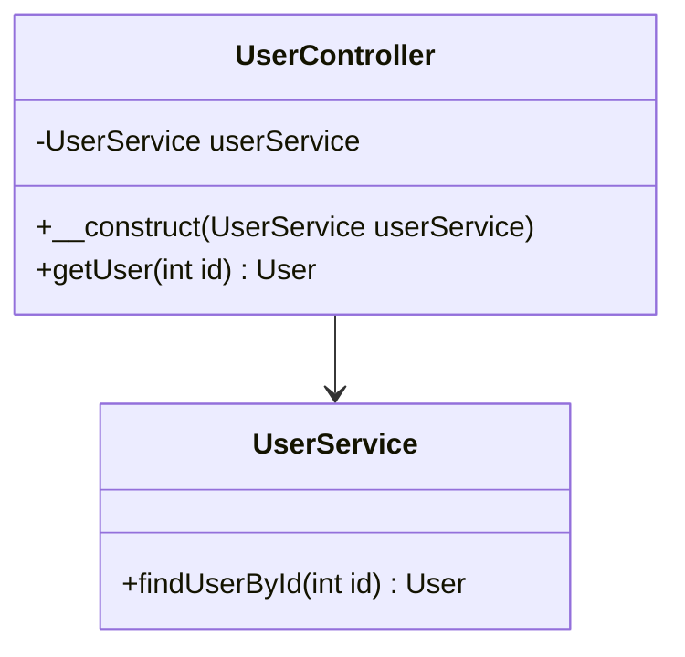

## 3.8 PSR Standards and Coding Style

In the world of PHP development, maintaining a consistent coding style is crucial for creating readable, maintainable, and scalable code. The PHP Standards Recommendations (PSRs) provide a set of guidelines that help developers achieve this consistency. In this section, we will delve into the significance of PSR standards, particularly focusing on PSR-12, and explore how adhering to these standards can enhance your PHP projects.

### Introduction to PHP Standards Recommendations (PSRs)

The PHP Standards Recommendations (PSRs) are a collection of guidelines and best practices established by the PHP Framework Interoperability Group (PHP-FIG). These standards aim to promote consistency and interoperability across PHP projects, making it easier for developers to collaborate and integrate different libraries and frameworks.

#### Key PSRs to Know

- **PSR-1: Basic Coding Standard** - Establishes a basic level of coding style, including file structure and naming conventions.
- **PSR-2: Coding Style Guide** - Provides a comprehensive coding style guide, which has been superseded by PSR-12.
- **PSR-4: Autoloading Standard** - Defines a standard for autoloading classes using file paths.
- **PSR-12: Extended Coding Style Guide** - An extension of PSR-2, offering more detailed guidelines for modern PHP code.

For a complete list of PSRs, visit the [PHP-FIG - PHP Standards Recommendations](https://www.php-fig.org/psr/).

### Implementing PSR-12 Coding Style in Projects

PSR-12 is the latest coding style guide that builds upon PSR-2, providing a more comprehensive set of rules for modern PHP development. Let's explore how to implement PSR-12 in your projects.

#### Key Aspects of PSR-12

1. **File Structure and Naming Conventions**
   - Files MUST use only `<?php` and `<?=` tags.
   - Files MUST use only UTF-8 without BOM for PHP code.
   - Class names MUST be declared in `StudlyCaps`.
   - Class constants MUST be declared in all upper case with underscore separators.

2. **Indentation and Line Length**
   - Code MUST use 4 spaces for indenting, not tabs.
   - Lines SHOULD not be longer than 80 characters; lines MUST not be longer than 120 characters.

3. **Namespace and Use Declarations**
   - There MUST be one blank line after the `namespace` declaration.
   - There MUST be one blank line after the `use` block.

4. **Class and Method Declarations**
   - Visibility MUST be declared on all properties and methods.
   - The `abstract` and `final` declarations MUST precede the visibility declaration.

5. **Control Structures**
   - Control structure keywords MUST have one space after them.
   - Opening braces for control structures MUST go on the same line, and closing braces MUST go on the next line after the body.

6. **Function Calls and Definitions**
   - In the argument list, there MUST NOT be a space before each comma, and there MUST be one space after each comma.
   - Method and function arguments with default values MUST go at the end of the argument list.

#### Example of PSR-12 Compliant Code

```php
<?php

namespace App\Controller;

use App\Service\UserService;

class UserController
{
    private UserService $userService;

    public function __construct(UserService $userService)
    {
        $this->userService = $userService;
    }

    public function getUser(int $id): ?User
    {
        if ($id <= 0) {
            throw new InvalidArgumentException('Invalid user ID');
        }

        return $this->userService->findUserById($id);
    }
}
```

### Benefits of Adhering to Coding Standards

Adhering to coding standards like PSR-12 offers numerous benefits:

- **Consistency**: Ensures a uniform coding style across the codebase, making it easier for developers to read and understand the code.
- **Collaboration**: Facilitates collaboration among team members by reducing misunderstandings and discrepancies in coding styles.
- **Maintainability**: Improves the maintainability of the code by making it easier to identify and fix bugs.
- **Interoperability**: Enhances interoperability between different libraries and frameworks, as they follow the same standards.
- **Professionalism**: Demonstrates a commitment to quality and professionalism in software development.

### Tools for Enforcing PSR Standards

To ensure compliance with PSR standards, developers can use various tools:

- **PHP_CodeSniffer**: A popular tool for detecting violations of coding standards in PHP code.
- **PHP-CS-Fixer**: Automatically fixes coding style issues according to PSR standards.
- **PHPStan**: A static analysis tool that helps find bugs in your code.

### Visualizing PSR-12 Compliance

To better understand how PSR-12 compliance affects your code, let's visualize the structure of a PSR-12 compliant PHP file using a class diagram.



### Try It Yourself

To get hands-on experience with PSR-12, try modifying the following code snippet to make it PSR-12 compliant:

```php
<?php

namespace App\Controller;
use App\Service\UserService;

class usercontroller {
    private $userService;

    public function __construct(UserService $userService) {
        $this->userService=$userService;
    }

    public function getuser($id) {
        if ($id <= 0) {
            throw new \InvalidArgumentException('Invalid user ID');
        }
        return $this->userService->findUserById($id);
    }
}
```

### Knowledge Check

- What are the key differences between PSR-2 and PSR-12?
- How does adhering to PSR standards improve code maintainability?
- What tools can you use to enforce PSR compliance in your projects?

### Embrace the Journey

Remember, mastering PSR standards and coding style is a journey. As you continue to apply these principles, you'll find that your code becomes more readable, maintainable, and professional. Keep experimenting, stay curious, and enjoy the process of becoming a better PHP developer!

## Quiz: PSR Standards and Coding Style



### What is the primary purpose of PSR standards in PHP?

- [x] To promote consistency and interoperability across PHP projects
- [ ] To enforce strict security measures
- [ ] To limit the use of third-party libraries
- [ ] To restrict PHP to a specific version

> **Explanation:** PSR standards are designed to promote consistency and interoperability across PHP projects, making it easier for developers to collaborate and integrate different libraries and frameworks.

### Which PSR standard is specifically focused on coding style?

- [ ] PSR-1
- [ ] PSR-4
- [x] PSR-12
- [ ] PSR-7

> **Explanation:** PSR-12 is the standard that focuses on coding style, providing a comprehensive set of guidelines for modern PHP development.

### What is the recommended indentation style according to PSR-12?

- [ ] Tabs
- [x] 4 spaces
- [ ] 2 spaces
- [ ] 8 spaces

> **Explanation:** PSR-12 recommends using 4 spaces for indentation, not tabs.

### How should class names be declared according to PSR-12?

- [ ] lowercase
- [ ] UPPERCASE
- [x] StudlyCaps
- [ ] camelCase

> **Explanation:** Class names should be declared in StudlyCaps according to PSR-12.

### Which tool can automatically fix coding style issues according to PSR standards?

- [x] PHP-CS-Fixer
- [ ] PHPStan
- [ ] PHPUnit
- [ ] Composer

> **Explanation:** PHP-CS-Fixer is a tool that can automatically fix coding style issues according to PSR standards.

### What is the maximum recommended line length in PSR-12?

- [ ] 60 characters
- [ ] 100 characters
- [x] 120 characters
- [ ] 150 characters

> **Explanation:** PSR-12 recommends that lines should not be longer than 120 characters.

### Which of the following is NOT a benefit of adhering to coding standards?

- [ ] Consistency
- [ ] Collaboration
- [ ] Maintainability
- [x] Increased execution speed

> **Explanation:** While coding standards improve consistency, collaboration, and maintainability, they do not directly affect the execution speed of the code.

### What is the correct way to declare a class constant according to PSR-12?

- [ ] `const myConstant = 1;`
- [x] `const MY_CONSTANT = 1;`
- [ ] `const MyConstant = 1;`
- [ ] `const my_constant = 1;`

> **Explanation:** Class constants must be declared in all upper case with underscore separators according to PSR-12.

### Which PSR standard defines a standard for autoloading classes using file paths?

- [ ] PSR-1
- [x] PSR-4
- [ ] PSR-7
- [ ] PSR-12

> **Explanation:** PSR-4 defines a standard for autoloading classes using file paths.

### True or False: PSR-12 allows the use of tabs for indentation.

- [ ] True
- [x] False

> **Explanation:** PSR-12 specifies that code must use 4 spaces for indenting, not tabs.


