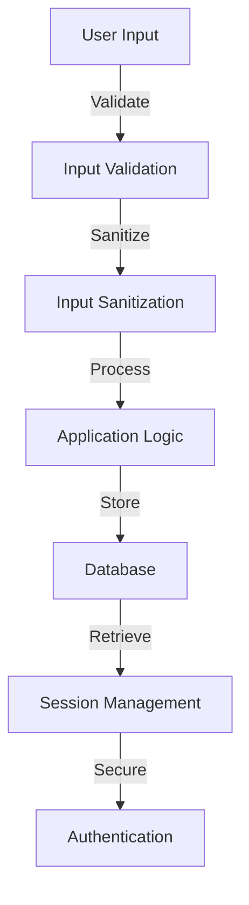

## 3.9 Security Best Practices in PHP

In the ever-evolving landscape of web development, security remains a paramount concern. PHP, being one of the most widely used server-side scripting languages, is often targeted by malicious actors. Therefore, understanding and implementing security best practices is crucial for any PHP developer. This section will guide you through essential security measures, focusing on preventing common vulnerabilities, validating and sanitizing user input, and securely handling sessions and authentication data.

### Introduction to PHP Security

Security in PHP is not just about writing secure code; it's about adopting a mindset that prioritizes security at every stage of development. Let's explore the foundational concepts and practices that will help you build secure PHP applications.

### Preventing Common Security Vulnerabilities

PHP applications are susceptible to various security vulnerabilities. Understanding these vulnerabilities and how to mitigate them is the first step toward building secure applications.

#### SQL Injection

SQL Injection is a critical vulnerability that allows attackers to execute arbitrary SQL code on your database. This can lead to data breaches, data loss, or unauthorized data manipulation.

**Prevention Techniques:**

1. **Use Prepared Statements:** Prepared statements ensure that SQL queries are executed with parameterized inputs, preventing malicious SQL code from being executed.

    ```php
    $stmt = $pdo->prepare('SELECT * FROM users WHERE username = :username');
    $stmt->execute(['username' => $inputUsername]);
    ```

2. **Use ORM Libraries:** Object-Relational Mapping (ORM) libraries like Doctrine or Eloquent automatically handle parameterized queries, reducing the risk of SQL injection.

3. **Avoid Dynamic Queries:** Refrain from constructing SQL queries using user input directly.

#### Cross-Site Scripting (XSS)

XSS attacks occur when an attacker injects malicious scripts into web pages viewed by other users. This can lead to data theft, session hijacking, or defacement of websites.

**Prevention Techniques:**

1. **Escape Output:** Always escape user-generated content before displaying it in HTML. Use PHP's `htmlspecialchars()` function.

    ```php
    echo htmlspecialchars($userInput, ENT_QUOTES, 'UTF-8');
    ```

2. **Use Content Security Policy (CSP):** Implement CSP headers to restrict the sources from which scripts can be loaded.

3. **Sanitize Input:** Use libraries like HTML Purifier to sanitize HTML content.

#### Cross-Site Request Forgery (CSRF)

CSRF attacks trick users into performing actions they did not intend to perform. This is often achieved by exploiting the user's authenticated session.

**Prevention Techniques:**

1. **Use CSRF Tokens:** Generate and validate CSRF tokens for state-changing requests.

    ```php
    // Generate a CSRF token
    $_SESSION['csrf_token'] = bin2hex(random_bytes(32));

    // Validate the CSRF token
    if (!hash_equals($_SESSION['csrf_token'], $_POST['csrf_token'])) {
        die('Invalid CSRF token');
    }
    ```

2. **SameSite Cookies:** Set the `SameSite` attribute on cookies to prevent them from being sent with cross-site requests.

    ```php
    setcookie('session', $sessionId, ['samesite' => 'Strict']);
    ```

#### Remote Code Execution (RCE)

RCE vulnerabilities allow attackers to execute arbitrary code on the server. This can lead to complete server compromise.

**Prevention Techniques:**

1. **Disable Dangerous Functions:** Disable PHP functions like `eval()`, `exec()`, `system()`, and `shell_exec()` in `php.ini`.

2. **Validate and Sanitize Input:** Never trust user input. Always validate and sanitize it before using it in any system command or file operation.

3. **Use Safe Libraries:** Use libraries and frameworks that provide safe abstractions for file operations and command execution.

### Validating and Sanitizing User Input

User input is a primary attack vector for malicious actors. Proper validation and sanitization are crucial to prevent security vulnerabilities.

#### Input Validation

Input validation ensures that user input meets the expected format and constraints before processing it.

1. **Use Built-in Functions:** PHP provides several functions for input validation, such as `filter_var()`.

    ```php
    if (!filter_var($email, FILTER_VALIDATE_EMAIL)) {
        die('Invalid email address');
    }
    ```

2. **Regular Expressions:** Use regular expressions to validate complex input patterns.

    ```php
    if (!preg_match('/^[a-zA-Z0-9_]{5,20}$/', $username)) {
        die('Invalid username');
    }
    ```

3. **Type Checking:** Ensure that input is of the expected type using PHP's type declarations.

#### Input Sanitization

Input sanitization removes or encodes unwanted characters from user input to prevent malicious data from being processed.

1. **Escape Special Characters:** Use functions like `htmlspecialchars()` and `addslashes()` to escape special characters.

2. **Use Whitelisting:** Allow only known safe characters or patterns in user input.

3. **Sanitize HTML:** Use libraries like HTML Purifier to sanitize HTML content.

### Secure Handling of Sessions and Authentication Data

Sessions and authentication data are critical components of web applications. Secure handling of these elements is essential to prevent unauthorized access and data breaches.

#### Session Management

1. **Use Secure Cookies:** Set the `Secure` and `HttpOnly` attributes on session cookies to prevent them from being accessed by JavaScript or transmitted over insecure connections.

    ```php
    session_set_cookie_params(['secure' => true, 'httponly' => true]);
    ```

2. **Regenerate Session IDs:** Regenerate session IDs after login or privilege changes to prevent session fixation attacks.

    ```php
    session_regenerate_id(true);
    ```

3. **Limit Session Lifetime:** Set a reasonable session timeout to reduce the risk of session hijacking.

#### Authentication Best Practices

1. **Use Strong Password Hashing:** Use password hashing functions like `password_hash()` and `password_verify()` to securely store and verify passwords.

    ```php
    $hashedPassword = password_hash($password, PASSWORD_BCRYPT);
    ```

2. **Implement Multi-Factor Authentication (MFA):** Add an extra layer of security by requiring additional verification methods.

3. **Secure Password Reset Mechanisms:** Ensure that password reset links are time-limited and use secure tokens.

### Try It Yourself

To reinforce your understanding of PHP security best practices, try modifying the code examples provided. Experiment with different input validation techniques, implement CSRF protection, and test session management strategies. Remember, security is an ongoing process, and continuous learning is key to staying ahead of potential threats.

### Visualizing PHP Security Concepts

To better understand the flow of data and potential vulnerabilities in a PHP application, let's visualize the process of handling user input and session management.



**Diagram Description:** This flowchart illustrates the process of handling user input in a PHP application. It highlights the importance of validating and sanitizing input before processing it and securely managing sessions and authentication data.

### References and Links

For further reading on PHP security best practices, consider the following resources:

- [OWASP PHP Security Cheat Sheet](https://cheatsheetseries.owasp.org/cheatsheets/PHP_Security_Cheat_Sheet.html)
- [PHP Manual: Security](https://www.php.net/manual/en/security.php)
- [NIST Password Guidelines](https://pages.nist.gov/800-63-3/sp800-63b.html)

### Knowledge Check

Before moving on, let's test your understanding of PHP security best practices with a few questions:

1. What is the primary purpose of input validation?
2. How can you prevent SQL injection in PHP?
3. What are the benefits of using CSRF tokens?
4. Why is it important to regenerate session IDs?
5. How does password hashing enhance security?

### Embrace the Journey

Remember, mastering PHP security is a journey, not a destination. As you continue to develop your skills, stay curious, keep experimenting, and embrace the ever-changing landscape of web security. By prioritizing security in your development process, you'll build robust and secure applications that stand the test of time.

### Quiz: Security Best Practices in PHP



### What is the primary purpose of input validation?

- [x] To ensure user input meets expected format and constraints
- [ ] To remove unwanted characters from user input
- [ ] To execute arbitrary SQL code
- [ ] To store user input in the database

> **Explanation:** Input validation ensures that user input meets the expected format and constraints before processing it.

### How can you prevent SQL injection in PHP?

- [x] Use prepared statements
- [ ] Use dynamic queries
- [ ] Disable SQL functions
- [ ] Use HTML Purifier

> **Explanation:** Prepared statements ensure that SQL queries are executed with parameterized inputs, preventing malicious SQL code from being executed.

### What are the benefits of using CSRF tokens?

- [x] They prevent unauthorized actions by verifying requests
- [ ] They encrypt user data
- [ ] They sanitize HTML content
- [ ] They validate email addresses

> **Explanation:** CSRF tokens prevent unauthorized actions by verifying that requests are made by the legitimate user.

### Why is it important to regenerate session IDs?

- [x] To prevent session fixation attacks
- [ ] To increase session timeout
- [ ] To store user passwords securely
- [ ] To validate user input

> **Explanation:** Regenerating session IDs prevents session fixation attacks by ensuring that a new session ID is generated after login or privilege changes.

### How does password hashing enhance security?

- [x] It securely stores passwords by converting them into a fixed-length string
- [ ] It encrypts passwords for transmission
- [x] It makes it difficult for attackers to retrieve original passwords
- [ ] It validates user input

> **Explanation:** Password hashing securely stores passwords by converting them into a fixed-length string, making it difficult for attackers to retrieve the original passwords.

### What is the role of escaping output in preventing XSS?

- [x] It prevents malicious scripts from being executed in the browser
- [ ] It validates user input
- [ ] It stores data in the database
- [ ] It encrypts user data

> **Explanation:** Escaping output prevents malicious scripts from being executed in the browser by converting special characters into HTML entities.

### Which PHP function is used for password hashing?

- [x] password_hash()
- [ ] hash()
- [x] password_verify()
- [ ] md5()

> **Explanation:** The `password_hash()` function is used for hashing passwords, and `password_verify()` is used for verifying hashed passwords.

### What is the purpose of the `SameSite` attribute in cookies?

- [x] To prevent cookies from being sent with cross-site requests
- [ ] To encrypt cookie data
- [ ] To validate user input
- [ ] To store session data

> **Explanation:** The `SameSite` attribute prevents cookies from being sent with cross-site requests, reducing the risk of CSRF attacks.

### How can you secure password reset mechanisms?

- [x] Use time-limited secure tokens
- [ ] Use dynamic queries
- [ ] Use HTML Purifier
- [ ] Use prepared statements

> **Explanation:** Secure password reset mechanisms use time-limited secure tokens to ensure that password reset links are valid for a limited time.

### True or False: Disabling dangerous PHP functions can prevent remote code execution.

- [x] True
- [ ] False

> **Explanation:** Disabling dangerous PHP functions like `eval()`, `exec()`, and `shell_exec()` can prevent remote code execution by restricting the execution of arbitrary code.



By following these security best practices, you'll be well-equipped to build secure PHP applications that protect user data and maintain the integrity of your systems. Keep learning, stay vigilant, and continue to prioritize security in your development process.
