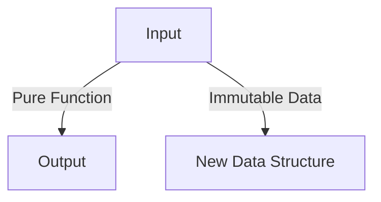

## 4.1 Overview of Functional Programming Concepts

Functional Programming (FP) is a programming paradigm that treats computation as the evaluation of mathematical functions and avoids changing state or mutable data. In this section, we will delve into the core principles of functional programming, explore its differences from object-oriented programming (OOP), and discuss the benefits of applying FP concepts in PHP.

### Principles of Functional Programming

Functional programming is built upon several key principles that distinguish it from other paradigms. Let's explore these principles in detail:

#### 1. Pure Functions

A pure function is a function where the output value is determined only by its input values, without observable side effects. This means that calling a pure function with the same arguments will always produce the same result.

```php
<?php
// Pure function example
function add($a, $b) {
    return $a + $b;
}

echo add(2, 3); // Outputs: 5
```

**Key Characteristics:**
- **Deterministic:** The same input always results in the same output.
- **No Side Effects:** The function does not alter any external state.

#### 2. Immutability

Immutability refers to the concept of data being unchangeable once created. Instead of modifying existing data, new data structures are created.

```php
<?php
// Immutable data example
$numbers = [1, 2, 3];
$newNumbers = array_map(fn($n) => $n * 2, $numbers);

print_r($newNumbers); // Outputs: [2, 4, 6]
```

**Benefits:**
- **Predictability:** Easier to reason about code.
- **Concurrency:** Safe to use in concurrent environments.

#### 3. First-Class and Higher-Order Functions

In FP, functions are first-class citizens, meaning they can be passed as arguments, returned from other functions, and assigned to variables. Higher-order functions are functions that take other functions as arguments or return them as results.

```php
<?php
// Higher-order function example
function applyFunction($func, $value) {
    return $func($value);
}

$square = fn($x) => $x * $x;
echo applyFunction($square, 4); // Outputs: 16
```

**Advantages:**
- **Reusability:** Functions can be reused and composed.
- **Abstraction:** Simplifies complex operations.

#### 4. Recursion

Recursion is a technique where a function calls itself to solve a problem. It is often used in place of loops in FP.

```php
<?php
// Recursive function example
function factorial($n) {
    return $n <= 1 ? 1 : $n * factorial($n - 1);
}

echo factorial(5); // Outputs: 120
```

**Considerations:**
- **Base Case:** Essential to prevent infinite recursion.
- **Stack Usage:** Can lead to stack overflow if not managed properly.

#### 5. Function Composition

Function composition is the process of combining two or more functions to produce a new function.

```php
<?php
// Function composition example
$addOne = fn($x) => $x + 1;
$double = fn($x) => $x * 2;

$compose = fn($f, $g) => fn($x) => $f($g($x));
$addOneThenDouble = $compose($double, $addOne);

echo $addOneThenDouble(3); // Outputs: 8
```

**Benefits:**
- **Modularity:** Breaks down complex operations into simpler parts.
- **Readability:** Enhances code clarity.

### Differences Between Functional and Object-Oriented Programming

Functional programming and object-oriented programming are two distinct paradigms, each with its own approach to solving problems. Let's compare them:

#### State Management

- **FP:** Emphasizes immutability and stateless functions.
- **OOP:** Relies on objects that maintain state.

#### Data and Behavior

- **FP:** Separates data and behavior, focusing on pure functions.
- **OOP:** Encapsulates data and behavior within objects.

#### Code Structure

- **FP:** Uses functions as the primary building blocks.
- **OOP:** Uses classes and objects to structure code.

#### Side Effects

- **FP:** Avoids side effects, promoting pure functions.
- **OOP:** Allows side effects through methods that modify object state.

#### Example Comparison

Let's compare a simple example of calculating the area of a rectangle in both paradigms:

**Functional Approach:**

```php
<?php
// Functional approach
function calculateArea($width, $height) {
    return $width * $height;
}

echo calculateArea(5, 10); // Outputs: 50
```

**Object-Oriented Approach:**

```php
<?php
// Object-oriented approach
class Rectangle {
    private $width;
    private $height;

    public function __construct($width, $height) {
        $this->width = $width;
        $this->height = $height;
    }

    public function calculateArea() {
        return $this->width * $this->height;
    }
}

$rectangle = new Rectangle(5, 10);
echo $rectangle->calculateArea(); // Outputs: 50
```

### Benefits of Applying Functional Programming Concepts in PHP

Functional programming offers several advantages that can enhance PHP development:

#### 1. Improved Code Readability

FP encourages writing smaller, more focused functions, making code easier to read and understand.

#### 2. Easier Testing and Debugging

Pure functions are easier to test and debug because they do not depend on external state.

#### 3. Enhanced Modularity

FP promotes the use of reusable functions, leading to more modular code.

#### 4. Concurrency and Parallelism

Immutability and stateless functions make it easier to write concurrent and parallel code.

#### 5. Reduced Bugs

By avoiding side effects and mutable state, FP reduces the likelihood of bugs.

#### 6. Better Abstraction

Higher-order functions and function composition provide powerful abstraction mechanisms.

### Visualizing Functional Programming Concepts

To better understand the flow of functional programming, let's visualize some of these concepts using Mermaid.js diagrams.

#### Pure Functions and Immutability



**Description:** This diagram illustrates how pure functions take input and produce output without altering the original data.

#### Function Composition


**Description:** This diagram shows how functions can be composed to create a new function that processes data through multiple stages.

### Try It Yourself

To solidify your understanding of functional programming concepts, try modifying the code examples provided. Experiment with creating your own pure functions, higher-order functions, and recursive functions. Consider how you might refactor existing code to incorporate FP principles.

### References and Links

For further reading on functional programming concepts, consider the following resources:

- [MDN Web Docs: Functional Programming](https://developer.mozilla.org/en-US/docs/Glossary/Functional_programming)
- [W3Schools: PHP Functions](https://www.w3schools.com/php/php_functions.asp)
- [PHP Manual: Anonymous Functions](https://www.php.net/manual/en/functions.anonymous.php)

### Knowledge Check

- What is a pure function, and why is it important in functional programming?
- How does immutability benefit concurrent programming?
- Compare and contrast functional programming and object-oriented programming.
- What are higher-order functions, and how do they enhance code reusability?
- Explain the concept of function composition and its advantages.

### Embrace the Journey

Remember, this is just the beginning of your exploration into functional programming in PHP. As you progress, you'll discover more advanced techniques and patterns that will further enhance your coding skills. Keep experimenting, stay curious, and enjoy the journey!

### Quiz: Overview of Functional Programming Concepts



### What is a pure function?

- [x] A function that returns the same output for the same input and has no side effects.
- [ ] A function that modifies global variables.
- [ ] A function that relies on external state.
- [ ] A function that uses loops.

> **Explanation:** A pure function always produces the same output for the same input and does not cause side effects.

### What is immutability in functional programming?

- [x] Data cannot be changed once created.
- [ ] Data can be modified at any time.
- [ ] Functions can alter global state.
- [ ] Variables are mutable by default.

> **Explanation:** Immutability means that data cannot be changed once it is created, promoting predictability and safety in concurrent environments.

### Which of the following is a higher-order function?

- [x] A function that takes another function as an argument.
- [ ] A function that returns a string.
- [ ] A function that uses loops.
- [ ] A function that modifies global variables.

> **Explanation:** Higher-order functions take other functions as arguments or return them as results, enhancing reusability and abstraction.

### What is the main advantage of using recursion in functional programming?

- [x] It can replace loops and simplify code.
- [ ] It increases code complexity.
- [ ] It requires more memory.
- [ ] It is slower than loops.

> **Explanation:** Recursion can replace loops, simplifying code by breaking down problems into smaller, more manageable parts.

### How does function composition benefit code structure?

- [x] It allows combining simple functions to create complex operations.
- [ ] It makes code harder to read.
- [ ] It increases the number of lines of code.
- [ ] It requires more memory.

> **Explanation:** Function composition allows developers to combine simple functions to create complex operations, enhancing modularity and readability.

### What is a key difference between FP and OOP?

- [x] FP emphasizes immutability, while OOP relies on objects with state.
- [ ] FP uses classes, while OOP uses functions.
- [ ] FP allows side effects, while OOP avoids them.
- [ ] FP is not suitable for PHP.

> **Explanation:** FP emphasizes immutability and stateless functions, whereas OOP relies on objects that maintain state.

### Why are pure functions easier to test?

- [x] They do not depend on external state.
- [ ] They modify global variables.
- [ ] They use loops.
- [ ] They require more memory.

> **Explanation:** Pure functions are easier to test because they do not depend on external state, making them predictable and isolated.

### What is the benefit of using first-class functions?

- [x] Functions can be passed as arguments and returned as results.
- [ ] Functions cannot be reused.
- [ ] Functions are limited to specific operations.
- [ ] Functions cannot be assigned to variables.

> **Explanation:** First-class functions can be passed as arguments, returned as results, and assigned to variables, enhancing flexibility and reusability.

### What does immutability help prevent in concurrent programming?

- [x] Race conditions.
- [ ] Increased memory usage.
- [ ] Faster execution.
- [ ] More complex code.

> **Explanation:** Immutability helps prevent race conditions by ensuring that data cannot be changed once created, making it safe for concurrent use.

### True or False: Functional programming in PHP can enhance code readability and maintainability.

- [x] True
- [ ] False

> **Explanation:** Functional programming promotes writing smaller, focused functions, improving code readability and maintainability.


