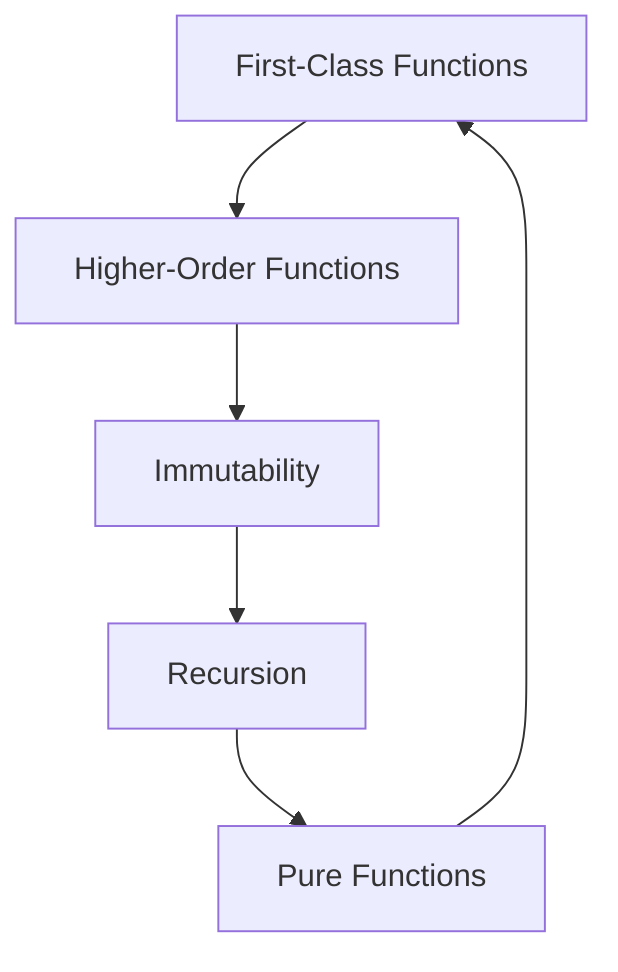

## 4.2 Functional Programming Features in PHP

Functional programming (FP) is a paradigm that treats computation as the evaluation of mathematical functions and avoids changing state or mutable data. PHP, traditionally known for its imperative and object-oriented capabilities, has embraced functional programming features over the years. This section will delve into these features, focusing on first-class functions, higher-order functions, immutability, recursion, and pure functions.

### First-Class Functions and Higher-Order Functions

#### First-Class Functions

In PHP, functions are first-class citizens, meaning they can be assigned to variables, passed as arguments, and returned from other functions. This capability allows for more flexible and reusable code.

**Example: Assigning a Function to a Variable**

```php
<?php

// Define a simple function
function greet($name) {
    return "Hello, $name!";
}

// Assign the function to a variable
$greeter = 'greet';

// Call the function using the variable
echo $greeter('World'); // Outputs: Hello, World!

?>
```

**Explanation:** Here, the `greet` function is assigned to the `$greeter` variable, demonstrating PHP's support for first-class functions.

#### Higher-Order Functions

Higher-order functions are functions that take other functions as arguments or return them as results. They are a cornerstone of functional programming, enabling powerful abstractions and code reuse.

**Example: Using a Higher-Order Function**

```php
<?php

// Define a higher-order function
function applyFunction($func, $value) {
    return $func($value);
}

// Define a simple function
function square($n) {
    return $n * $n;
}

// Use the higher-order function
echo applyFunction('square', 4); // Outputs: 16

?>
```

**Explanation:** The `applyFunction` is a higher-order function that takes another function (`square`) and a value as arguments, applying the function to the value.

### Immutability and Its Importance in FP

Immutability refers to the concept of data that cannot be changed after it is created. In functional programming, immutability is crucial because it helps avoid side effects and makes code easier to reason about.

#### Implementing Immutability in PHP

While PHP does not enforce immutability, developers can adopt practices to simulate it, such as using constants or creating new instances instead of modifying existing ones.

**Example: Simulating Immutability**

```php
<?php

class ImmutablePoint {
    private $x;
    private $y;

    public function __construct($x, $y) {
        $this->x = $x;
        $this->y = $y;
    }

    public function withX($x) {
        return new self($x, $this->y);
    }

    public function withY($y) {
        return new self($this->x, $y);
    }

    public function getX() {
        return $this->x;
    }

    public function getY() {
        return $this->y;
    }
}

$point = new ImmutablePoint(1, 2);
$newPoint = $point->withX(3);

echo $point->getX(); // Outputs: 1
echo $newPoint->getX(); // Outputs: 3

?>
```

**Explanation:** The `ImmutablePoint` class demonstrates immutability by returning new instances with modified values instead of altering the original object.

### Recursion and Pure Functions

#### Recursion

Recursion is a technique where a function calls itself to solve a problem. It is often used in functional programming to replace iterative loops.

**Example: Recursive Function to Calculate Factorial**

```php
<?php

function factorial($n) {
    if ($n <= 1) {
        return 1;
    }
    return $n * factorial($n - 1);
}

echo factorial(5); // Outputs: 120

?>
```

**Explanation:** The `factorial` function calculates the factorial of a number using recursion, calling itself with a decremented value until it reaches the base case.

#### Pure Functions

Pure functions are functions that always produce the same output for the same input and have no side effects. They are a fundamental concept in functional programming, promoting predictability and testability.

**Example: Pure Function**

```php
<?php

function add($a, $b) {
    return $a + $b;
}

echo add(2, 3); // Outputs: 5

?>
```

**Explanation:** The `add` function is pure because it consistently returns the same result for the same inputs and does not modify any external state.

### Visualizing Functional Programming Concepts

To better understand these concepts, let's visualize how functions interact in a functional programming context.



**Diagram Description:** This diagram illustrates the interconnected nature of functional programming concepts, showing how each concept builds upon the others.

### Try It Yourself

Experiment with the code examples provided. Try modifying the `applyFunction` example to use different functions, or create your own immutable class. This hands-on approach will deepen your understanding of functional programming in PHP.

### References and Links

- [PHP Manual: Functions](https://www.php.net/manual/en/language.functions.php)
- [MDN Web Docs: Functional Programming](https://developer.mozilla.org/en-US/docs/Web/JavaScript/Guide/Functions#functional_programming)
- [W3Schools: PHP Functions](https://www.w3schools.com/php/php_functions.asp)

### Knowledge Check

- What are first-class functions, and how do they differ from higher-order functions?
- How can immutability be implemented in PHP?
- What are the benefits of using pure functions in your code?

### Embrace the Journey

Remember, mastering functional programming in PHP is a journey. As you explore these concepts, you'll gain new insights into writing cleaner, more efficient code. Keep experimenting, stay curious, and enjoy the process!

## Quiz: Functional Programming Features in PHP



### What is a first-class function in PHP?

- [x] A function that can be assigned to a variable, passed as an argument, or returned from another function.
- [ ] A function that is defined at the top of a PHP file.
- [ ] A function that can only be used within a class.
- [ ] A function that is automatically executed when a script runs.

> **Explanation:** First-class functions in PHP can be assigned to variables, passed as arguments, and returned from other functions, allowing for flexible and reusable code.

### What is a higher-order function?

- [x] A function that takes other functions as arguments or returns them as results.
- [ ] A function that is defined within another function.
- [ ] A function that can only be used with arrays.
- [ ] A function that is executed at a higher priority than others.

> **Explanation:** Higher-order functions are functions that take other functions as arguments or return them as results, enabling powerful abstractions and code reuse.

### How can immutability be achieved in PHP?

- [x] By using constants or creating new instances instead of modifying existing ones.
- [ ] By using global variables.
- [ ] By using the `static` keyword.
- [ ] By using the `global` keyword.

> **Explanation:** Immutability in PHP can be simulated by using constants or creating new instances instead of modifying existing ones, helping to avoid side effects.

### What is a pure function?

- [x] A function that always produces the same output for the same input and has no side effects.
- [ ] A function that modifies global variables.
- [ ] A function that can only be used within a class.
- [ ] A function that is automatically executed when a script runs.

> **Explanation:** Pure functions always produce the same output for the same input and have no side effects, promoting predictability and testability.

### What is recursion?

- [x] A technique where a function calls itself to solve a problem.
- [ ] A technique where a function is executed multiple times in a loop.
- [ ] A technique where a function is defined within another function.
- [ ] A technique where a function is called from another script.

> **Explanation:** Recursion is a technique where a function calls itself to solve a problem, often used in functional programming to replace iterative loops.

### Which of the following is an example of a higher-order function?

- [x] A function that takes another function as an argument.
- [ ] A function that modifies a global variable.
- [ ] A function that is defined within a class.
- [ ] A function that is executed at the start of a script.

> **Explanation:** A higher-order function is one that takes another function as an argument or returns a function as a result.

### What is the main benefit of using pure functions?

- [x] They promote predictability and testability.
- [ ] They allow for faster execution of code.
- [ ] They enable the use of global variables.
- [ ] They automatically handle errors.

> **Explanation:** Pure functions promote predictability and testability by always producing the same output for the same input and having no side effects.

### How does immutability help in functional programming?

- [x] It helps avoid side effects and makes code easier to reason about.
- [ ] It allows for faster execution of code.
- [ ] It enables the use of global variables.
- [ ] It automatically handles errors.

> **Explanation:** Immutability helps avoid side effects and makes code easier to reason about, which is crucial in functional programming.

### What is the purpose of using recursion in functional programming?

- [x] To replace iterative loops with function calls.
- [ ] To execute code faster.
- [ ] To modify global variables.
- [ ] To automatically handle errors.

> **Explanation:** Recursion is used in functional programming to replace iterative loops with function calls, allowing for more concise and expressive code.

### True or False: PHP enforces immutability by default.

- [ ] True
- [x] False

> **Explanation:** PHP does not enforce immutability by default, but developers can adopt practices to simulate it, such as using constants or creating new instances.


