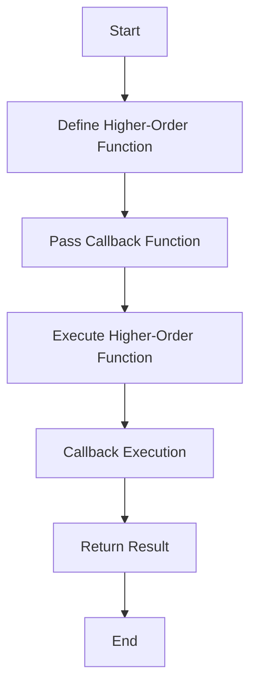

## 4.3 Higher-Order Functions and Callbacks

In the realm of functional programming, higher-order functions and callbacks are powerful concepts that enable developers to write more flexible, reusable, and concise code. In PHP, these concepts are not only supported but are also integral to modern PHP development. In this section, we will delve into the intricacies of higher-order functions and callbacks, explore their applications, and provide practical examples to illustrate their use in PHP.

### Understanding Higher-Order Functions

**Higher-order functions** are functions that can take other functions as arguments or return them as results. This capability allows for a high degree of abstraction and code reuse. In PHP, higher-order functions are commonly used in conjunction with anonymous functions and closures.

#### Key Characteristics of Higher-Order Functions

- **Function as Parameter**: A higher-order function can accept one or more functions as arguments.
- **Function as Return Value**: It can return a function as its result.
- **Abstraction and Reusability**: They enable the creation of more abstract and reusable code components.

### Callbacks in PHP

A **callback** is a function that is passed as an argument to another function and is executed after a certain event or condition. Callbacks are a fundamental part of asynchronous programming and event-driven architectures.

#### Types of Callbacks in PHP

- **Anonymous Functions**: Also known as closures, these are functions without a name that can capture variables from their surrounding scope.
- **Named Functions**: Regular functions that are passed by their name as a string.
- **Static Methods**: Class methods that can be used as callbacks by specifying the class name and method name.

### Using Built-in PHP Functions

PHP provides several built-in functions that leverage higher-order functions and callbacks. Two of the most commonly used are `array_map()` and `array_filter()`.

#### `array_map()`

The `array_map()` function applies a callback to the elements of one or more arrays.

```php
<?php
function square($n) {
    return $n * $n;
}

$numbers = [1, 2, 3, 4, 5];
$squaredNumbers = array_map('square', $numbers);

print_r($squaredNumbers);
// Output: Array ( [0] => 1 [1] => 4 [2] => 9 [3] => 16 [4] => 25 )
?>
```

#### `array_filter()`

The `array_filter()` function filters elements of an array using a callback function.

```php
<?php
function isEven($n) {
    return $n % 2 === 0;
}

$numbers = [1, 2, 3, 4, 5];
$evenNumbers = array_filter($numbers, 'isEven');

print_r($evenNumbers);
// Output: Array ( [1] => 2 [3] => 4 )
?>
```

### Creating Custom Higher-Order Functions

Creating custom higher-order functions in PHP involves defining functions that accept other functions as parameters or return them. This allows for greater flexibility and modularity in your code.

#### Example: Custom Array Mapper

Let's create a custom function similar to `array_map()`.

```php
<?php
function customMap(array $array, callable $callback) {
    $result = [];
    foreach ($array as $item) {
        $result[] = $callback($item);
    }
    return $result;
}

$numbers = [1, 2, 3, 4, 5];
$squaredNumbers = customMap($numbers, function($n) {
    return $n * $n;
});

print_r($squaredNumbers);
// Output: Array ( [0] => 1 [1] => 4 [2] => 9 [3] => 16 [4] => 25 )
?>
```

### Practical Applications

Higher-order functions and callbacks are not just theoretical concepts; they have practical applications in real-world PHP development.

#### Event Handling

In event-driven programming, callbacks are used to handle events. For example, in a web application, you might use a callback to handle a button click event.

#### Asynchronous Programming

Callbacks are essential in asynchronous programming, where they are used to handle the results of asynchronous operations, such as database queries or HTTP requests.

#### Middleware in Web Applications

In web applications, middleware functions are often implemented as higher-order functions that take a request handler as a parameter and return a new handler.

### Visualizing Higher-Order Functions and Callbacks

To better understand the flow of higher-order functions and callbacks, let's visualize the process using a flowchart.



This flowchart illustrates the process of defining a higher-order function, passing a callback, executing the function, and returning the result.

### Try It Yourself

Experiment with the code examples provided. Try modifying the callback functions to perform different operations, such as filtering odd numbers or transforming strings.

### References and Further Reading

- [PHP Manual: Anonymous Functions](https://www.php.net/manual/en/functions.anonymous.php)
- [PHP Manual: array_map()](https://www.php.net/manual/en/function.array-map.php)
- [PHP Manual: array_filter()](https://www.php.net/manual/en/function.array-filter.php)

### Knowledge Check

- What is a higher-order function?
- How do callbacks work in PHP?
- Can you create a custom higher-order function that filters an array based on a callback?

### Embrace the Journey

Remember, mastering higher-order functions and callbacks is a journey. As you continue to explore these concepts, you'll discover new ways to write more efficient and elegant PHP code. Keep experimenting, stay curious, and enjoy the process!

## Quiz: Higher-Order Functions and Callbacks



### What is a higher-order function?

- [x] A function that takes other functions as arguments or returns them as results.
- [ ] A function that only performs mathematical operations.
- [ ] A function that cannot be nested.
- [ ] A function that only works with arrays.

> **Explanation:** A higher-order function is one that can take other functions as arguments or return them as results, enabling more abstract and reusable code.

### Which PHP function applies a callback to the elements of an array?

- [x] array_map()
- [ ] array_filter()
- [ ] array_reduce()
- [ ] array_walk()

> **Explanation:** The `array_map()` function applies a callback to the elements of an array.

### What is a callback in PHP?

- [x] A function passed as an argument to another function.
- [ ] A function that calls itself.
- [ ] A function that is executed immediately.
- [ ] A function that cannot return a value.

> **Explanation:** A callback is a function that is passed as an argument to another function and is executed after a certain event or condition.

### How can you define an anonymous function in PHP?

- [x] Using the `function` keyword without a name.
- [ ] Using the `class` keyword.
- [ ] Using the `new` keyword.
- [ ] Using the `return` keyword.

> **Explanation:** An anonymous function in PHP is defined using the `function` keyword without a name.

### What is the output of the following code?
```php
<?php
$numbers = [1, 2, 3, 4, 5];
$evenNumbers = array_filter($numbers, function($n) {
    return $n % 2 === 0;
});
print_r($evenNumbers);
?>
```

- [x] Array ( [1] => 2 [3] => 4 )
- [ ] Array ( [0] => 1 [2] => 3 [4] => 5 )
- [ ] Array ( [0] => 2 [1] => 4 )
- [ ] Array ( [0] => 1 [1] => 3 [2] => 5 )

> **Explanation:** The `array_filter()` function filters the array to include only even numbers, resulting in Array ( [1] => 2 [3] => 4 ).

### Which of the following is NOT a type of callback in PHP?

- [ ] Anonymous Functions
- [ ] Named Functions
- [ ] Static Methods
- [x] Dynamic Variables

> **Explanation:** Dynamic variables are not a type of callback in PHP. Callbacks can be anonymous functions, named functions, or static methods.

### What is the purpose of using higher-order functions?

- [x] To create more abstract and reusable code components.
- [ ] To make code execution slower.
- [ ] To increase the complexity of code.
- [ ] To eliminate the need for functions.

> **Explanation:** Higher-order functions allow for the creation of more abstract and reusable code components, enhancing code flexibility and maintainability.

### How can you pass a static method as a callback in PHP?

- [x] Using an array with the class name and method name.
- [ ] Using a string with the method name only.
- [ ] Using a variable with the method name.
- [ ] Using the `new` keyword.

> **Explanation:** A static method can be passed as a callback in PHP using an array with the class name and method name.

### What is the main advantage of using callbacks in asynchronous programming?

- [x] They allow handling the results of asynchronous operations.
- [ ] They make code execution synchronous.
- [ ] They eliminate the need for event handling.
- [ ] They increase the complexity of code.

> **Explanation:** Callbacks are essential in asynchronous programming as they allow handling the results of asynchronous operations, such as database queries or HTTP requests.

### True or False: Higher-order functions can only accept functions as parameters, not return them.

- [ ] True
- [x] False

> **Explanation:** False. Higher-order functions can both accept functions as parameters and return them as results.


