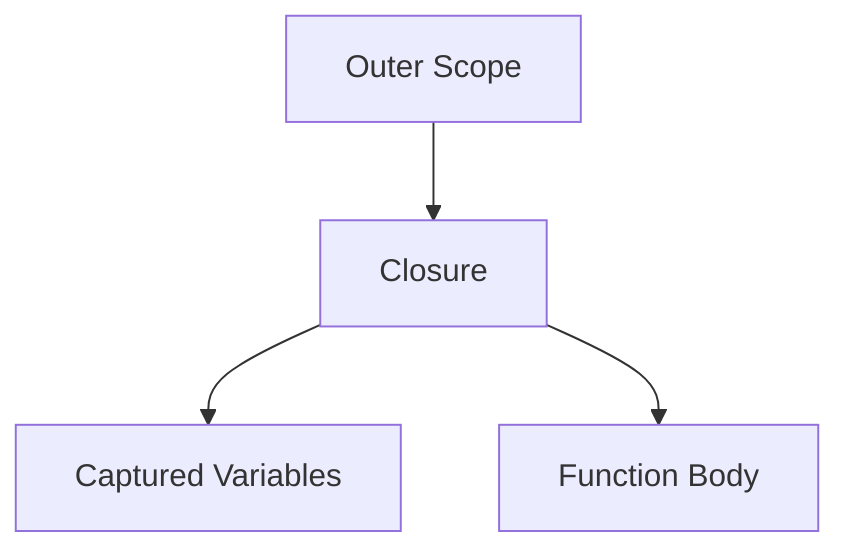

## 4.4 Lambdas, Closures, and Anonymous Functions

In the realm of PHP, lambdas, closures, and anonymous functions are powerful tools that allow developers to write more expressive and flexible code. These concepts are integral to functional programming and can significantly enhance the way we approach problem-solving in PHP. In this section, we'll delve into the syntax, usage, and practical applications of these constructs, providing you with the knowledge to leverage them effectively in your projects.

### Understanding Lambdas, Closures, and Anonymous Functions

Before we dive into the specifics, let's clarify what each of these terms means in the context of PHP:

- **Anonymous Functions**: These are functions that are defined without a name. They are often used as the value of a variable or as an argument to other functions.
- **Lambdas**: In PHP, lambdas are essentially anonymous functions. The term "lambda" is borrowed from lambda calculus, a formal system in mathematical logic for expressing computation.
- **Closures**: A closure is an anonymous function that can capture variables from its surrounding scope. This feature allows closures to "remember" the environment in which they were created.

### Syntax and Usage

Let's start by looking at the basic syntax for creating an anonymous function in PHP:

```php
$greet = function($name) {
    return "Hello, $name!";
};

echo $greet("World"); // Outputs: Hello, World!
```

In this example, `$greet` is an anonymous function that takes a single argument `$name` and returns a greeting string. We can invoke this function by calling `$greet("World")`.

#### Capturing Variables by Value and Reference

One of the key features of closures in PHP is their ability to capture variables from the surrounding scope. This is done using the `use` keyword. Let's explore how this works:

```php
$message = "Hello";

$greet = function($name) use ($message) {
    return "$message, $name!";
};

echo $greet("Alice"); // Outputs: Hello, Alice!
```

In this example, the closure captures the `$message` variable from the surrounding scope. The `use` keyword allows the closure to access `$message` even though it is not passed as an argument.

By default, variables are captured by value, meaning that changes to the variable inside the closure do not affect the original variable. To capture a variable by reference, prepend an `&` to the variable name:

```php
$count = 0;

$increment = function() use (&$count) {
    $count++;
};

$increment();
$increment();

echo $count; // Outputs: 2
```

Here, the `$count` variable is captured by reference, allowing the closure to modify its value.

### Practical Examples of Closures in PHP Applications

Closures are incredibly versatile and can be used in a variety of scenarios. Let's explore some practical examples:

#### Sorting Arrays with Closures

Closures are often used as callback functions for array operations. For instance, we can use a closure to sort an array of objects:

```php
$people = [
    ['name' => 'Alice', 'age' => 30],
    ['name' => 'Bob', 'age' => 25],
    ['name' => 'Charlie', 'age' => 35],
];

usort($people, function($a, $b) {
    return $a['age'] <=> $b['age'];
});

print_r($people);
```

In this example, the `usort` function uses a closure to compare the `age` of each person, sorting the array in ascending order.

#### Implementing a Simple Event System

Closures can also be used to implement a simple event system. Here's an example:

```php
class EventManager {
    private $listeners = [];

    public function on($event, $listener) {
        $this->listeners[$event][] = $listener;
    }

    public function trigger($event, $data = null) {
        if (isset($this->listeners[$event])) {
            foreach ($this->listeners[$event] as $listener) {
                $listener($data);
            }
        }
    }
}

$em = new EventManager();

$em->on('user.registered', function($user) {
    echo "User registered: " . $user['name'] . "\n";
});

$em->trigger('user.registered', ['name' => 'Alice']);
```

In this example, the `EventManager` class allows us to register listeners for specific events. When an event is triggered, all registered listeners are called with the provided data.

### Visualizing Closures and Variable Capture

To better understand how closures capture variables, let's visualize the process using a diagram:



In this diagram, the closure captures variables from the outer scope and uses them within its function body. This visualization helps illustrate the concept of closures "remembering" their environment.

### Try It Yourself

To deepen your understanding, try modifying the code examples above. For instance, experiment with capturing different types of variables or using closures in other array functions like `array_map` or `array_filter`.

### References and Further Reading

For more information on lambdas, closures, and anonymous functions in PHP, consider exploring the following resources:

- [PHP Manual: Anonymous Functions](https://www.php.net/manual/en/functions.anonymous.php)
- [MDN Web Docs: Closures](https://developer.mozilla.org/en-US/docs/Web/JavaScript/Closures) (Note: While this is a JavaScript resource, the concept of closures is similar across languages.)

### Knowledge Check

Let's reinforce what we've learned with a few questions:

- What is the difference between a lambda and a closure in PHP?
- How do you capture a variable by reference in a closure?
- Can closures be used as callback functions in PHP? Provide an example.

### Embrace the Journey

Remember, mastering lambdas, closures, and anonymous functions is just one step in your PHP journey. As you continue to explore these concepts, you'll discover new ways to write more efficient and maintainable code. Keep experimenting, stay curious, and enjoy the journey!

## Quiz: Lambdas, Closures, and Anonymous Functions



### What is an anonymous function in PHP?

- [x] A function without a name
- [ ] A function that captures variables from the global scope
- [ ] A function that is always static
- [ ] A function that cannot be passed as an argument

> **Explanation:** An anonymous function is defined without a name and can be assigned to a variable or used as a callback.

### How do you capture a variable by reference in a closure?

- [x] Using the `&` symbol before the variable name
- [ ] Using the `use` keyword
- [ ] By passing the variable as an argument
- [ ] By declaring the variable as global

> **Explanation:** The `&` symbol is used to capture a variable by reference, allowing the closure to modify its value.

### What is a closure in PHP?

- [x] An anonymous function that can capture variables from its surrounding scope
- [ ] A function that cannot be reused
- [ ] A function that is always public
- [ ] A function that is defined inside a class

> **Explanation:** A closure is an anonymous function that can capture and use variables from the scope in which it was defined.

### Can closures be used as callback functions in PHP?

- [x] Yes
- [ ] No

> **Explanation:** Closures can be used as callback functions, making them versatile for array operations and event handling.

### What keyword is used to capture variables in a closure?

- [x] `use`
- [ ] `capture`
- [ ] `bind`
- [ ] `include`

> **Explanation:** The `use` keyword is used to specify which variables should be captured by the closure.

### What is the output of the following code?
```php
$message = "Hello";
$greet = function($name) use ($message) {
    return "$message, $name!";
};
echo $greet("Alice");
```

- [x] Hello, Alice!
- [ ] Hello, World!
- [ ] Alice, Hello!
- [ ] Error

> **Explanation:** The closure captures the `$message` variable and uses it in the greeting.

### How can you modify a captured variable inside a closure?

- [x] Capture it by reference using `&`
- [ ] Use the `global` keyword
- [ ] Pass it as an argument
- [ ] Declare it as static

> **Explanation:** Capturing a variable by reference with `&` allows the closure to modify its value.

### Which of the following is a valid use of closures?

- [x] Sorting an array with `usort`
- [ ] Declaring a class
- [ ] Defining a constant
- [ ] Creating a global variable

> **Explanation:** Closures are often used as callback functions for sorting arrays and other operations.

### What is the primary benefit of using closures?

- [x] They allow functions to capture and use variables from their surrounding scope
- [ ] They make code run faster
- [ ] They are easier to debug
- [ ] They eliminate the need for classes

> **Explanation:** Closures provide the ability to capture and use variables from the scope in which they were defined, enhancing flexibility.

### True or False: A closure can modify the value of a captured variable by default.

- [ ] True
- [x] False

> **Explanation:** By default, variables are captured by value, meaning changes inside the closure do not affect the original variable unless captured by reference.


