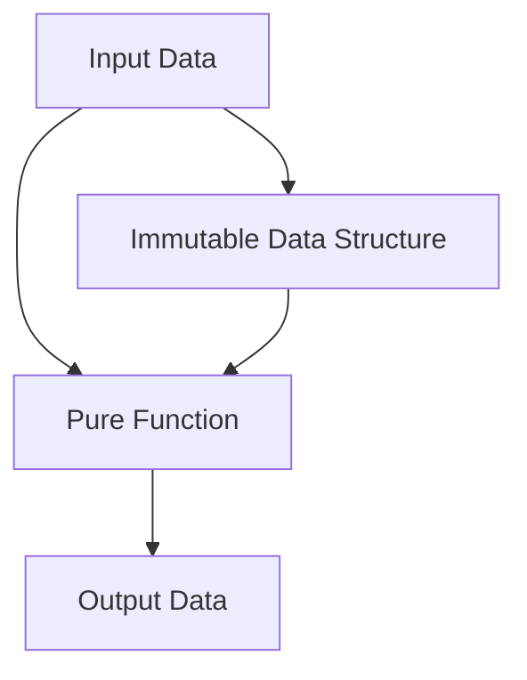

## 4.5 Immutability and Pure Functions

In the realm of functional programming, two concepts stand out for their ability to create robust, maintainable, and predictable code: **immutability** and **pure functions**. These concepts are not only foundational to functional programming but also offer significant advantages when applied in PHP, a language traditionally known for its imperative and object-oriented paradigms. In this section, we will delve into these concepts, understand their importance, and learn how to effectively implement them in PHP.

### Understanding Immutability

**Immutability** refers to the idea that once a data structure is created, it cannot be changed. This concept is crucial in functional programming because it eliminates side effects, making code easier to reason about and debug.

#### Implementing Immutability in PHP

PHP, by default, does not enforce immutability. However, we can achieve immutability by adhering to certain practices:

1. **Use Constants**: Define constants for values that should not change.
2. **Avoid Mutating State**: Instead of modifying an object or array, create a new one with the desired changes.
3. **Leverage Immutable Libraries**: Use libraries like `immutable.php` to enforce immutability.

Here's a simple example of implementing immutability in PHP:

```php
<?php

class ImmutablePoint {
    private $x;
    private $y;

    public function __construct($x, $y) {
        $this->x = $x;
        $this->y = $y;
    }

    public function getX() {
        return $this->x;
    }

    public function getY() {
        return $this->y;
    }

    public function withX($x) {
        return new ImmutablePoint($x, $this->y);
    }

    public function withY($y) {
        return new ImmutablePoint($this->x, $y);
    }
}

$point = new ImmutablePoint(2, 3);
$newPoint = $point->withX(5);

echo $point->getX(); // Outputs: 2
echo $newPoint->getX(); // Outputs: 5
```

In this example, the `ImmutablePoint` class does not allow direct modification of its properties. Instead, it provides methods to create new instances with modified values.

### Advantages of Immutability

- **Predictability**: Immutable data structures are predictable, as they do not change state.
- **Thread Safety**: Immutability naturally leads to thread-safe code, as concurrent operations cannot alter the state.
- **Simplified Debugging**: With no side effects, debugging becomes more straightforward.

### Understanding Pure Functions

A **pure function** is a function where the output value is determined only by its input values, without observable side effects. This means that given the same input, a pure function will always return the same output.

#### Characteristics of Pure Functions

1. **Deterministic**: Always produces the same result for the same input.
2. **No Side Effects**: Does not alter any external state or interact with the outside world (e.g., no database or file system operations).

Here's an example of a pure function in PHP:

```php
<?php

function add($a, $b) {
    return $a + $b;
}

echo add(2, 3); // Outputs: 5
```

The `add` function is pure because it always returns the same result for the same inputs and does not modify any external state.

### Advantages of Pure Functions

- **Ease of Testing**: Pure functions are easy to test because they do not depend on external state.
- **Concurrency**: Pure functions can be executed in parallel without concerns about shared state.
- **Composability**: Pure functions can be easily composed to build more complex functions.

### Combining Immutability and Pure Functions

When combined, immutability and pure functions provide a powerful toolkit for building reliable and maintainable applications. They enable developers to write code that is easier to understand, test, and debug.

#### Example: Functional Data Transformation

Consider a scenario where we need to transform a list of numbers by doubling each value. Using immutability and pure functions, we can achieve this as follows:

```php
<?php

function double($number) {
    return $number * 2;
}

function transform(array $numbers, callable $func) {
    $result = [];
    foreach ($numbers as $number) {
        $result[] = $func($number);
    }
    return $result;
}

$numbers = [1, 2, 3, 4];
$doubledNumbers = transform($numbers, 'double');

print_r($doubledNumbers); // Outputs: [2, 4, 6, 8]
```

In this example, the `double` function is pure, and the `transform` function applies it immutably to each element of the array.

### Visualizing Immutability and Pure Functions

To better understand these concepts, let's visualize how they interact in a program:



**Diagram Description**: This flowchart illustrates how input data is processed by a pure function to produce output data. The immutable data structure ensures that the input remains unchanged, allowing for predictable and reliable transformations.

### Practical Considerations

While immutability and pure functions offer numerous benefits, there are practical considerations to keep in mind:

- **Performance**: Creating new instances of data structures can be less efficient than modifying existing ones. Use these concepts judiciously in performance-critical sections.
- **Memory Usage**: Immutability can lead to increased memory usage due to the creation of new objects. Consider using memory-efficient data structures or libraries.
- **Interoperability**: Ensure that immutable and pure function paradigms integrate well with existing codebases and libraries.

### Try It Yourself

To deepen your understanding, try modifying the code examples provided:

- **Experiment with Different Transformations**: Modify the `double` function to perform other operations, such as squaring or halving the numbers.
- **Create Your Own Immutable Class**: Design an immutable class for a different data structure, such as a `Rectangle` with width and height properties.
- **Compose Pure Functions**: Combine multiple pure functions to perform complex transformations on data.

### Further Reading

For more information on immutability and pure functions, consider exploring the following resources:

- [MDN Web Docs on Functional Programming](https://developer.mozilla.org/en-US/docs/Web/JavaScript/Guide/Functions#functional_programming)
- [PHP: The Right Way](https://phptherightway.com/)
- [Functional Programming in PHP](https://www.php.net/manual/en/language.functional.php)

### Knowledge Check

- **What is immutability, and why is it important?**
- **How does a pure function differ from an impure function?**
- **What are the benefits of using pure functions in concurrent programming?**

### Embrace the Journey

Remember, mastering immutability and pure functions is a journey. As you continue to explore these concepts, you'll find new ways to apply them to your PHP projects. Keep experimenting, stay curious, and enjoy the process of learning and growing as a developer.

## Quiz: Immutability and Pure Functions



### What is a key characteristic of immutable data structures?

- [x] They cannot be changed after creation.
- [ ] They are always stored in a database.
- [ ] They require more memory than mutable structures.
- [ ] They are only used in object-oriented programming.

> **Explanation:** Immutable data structures cannot be changed after they are created, which helps prevent side effects.

### Which of the following is a pure function?

- [x] A function that returns the same result for the same inputs.
- [ ] A function that modifies a global variable.
- [ ] A function that writes to a file.
- [ ] A function that logs messages to the console.

> **Explanation:** A pure function always returns the same result for the same inputs and does not cause side effects.

### What is a benefit of using pure functions?

- [x] They are easier to test.
- [ ] They require more memory.
- [ ] They are faster than impure functions.
- [ ] They can modify external state.

> **Explanation:** Pure functions are easier to test because they do not depend on or modify external state.

### How can immutability improve concurrency?

- [x] By ensuring that data cannot be changed by multiple threads simultaneously.
- [ ] By reducing the number of threads needed.
- [ ] By increasing the speed of data processing.
- [ ] By allowing data to be shared across processes.

> **Explanation:** Immutability ensures that data cannot be changed by multiple threads simultaneously, which improves concurrency.

### What is a common challenge when implementing immutability in PHP?

- [x] Increased memory usage due to new object creation.
- [ ] Difficulty in understanding the code.
- [ ] Lack of support for object-oriented programming.
- [ ] Incompatibility with PHP 7.

> **Explanation:** Immutability can lead to increased memory usage because new objects are created instead of modifying existing ones.

### Which PHP feature can help enforce immutability?

- [x] Constants
- [ ] Global variables
- [ ] Dynamic typing
- [ ] Magic methods

> **Explanation:** Constants in PHP can help enforce immutability by preventing changes to their values.

### What is a side effect in the context of pure functions?

- [x] Any observable interaction with the outside world.
- [ ] A change in the function's input parameters.
- [ ] An increase in execution time.
- [ ] A decrease in code readability.

> **Explanation:** A side effect is any observable interaction with the outside world, such as modifying a global variable or writing to a file.

### How can pure functions be composed?

- [x] By combining them to perform complex transformations.
- [ ] By modifying their internal state.
- [ ] By using global variables.
- [ ] By changing their input parameters.

> **Explanation:** Pure functions can be composed by combining them to perform complex transformations without side effects.

### What is a potential downside of immutability?

- [x] Increased memory usage.
- [ ] Decreased code readability.
- [ ] Difficulty in testing.
- [ ] Lack of support in PHP.

> **Explanation:** Immutability can lead to increased memory usage because new objects are created instead of modifying existing ones.

### True or False: Pure functions can modify global variables.

- [ ] True
- [x] False

> **Explanation:** Pure functions cannot modify global variables, as they do not cause side effects.



By understanding and applying the principles of immutability and pure functions, you'll be well-equipped to write cleaner, more efficient, and more reliable PHP code. Keep exploring these concepts, and you'll discover new ways to enhance your development skills and create better software.
