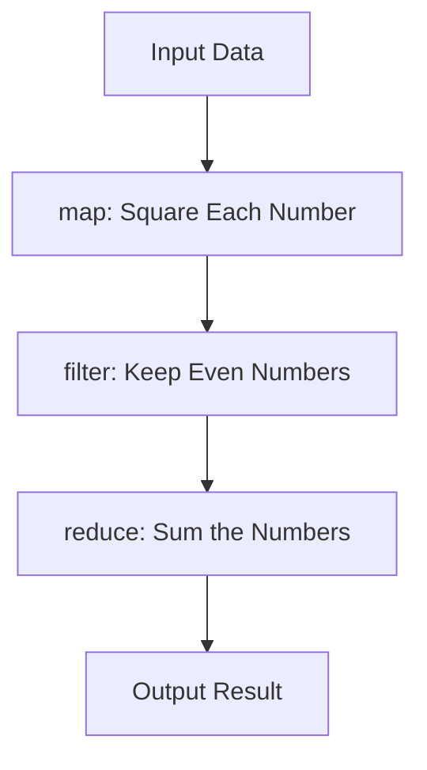

## 4.6 Using Functional Libraries (e.g., Functional PHP)

In the realm of PHP development, functional programming (FP) has gained traction for its ability to produce cleaner, more maintainable, and less error-prone code. While PHP is primarily an object-oriented language, it has been evolving to support functional programming paradigms. This section explores how functional libraries like Functional PHP and nikic/iter can enhance PHP's functional programming capabilities, allowing developers to write more expressive and efficient code.

### Introduction to Functional Libraries in PHP

Functional libraries in PHP provide a set of tools and utilities that enable developers to apply functional programming techniques more effectively. These libraries offer functional primitives such as map, filter, reduce, and more, which are not natively available in PHP. By leveraging these libraries, developers can write code that is more declarative and concise.

#### Popular Functional Libraries

1. **Functional PHP**: This library provides a collection of functional primitives for PHP, allowing developers to apply functional programming concepts such as higher-order functions, immutability, and pure functions.

   **Link:** [Functional PHP - Functional primitives for PHP](https://github.com/lstrojny/functional-php)

2. **nikic/iter**: This library offers iteration primitives using generators, enabling developers to work with iterators in a functional style.

   **Link:** [nikic/iter - Iteration primitives using generators](https://github.com/nikic/iter)

### Functional PHP: A Closer Look

Functional PHP is a library that brings functional programming primitives to PHP. It provides a wide range of functions that allow developers to apply functional programming techniques to their code. Let's explore some of the key features and functions offered by Functional PHP.

#### Key Features of Functional PHP

- **Higher-Order Functions**: Functions that take other functions as arguments or return them as results.
- **Immutability**: Ensures that data structures cannot be modified after they are created.
- **Pure Functions**: Functions that do not have side effects and always produce the same output for the same input.

#### Commonly Used Functions

1. **map**: Applies a given function to each element of a collection and returns a new collection with the results.

   ```php
   use function Functional\map;

   $numbers = [1, 2, 3, 4, 5];
   $squared = map($numbers, function($value) {
       return $value * $value;
   });

   print_r($squared); // Outputs: [1, 4, 9, 16, 25]
   ```

2. **filter**: Filters elements of a collection using a predicate function and returns a new collection with the elements that satisfy the predicate.

   ```php
   use function Functional\filter;

   $numbers = [1, 2, 3, 4, 5];
   $evenNumbers = filter($numbers, function($value) {
       return $value % 2 === 0;
   });

   print_r($evenNumbers); // Outputs: [2, 4]
   ```

3. **reduce**: Reduces a collection to a single value using a reducer function.

   ```php
   use function Functional\reduce;

   $numbers = [1, 2, 3, 4, 5];
   $sum = reduce($numbers, function($carry, $value) {
       return $carry + $value;
   }, 0);

   echo $sum; // Outputs: 15
   ```

### nikic/iter: Iteration Primitives Using Generators

The nikic/iter library provides iteration primitives using PHP's generator feature. This library allows developers to work with iterators in a functional style, making it easier to handle large datasets and streams of data.

#### Key Features of nikic/iter

- **Lazy Evaluation**: Processes data only when needed, which can improve performance and reduce memory usage.
- **Composability**: Allows chaining of operations to create complex data processing pipelines.

#### Commonly Used Functions

1. **map**: Transforms each element of an iterator using a callback function.

   ```php
   use function iter\map;

   $numbers = [1, 2, 3, 4, 5];
   $squared = map(function($value) {
       return $value * $value;
   }, $numbers);

   foreach ($squared as $value) {
       echo $value . ' '; // Outputs: 1 4 9 16 25
   }
   ```

2. **filter**: Filters elements of an iterator using a predicate function.

   ```php
   use function iter\filter;

   $numbers = [1, 2, 3, 4, 5];
   $evenNumbers = filter(function($value) {
       return $value % 2 === 0;
   }, $numbers);

   foreach ($evenNumbers as $value) {
       echo $value . ' '; // Outputs: 2 4
   }
   ```

3. **reduce**: Reduces an iterator to a single value using a reducer function.

   ```php
   use function iter\reduce;

   $numbers = [1, 2, 3, 4, 5];
   $sum = reduce(function($carry, $value) {
       return $carry + $value;
   }, $numbers, 0);

   echo $sum; // Outputs: 15
   ```

### Visualizing Functional Programming with Libraries

To better understand how functional libraries enhance PHP's capabilities, let's visualize the flow of data through a series of functional transformations using a Mermaid.js diagram.



**Description:** This diagram illustrates a data processing pipeline where input data is transformed through a series of functional operations: mapping, filtering, and reducing.

### Try It Yourself

To deepen your understanding of functional programming in PHP, try modifying the code examples provided above. Experiment with different functions and data sets to see how the output changes. For instance, try using a different predicate function in the `filter` example or a different reducer function in the `reduce` example.

### References and Further Reading

- [Functional PHP Documentation](https://github.com/lstrojny/functional-php)
- [nikic/iter Documentation](https://github.com/nikic/iter)
- [PHP Manual: Generators](https://www.php.net/manual/en/language.generators.php)
- [MDN Web Docs: Functional Programming](https://developer.mozilla.org/en-US/docs/Glossary/Functional_programming)

### Knowledge Check

- What are the benefits of using functional programming in PHP?
- How do functional libraries enhance PHP's capabilities?
- What is the difference between `map`, `filter`, and `reduce` functions?

### Embrace the Journey

Remember, this is just the beginning of your journey into functional programming with PHP. As you continue to explore and experiment with functional libraries, you'll discover new ways to write more expressive and maintainable code. Keep experimenting, stay curious, and enjoy the journey!

## Quiz: Using Functional Libraries (e.g., Functional PHP)



### What is the primary benefit of using functional libraries in PHP?

- [x] They provide functional programming primitives not natively available in PHP.
- [ ] They replace object-oriented programming entirely.
- [ ] They make PHP code run faster by default.
- [ ] They are only useful for mathematical computations.

> **Explanation:** Functional libraries provide functional programming primitives like map, filter, and reduce, which are not natively available in PHP.

### Which function in Functional PHP applies a given function to each element of a collection?

- [x] map
- [ ] filter
- [ ] reduce
- [ ] foreach

> **Explanation:** The `map` function applies a given function to each element of a collection and returns a new collection with the results.

### What is the key feature of nikic/iter that improves performance?

- [x] Lazy Evaluation
- [ ] Eager Loading
- [ ] Synchronous Processing
- [ ] Immediate Execution

> **Explanation:** Lazy evaluation processes data only when needed, which can improve performance and reduce memory usage.

### In the context of functional programming, what is a pure function?

- [x] A function that does not have side effects and always produces the same output for the same input.
- [ ] A function that modifies global variables.
- [ ] A function that can return different results for the same input.
- [ ] A function that relies on external state.

> **Explanation:** A pure function does not have side effects and always produces the same output for the same input.

### Which library provides iteration primitives using generators?

- [x] nikic/iter
- [ ] Functional PHP
- [ ] Laravel
- [ ] Symfony

> **Explanation:** The nikic/iter library provides iteration primitives using PHP's generator feature.

### What is the purpose of the `filter` function in functional programming?

- [x] To filter elements of a collection using a predicate function.
- [ ] To apply a function to each element of a collection.
- [ ] To reduce a collection to a single value.
- [ ] To sort elements of a collection.

> **Explanation:** The `filter` function filters elements of a collection using a predicate function and returns a new collection with the elements that satisfy the predicate.

### How does the `reduce` function work in functional programming?

- [x] It reduces a collection to a single value using a reducer function.
- [ ] It applies a function to each element of a collection.
- [ ] It filters elements of a collection using a predicate function.
- [ ] It sorts elements of a collection.

> **Explanation:** The `reduce` function reduces a collection to a single value using a reducer function.

### What is the advantage of using higher-order functions in PHP?

- [x] They allow functions to be passed as arguments or returned as results.
- [ ] They automatically optimize code for performance.
- [ ] They eliminate the need for variables.
- [ ] They are only used for mathematical operations.

> **Explanation:** Higher-order functions allow functions to be passed as arguments or returned as results, enabling more flexible and reusable code.

### True or False: Functional programming in PHP can help produce cleaner and more maintainable code.

- [x] True
- [ ] False

> **Explanation:** Functional programming promotes cleaner and more maintainable code by encouraging the use of pure functions, immutability, and declarative code.

### Which of the following is NOT a feature of Functional PHP?

- [ ] Higher-Order Functions
- [ ] Immutability
- [ ] Pure Functions
- [x] Object-Oriented Inheritance

> **Explanation:** Functional PHP focuses on functional programming features like higher-order functions, immutability, and pure functions, not object-oriented inheritance.


