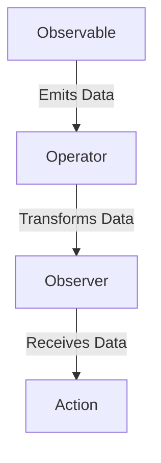

## 4.8 Reactive Programming in PHP

Reactive programming is a paradigm that focuses on asynchronous data streams and the propagation of change. It is particularly useful in scenarios where applications need to handle a large number of events or data streams efficiently. In this section, we will delve into the concepts of reactive programming in PHP, explore the use of RxPHP for reactive extensions, and demonstrate how to build event-driven and asynchronous applications.

### Introduction to Reactive Programming Concepts

Reactive programming is a programming paradigm oriented around data flows and the propagation of change. It allows developers to express static or dynamic data flows with ease, and automatically propagate changes through the data flow. This is particularly useful in applications that require real-time updates, such as stock trading platforms, live sports scores, or collaborative editing tools.

#### Key Concepts of Reactive Programming

1. **Observables**: These are data sources that emit data over time. Observables can be thought of as a stream of data that can be observed and reacted to.

2. **Observers**: These are entities that subscribe to observables to receive data. Observers react to the data emitted by observables.

3. **Operators**: These are functions that allow you to manipulate data streams. Operators can filter, transform, combine, and perform various operations on data streams.

4. **Schedulers**: These control the execution context of observables. Schedulers determine when and where the data streams are executed.

5. **Subscriptions**: These represent the execution of an observable. Subscriptions allow you to start and stop the flow of data.

### Using RxPHP for Reactive Extensions

RxPHP is a library that provides reactive extensions for PHP, enabling developers to work with asynchronous data streams. It is part of the ReactiveX family, which includes libraries for various programming languages.

#### Installing RxPHP

To get started with RxPHP, you need to install it via Composer. Run the following command in your terminal:

```bash
composer require reactive/rxphp
```

#### Creating Observables

Let's create a simple observable that emits a sequence of numbers:

```php
require 'vendor/autoload.php';

use Rx\Observable;

// Create an observable that emits numbers from 1 to 5
$observable = Observable::range(1, 5);

// Subscribe to the observable and print each emitted value
$observable->subscribe(function ($value) {
    echo "Received: $value\n";
});
```

In this example, we create an observable using `Observable::range()` that emits numbers from 1 to 5. We then subscribe to this observable and print each emitted value.

#### Using Operators

Operators are powerful tools in reactive programming that allow you to manipulate data streams. Let's use some common operators:

```php
use Rx\Observable;

// Create an observable that emits numbers from 1 to 10
$observable = Observable::range(1, 10);

// Use the filter operator to only allow even numbers
$filteredObservable = $observable->filter(function ($value) {
    return $value % 2 === 0;
});

// Subscribe and print each even number
$filteredObservable->subscribe(function ($value) {
    echo "Even number: $value\n";
});
```

In this example, we use the `filter` operator to only allow even numbers to pass through the observable. The `filter` operator takes a callback function that returns `true` for values that should be emitted.

#### Combining Observables

You can combine multiple observables using operators like `merge`, `concat`, and `zip`. Here's an example using `merge`:

```php
use Rx\Observable;

// Create two observables
$observable1 = Observable::of(1, 2, 3);
$observable2 = Observable::of(4, 5, 6);

// Merge the two observables
$mergedObservable = Observable::merge($observable1, $observable2);

// Subscribe and print each value
$mergedObservable->subscribe(function ($value) {
    echo "Merged value: $value\n";
});
```

The `merge` operator combines the emissions of multiple observables into a single observable.

### Building Event-Driven and Asynchronous Applications

Reactive programming is particularly well-suited for building event-driven and asynchronous applications. Let's explore how to use RxPHP to handle asynchronous events.

#### Asynchronous Data Streams

In reactive programming, data streams can be asynchronous, meaning they emit data over time rather than all at once. This is useful for handling events such as user input, network requests, or file I/O.

```php
use Rx\Observable;
use Rx\Scheduler\EventLoopScheduler;
use React\EventLoop\Factory;

// Create an event loop
$loop = Factory::create();

// Create an observable that emits values asynchronously
$observable = Observable::interval(1000, new EventLoopScheduler($loop))
    ->take(5);

// Subscribe and print each value
$observable->subscribe(function ($value) {
    echo "Async value: $value\n";
});

// Run the event loop
$loop->run();
```

In this example, we create an observable that emits values every second using `Observable::interval()`. We use an `EventLoopScheduler` to handle the asynchronous execution.

#### Handling User Input

Reactive programming can be used to handle user input in a responsive manner. Let's create an example that reacts to user input:

```php
use Rx\Observable;
use Rx\Scheduler\EventLoopScheduler;
use React\EventLoop\Factory;
use React\Stream\ReadableResourceStream;

// Create an event loop
$loop = Factory::create();

// Create a stream from STDIN
$stdin = new ReadableResourceStream(STDIN, $loop);

// Create an observable from the stream
$observable = Observable::fromEvent($stdin, 'data')
    ->map(function ($data) {
        return trim($data);
    });

// Subscribe and print each input
$observable->subscribe(function ($input) {
    echo "You typed: $input\n";
});

// Run the event loop
$loop->run();
```

In this example, we create an observable from a stream of user input using `Observable::fromEvent()`. We then map the input to remove any trailing whitespace and print it.

### Visualizing Reactive Programming Concepts

To better understand the flow of data in reactive programming, let's visualize the interaction between observables, observers, and operators.



**Diagram Description**: This diagram illustrates the flow of data in reactive programming. The observable emits data, which is transformed by an operator before being received by an observer. The observer then performs an action based on the received data.

### Key Takeaways

- **Reactive programming** is a powerful paradigm for handling asynchronous data streams and event-driven applications.
- **RxPHP** provides reactive extensions for PHP, enabling developers to work with observables, observers, and operators.
- **Operators** allow you to manipulate data streams, while **schedulers** control the execution context.
- Reactive programming is well-suited for applications that require real-time updates and responsiveness.

### Try It Yourself

Experiment with the code examples provided in this section. Try modifying the observables, using different operators, and combining multiple data streams. Explore the RxPHP documentation for more operators and advanced features.

### Further Reading

- [ReactiveX/RxPHP - Reactive extensions for PHP](https://github.com/ReactiveX/RxPHP)
- [Reactive Programming with RxPHP](https://reactivex.io/rxphp/)
- [Introduction to Reactive Programming](https://www.reactivemanifesto.org/)

## Quiz: Reactive Programming in PHP



### What is the primary focus of reactive programming?

- [x] Asynchronous data streams and propagation of change
- [ ] Synchronous data processing
- [ ] Object-oriented design
- [ ] Procedural programming

> **Explanation:** Reactive programming focuses on asynchronous data streams and the propagation of change, allowing for real-time updates and responsiveness.

### Which library provides reactive extensions for PHP?

- [x] RxPHP
- [ ] Laravel
- [ ] Symfony
- [ ] CodeIgniter

> **Explanation:** RxPHP is the library that provides reactive extensions for PHP, enabling developers to work with asynchronous data streams.

### What is an observable in reactive programming?

- [x] A data source that emits data over time
- [ ] A function that transforms data
- [ ] A class that handles user input
- [ ] A method for error handling

> **Explanation:** An observable is a data source that emits data over time, which can be observed and reacted to by observers.

### What is the purpose of operators in reactive programming?

- [x] To manipulate data streams
- [ ] To handle errors
- [ ] To manage user input
- [ ] To create classes

> **Explanation:** Operators are functions that allow you to manipulate data streams, such as filtering, transforming, and combining data.

### How can you create an observable that emits values asynchronously in RxPHP?

- [x] Use `Observable::interval()` with an `EventLoopScheduler`
- [ ] Use `Observable::range()`
- [ ] Use `Observable::of()`
- [ ] Use `Observable::fromArray()`

> **Explanation:** You can create an observable that emits values asynchronously using `Observable::interval()` with an `EventLoopScheduler`.

### What does the `filter` operator do in RxPHP?

- [x] Allows only certain values to pass through the observable
- [ ] Combines multiple observables
- [ ] Transforms data into a different format
- [ ] Handles errors in the data stream

> **Explanation:** The `filter` operator allows only certain values to pass through the observable based on a specified condition.

### Which of the following is NOT a key concept of reactive programming?

- [ ] Observables
- [ ] Observers
- [ ] Operators
- [x] Classes

> **Explanation:** Classes are not a key concept of reactive programming. The key concepts are observables, observers, operators, schedulers, and subscriptions.

### What is the role of schedulers in reactive programming?

- [x] To control the execution context of observables
- [ ] To filter data streams
- [ ] To handle user input
- [ ] To manage error handling

> **Explanation:** Schedulers control the execution context of observables, determining when and where the data streams are executed.

### True or False: Reactive programming is only useful for handling user input.

- [ ] True
- [x] False

> **Explanation:** False. Reactive programming is useful for handling various asynchronous events, not just user input, including network requests and file I/O.

### Which operator would you use to combine emissions from multiple observables?

- [x] `merge`
- [ ] `filter`
- [ ] `map`
- [ ] `reduce`

> **Explanation:** The `merge` operator is used to combine emissions from multiple observables into a single observable.



Remember, this is just the beginning. As you progress, you'll build more complex and interactive applications using reactive programming in PHP. Keep experimenting, stay curious, and enjoy the journey!
