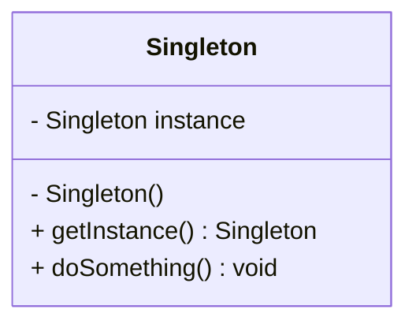
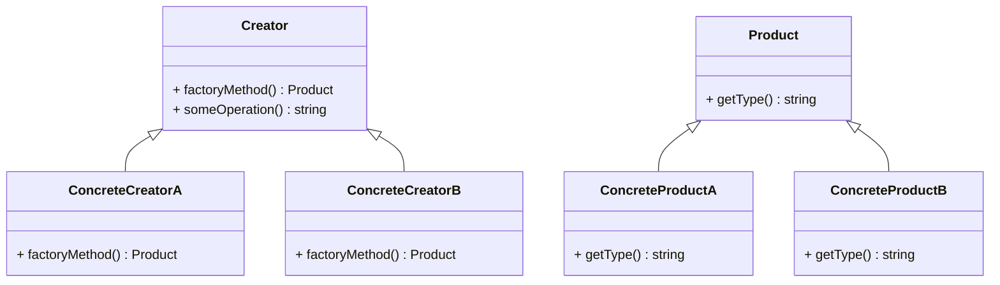
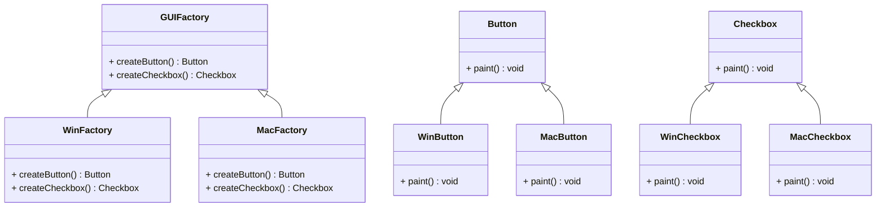

## 5.1 Adapting Creational Patterns to PHP

In the realm of software development, design patterns serve as time-tested solutions to common problems. Creational patterns, in particular, focus on the process of object creation, ensuring that your code is flexible, reusable, and maintainable. In this section, we will explore how PHP's unique features influence the adaptation of creational design patterns and guide you in selecting the appropriate pattern for your development needs.

### Overview of Creational Design Patterns

Creational design patterns abstract the instantiation process, making it more adaptable to change. They help manage the complexities of object creation, which can be particularly beneficial in large-scale applications. The primary creational patterns include:

- **Singleton**: Ensures a class has only one instance and provides a global point of access to it.
- **Factory Method**: Defines an interface for creating an object, but lets subclasses alter the type of objects that will be created.
- **Abstract Factory**: Provides an interface for creating families of related or dependent objects without specifying their concrete classes.
- **Builder**: Separates the construction of a complex object from its representation, allowing the same construction process to create different representations.
- **Prototype**: Creates new objects by copying an existing object, known as the prototype.

### How PHP's Features Influence Creational Patterns

PHP, as a dynamic and versatile language, offers several features that can influence how creational patterns are implemented. Let's explore some of these features:

#### 1. Dynamic Typing

PHP's dynamic typing allows for flexibility in object creation. Unlike statically typed languages, PHP does not require explicit type declarations, which can simplify the implementation of patterns like Factory Method and Abstract Factory. However, this flexibility requires careful management to avoid runtime errors.

#### 2. Late Static Binding

PHP's late static binding enables the use of static methods in a way that respects inheritance. This feature is particularly useful in implementing the Singleton pattern, where you might want to ensure that the correct subclass instance is returned.

#### 3. Anonymous Classes

Introduced in PHP 7, anonymous classes provide a way to create simple, one-off objects without the need for a full class declaration. This can be useful in scenarios where a full class definition is unnecessary, such as in certain Factory Method implementations.

#### 4. Traits

Traits in PHP allow for code reuse across classes without using inheritance. They can be used to implement shared behavior in creational patterns, such as common initialization logic in a Builder pattern.

#### 5. Namespaces and Autoloading

PHP's namespaces and autoloading capabilities facilitate the organization and management of classes, which is crucial when dealing with complex creational patterns like Abstract Factory.

### Selecting the Appropriate Creational Pattern for a Problem

Choosing the right creational pattern depends on the specific requirements and constraints of your project. Here are some guidelines to help you make an informed decision:

- **Use Singleton** when you need to ensure that a class has only one instance and provide a global point of access to it. This is common in scenarios like logging, configuration management, or database connections.

- **Opt for Factory Method** when you need to delegate the instantiation of objects to subclasses. This pattern is useful when the exact type of object to be created is determined by subclasses.

- **Choose Abstract Factory** when you need to create families of related or dependent objects without specifying their concrete classes. This pattern is ideal for systems that need to be independent of how their objects are created.

- **Implement Builder** when you need to construct complex objects step by step. This pattern is beneficial when an object requires numerous configurations or when you want to isolate the construction code from the representation.

- **Apply Prototype** when you need to create new objects by copying existing ones. This pattern is useful when the cost of creating a new instance of an object is more expensive than copying an existing one.

### Code Examples

Let's delve into some code examples to illustrate how these patterns can be adapted to PHP.

#### Singleton Pattern

The Singleton pattern ensures that a class has only one instance and provides a global point of access to it. Here's how you can implement it in PHP:

```php
<?php

class Singleton {
    private static $instance = null;

    // Private constructor to prevent direct instantiation
    private function __construct() {}

    // Method to get the single instance of the class
    public static function getInstance() {
        if (self::$instance === null) {
            self::$instance = new Singleton();
        }
        return self::$instance;
    }

    public function doSomething() {
        echo "Singleton instance doing something.";
    }
}

// Usage
$singleton = Singleton::getInstance();
$singleton->doSomething();
```

**Key Points:**
- The constructor is private to prevent direct instantiation.
- A static method `getInstance()` is used to access the single instance.
- The instance is created only once and reused thereafter.

#### Factory Method Pattern

The Factory Method pattern defines an interface for creating an object but lets subclasses decide which class to instantiate. Here's an example in PHP:

```php
<?php

abstract class Product {
    abstract public function getType();
}

class ConcreteProductA extends Product {
    public function getType() {
        return "Product A";
    }
}

class ConcreteProductB extends Product {
    public function getType() {
        return "Product B";
    }
}

abstract class Creator {
    abstract public function factoryMethod(): Product;

    public function someOperation() {
        $product = $this->factoryMethod();
        return "Creator: The same creator's code has just worked with " . $product->getType();
    }
}

class ConcreteCreatorA extends Creator {
    public function factoryMethod(): Product {
        return new ConcreteProductA();
    }
}

class ConcreteCreatorB extends Creator {
    public function factoryMethod(): Product {
        return new ConcreteProductB();
    }
}

// Usage
$creatorA = new ConcreteCreatorA();
echo $creatorA->someOperation();

$creatorB = new ConcreteCreatorB();
echo $creatorB->someOperation();
```

**Key Points:**
- The `Creator` class declares the factory method that returns an object of type `Product`.
- Subclasses `ConcreteCreatorA` and `ConcreteCreatorB` implement the factory method to return specific product instances.

#### Abstract Factory Pattern

The Abstract Factory pattern provides an interface for creating families of related or dependent objects without specifying their concrete classes. Here's an example in PHP:

```php
<?php

interface GUIFactory {
    public function createButton(): Button;
    public function createCheckbox(): Checkbox;
}

class WinFactory implements GUIFactory {
    public function createButton(): Button {
        return new WinButton();
    }

    public function createCheckbox(): Checkbox {
        return new WinCheckbox();
    }
}

class MacFactory implements GUIFactory {
    public function createButton(): Button {
        return new MacButton();
    }

    public function createCheckbox(): Checkbox {
        return new MacCheckbox();
    }
}

interface Button {
    public function paint();
}

class WinButton implements Button {
    public function paint() {
        echo "Rendering a button in a Windows style.";
    }
}

class MacButton implements Button {
    public function paint() {
        echo "Rendering a button in a MacOS style.";
    }
}

interface Checkbox {
    public function paint();
}

class WinCheckbox implements Checkbox {
    public function paint() {
        echo "Rendering a checkbox in a Windows style.";
    }
}

class MacCheckbox implements Checkbox {
    public function paint() {
        echo "Rendering a checkbox in a MacOS style.";
    }
}

// Usage
function clientCode(GUIFactory $factory) {
    $button = $factory->createButton();
    $checkbox = $factory->createCheckbox();
    $button->paint();
    $checkbox->paint();
}

clientCode(new WinFactory());
clientCode(new MacFactory());
```

**Key Points:**
- `GUIFactory` is the abstract factory interface that declares methods for creating abstract products.
- `WinFactory` and `MacFactory` are concrete factories that implement the abstract factory interface.
- Each factory creates a set of related products (`Button` and `Checkbox`).

#### Builder Pattern

The Builder pattern separates the construction of a complex object from its representation. Here's how you can implement it in PHP:

```php
<?php

class Product {
    private $parts = [];

    public function add($part) {
        $this->parts[] = $part;
    }

    public function show() {
        echo "Product parts: " . implode(', ', $this->parts) . "\n";
    }
}

interface Builder {
    public function buildPartA();
    public function buildPartB();
    public function getResult(): Product;
}

class ConcreteBuilder implements Builder {
    private $product;

    public function __construct() {
        $this->product = new Product();
    }

    public function buildPartA() {
        $this->product->add("Part A");
    }

    public function buildPartB() {
        $this->product->add("Part B");
    }

    public function getResult(): Product {
        return $this->product;
    }
}

class Director {
    private $builder;

    public function setBuilder(Builder $builder) {
        $this->builder = $builder;
    }

    public function construct() {
        $this->builder->buildPartA();
        $this->builder->buildPartB();
    }
}

// Usage
$builder = new ConcreteBuilder();
$director = new Director();
$director->setBuilder($builder);
$director->construct();
$product = $builder->getResult();
$product->show();
```

**Key Points:**
- The `Builder` interface defines methods for creating parts of a `Product`.
- `ConcreteBuilder` implements the `Builder` interface and constructs the product.
- `Director` controls the construction process using a builder object.

#### Prototype Pattern

The Prototype pattern creates new objects by copying an existing object, known as the prototype. Here's an example in PHP:

```php
<?php

class Prototype {
    private $property;

    public function __construct($property) {
        $this->property = $property;
    }

    public function __clone() {
        // Perform deep copy if necessary
    }

    public function getProperty() {
        return $this->property;
    }
}

// Usage
$prototype = new Prototype("Original");
$clone = clone $prototype;
echo $clone->getProperty();
```

**Key Points:**
- The `Prototype` class implements the `__clone()` method to allow cloning.
- Cloning creates a new instance with the same properties as the original.

### Visualizing Creational Patterns in PHP

To better understand the relationships and workflows of these patterns, let's visualize them using Mermaid.js diagrams.

#### Singleton Pattern Diagram



**Description:** This diagram illustrates the Singleton pattern, showing the private constructor and the static `getInstance()` method that returns the single instance.

#### Factory Method Pattern Diagram



**Description:** This diagram represents the Factory Method pattern, highlighting the relationship between the creator classes and the product classes.

#### Abstract Factory Pattern Diagram



**Description:** This diagram illustrates the Abstract Factory pattern, showing the relationships between factories and their products.

### Design Considerations

When adapting creational patterns to PHP, consider the following:

- **Performance**: Some patterns, like Singleton, can introduce performance bottlenecks if not implemented correctly. Ensure that your implementation is efficient and does not create unnecessary overhead.

- **Flexibility**: PHP's dynamic nature allows for flexible implementations, but this can also lead to errors if not managed carefully. Use type hinting and strict mode to mitigate potential issues.

- **Maintainability**: Choose patterns that enhance the maintainability of your code. Patterns like Builder and Abstract Factory can help isolate changes and reduce dependencies.

### PHP Unique Features

PHP offers several unique features that can enhance the implementation of creational patterns:

- **Dynamic Typing**: Allows for flexible object creation without strict type constraints.
- **Late Static Binding**: Facilitates the use of static methods in inheritance hierarchies.
- **Anonymous Classes**: Enable quick and simple object creation without full class declarations.
- **Traits**: Provide a mechanism for code reuse across classes without inheritance.

### Differences and Similarities

Creational patterns often share similarities, which can lead to confusion. Here's a quick comparison:

- **Singleton vs. Multiton**: Both ensure controlled instance creation, but Singleton restricts to one instance, while Multiton allows multiple named instances.
- **Factory Method vs. Abstract Factory**: Factory Method delegates object creation to subclasses, while Abstract Factory creates families of related objects.
- **Builder vs. Prototype**: Builder constructs complex objects step by step, while Prototype creates new objects by copying existing ones.

### Try It Yourself

To deepen your understanding, try modifying the provided code examples:

- **Singleton**: Add a method to reset the instance and test its behavior.
- **Factory Method**: Create additional product types and corresponding creators.
- **Abstract Factory**: Implement a new factory for a different operating system.
- **Builder**: Add more parts to the product and modify the construction process.
- **Prototype**: Implement deep cloning for complex objects.

### Knowledge Check

- **What is the primary purpose of creational design patterns?**
- **How does PHP's dynamic typing influence the implementation of creational patterns?**
- **What is the difference between Factory Method and Abstract Factory patterns?**
- **How can traits be used in the implementation of creational patterns?**

### Embrace the Journey

Remember, mastering design patterns is a journey. As you continue to explore and implement these patterns, you'll gain a deeper understanding of their nuances and applications. Keep experimenting, stay curious, and enjoy the process of becoming a more proficient PHP developer!

## Quiz: Adapting Creational Patterns to PHP



### What is the primary purpose of creational design patterns?

- [x] To manage object creation processes
- [ ] To define object behavior
- [ ] To structure object relationships
- [ ] To handle object destruction

> **Explanation:** Creational design patterns focus on managing the process of object creation to ensure flexibility and reuse.

### How does PHP's dynamic typing influence creational patterns?

- [x] It allows for flexible object creation
- [ ] It enforces strict type constraints
- [ ] It simplifies inheritance hierarchies
- [ ] It restricts object cloning

> **Explanation:** PHP's dynamic typing allows for flexible object creation without strict type constraints, which can simplify the implementation of creational patterns.

### What is the difference between Factory Method and Abstract Factory patterns?

- [x] Factory Method delegates object creation to subclasses; Abstract Factory creates families of related objects
- [ ] Factory Method creates families of related objects; Abstract Factory delegates object creation to subclasses
- [ ] Both patterns are identical in purpose and implementation
- [ ] Factory Method is used for object destruction; Abstract Factory is used for object creation

> **Explanation:** Factory Method delegates object creation to subclasses, while Abstract Factory creates families of related objects without specifying their concrete classes.

### How can traits be used in the implementation of creational patterns?

- [x] To implement shared behavior across classes
- [ ] To enforce strict type constraints
- [ ] To create anonymous classes
- [ ] To manage object destruction

> **Explanation:** Traits in PHP allow for code reuse across classes, which can be used to implement shared behavior in creational patterns.

### Which PHP feature is particularly useful for implementing the Singleton pattern?

- [x] Late Static Binding
- [ ] Anonymous Classes
- [ ] Dynamic Typing
- [ ] Traits

> **Explanation:** Late Static Binding in PHP is useful for implementing the Singleton pattern, as it allows static methods to respect inheritance.

### What is a key benefit of using the Builder pattern?

- [x] It separates the construction of a complex object from its representation
- [ ] It ensures a class has only one instance
- [ ] It creates new objects by copying existing ones
- [ ] It defines an interface for creating an object

> **Explanation:** The Builder pattern separates the construction of a complex object from its representation, allowing for different configurations.

### In the Prototype pattern, how are new objects created?

- [x] By copying an existing object
- [ ] By using a factory method
- [ ] By constructing them step by step
- [ ] By using a singleton instance

> **Explanation:** The Prototype pattern creates new objects by copying an existing object, known as the prototype.

### What is a common use case for the Singleton pattern?

- [x] Managing database connections
- [ ] Creating families of related objects
- [ ] Constructing complex objects
- [ ] Cloning existing objects

> **Explanation:** A common use case for the Singleton pattern is managing database connections, where a single instance is needed.

### Which pattern would you use to create a set of related objects?

- [x] Abstract Factory
- [ ] Singleton
- [ ] Prototype
- [ ] Builder

> **Explanation:** The Abstract Factory pattern is used to create families of related or dependent objects without specifying their concrete classes.

### True or False: The Factory Method pattern is used to create a single instance of a class.

- [ ] True
- [x] False

> **Explanation:** False. The Factory Method pattern defines an interface for creating an object, but lets subclasses decide which class to instantiate, rather than creating a single instance.



Remember, this is just the beginning. As you progress, you'll build more complex and interactive applications using these patterns. Keep experimenting, stay curious, and enjoy the journey!
