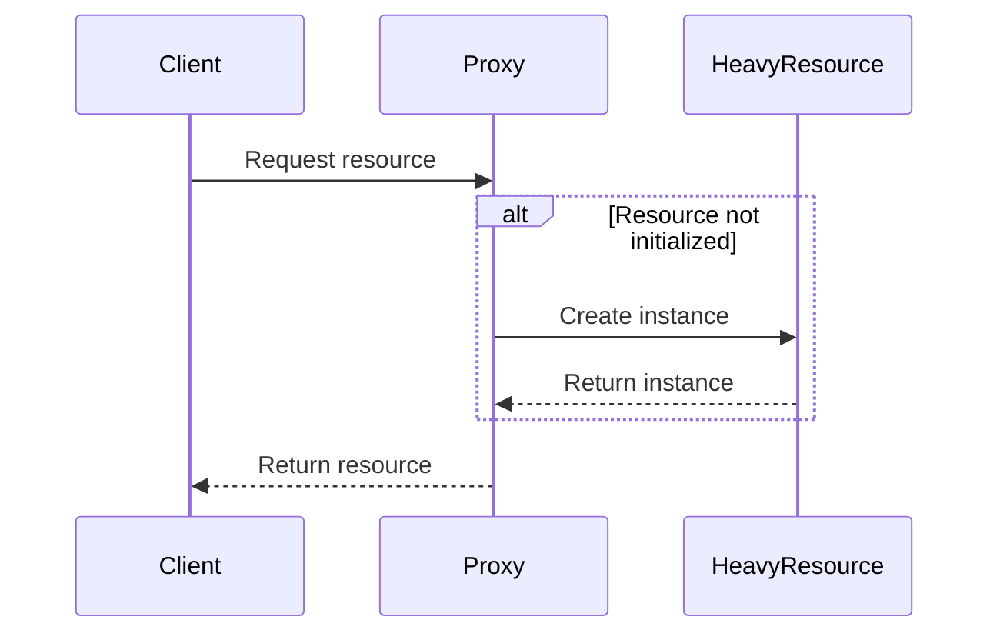

## 5.10 Lazy Initialization

In the realm of software design patterns, Lazy Initialization is a creational pattern that focuses on delaying the creation of an object, the calculation of a value, or some other expensive process until the first time it is needed. This approach can significantly enhance the performance of an application by avoiding unnecessary resource consumption and improving startup times.

### Intent

The primary intent of Lazy Initialization is to optimize resource usage by deferring the creation of objects or the execution of resource-intensive operations until they are actually required. This can be particularly beneficial in scenarios where the initialization of an object is costly in terms of time or memory, and the object may not be used immediately or at all.

### Key Participants

- **Client**: The entity that requires the object or resource.
- **Lazy Initializer**: The mechanism that defers the creation or initialization of the object.
- **Actual Object**: The object whose creation is deferred.

### Applicability

Lazy Initialization is applicable in scenarios where:

- The initialization of an object is resource-intensive.
- The object may not be used in every execution path.
- You want to improve application startup time by deferring resource allocation.

### Implementing Lazy Initialization in PHP

In PHP, Lazy Initialization can be implemented using various techniques, including proxies, null objects, and closures. Let's explore these methods in detail.

#### Using Proxies

A proxy is an object that acts as a surrogate or placeholder for another object. It controls access to the actual object, deferring its creation until it is needed.

```php
<?php

interface HeavyResourceInterface {
    public function load();
}

class HeavyResource implements HeavyResourceInterface {
    public function __construct() {
        // Simulate a heavy initialization process
        echo "Initializing heavy resource...\n";
    }

    public function load() {
        echo "Heavy resource loaded.\n";
    }
}

class HeavyResourceProxy implements HeavyResourceInterface {
    private $heavyResource = null;

    public function load() {
        if ($this->heavyResource === null) {
            $this->heavyResource = new HeavyResource();
        }
        $this->heavyResource->load();
    }
}

// Client code
$resource = new HeavyResourceProxy();
echo "Proxy created.\n";
$resource->load(); // Heavy resource initialized and loaded here
```

In this example, the `HeavyResourceProxy` class acts as a proxy for the `HeavyResource` class. The actual `HeavyResource` object is only created when the `load` method is called for the first time.

#### Using Null Objects

A null object is a special case of a proxy that represents a non-existent object. It can be used to defer the creation of an object until it is actually needed.

```php
<?php

class NullResource implements HeavyResourceInterface {
    public function load() {
        echo "Null resource: nothing to load.\n";
    }
}

class ResourceManager {
    private $resource;

    public function __construct(HeavyResourceInterface $resource) {
        $this->resource = $resource;
    }

    public function loadResource() {
        $this->resource->load();
    }
}

// Client code
$nullResource = new NullResource();
$manager = new ResourceManager($nullResource);
$manager->loadResource(); // Outputs: Null resource: nothing to load.
```

In this example, the `NullResource` class implements the `HeavyResourceInterface` but does not perform any actual loading. This allows the `ResourceManager` to operate without needing to know whether the resource is real or null.

#### Using Closures

Closures in PHP can also be used to implement Lazy Initialization by deferring the execution of a function until it is called.

```php
<?php

class LazyLoader {
    private $initializer;
    private $resource = null;

    public function __construct(callable $initializer) {
        $this->initializer = $initializer;
    }

    public function getResource() {
        if ($this->resource === null) {
            $this->resource = ($this->initializer)();
        }
        return $this->resource;
    }
}

// Client code
$loader = new LazyLoader(function() {
    echo "Creating resource...\n";
    return new HeavyResource();
});

echo "Loader created.\n";
$resource = $loader->getResource(); // Outputs: Creating resource...
$resource->load(); // Outputs: Heavy resource loaded.
```

Here, the `LazyLoader` class uses a closure to defer the creation of the `HeavyResource` object until the `getResource` method is called.

### Managing Resource-Intensive Operations

Lazy Initialization is particularly useful for managing resource-intensive operations such as:

- **Database Connections**: Establishing a database connection can be deferred until the first query is executed.
- **File Loading**: Large files can be loaded on demand rather than at application startup.
- **Complex Calculations**: Expensive calculations can be postponed until their results are needed.

### Use Cases and Examples

#### Loading Heavy Resources

Consider an application that needs to load a large configuration file. Using Lazy Initialization, the file can be loaded only when its contents are needed.

```php
<?php

class ConfigLoader {
    private $config = null;

    public function getConfig() {
        if ($this->config === null) {
            echo "Loading configuration file...\n";
            $this->config = parse_ini_file('config.ini');
        }
        return $this->config;
    }
}

// Client code
$loader = new ConfigLoader();
$config = $loader->getConfig(); // Outputs: Loading configuration file...
```

#### Improving Application Startup Time

By deferring the initialization of non-essential components, Lazy Initialization can significantly reduce application startup time, leading to a more responsive user experience.

### Design Considerations

When implementing Lazy Initialization, consider the following:

- **Thread Safety**: In a multi-threaded environment, ensure that the initialization process is thread-safe to avoid race conditions.
- **Memory Usage**: While Lazy Initialization can reduce initial memory usage, it may increase memory consumption if many objects are initialized simultaneously.
- **Complexity**: Introducing Lazy Initialization can add complexity to the codebase, so it should be used judiciously.

### PHP Unique Features

PHP's support for closures and dynamic typing makes it particularly well-suited for implementing Lazy Initialization. The ability to use anonymous functions and lambda expressions allows for flexible and concise lazy loading mechanisms.

### Differences and Similarities

Lazy Initialization is often confused with the Singleton pattern, as both involve controlling the instantiation of objects. However, Lazy Initialization focuses on deferring creation, while Singleton ensures a single instance. They can be used together, but they serve different purposes.

### Visualizing Lazy Initialization

To better understand Lazy Initialization, let's visualize the process using a sequence diagram.



In this diagram, the client requests a resource from the proxy. If the resource is not yet initialized, the proxy creates it and returns it to the client.

### Try It Yourself

Experiment with the provided code examples by modifying them to suit different scenarios. For instance, try implementing Lazy Initialization for a database connection or a file loader. Observe how deferring initialization affects performance and resource usage.

### Knowledge Check

- What is the primary benefit of using Lazy Initialization?
- How does Lazy Initialization differ from the Singleton pattern?
- What are some common use cases for Lazy Initialization in PHP?

### Embrace the Journey

Remember, Lazy Initialization is just one of many design patterns that can enhance your PHP applications. As you continue to explore and experiment with different patterns, you'll gain a deeper understanding of how to build efficient, maintainable, and scalable software. Keep experimenting, stay curious, and enjoy the journey!

## Quiz: Lazy Initialization



### What is the main purpose of Lazy Initialization?

- [x] To delay the creation of an object until it is needed
- [ ] To ensure only one instance of an object exists
- [ ] To preload all resources at application startup
- [ ] To simplify code by removing initialization logic

> **Explanation:** Lazy Initialization is used to defer the creation of an object until it is actually needed, optimizing resource usage.

### Which of the following is a common technique for implementing Lazy Initialization in PHP?

- [x] Using proxies
- [ ] Using factories
- [ ] Using decorators
- [ ] Using adapters

> **Explanation:** Proxies are commonly used to implement Lazy Initialization by acting as placeholders for actual objects.

### What is a potential drawback of Lazy Initialization?

- [x] Increased complexity in the codebase
- [ ] Reduced memory usage
- [ ] Faster application startup time
- [ ] Simplified object creation

> **Explanation:** Lazy Initialization can add complexity to the codebase, as it involves additional logic to defer object creation.

### How does Lazy Initialization improve application performance?

- [x] By deferring resource-intensive operations until needed
- [ ] By preloading all resources at startup
- [ ] By reducing the number of objects created
- [ ] By simplifying the code structure

> **Explanation:** Lazy Initialization improves performance by deferring resource-intensive operations, reducing initial resource consumption.

### In which scenario is Lazy Initialization most beneficial?

- [x] When initializing a resource is costly and may not be used
- [ ] When a resource is needed immediately at startup
- [ ] When a resource is lightweight and frequently used
- [ ] When a resource is shared across multiple instances

> **Explanation:** Lazy Initialization is beneficial when a resource is costly to initialize and may not be used in every execution path.

### What is a null object in the context of Lazy Initialization?

- [x] An object that represents a non-existent or default state
- [ ] An object that is always initialized
- [ ] An object that is shared across multiple clients
- [ ] An object that preloads resources

> **Explanation:** A null object is a placeholder that represents a non-existent or default state, used to defer actual object creation.

### Which PHP feature is particularly useful for implementing Lazy Initialization?

- [x] Closures
- [ ] Traits
- [ ] Interfaces
- [ ] Namespaces

> **Explanation:** Closures in PHP allow for flexible and concise lazy loading mechanisms, making them useful for Lazy Initialization.

### How does Lazy Initialization differ from the Singleton pattern?

- [x] Lazy Initialization defers creation, Singleton ensures a single instance
- [ ] Lazy Initialization ensures a single instance, Singleton defers creation
- [ ] Both patterns serve the same purpose
- [ ] Lazy Initialization is a type of Singleton pattern

> **Explanation:** Lazy Initialization focuses on deferring creation, while Singleton ensures a single instance of an object.

### What is a key consideration when implementing Lazy Initialization in a multi-threaded environment?

- [x] Ensuring thread safety during initialization
- [ ] Reducing memory usage
- [ ] Simplifying object creation
- [ ] Preloading resources at startup

> **Explanation:** In a multi-threaded environment, it is important to ensure thread safety during the initialization process to avoid race conditions.

### True or False: Lazy Initialization can help reduce application startup time.

- [x] True
- [ ] False

> **Explanation:** Lazy Initialization can reduce application startup time by deferring the initialization of non-essential components.


