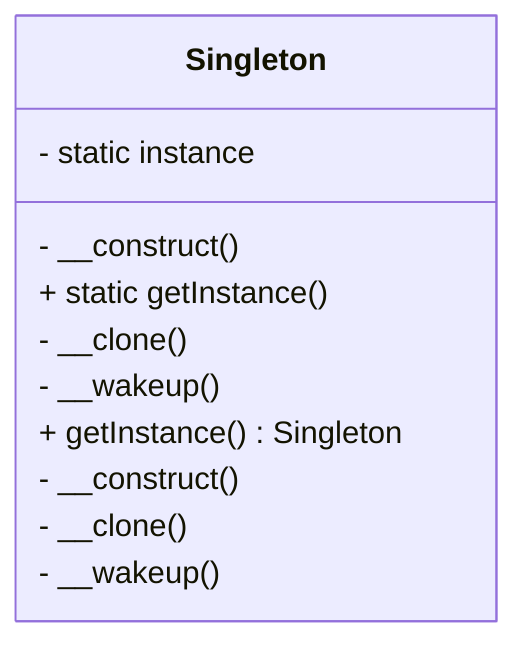

## 5.2 Singleton Pattern

The Singleton Pattern is a creational design pattern that ensures a class has only one instance and provides a global point of access to it. This pattern is particularly useful when exactly one object is needed to coordinate actions across the system. In this section, we will explore the Singleton Pattern in PHP, understand its implementation, and discuss its use cases and best practices.

### Intent

The primary intent of the Singleton Pattern is to restrict the instantiation of a class to a single object. This is useful in scenarios where having multiple instances of a class would lead to inconsistent behavior or resource conflicts.

### Key Participants

- **Singleton Class**: The class that is responsible for creating and managing its single instance.
- **Static Instance Property**: A static property that holds the single instance of the class.
- **Private Constructor**: A private constructor prevents the direct instantiation of the class from outside.
- **Static Method**: A static method that provides access to the single instance of the class.

### Implementing the Singleton Pattern in PHP

To implement the Singleton Pattern in PHP, we need to ensure that the class cannot be instantiated from outside and that it provides a static method to access the single instance. Let's break down the implementation step by step.

#### Step 1: Define the Singleton Class

```php
<?php

class Singleton {
    // Static property to hold the single instance
    private static $instance = null;

    // Private constructor to prevent direct instantiation
    private function __construct() {
        // Initialization code here
    }

    // Method to provide access to the single instance
    public static function getInstance() {
        if (self::$instance === null) {
            self::$instance = new Singleton();
        }
        return self::$instance;
    }

    // Prevent cloning of the instance
    private function __clone() {}

    // Prevent unserialization of the instance
    private function __wakeup() {}
}

?>
```

#### Explanation

- **Static Instance Property**: The `$instance` property is static, meaning it belongs to the class itself rather than any instance. It holds the single instance of the class.
- **Private Constructor**: The constructor is private, preventing the class from being instantiated from outside.
- **getInstance Method**: This static method checks if the instance already exists. If not, it creates a new instance and returns it.
- **Prevent Cloning and Unserialization**: The `__clone` and `__wakeup` methods are private to prevent cloning and unserialization, which could create additional instances.

### Thread-Safe Singleton Considerations

In a multi-threaded environment, the Singleton Pattern can face issues if multiple threads try to create an instance simultaneously. To make the Singleton Pattern thread-safe, we can use locking mechanisms.

#### Thread-Safe Singleton Implementation

```php
<?php

class ThreadSafeSingleton {
    private static $instance = null;
    private static $lock = false;

    private function __construct() {}

    public static function getInstance() {
        if (self::$instance === null) {
            if (!self::$lock) {
                self::$lock = true;
                self::$instance = new ThreadSafeSingleton();
                self::$lock = false;
            }
        }
        return self::$instance;
    }

    private function __clone() {}
    private function __wakeup() {}
}

?>
```

#### Explanation

- **Locking Mechanism**: A simple boolean lock is used to prevent multiple threads from creating an instance simultaneously. This is a basic approach and may not be sufficient for all environments. More advanced locking mechanisms, such as mutexes, may be required for robust thread safety.

### Use Cases and Examples

The Singleton Pattern is commonly used in scenarios where a single point of access is required for a shared resource. Here are some typical use cases:

#### Managing Configuration Settings

In many applications, configuration settings are stored in a file or database. The Singleton Pattern can be used to load these settings once and provide a global point of access.

```php
<?php

class Config {
    private static $instance = null;
    private $settings = [];

    private function __construct() {
        // Load configuration settings
        $this->settings = parse_ini_file('config.ini');
    }

    public static function getInstance() {
        if (self::$instance === null) {
            self::$instance = new Config();
        }
        return self::$instance;
    }

    public function get($key) {
        return $this->settings[$key] ?? null;
    }
}

$config = Config::getInstance();
echo $config->get('database_host');

?>
```

#### Accessing Shared Resources

Singletons can be used to manage connections to shared resources, such as databases or file systems, ensuring that only one connection is open at any time.

```php
<?php

class DatabaseConnection {
    private static $instance = null;
    private $connection;

    private function __construct() {
        // Establish database connection
        $this->connection = new PDO('mysql:host=localhost;dbname=test', 'user', 'password');
    }

    public static function getInstance() {
        if (self::$instance === null) {
            self::$instance = new DatabaseConnection();
        }
        return self::$instance;
    }

    public function getConnection() {
        return $this->connection;
    }
}

$db = DatabaseConnection::getInstance();
$conn = $db->getConnection();

?>
```

### Design Considerations

- **When to Use**: The Singleton Pattern is ideal when a single instance of a class is needed to coordinate actions across the system. However, it should be used judiciously, as it can introduce global state into an application, making it harder to test and maintain.
- **Pitfalls**: Overuse of the Singleton Pattern can lead to tight coupling and difficulty in testing. Consider using dependency injection to manage shared resources instead.

### PHP Unique Features

PHP's unique features, such as its simple syntax for static properties and methods, make implementing the Singleton Pattern straightforward. However, PHP does not natively support multi-threading, so thread safety is less of a concern unless using extensions or frameworks that introduce concurrency.

### Differences and Similarities

The Singleton Pattern is often confused with the Factory Method Pattern, as both involve controlling the instantiation of objects. However, the Singleton Pattern ensures a single instance, while the Factory Method Pattern allows for multiple instances with controlled creation logic.

### Visualizing the Singleton Pattern

To better understand the Singleton Pattern, let's visualize the process of accessing the single instance.



### Try It Yourself

Experiment with the Singleton Pattern by modifying the code examples. Try adding additional methods to the Singleton class or implementing a thread-safe Singleton using different locking mechanisms. Consider how the pattern might be applied in your own projects.

### Knowledge Check

- What is the primary purpose of the Singleton Pattern?
- How does the Singleton Pattern ensure only one instance of a class is created?
- What are some common use cases for the Singleton Pattern?
- How can you make a Singleton thread-safe in PHP?
- What are some potential pitfalls of using the Singleton Pattern?

### Embrace the Journey

Remember, mastering design patterns like the Singleton Pattern is just the beginning of your journey in PHP development. As you progress, you'll encounter more complex patterns and scenarios. Keep experimenting, stay curious, and enjoy the journey!

## Quiz: Singleton Pattern



### What is the primary purpose of the Singleton Pattern?

- [x] To ensure a class has only one instance globally
- [ ] To create multiple instances of a class
- [ ] To provide a template for creating objects
- [ ] To encapsulate a group of individual factories

> **Explanation:** The Singleton Pattern ensures that a class has only one instance and provides a global point of access to it.

### How does the Singleton Pattern prevent multiple instances?

- [x] By using a private constructor and a static method
- [ ] By using a public constructor
- [ ] By using multiple static methods
- [ ] By using a protected constructor

> **Explanation:** The Singleton Pattern uses a private constructor to prevent direct instantiation and a static method to provide access to the single instance.

### Which method is used to access the Singleton instance?

- [x] getInstance()
- [ ] createInstance()
- [ ] newInstance()
- [ ] accessInstance()

> **Explanation:** The `getInstance()` method is commonly used to access the Singleton instance.

### What is a common use case for the Singleton Pattern?

- [x] Managing configuration settings
- [ ] Creating multiple database connections
- [ ] Implementing a user interface
- [ ] Handling multiple threads

> **Explanation:** The Singleton Pattern is often used to manage configuration settings, ensuring a single point of access.

### How can you make a Singleton thread-safe in PHP?

- [x] By using a locking mechanism
- [ ] By using multiple static properties
- [ ] By using a public constructor
- [ ] By using multiple instances

> **Explanation:** A locking mechanism can be used to make a Singleton thread-safe, preventing multiple threads from creating an instance simultaneously.

### What is a potential pitfall of using the Singleton Pattern?

- [x] It can introduce global state
- [ ] It allows multiple instances
- [ ] It simplifies testing
- [ ] It increases coupling

> **Explanation:** The Singleton Pattern can introduce global state, making it harder to test and maintain.

### What is the difference between Singleton and Factory Method Patterns?

- [x] Singleton ensures a single instance, while Factory Method allows multiple instances
- [ ] Singleton creates multiple instances, while Factory Method ensures a single instance
- [ ] Both patterns ensure a single instance
- [ ] Both patterns create multiple instances

> **Explanation:** The Singleton Pattern ensures a single instance, while the Factory Method Pattern allows for multiple instances with controlled creation logic.

### What is the role of the static property in a Singleton?

- [x] To hold the single instance of the class
- [ ] To create multiple instances
- [ ] To provide a template for objects
- [ ] To encapsulate methods

> **Explanation:** The static property holds the single instance of the class, ensuring that only one instance exists.

### Why is the constructor private in a Singleton?

- [x] To prevent direct instantiation from outside
- [ ] To allow multiple instances
- [ ] To simplify object creation
- [ ] To provide a template for objects

> **Explanation:** The constructor is private to prevent direct instantiation from outside, ensuring that the Singleton Pattern controls the creation of the instance.

### True or False: PHP natively supports multi-threading, making thread-safe Singletons unnecessary.

- [ ] True
- [x] False

> **Explanation:** PHP does not natively support multi-threading, but thread-safe Singletons may still be necessary when using extensions or frameworks that introduce concurrency.


