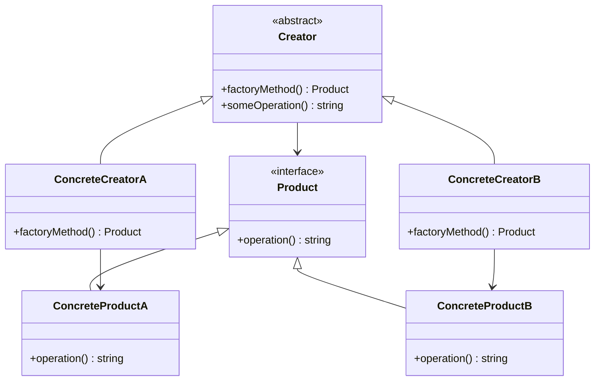

## 5.3 Factory Method Pattern

The Factory Method Pattern is a creational design pattern that provides an interface for creating objects in a superclass but allows subclasses to alter the type of objects that will be created. This pattern is particularly useful when the exact types and dependencies of the objects are not known until runtime.

### Intent

The primary intent of the Factory Method Pattern is to define an interface for creating an object, but let subclasses decide which class to instantiate. It lets a class defer instantiation to subclasses.

### Key Participants

1. **Product**: Defines the interface for objects the factory method creates.
2. **ConcreteProduct**: Implements the Product interface.
3. **Creator**: Declares the factory method, which returns an object of type Product. Creator may also define a default implementation of the factory method that returns a default ConcreteProduct object.
4. **ConcreteCreator**: Overrides the factory method to return an instance of a ConcreteProduct.

### Applicability

Use the Factory Method Pattern when:
- A class cannot anticipate the class of objects it must create.
- A class wants its subclasses to specify the objects it creates.
- Classes delegate responsibility to one of several helper subclasses, and you want to localize the knowledge of which helper subclass is the delegate.

### Implementing Factory Method in PHP

Let's dive into how we can implement the Factory Method Pattern in PHP. We'll start by creating abstract creator classes and then subclass them to create concrete products.

#### Creating Abstract Creator Classes

The abstract creator class will declare the factory method that returns an object of type Product. Here's a simple example:

```php
<?php

// Product interface
interface Product {
    public function operation(): string;
}

// ConcreteProductA
class ConcreteProductA implements Product {
    public function operation(): string {
        return "Result of ConcreteProductA";
    }
}

// ConcreteProductB
class ConcreteProductB implements Product {
    public function operation(): string {
        return "Result of ConcreteProductB";
    }
}

// Creator abstract class
abstract class Creator {
    // The factory method
    abstract public function factoryMethod(): Product;

    // An operation that uses the product
    public function someOperation(): string {
        $product = $this->factoryMethod();
        return "Creator: The same creator's code has just worked with " . $product->operation();
    }
}
```

#### Subclassing to Create Concrete Products

Now, let's create concrete creator classes that override the factory method to return different types of products:

```php
<?php

// ConcreteCreatorA
class ConcreteCreatorA extends Creator {
    public function factoryMethod(): Product {
        return new ConcreteProductA();
    }
}

// ConcreteCreatorB
class ConcreteCreatorB extends Creator {
    public function factoryMethod(): Product {
        return new ConcreteProductB();
    }
}

// Client code
function clientCode(Creator $creator) {
    echo "Client: I'm not aware of the creator's class, but it still works.\n"
        . $creator->someOperation();
}

echo "App: Launched with the ConcreteCreatorA.\n";
clientCode(new ConcreteCreatorA());
echo "\n\n";

echo "App: Launched with the ConcreteCreatorB.\n";
clientCode(new ConcreteCreatorB());
```

### Extending Factories Without Modifying Existing Code

One of the significant advantages of the Factory Method Pattern is that it allows you to introduce new types of products into your application without breaking existing client code. You can extend the factory by adding new concrete creator classes.

#### Example: Adding a New Product

Suppose we want to add a new product type, `ConcreteProductC`. We can do this by creating a new concrete creator class:

```php
<?php

// ConcreteProductC
class ConcreteProductC implements Product {
    public function operation(): string {
        return "Result of ConcreteProductC";
    }
}

// ConcreteCreatorC
class ConcreteCreatorC extends Creator {
    public function factoryMethod(): Product {
        return new ConcreteProductC();
    }
}

// Client code
echo "App: Launched with the ConcreteCreatorC.\n";
clientCode(new ConcreteCreatorC());
```

### Use Cases and Examples

The Factory Method Pattern is particularly useful in scenarios where you need to generate different types of objects at runtime or simplify complex object creation logic.

#### Use Case: Generating Different Types of Objects at Runtime

Consider a scenario where you are developing a notification system that can send different types of notifications (e.g., email, SMS, push notifications). You can use the Factory Method Pattern to create a flexible system that can generate the appropriate notification type based on runtime conditions.

```php
<?php

// Notification interface
interface Notification {
    public function send(): void;
}

// EmailNotification
class EmailNotification implements Notification {
    public function send(): void {
        echo "Sending Email Notification\n";
    }
}

// SMSNotification
class SMSNotification implements Notification {
    public function send(): void {
        echo "Sending SMS Notification\n";
    }
}

// PushNotification
class PushNotification implements Notification {
    public function send(): void {
        echo "Sending Push Notification\n";
    }
}

// NotificationCreator abstract class
abstract class NotificationCreator {
    abstract public function createNotification(): Notification;

    public function notify(): void {
        $notification = $this->createNotification();
        $notification->send();
    }
}

// EmailNotificationCreator
class EmailNotificationCreator extends NotificationCreator {
    public function createNotification(): Notification {
        return new EmailNotification();
    }
}

// SMSNotificationCreator
class SMSNotificationCreator extends NotificationCreator {
    public function createNotification(): Notification {
        return new SMSNotification();
    }
}

// PushNotificationCreator
class PushNotificationCreator extends NotificationCreator {
    public function createNotification(): Notification {
        return new PushNotification();
    }
}

// Client code
function sendNotification(NotificationCreator $creator) {
    $creator->notify();
}

echo "Sending Email Notification:\n";
sendNotification(new EmailNotificationCreator());
echo "\n";

echo "Sending SMS Notification:\n";
sendNotification(new SMSNotificationCreator());
echo "\n";

echo "Sending Push Notification:\n";
sendNotification(new PushNotificationCreator());
```

#### Simplifying Object Creation Logic

The Factory Method Pattern can also simplify object creation logic by encapsulating the instantiation process within factory methods. This is particularly useful when creating complex objects with many dependencies.

### Design Considerations

When implementing the Factory Method Pattern, consider the following:

- **Flexibility**: The pattern provides flexibility by allowing you to introduce new products without modifying existing code.
- **Complexity**: While the pattern simplifies object creation, it can introduce additional complexity by requiring multiple classes for each product type.
- **Overhead**: The pattern may introduce overhead if the factory method is used to create simple objects that do not require complex instantiation logic.

### PHP Unique Features

PHP offers several unique features that can enhance the implementation of the Factory Method Pattern:

- **Anonymous Classes**: PHP supports anonymous classes, which can be used to create simple factory methods without defining separate classes.
- **Traits**: PHP traits can be used to share common factory method logic across multiple creator classes.
- **Type Declarations**: PHP's type declarations can enforce the return type of factory methods, ensuring that they return the correct product type.

### Differences and Similarities

The Factory Method Pattern is often confused with the Abstract Factory Pattern. The key difference is that the Factory Method Pattern uses inheritance to decide which object to instantiate, while the Abstract Factory Pattern uses composition.

### Visualizing the Factory Method Pattern

To better understand the Factory Method Pattern, let's visualize it using a class diagram:



### Try It Yourself

Experiment with the Factory Method Pattern by modifying the code examples provided. Try creating new product types and corresponding creator classes. Observe how the pattern allows you to extend functionality without modifying existing code.

### Knowledge Check

- What is the primary intent of the Factory Method Pattern?
- How does the Factory Method Pattern differ from the Abstract Factory Pattern?
- What are some use cases for the Factory Method Pattern?
- How can PHP's unique features enhance the implementation of the Factory Method Pattern?

### Embrace the Journey

Remember, mastering design patterns is a journey. As you continue to explore and experiment with the Factory Method Pattern, you'll gain a deeper understanding of how to create flexible and maintainable code. Keep experimenting, stay curious, and enjoy the journey!

## Quiz: Factory Method Pattern



### What is the primary intent of the Factory Method Pattern?

- [x] To define an interface for creating an object, but let subclasses decide which class to instantiate.
- [ ] To create a single instance of a class.
- [ ] To provide a way to access the elements of an aggregate object sequentially.
- [ ] To compose objects into tree structures to represent part-whole hierarchies.

> **Explanation:** The Factory Method Pattern defines an interface for creating an object, but lets subclasses decide which class to instantiate.

### Which of the following is a key participant in the Factory Method Pattern?

- [x] Creator
- [ ] Singleton
- [ ] Iterator
- [ ] Composite

> **Explanation:** The Creator is a key participant in the Factory Method Pattern, responsible for declaring the factory method.

### How does the Factory Method Pattern differ from the Abstract Factory Pattern?

- [x] The Factory Method Pattern uses inheritance to decide which object to instantiate, while the Abstract Factory Pattern uses composition.
- [ ] The Factory Method Pattern uses composition, while the Abstract Factory Pattern uses inheritance.
- [ ] Both patterns use inheritance to decide which object to instantiate.
- [ ] Both patterns use composition to decide which object to instantiate.

> **Explanation:** The Factory Method Pattern uses inheritance to decide which object to instantiate, while the Abstract Factory Pattern uses composition.

### What is a common use case for the Factory Method Pattern?

- [x] Generating different types of objects at runtime.
- [ ] Ensuring a class has only one instance.
- [ ] Providing a way to access the elements of an aggregate object sequentially.
- [ ] Composing objects into tree structures to represent part-whole hierarchies.

> **Explanation:** A common use case for the Factory Method Pattern is generating different types of objects at runtime.

### Which PHP feature can enhance the implementation of the Factory Method Pattern?

- [x] Anonymous Classes
- [ ] Global Variables
- [ ] Static Methods
- [ ] Procedural Programming

> **Explanation:** PHP's anonymous classes can enhance the implementation of the Factory Method Pattern by allowing simple factory methods without defining separate classes.

### What is the role of the ConcreteCreator in the Factory Method Pattern?

- [x] To override the factory method to return an instance of a ConcreteProduct.
- [ ] To define the interface for objects the factory method creates.
- [ ] To declare the factory method.
- [ ] To implement the Product interface.

> **Explanation:** The ConcreteCreator overrides the factory method to return an instance of a ConcreteProduct.

### What advantage does the Factory Method Pattern provide?

- [x] It allows you to introduce new types of products without modifying existing code.
- [ ] It ensures a class has only one instance.
- [ ] It provides a way to access the elements of an aggregate object sequentially.
- [ ] It composes objects into tree structures to represent part-whole hierarchies.

> **Explanation:** The Factory Method Pattern allows you to introduce new types of products without modifying existing code.

### What is a potential drawback of the Factory Method Pattern?

- [x] It can introduce additional complexity by requiring multiple classes for each product type.
- [ ] It ensures a class has only one instance.
- [ ] It provides a way to access the elements of an aggregate object sequentially.
- [ ] It composes objects into tree structures to represent part-whole hierarchies.

> **Explanation:** A potential drawback of the Factory Method Pattern is that it can introduce additional complexity by requiring multiple classes for each product type.

### True or False: The Factory Method Pattern simplifies object creation logic by encapsulating the instantiation process within factory methods.

- [x] True
- [ ] False

> **Explanation:** True. The Factory Method Pattern simplifies object creation logic by encapsulating the instantiation process within factory methods.

### What is the role of the Product in the Factory Method Pattern?

- [x] To define the interface for objects the factory method creates.
- [ ] To override the factory method to return an instance of a ConcreteProduct.
- [ ] To declare the factory method.
- [ ] To implement the ConcreteCreator interface.

> **Explanation:** The Product defines the interface for objects the factory method creates.




