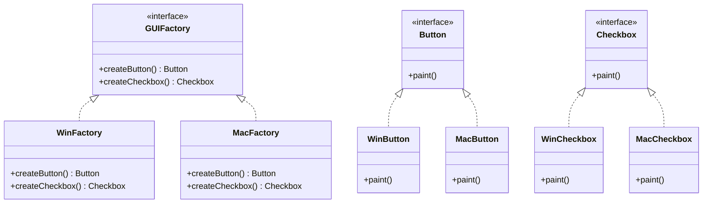

## 5.4 Abstract Factory Pattern

The Abstract Factory Pattern is a creational design pattern that provides an interface for creating families of related or dependent objects without specifying their concrete classes. This pattern is particularly useful when a system needs to be independent of how its objects are created, composed, and represented. In this section, we will explore the Abstract Factory Pattern in PHP, its implementation, and its practical applications.

### Intent

The primary intent of the Abstract Factory Pattern is to encapsulate a group of individual factories that have a common theme. It allows for the creation of objects that follow a particular interface without needing to know the specifics of the concrete classes. This pattern is beneficial when dealing with multiple families of products or when the system needs to be configured with one of multiple families of products.

### Key Participants

- **Abstract Factory**: Declares an interface for operations that create abstract product objects.
- **Concrete Factory**: Implements the operations to create concrete product objects.
- **Abstract Product**: Declares an interface for a type of product object.
- **Concrete Product**: Defines a product object to be created by the corresponding concrete factory and implements the Abstract Product interface.
- **Client**: Uses only interfaces declared by Abstract Factory and Abstract Product classes.

### Implementing Abstract Factory in PHP

Let's dive into implementing the Abstract Factory Pattern in PHP. We'll start by defining the abstract factory interfaces and then create concrete factory classes.

#### Defining Abstract Factory Interfaces

The first step is to define the abstract factory interface. This interface will declare methods for creating abstract product objects.

```php
<?php

interface GUIFactory {
    public function createButton(): Button;
    public function createCheckbox(): Checkbox;
}

interface Button {
    public function paint();
}

interface Checkbox {
    public function paint();
}
```

In this example, `GUIFactory` is the abstract factory interface with methods to create `Button` and `Checkbox` objects. The `Button` and `Checkbox` interfaces represent abstract products.

#### Creating Concrete Factory Classes

Next, we implement concrete factory classes that produce concrete products. Each factory corresponds to a specific product family.

```php
<?php

class WinFactory implements GUIFactory {
    public function createButton(): Button {
        return new WinButton();
    }

    public function createCheckbox(): Checkbox {
        return new WinCheckbox();
    }
}

class MacFactory implements GUIFactory {
    public function createButton(): Button {
        return new MacButton();
    }

    public function createCheckbox(): Checkbox {
        return new MacCheckbox();
    }
}

class WinButton implements Button {
    public function paint() {
        echo "Rendering a button in Windows style.\n";
    }
}

class WinCheckbox implements Checkbox {
    public function paint() {
        echo "Rendering a checkbox in Windows style.\n";
    }
}

class MacButton implements Button {
    public function paint() {
        echo "Rendering a button in macOS style.\n";
    }
}

class MacCheckbox implements Checkbox {
    public function paint() {
        echo "Rendering a checkbox in macOS style.\n";
    }
}
```

Here, `WinFactory` and `MacFactory` are concrete factories that create Windows and macOS style buttons and checkboxes, respectively. `WinButton`, `WinCheckbox`, `MacButton`, and `MacCheckbox` are concrete products implementing the `Button` and `Checkbox` interfaces.

#### Managing Multiple Product Families

The Abstract Factory Pattern excels in scenarios where multiple product families are involved. By encapsulating the creation logic within factory classes, the pattern allows for easy management and extension of product families.

```php
<?php

function clientCode(GUIFactory $factory) {
    $button = $factory->createButton();
    $checkbox = $factory->createCheckbox();

    $button->paint();
    $checkbox->paint();
}

echo "Client: Testing client code with the Windows factory:\n";
clientCode(new WinFactory());

echo "\nClient: Testing the same client code with the macOS factory:\n";
clientCode(new MacFactory());
```

In this client code, we use the `GUIFactory` interface to create products without knowing their concrete classes. This demonstrates the flexibility and scalability of the Abstract Factory Pattern.

### Use Cases and Examples

The Abstract Factory Pattern is widely used in software development for various purposes. Here are some common use cases:

#### Cross-Platform UI Components

When developing cross-platform applications, the Abstract Factory Pattern can be used to create UI components that adapt to different operating systems. This ensures a consistent user experience across platforms.

#### Theming and Skinning Applications

The pattern is also useful for theming and skinning applications. By defining different product families for each theme, developers can easily switch between themes without altering the core application logic.

### Design Considerations

When implementing the Abstract Factory Pattern, consider the following:

- **Complexity**: The pattern can introduce additional complexity due to the number of interfaces and classes involved. Ensure that the benefits outweigh the complexity.
- **Scalability**: The pattern is highly scalable, making it suitable for applications that require frequent updates or extensions to product families.
- **Decoupling**: The pattern promotes decoupling between client code and concrete classes, enhancing maintainability and flexibility.

### PHP Unique Features

PHP offers several features that can enhance the implementation of the Abstract Factory Pattern:

- **Interfaces and Traits**: PHP's support for interfaces and traits allows for flexible and reusable code structures.
- **Namespaces**: Use namespaces to organize and manage classes, especially in large applications with multiple product families.
- **Type Declarations**: Utilize type declarations to enforce method signatures and improve code readability.

### Differences and Similarities

The Abstract Factory Pattern is often compared to the Factory Method Pattern. While both patterns deal with object creation, they differ in their approach:

- **Abstract Factory**: Focuses on creating families of related objects. It involves multiple factory methods within a single interface.
- **Factory Method**: Focuses on creating a single product. It involves a single factory method in a class hierarchy.

### Visualizing the Abstract Factory Pattern

To better understand the Abstract Factory Pattern, let's visualize its structure using a class diagram.



This diagram illustrates the relationships between the abstract factory, concrete factories, abstract products, and concrete products.

### Try It Yourself

To deepen your understanding of the Abstract Factory Pattern, try modifying the code examples:

- **Add a new product family**: Implement a new factory and product classes for a different platform, such as Linux.
- **Extend existing products**: Add new methods to the `Button` and `Checkbox` interfaces and implement them in the concrete product classes.
- **Experiment with different client scenarios**: Create different client functions that utilize the factories in various ways.

### Knowledge Check

Before moving on, let's review some key points:

- The Abstract Factory Pattern provides an interface for creating families of related objects.
- It promotes decoupling between client code and concrete classes.
- The pattern is useful for cross-platform applications and theming.

### Embrace the Journey

Remember, mastering design patterns is a journey. As you continue to explore and implement patterns like the Abstract Factory, you'll gain valuable insights into software architecture and design. Keep experimenting, stay curious, and enjoy the process!

## Quiz: Abstract Factory Pattern



### What is the primary intent of the Abstract Factory Pattern?

- [x] To provide an interface for creating families of related objects.
- [ ] To create a single object with a factory method.
- [ ] To manage object lifecycle and memory.
- [ ] To define a one-to-one mapping between classes.

> **Explanation:** The Abstract Factory Pattern is designed to provide an interface for creating families of related or dependent objects without specifying their concrete classes.

### Which of the following is a key participant in the Abstract Factory Pattern?

- [x] Abstract Factory
- [ ] Singleton
- [x] Concrete Factory
- [ ] Observer

> **Explanation:** The key participants in the Abstract Factory Pattern include the Abstract Factory, Concrete Factory, Abstract Product, Concrete Product, and Client.

### How does the Abstract Factory Pattern promote decoupling?

- [x] By using interfaces to hide concrete class implementations.
- [ ] By using global variables to manage state.
- [ ] By implementing all logic in a single class.
- [ ] By avoiding the use of interfaces.

> **Explanation:** The Abstract Factory Pattern promotes decoupling by using interfaces to hide the details of concrete class implementations from the client code.

### What is a common use case for the Abstract Factory Pattern?

- [x] Cross-platform UI components
- [ ] Real-time data processing
- [ ] Database connection pooling
- [ ] Logging and monitoring

> **Explanation:** A common use case for the Abstract Factory Pattern is creating cross-platform UI components that adapt to different operating systems.

### Which PHP feature enhances the implementation of the Abstract Factory Pattern?

- [x] Interfaces and Traits
- [ ] Global Variables
- [ ] Inline HTML
- [ ] Static Methods

> **Explanation:** PHP's support for interfaces and traits allows for flexible and reusable code structures, enhancing the implementation of the Abstract Factory Pattern.

### How does the Abstract Factory Pattern differ from the Factory Method Pattern?

- [x] It focuses on creating families of related objects.
- [ ] It focuses on creating a single product.
- [ ] It involves a single factory method.
- [ ] It does not use interfaces.

> **Explanation:** The Abstract Factory Pattern focuses on creating families of related objects, whereas the Factory Method Pattern focuses on creating a single product.

### What is a benefit of using the Abstract Factory Pattern?

- [x] Scalability
- [ ] Increased complexity
- [ ] Tight coupling
- [ ] Limited flexibility

> **Explanation:** The Abstract Factory Pattern is highly scalable, making it suitable for applications that require frequent updates or extensions to product families.

### Which of the following is NOT a key participant in the Abstract Factory Pattern?

- [ ] Abstract Factory
- [ ] Concrete Factory
- [x] Singleton
- [ ] Concrete Product

> **Explanation:** The Singleton is not a key participant in the Abstract Factory Pattern. The key participants include the Abstract Factory, Concrete Factory, Abstract Product, Concrete Product, and Client.

### What is the role of the Client in the Abstract Factory Pattern?

- [x] To use interfaces declared by Abstract Factory and Abstract Product classes.
- [ ] To implement concrete product classes.
- [ ] To define the factory interface.
- [ ] To manage object lifecycle.

> **Explanation:** The Client uses only interfaces declared by Abstract Factory and Abstract Product classes, ensuring decoupling from concrete implementations.

### True or False: The Abstract Factory Pattern can be used for theming and skinning applications.

- [x] True
- [ ] False

> **Explanation:** True. The Abstract Factory Pattern is useful for theming and skinning applications by defining different product families for each theme.


