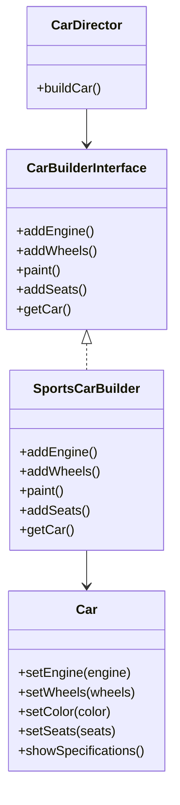

## 5.5 Builder Pattern

The Builder Pattern is a creational design pattern that allows for the step-by-step construction of complex objects. Unlike other creational patterns, the Builder Pattern separates the construction of a complex object from its representation, enabling the same construction process to create different representations. This pattern is particularly useful when an object needs to be created with numerous optional parameters or when the construction process is complex.

### Intent

The primary intent of the Builder Pattern is to provide a way to construct a complex object step by step. It allows for greater control over the construction process and can be used to create different representations of the same object.

### Key Participants

- **Builder**: An interface or abstract class defining the steps to build the product.
- **ConcreteBuilder**: A class that implements the Builder interface and provides specific implementations for the building steps.
- **Director**: A class that constructs the object using the Builder interface.
- **Product**: The complex object that is being constructed.

### Applicability

Use the Builder Pattern when:

- The construction process of an object is complex.
- You need to create different representations of an object.
- You want to construct an object step by step.
- The object requires numerous optional parameters.

### Implementing Builder in PHP

Let's explore how to implement the Builder Pattern in PHP by creating a simple example of building a `Car` object.

#### Step 1: Define the Product Class

The `Car` class represents the complex object that we want to construct.

```php
<?php

class Car
{
    private $engine;
    private $wheels;
    private $color;
    private $seats;

    public function setEngine($engine)
    {
        $this->engine = $engine;
    }

    public function setWheels($wheels)
    {
        $this->wheels = $wheels;
    }

    public function setColor($color)
    {
        $this->color = $color;
    }

    public function setSeats($seats)
    {
        $this->seats = $seats;
    }

    public function showSpecifications()
    {
        echo "Engine: $this->engine\n";
        echo "Wheels: $this->wheels\n";
        echo "Color: $this->color\n";
        echo "Seats: $this->seats\n";
    }
}
```

#### Step 2: Create the Builder Interface

The `CarBuilderInterface` defines the steps required to build a `Car`.

```php
<?php

interface CarBuilderInterface
{
    public function addEngine();
    public function addWheels();
    public function paint();
    public function addSeats();
    public function getCar();
}
```

#### Step 3: Implement the Concrete Builder

The `SportsCarBuilder` class implements the `CarBuilderInterface` and provides specific implementations for building a sports car.

```php
<?php

class SportsCarBuilder implements CarBuilderInterface
{
    private $car;

    public function __construct()
    {
        $this->car = new Car();
    }

    public function addEngine()
    {
        $this->car->setEngine('V8 Engine');
    }

    public function addWheels()
    {
        $this->car->setWheels('18 inch Alloy Wheels');
    }

    public function paint()
    {
        $this->car->setColor('Red');
    }

    public function addSeats()
    {
        $this->car->setSeats('Leather Seats');
    }

    public function getCar()
    {
        return $this->car;
    }
}
```

#### Step 4: Define the Director Class

The `CarDirector` class is responsible for constructing the `Car` using the `CarBuilderInterface`.

```php
<?php

class CarDirector
{
    private $builder;

    public function __construct(CarBuilderInterface $builder)
    {
        $this->builder = $builder;
    }

    public function buildCar()
    {
        $this->builder->addEngine();
        $this->builder->addWheels();
        $this->builder->paint();
        $this->builder->addSeats();
        return $this->builder->getCar();
    }
}
```

#### Step 5: Client Code

The client code uses the `CarDirector` to construct a `Car`.

```php
<?php

$builder = new SportsCarBuilder();
$director = new CarDirector($builder);
$sportsCar = $director->buildCar();
$sportsCar->showSpecifications();
```

### Fluent Interface Pattern for Improved Readability

The Builder Pattern often uses the Fluent Interface pattern to improve readability and make the code more expressive. This is achieved by returning the builder object itself from each method, allowing method chaining.

#### Example of Fluent Interface

Let's modify the `SportsCarBuilder` to use a Fluent Interface.

```php
<?php

class SportsCarBuilder implements CarBuilderInterface
{
    private $car;

    public function __construct()
    {
        $this->car = new Car();
    }

    public function addEngine()
    {
        $this->car->setEngine('V8 Engine');
        return $this;
    }

    public function addWheels()
    {
        $this->car->setWheels('18 inch Alloy Wheels');
        return $this;
    }

    public function paint()
    {
        $this->car->setColor('Red');
        return $this;
    }

    public function addSeats()
    {
        $this->car->setSeats('Leather Seats');
        return $this;
    }

    public function getCar()
    {
        return $this->car;
    }
}
```

#### Using the Fluent Interface

```php
<?php

$builder = new SportsCarBuilder();
$sportsCar = $builder->addEngine()
                     ->addWheels()
                     ->paint()
                     ->addSeats()
                     ->getCar();
$sportsCar->showSpecifications();
```

### Use Cases and Examples

The Builder Pattern is particularly useful in scenarios where complex objects need to be constructed. Here are some common use cases:

#### Constructing Complex Objects

- **Query Builders**: Constructing SQL queries with various optional clauses.
- **Document Builders**: Creating complex documents with multiple sections and formatting options.

#### Configuring Objects with Numerous Optional Parameters

- **UI Components**: Configuring UI components with various styles and behaviors.
- **Configuration Objects**: Setting up configuration objects with numerous optional settings.

### Design Considerations

When implementing the Builder Pattern, consider the following:

- **Complexity**: The Builder Pattern can introduce additional complexity. Use it only when necessary.
- **Flexibility**: The pattern provides flexibility in constructing complex objects. Ensure that the builder interface is well-defined.
- **Fluent Interface**: Consider using a Fluent Interface to improve readability and usability.

### PHP Unique Features

PHP offers several unique features that can enhance the implementation of the Builder Pattern:

- **Magic Methods**: Use magic methods like `__call` to dynamically handle method chaining.
- **Traits**: Use traits to share common builder functionality across multiple builders.
- **Anonymous Classes**: Use anonymous classes for simple builders that do not require a separate class definition.

### Differences and Similarities

The Builder Pattern is often confused with the Factory Method Pattern. Here are the key differences:

- **Builder Pattern**: Focuses on constructing a complex object step by step.
- **Factory Method Pattern**: Focuses on creating an object without exposing the instantiation logic.

### Visualizing the Builder Pattern

Below is a class diagram representing the Builder Pattern:



### Try It Yourself

Experiment with the Builder Pattern by modifying the `SportsCarBuilder` to create different types of cars, such as a `SUVBuilder` or `TruckBuilder`. Try adding new features or parameters to the `Car` class and update the builders accordingly.

### Knowledge Check

- What is the primary intent of the Builder Pattern?
- How does the Builder Pattern differ from the Factory Method Pattern?
- What are some common use cases for the Builder Pattern?
- How can the Fluent Interface pattern improve the readability of the Builder Pattern?

### Embrace the Journey

Remember, mastering design patterns is a journey. As you continue to explore and implement the Builder Pattern, you'll gain a deeper understanding of how to construct complex objects efficiently. Keep experimenting, stay curious, and enjoy the journey!

## Quiz: Builder Pattern



### What is the primary intent of the Builder Pattern?

- [x] To construct a complex object step by step.
- [ ] To create a single instance of a class.
- [ ] To provide an interface for creating families of related objects.
- [ ] To define a skeleton of an algorithm.

> **Explanation:** The Builder Pattern is designed to construct complex objects step by step, separating the construction process from the representation.

### Which of the following is a key participant in the Builder Pattern?

- [x] Builder
- [ ] Singleton
- [ ] Factory
- [ ] Observer

> **Explanation:** The Builder is a key participant in the Builder Pattern, responsible for defining the steps to build the product.

### How does the Builder Pattern differ from the Factory Method Pattern?

- [x] The Builder Pattern constructs objects step by step, while the Factory Method Pattern focuses on creating objects without exposing instantiation logic.
- [ ] The Builder Pattern creates a single instance, while the Factory Method Pattern creates multiple instances.
- [ ] The Builder Pattern is used for creating families of related objects, while the Factory Method Pattern is not.
- [ ] The Builder Pattern is used for defining a skeleton of an algorithm, while the Factory Method Pattern is not.

> **Explanation:** The Builder Pattern constructs objects step by step, whereas the Factory Method Pattern focuses on creating objects without exposing the instantiation logic.

### What is a common use case for the Builder Pattern?

- [x] Constructing complex objects like queries or documents.
- [ ] Creating a single instance of a class.
- [ ] Observing changes in object state.
- [ ] Defining a skeleton of an algorithm.

> **Explanation:** The Builder Pattern is commonly used for constructing complex objects like queries or documents.

### How can the Fluent Interface pattern improve the readability of the Builder Pattern?

- [x] By allowing method chaining.
- [ ] By reducing the number of classes.
- [ ] By simplifying the constructor.
- [ ] By eliminating the need for interfaces.

> **Explanation:** The Fluent Interface pattern improves readability by allowing method chaining, making the code more expressive.

### What is the role of the Director in the Builder Pattern?

- [x] To construct the object using the Builder interface.
- [ ] To define the steps to build the product.
- [ ] To provide specific implementations for building steps.
- [ ] To represent the complex object being constructed.

> **Explanation:** The Director is responsible for constructing the object using the Builder interface.

### Which PHP feature can enhance the implementation of the Builder Pattern?

- [x] Traits
- [ ] Singleton
- [ ] Observer
- [ ] Factory

> **Explanation:** Traits can be used to share common builder functionality across multiple builders, enhancing the implementation of the Builder Pattern.

### What is a potential drawback of the Builder Pattern?

- [x] It can introduce additional complexity.
- [ ] It cannot be used with interfaces.
- [ ] It does not support method chaining.
- [ ] It is not suitable for constructing complex objects.

> **Explanation:** The Builder Pattern can introduce additional complexity, so it should be used only when necessary.

### What is the benefit of separating object construction from representation?

- [x] It allows for different representations of the same object.
- [ ] It reduces the number of classes.
- [ ] It simplifies the constructor.
- [ ] It eliminates the need for interfaces.

> **Explanation:** Separating object construction from representation allows for different representations of the same object.

### True or False: The Builder Pattern is often confused with the Singleton Pattern.

- [ ] True
- [x] False

> **Explanation:** The Builder Pattern is often confused with the Factory Method Pattern, not the Singleton Pattern.


