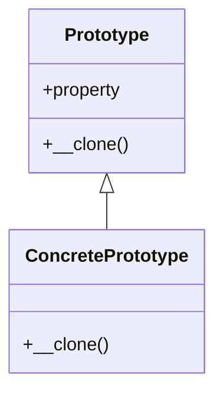

## 5.6 Prototype Pattern

In the realm of software design, the Prototype Pattern stands out as a powerful creational pattern that allows developers to create new objects by cloning existing ones. This approach can be particularly useful when object creation is costly in terms of time or resources, or when the configuration of an object is complex. In this section, we will delve into the Prototype Pattern in PHP, exploring its implementation, use cases, and the nuances of object cloning.

### Intent of the Prototype Pattern

The primary intent of the Prototype Pattern is to enable the creation of new objects by copying existing ones, thereby reducing the overhead associated with object instantiation. This pattern is particularly beneficial when the cost of creating a new instance of a class is more expensive than copying an existing instance.

### Key Participants

- **Prototype**: An interface or abstract class that defines the method for cloning itself.
- **ConcretePrototype**: A class that implements the Prototype interface and provides the actual cloning logic.
- **Client**: The entity that requests a clone of the prototype.

### Implementing Prototype in PHP

PHP provides a straightforward way to implement the Prototype Pattern through the use of the `clone` keyword. This keyword allows for the creation of a shallow copy of an object. However, understanding the difference between shallow and deep copying is crucial for effective implementation.

#### Using the `clone` Keyword

The `clone` keyword in PHP creates a shallow copy of an object. This means that the new object is a copy of the original, but any references to other objects within it are not duplicated; they still point to the same objects as the original.

```php
class Prototype {
    public $property;

    public function __construct($property) {
        $this->property = $property;
    }

    public function __clone() {
        // Customize the cloning process if needed
    }
}

// Create an original object
$original = new Prototype("Original Property");

// Clone the original object
$clone = clone $original;

// Modify the clone's property
$clone->property = "Cloned Property";

echo $original->property; // Outputs: Original Property
echo $clone->property;    // Outputs: Cloned Property
```

In this example, the `clone` keyword is used to create a new instance of the `Prototype` class. The `__clone()` method can be overridden to customize the cloning process if necessary.

#### Deep Copying vs. Shallow Copying

- **Shallow Copying**: As demonstrated above, a shallow copy duplicates the object but not the objects it references. This can lead to shared state issues if the cloned object modifies a referenced object.
  
- **Deep Copying**: A deep copy duplicates the object and all objects it references, creating independent copies. Implementing deep copying in PHP requires manually cloning each referenced object.

```php
class DeepPrototype {
    public $property;
    public $subObject;

    public function __construct($property, $subObject) {
        $this->property = $property;
        $this->subObject = $subObject;
    }

    public function __clone() {
        // Perform a deep copy by cloning the sub-object
        $this->subObject = clone $this->subObject;
    }
}

class SubObject {
    public $subProperty;

    public function __construct($subProperty) {
        $this->subProperty = $subProperty;
    }
}

// Create an original object with a sub-object
$original = new DeepPrototype("Original Property", new SubObject("Sub Property"));

// Clone the original object
$clone = clone $original;

// Modify the clone's sub-object property
$clone->subObject->subProperty = "Modified Sub Property";

echo $original->subObject->subProperty; // Outputs: Sub Property
echo $clone->subObject->subProperty;    // Outputs: Modified Sub Property
```

In this deep copy example, the `__clone()` method is overridden to clone the `subObject`, ensuring that the cloned object has its own independent copy of the sub-object.

### Managing Object Cloning and Dependencies

When implementing the Prototype Pattern, managing dependencies and ensuring that cloned objects are independent of their originals is crucial. This involves careful consideration of how objects are referenced and cloned.

- **Custom Cloning Logic**: Override the `__clone()` method to implement custom cloning logic, such as deep copying or resetting certain properties.
- **Avoiding Shared State**: Ensure that any shared state between the original and cloned objects is properly managed to prevent unintended side effects.

### Use Cases and Examples

The Prototype Pattern is particularly useful in scenarios where object creation is resource-intensive or when objects have complex configurations.

#### Duplicating Configured Objects

In applications where objects are configured with numerous properties or dependencies, the Prototype Pattern allows for the efficient duplication of these objects without the need to reconfigure each new instance.

```php
class ConfiguredObject {
    public $settings;

    public function __construct($settings) {
        $this->settings = $settings;
    }

    public function __clone() {
        // Deep copy settings if necessary
        $this->settings = clone $this->settings;
    }
}

// Create a configured object
$original = new ConfiguredObject((object)['theme' => 'dark', 'language' => 'en']);

// Clone the configured object
$clone = clone $original;

// Modify the clone's settings
$clone->settings->theme = 'light';

echo $original->settings->theme; // Outputs: dark
echo $clone->settings->theme;    // Outputs: light
```

#### Performance Optimization in Object Creation

When creating objects is computationally expensive, such as in graphics rendering or complex simulations, the Prototype Pattern can significantly reduce the overhead by cloning pre-existing objects.

### Design Considerations

When deciding to use the Prototype Pattern, consider the following:

- **Complexity of Object Structure**: If objects have complex structures with multiple nested objects, ensure that deep copying is implemented correctly.
- **Resource Constraints**: Use the Prototype Pattern when object creation is resource-intensive and cloning provides a performance benefit.
- **State Management**: Carefully manage the state of cloned objects to avoid shared state issues.

### PHP Unique Features

PHP's `clone` keyword and the ability to override the `__clone()` method provide a straightforward mechanism for implementing the Prototype Pattern. Additionally, PHP's dynamic typing and flexible object model make it easy to manage complex object hierarchies.

### Differences and Similarities with Other Patterns

The Prototype Pattern is often compared to the Factory Method Pattern, as both deal with object creation. However, while the Factory Method Pattern involves creating objects from scratch, the Prototype Pattern focuses on cloning existing objects. Understanding these distinctions can help in selecting the appropriate pattern for a given problem.

### Visualizing the Prototype Pattern

To better understand the Prototype Pattern, let's visualize the process of cloning an object using a class diagram.



In this diagram, `Prototype` is the base class with a `__clone()` method, and `ConcretePrototype` is a subclass that implements the cloning logic.

### Try It Yourself

Experiment with the Prototype Pattern by modifying the code examples provided. Try creating a more complex object structure and implement deep copying for nested objects. Observe how changes to the cloned objects affect the originals and vice versa.

### Knowledge Check

- What is the primary intent of the Prototype Pattern?
- Explain the difference between shallow and deep copying.
- How does PHP's `clone` keyword facilitate the Prototype Pattern?
- What are some use cases where the Prototype Pattern is beneficial?
- How can you manage dependencies when cloning objects?

### Embrace the Journey

Remember, mastering design patterns like the Prototype Pattern is a journey. As you continue to explore and experiment, you'll gain a deeper understanding of how to apply these patterns effectively in your PHP applications. Keep experimenting, stay curious, and enjoy the journey!

## Quiz: Prototype Pattern



### What is the primary intent of the Prototype Pattern?

- [x] To create new objects by cloning existing ones
- [ ] To create new objects from scratch
- [ ] To manage object dependencies
- [ ] To optimize object destruction

> **Explanation:** The Prototype Pattern is intended to create new objects by cloning existing ones, reducing the overhead of object creation.

### Which PHP keyword is used to clone an object?

- [x] clone
- [ ] copy
- [ ] duplicate
- [ ] new

> **Explanation:** The `clone` keyword in PHP is used to create a shallow copy of an object.

### What is the difference between shallow and deep copying?

- [x] Shallow copying duplicates the object but not the objects it references
- [ ] Deep copying duplicates the object and all objects it references
- [ ] Shallow copying duplicates all objects
- [ ] Deep copying duplicates only the top-level object

> **Explanation:** Shallow copying duplicates the object itself but not the objects it references, while deep copying duplicates both the object and all objects it references.

### How can you implement deep copying in PHP?

- [x] By manually cloning each referenced object
- [ ] By using the `deepClone` keyword
- [ ] By overriding the `__construct()` method
- [ ] By using the `copy` function

> **Explanation:** Deep copying in PHP requires manually cloning each referenced object to ensure they are independent copies.

### What is a common use case for the Prototype Pattern?

- [x] Duplicating configured objects
- [ ] Managing object destruction
- [ ] Creating objects from scratch
- [ ] Optimizing database queries

> **Explanation:** A common use case for the Prototype Pattern is duplicating configured objects to avoid reconfiguration.

### What method can be overridden to customize the cloning process in PHP?

- [x] __clone()
- [ ] __construct()
- [ ] __destruct()
- [ ] __copy()

> **Explanation:** The `__clone()` method can be overridden to customize the cloning process in PHP.

### What should you consider when using the Prototype Pattern?

- [x] Complexity of object structure
- [x] Resource constraints
- [ ] Object destruction
- [ ] Database optimization

> **Explanation:** When using the Prototype Pattern, consider the complexity of the object structure and resource constraints to ensure effective implementation.

### How does the Prototype Pattern differ from the Factory Method Pattern?

- [x] Prototype clones existing objects, while Factory Method creates new ones
- [ ] Prototype creates new objects, while Factory Method clones existing ones
- [ ] Both patterns create new objects from scratch
- [ ] Both patterns clone existing objects

> **Explanation:** The Prototype Pattern focuses on cloning existing objects, whereas the Factory Method Pattern involves creating new objects from scratch.

### What is a potential pitfall of shallow copying?

- [x] Shared state issues
- [ ] Increased memory usage
- [ ] Slower object creation
- [ ] Complex object destruction

> **Explanation:** Shallow copying can lead to shared state issues if the cloned object modifies a referenced object.

### True or False: The Prototype Pattern is only useful for simple objects.

- [ ] True
- [x] False

> **Explanation:** The Prototype Pattern is useful for both simple and complex objects, especially when object creation is resource-intensive or involves complex configurations.


