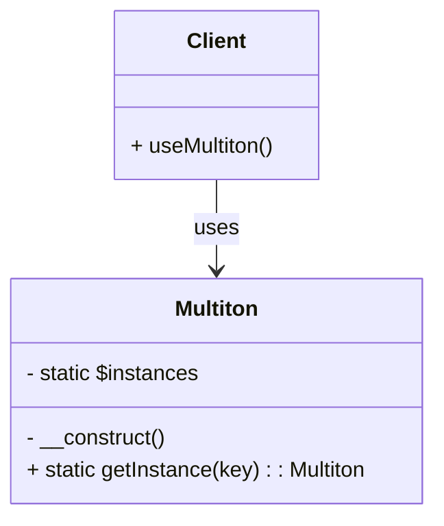

## 5.7 Multiton Pattern

In the realm of software design patterns, the Multiton Pattern stands out as a specialized creational pattern that allows for the management of a specific number of instances, each identified by a unique key. This pattern is particularly useful when you need to control the number of instances of a class and ensure that each instance is associated with a unique identifier. In this section, we will delve into the intricacies of the Multiton Pattern, explore its implementation in PHP, and examine its practical applications.

### Intent

The primary intent of the Multiton Pattern is to manage a set of named instances. Unlike the Singleton Pattern, which restricts the instantiation of a class to a single object, the Multiton Pattern allows for multiple instances, each associated with a unique key. This pattern is particularly useful when you need to manage a collection of related objects that are identified by specific keys.

### Key Participants

1. **Multiton Class**: The class that implements the Multiton Pattern. It is responsible for managing the instances and ensuring that each instance is associated with a unique key.
2. **Client**: The client code that interacts with the Multiton class to retrieve or create instances.

### Applicability

The Multiton Pattern is applicable in scenarios where:
- You need to manage a fixed number of instances, each identified by a unique key.
- Instances represent unique resources, such as database connections or configuration settings.
- You want to ensure that instances are created only when needed and reused thereafter.

### Implementing Multiton in PHP

To implement the Multiton Pattern in PHP, we typically store instances in an associative array, where the keys represent unique identifiers for each instance. Let's walk through a step-by-step implementation of the Multiton Pattern in PHP.

#### Step 1: Define the Multiton Class

The Multiton class is responsible for managing instances. It should have a private static array to store instances and a private constructor to prevent direct instantiation.

```php
<?php

class Multiton
{
    // Private static array to store instances
    private static $instances = [];

    // Private constructor to prevent direct instantiation
    private function __construct()
    {
    }

    // Method to get an instance by key
    public static function getInstance(string $key): Multiton
    {
        // Check if the instance for the given key already exists
        if (!isset(self::$instances[$key])) {
            // Create a new instance and store it in the array
            self::$instances[$key] = new self();
        }

        // Return the instance for the given key
        return self::$instances[$key];
    }
}
```

#### Step 2: Controlling Instance Creation and Retrieval

The `getInstance` method is the core of the Multiton Pattern. It checks if an instance for the given key already exists. If not, it creates a new instance and stores it in the associative array. This ensures that each key is associated with a unique instance.

#### Step 3: Using the Multiton Pattern

Let's see how we can use the Multiton Pattern in a practical scenario.

```php
<?php

// Retrieve instances using unique keys
$instance1 = Multiton::getInstance('database1');
$instance2 = Multiton::getInstance('database2');
$instance3 = Multiton::getInstance('database1');

// Check if the instances are the same
var_dump($instance1 === $instance3); // Outputs: bool(true)
var_dump($instance1 === $instance2); // Outputs: bool(false)
```

In this example, `instance1` and `instance3` are the same because they are retrieved using the same key `'database1'`. However, `instance2` is different because it is associated with a different key `'database2'`.

### Visualizing the Multiton Pattern

To better understand the Multiton Pattern, let's visualize it using a class diagram.



In this diagram, the `Multiton` class manages instances, and the `Client` interacts with it to retrieve or create instances.

### Use Cases and Examples

The Multiton Pattern is particularly useful in scenarios where you need to manage instances that represent unique resources. Let's explore some common use cases.

#### Use Case 1: Managing Database Connections

In applications that connect to multiple databases, the Multiton Pattern can be used to manage database connection instances, ensuring that each connection is associated with a unique identifier.

```php
<?php

class DatabaseConnection
{
    private static $instances = [];

    private function __construct()
    {
        // Private constructor to prevent direct instantiation
    }

    public static function getConnection(string $database): DatabaseConnection
    {
        if (!isset(self::$instances[$database])) {
            self::$instances[$database] = new self();
            echo "Creating new connection for $database\n";
        }

        return self::$instances[$database];
    }
}

// Usage
$db1 = DatabaseConnection::getConnection('db1');
$db2 = DatabaseConnection::getConnection('db2');
$db3 = DatabaseConnection::getConnection('db1'); // Reuses the existing connection

```

In this example, a new connection is created only if it doesn't already exist for the specified database.

#### Use Case 2: Managing Configuration Settings

The Multiton Pattern can also be used to manage configuration settings, where each configuration set is associated with a unique key.

```php
<?php

class Configuration
{
    private static $instances = [];
    private $settings = [];

    private function __construct(array $settings)
    {
        $this->settings = $settings;
    }

    public static function getConfiguration(string $name, array $settings = []): Configuration
    {
        if (!isset(self::$instances[$name])) {
            self::$instances[$name] = new self($settings);
        }

        return self::$instances[$name];
    }

    public function getSetting(string $key)
    {
        return $this->settings[$key] ?? null;
    }
}

// Usage
$config1 = Configuration::getConfiguration('app', ['debug' => true]);
$config2 = Configuration::getConfiguration('app');
echo $config1->getSetting('debug'); // Outputs: 1 (true)

```

In this example, the configuration settings for `'app'` are reused, ensuring consistency across the application.

### Design Considerations

When implementing the Multiton Pattern, consider the following:

- **Memory Usage**: Since instances are stored in a static array, they persist for the lifetime of the script. Ensure that this does not lead to excessive memory usage.
- **Thread Safety**: In a multi-threaded environment, ensure that access to the static array is synchronized to prevent race conditions.
- **Garbage Collection**: Be aware that instances stored in the static array will not be garbage collected until the script ends.

### PHP Unique Features

PHP's associative arrays make it particularly well-suited for implementing the Multiton Pattern. The language's dynamic nature allows for flexible management of instances, and the use of static properties ensures that instances are shared across the application.

### Differences and Similarities

The Multiton Pattern is often compared to the Singleton Pattern. While both patterns manage instances, the Singleton Pattern restricts instantiation to a single object, whereas the Multiton Pattern allows for multiple instances, each identified by a unique key.

### Try It Yourself

To deepen your understanding of the Multiton Pattern, try modifying the code examples to:

- Add a method to remove an instance by key.
- Implement a method to list all existing keys.
- Experiment with different types of resources, such as file handles or API clients.

### Knowledge Check

Before we wrap up, let's reinforce what we've learned with a few questions:

- What is the primary intent of the Multiton Pattern?
- How does the Multiton Pattern differ from the Singleton Pattern?
- What are some common use cases for the Multiton Pattern?

### Embrace the Journey

Remember, mastering design patterns like the Multiton Pattern is a journey. As you continue to explore and experiment, you'll gain a deeper understanding of how to apply these patterns effectively in your PHP applications. Keep experimenting, stay curious, and enjoy the journey!

## Quiz: Multiton Pattern



### What is the primary intent of the Multiton Pattern?

- [x] To manage a set of named instances
- [ ] To restrict instantiation to a single object
- [ ] To create a new instance for every request
- [ ] To manage instances without unique keys

> **Explanation:** The Multiton Pattern manages a set of named instances, each identified by a unique key.

### How does the Multiton Pattern differ from the Singleton Pattern?

- [x] Multiton allows multiple instances, Singleton restricts to one
- [ ] Both restrict to a single instance
- [ ] Multiton is for database connections only
- [ ] Singleton allows multiple instances

> **Explanation:** The Multiton Pattern allows multiple instances, each identified by a unique key, while the Singleton Pattern restricts instantiation to a single object.

### Which data structure is commonly used in PHP to store Multiton instances?

- [x] Associative array
- [ ] Indexed array
- [ ] Linked list
- [ ] Stack

> **Explanation:** An associative array is used to store Multiton instances, with keys representing unique identifiers.

### What is a common use case for the Multiton Pattern?

- [x] Managing database connections
- [ ] Creating new instances for every request
- [ ] Restricting instantiation to one object
- [ ] Managing unrelated objects

> **Explanation:** The Multiton Pattern is commonly used to manage database connections, ensuring each connection is associated with a unique identifier.

### What should you consider regarding memory usage when implementing the Multiton Pattern?

- [x] Instances persist for the script's lifetime
- [ ] Instances are garbage collected immediately
- [ ] Instances are stored in a temporary cache
- [ ] Instances are stored in a database

> **Explanation:** Instances in the Multiton Pattern persist for the script's lifetime, as they are stored in a static array.

### How can you ensure thread safety in a multi-threaded environment when using the Multiton Pattern?

- [x] Synchronize access to the static array
- [ ] Use a global variable
- [ ] Avoid using static properties
- [ ] Use a different pattern

> **Explanation:** Synchronizing access to the static array ensures thread safety in a multi-threaded environment.

### What is a potential drawback of using the Multiton Pattern?

- [x] Excessive memory usage
- [ ] Difficulty in creating new instances
- [ ] Lack of unique identifiers
- [ ] Inability to manage instances

> **Explanation:** Excessive memory usage can occur if too many instances are stored in the static array.

### What PHP feature makes it well-suited for implementing the Multiton Pattern?

- [x] Associative arrays
- [ ] Indexed arrays
- [ ] Lack of static properties
- [ ] Dynamic typing

> **Explanation:** PHP's associative arrays make it well-suited for implementing the Multiton Pattern, allowing flexible management of instances.

### Can the Multiton Pattern be used to manage configuration settings?

- [x] Yes
- [ ] No

> **Explanation:** The Multiton Pattern can be used to manage configuration settings, with each configuration set associated with a unique key.

### True or False: The Multiton Pattern is often confused with the Singleton Pattern.

- [x] True
- [ ] False

> **Explanation:** The Multiton Pattern is often compared to the Singleton Pattern, but they differ in the number of instances they manage.


