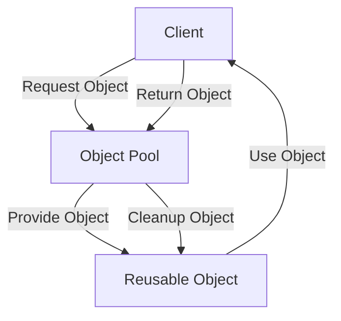

## 5.8 Pool Pattern

The Pool Pattern is a creational design pattern that focuses on the efficient reuse of objects that are expensive to create. This pattern is particularly useful in scenarios where the cost of initializing a class instance is high, and the number of instances needed at any given time is limited. By reusing objects, the Pool Pattern helps in reducing the overhead of object creation and destruction, thus enhancing performance and resource management.

### Intent

The primary intent of the Pool Pattern is to manage a pool of reusable objects, minimizing the cost of object creation and destruction. This pattern is especially beneficial in environments where resources are limited or expensive, such as database connections or thread management.

### Key Participants

1. **Pool Manager**: Manages the lifecycle of pooled objects, including creation, allocation, and cleanup.
2. **Reusable Object**: The object that is expensive to create and is managed by the pool.
3. **Client**: Requests objects from the pool and returns them after use.

### Applicability

- When object creation is costly in terms of time or resources.
- When you need to manage a limited number of resources efficiently.
- When objects can be reused without modification.

### Implementing Object Pool in PHP

To implement an object pool in PHP, we need to create a pool manager that handles the allocation and lifecycle of objects. Let's walk through the steps to create a simple object pool.

#### Creating a Pool Manager

The pool manager is responsible for maintaining a collection of reusable objects. It provides methods to acquire and release objects.

```php
<?php

class ObjectPool {
    private $available = [];
    private $inUse = [];

    public function get() {
        if (count($this->available) == 0) {
            // Create a new object if none are available
            $object = $this->create();
        } else {
            // Reuse an available object
            $object = array_pop($this->available);
        }

        $this->inUse[spl_object_hash($object)] = $object;
        return $object;
    }

    public function release($object) {
        $key = spl_object_hash($object);
        if (isset($this->inUse[$key])) {
            unset($this->inUse[$key]);
            $this->available[$key] = $object;
        }
    }

    protected function create() {
        // Create a new instance of the object
        return new ReusableObject();
    }
}

class ReusableObject {
    // Simulate an expensive-to-create object
}

```

In this example, the `ObjectPool` class manages a pool of `ReusableObject` instances. The `get()` method retrieves an object from the pool, creating a new one if necessary. The `release()` method returns an object to the pool for future reuse.

#### Handling Object Lifecycle and Cleanup

Proper management of the object lifecycle is crucial in the Pool Pattern. This includes initializing objects when they are created and cleaning them up before they are returned to the pool.

```php
<?php

class ObjectPool {
    // ... (previous code)

    public function get() {
        $object = parent::get();
        $this->initialize($object);
        return $object;
    }

    public function release($object) {
        $this->cleanup($object);
        parent::release($object);
    }

    protected function initialize($object) {
        // Initialize the object before use
    }

    protected function cleanup($object) {
        // Clean up the object before returning it to the pool
    }
}

```

The `initialize()` method prepares an object for use, while the `cleanup()` method resets it before returning it to the pool. This ensures that each object is in a consistent state when acquired by a client.

### Use Cases and Examples

The Pool Pattern is widely used in scenarios where resource management is critical. Let's explore some common use cases.

#### Database Connection Pooling

Database connections are expensive to establish and maintain. By using a pool of connections, we can reduce the overhead of repeatedly opening and closing connections.

```php
<?php

class DatabaseConnection {
    // Simulate a database connection
}

class DatabaseConnectionPool extends ObjectPool {
    protected function create() {
        return new DatabaseConnection();
    }

    protected function initialize($connection) {
        // Initialize the database connection
    }

    protected function cleanup($connection) {
        // Reset the connection state
    }
}

$pool = new DatabaseConnectionPool();
$connection = $pool->get();
// Use the connection
$pool->release($connection);

```

In this example, `DatabaseConnectionPool` extends `ObjectPool` to manage a pool of `DatabaseConnection` objects. This allows for efficient reuse of connections, reducing the cost of connection management.

#### Managing Reusable Threads or Resources

The Pool Pattern can also be applied to manage threads or other reusable resources. By pooling threads, we can optimize the execution of concurrent tasks.

```php
<?php

class Thread {
    // Simulate a thread
}

class ThreadPool extends ObjectPool {
    protected function create() {
        return new Thread();
    }

    protected function initialize($thread) {
        // Prepare the thread for execution
    }

    protected function cleanup($thread) {
        // Clean up the thread after execution
    }
}

$threadPool = new ThreadPool();
$thread = $threadPool->get();
// Execute tasks with the thread
$threadPool->release($thread);

```

Here, `ThreadPool` manages a pool of `Thread` objects, allowing for efficient execution of tasks without the overhead of repeatedly creating and destroying threads.

### Design Considerations

- **Thread Safety**: Ensure that the pool is thread-safe if used in a multi-threaded environment.
- **Resource Limits**: Define limits on the number of objects in the pool to prevent resource exhaustion.
- **Object State**: Ensure that objects are properly initialized and cleaned up to maintain consistency.

### PHP Unique Features

PHP's dynamic nature and garbage collection make it well-suited for implementing the Pool Pattern. The use of `spl_object_hash()` allows for efficient tracking of objects within the pool.

### Differences and Similarities

The Pool Pattern is often confused with the Singleton Pattern, but they serve different purposes. While the Singleton Pattern ensures a single instance of a class, the Pool Pattern manages multiple instances for reuse.

### Visualizing the Pool Pattern

To better understand the Pool Pattern, let's visualize the flow of object allocation and reuse.



This diagram illustrates the interaction between the client, object pool, and reusable objects. The client requests an object from the pool, uses it, and then returns it for future reuse.

### Try It Yourself

Experiment with the provided code examples by modifying the `ReusableObject` class to simulate different types of resources. Try implementing a pool for file handles or network connections to see how the Pool Pattern can be adapted to various scenarios.

### Knowledge Check

- What is the primary intent of the Pool Pattern?
- How does the Pool Pattern differ from the Singleton Pattern?
- Why is it important to initialize and clean up objects in a pool?
- What are some common use cases for the Pool Pattern?

### Embrace the Journey

Remember, mastering design patterns is a journey. As you explore the Pool Pattern, consider how it can be applied to optimize resource management in your projects. Keep experimenting, stay curious, and enjoy the journey!

## Quiz: Pool Pattern



### What is the primary intent of the Pool Pattern?

- [x] To manage a pool of reusable objects, minimizing the cost of object creation and destruction.
- [ ] To ensure a single instance of a class.
- [ ] To provide a global point of access to a resource.
- [ ] To encapsulate a request as an object.

> **Explanation:** The Pool Pattern focuses on managing a pool of reusable objects to minimize the cost of object creation and destruction.

### How does the Pool Pattern differ from the Singleton Pattern?

- [x] The Pool Pattern manages multiple instances for reuse, while the Singleton Pattern ensures a single instance.
- [ ] The Pool Pattern and Singleton Pattern both ensure a single instance.
- [ ] The Pool Pattern is used for object creation, while the Singleton Pattern is for object destruction.
- [ ] The Pool Pattern is a structural pattern, while the Singleton Pattern is a behavioral pattern.

> **Explanation:** The Pool Pattern manages multiple instances for reuse, whereas the Singleton Pattern ensures a single instance of a class.

### Why is it important to initialize and clean up objects in a pool?

- [x] To maintain consistency and ensure objects are in a usable state.
- [ ] To increase the number of objects in the pool.
- [ ] To decrease the number of objects in the pool.
- [ ] To ensure objects are never reused.

> **Explanation:** Initializing and cleaning up objects ensures they are in a consistent and usable state when acquired by a client.

### What is a common use case for the Pool Pattern?

- [x] Database connection pooling.
- [ ] Ensuring a single instance of a class.
- [ ] Encapsulating a request as an object.
- [ ] Providing a global point of access to a resource.

> **Explanation:** Database connection pooling is a common use case for the Pool Pattern, as it reduces the overhead of repeatedly opening and closing connections.

### Which method in the ObjectPool class is responsible for creating new objects?

- [x] create()
- [ ] get()
- [ ] release()
- [ ] initialize()

> **Explanation:** The `create()` method is responsible for creating new instances of the object in the pool.

### What PHP function is used to track objects within the pool?

- [x] spl_object_hash()
- [ ] hash()
- [ ] md5()
- [ ] sha1()

> **Explanation:** `spl_object_hash()` is used to efficiently track objects within the pool.

### What should be considered when implementing a pool in a multi-threaded environment?

- [x] Thread safety
- [ ] Object immutability
- [ ] Singleton pattern
- [ ] Global variables

> **Explanation:** Ensuring thread safety is crucial when implementing a pool in a multi-threaded environment.

### What is the role of the Pool Manager in the Pool Pattern?

- [x] To manage the lifecycle of pooled objects, including creation, allocation, and cleanup.
- [ ] To ensure a single instance of a class.
- [ ] To encapsulate a request as an object.
- [ ] To provide a global point of access to a resource.

> **Explanation:** The Pool Manager is responsible for managing the lifecycle of pooled objects, including creation, allocation, and cleanup.

### What is the benefit of using the Pool Pattern for thread management?

- [x] It optimizes the execution of concurrent tasks by reusing threads.
- [ ] It ensures a single instance of a thread.
- [ ] It encapsulates a thread as an object.
- [ ] It provides a global point of access to a thread.

> **Explanation:** The Pool Pattern optimizes the execution of concurrent tasks by reusing threads, reducing the overhead of repeatedly creating and destroying them.

### True or False: The Pool Pattern is often confused with the Singleton Pattern.

- [x] True
- [ ] False

> **Explanation:** The Pool Pattern is often confused with the Singleton Pattern, but they serve different purposes. The Pool Pattern manages multiple instances for reuse, while the Singleton Pattern ensures a single instance.




