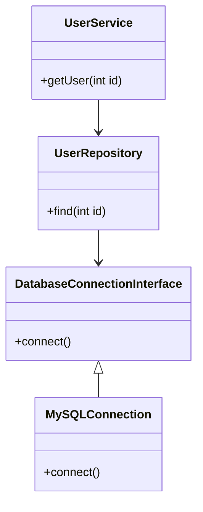

## 5.9 Dependency Injection

Dependency Injection (DI) is a fundamental design pattern in software development that promotes loose coupling and enhances the testability and maintainability of code. In PHP, DI is particularly useful for managing dependencies in complex applications. This section will guide you through the concepts, implementation strategies, and benefits of using Dependency Injection in PHP.

### Understanding Dependency Injection

Dependency Injection is a technique where an object receives its dependencies from an external source rather than creating them itself. This approach allows for greater flexibility and decoupling, as the object is not responsible for managing its dependencies.

#### Key Concepts

- **Dependency**: An object that another object relies on to function.
- **Injection**: The process of providing an object with its dependencies.
- **Inversion of Control (IoC)**: A broader principle where the control of object creation and management is inverted from the object itself to an external entity.

### Implementing Dependency Injection in PHP

There are three primary methods for implementing Dependency Injection in PHP: Constructor Injection, Setter Injection, and Interface Injection. Each method has its own use cases and benefits.

#### Constructor Injection

Constructor Injection involves passing dependencies to an object through its constructor. This method ensures that the object is fully initialized with all its dependencies at the time of creation.

```php
class DatabaseConnection {
    private $host;
    private $user;
    private $password;

    public function __construct($host, $user, $password) {
        $this->host = $host;
        $this->user = $user;
        $this->password = $password;
    }

    // Database connection logic...
}

class UserRepository {
    private $dbConnection;

    public function __construct(DatabaseConnection $dbConnection) {
        $this->dbConnection = $dbConnection;
    }

    // Methods to interact with the database...
}

// Usage
$dbConnection = new DatabaseConnection('localhost', 'root', 'password');
$userRepository = new UserRepository($dbConnection);
```

**Advantages**:
- Ensures all dependencies are available at object creation.
- Promotes immutability by not allowing dependencies to change after construction.

**Disadvantages**:
- Can lead to large constructors if an object has many dependencies.

#### Setter Injection

Setter Injection involves providing dependencies through setter methods after the object has been constructed. This method allows for optional dependencies and more flexible object configuration.

```php
class Logger {
    // Logger implementation...
}

class UserService {
    private $logger;

    public function setLogger(Logger $logger) {
        $this->logger = $logger;
    }

    // Service methods...
}

// Usage
$userService = new UserService();
$logger = new Logger();
$userService->setLogger($logger);
```

**Advantages**:
- Allows for optional dependencies.
- Provides flexibility in changing dependencies at runtime.

**Disadvantages**:
- Dependencies are not guaranteed to be set, which can lead to runtime errors.

#### Interface Injection

Interface Injection involves defining an interface that a class must implement to receive its dependencies. This method is less common but can be useful in certain scenarios.

```php
interface LoggerAwareInterface {
    public function setLogger(Logger $logger);
}

class UserService implements LoggerAwareInterface {
    private $logger;

    public function setLogger(Logger $logger) {
        $this->logger = $logger;
    }

    // Service methods...
}
```

**Advantages**:
- Enforces a contract for dependency provision.
- Useful in frameworks where dependencies are injected automatically.

**Disadvantages**:
- Can lead to more complex code and is less intuitive than other methods.

### Using Type Hints and Interfaces for Loose Coupling

PHP allows for type hinting in function signatures, which can be used to enforce dependency types and promote loose coupling. By using interfaces as type hints, you can ensure that dependencies adhere to a specific contract without being tied to a concrete implementation.

```php
interface DatabaseConnectionInterface {
    public function connect();
}

class MySQLConnection implements DatabaseConnectionInterface {
    public function connect() {
        // MySQL connection logic...
    }
}

class UserRepository {
    private $dbConnection;

    public function __construct(DatabaseConnectionInterface $dbConnection) {
        $this->dbConnection = $dbConnection;
    }

    // Methods to interact with the database...
}
```

### Dependency Injection Containers

A Dependency Injection Container (DIC) is a tool that manages the creation and injection of dependencies. It acts as a registry for services and their dependencies, providing a centralized way to configure and retrieve objects.

#### Managing Dependencies with Containers

PHP-DI is a popular Dependency Injection Container for PHP. It allows you to define services and their dependencies in a configuration file or through code, and then retrieve them from the container.

**Link:** [PHP-DI - Dependency Injection Container](https://php-di.org/)

```php
use DI\ContainerBuilder;

$containerBuilder = new ContainerBuilder();
$containerBuilder->addDefinitions([
    DatabaseConnectionInterface::class => \DI\create(MySQLConnection::class),
    UserRepository::class => \DI\autowire()->constructorParameter('dbConnection', \DI\get(DatabaseConnectionInterface::class)),
]);

$container = $containerBuilder->build();

// Retrieve a UserRepository instance with its dependencies injected
$userRepository = $container->get(UserRepository::class);
```

### Configuring and Retrieving Services

Dependency Injection Containers allow you to configure services and their dependencies in a centralized manner. This configuration can be done through code, annotations, or configuration files, depending on the container used.

#### Benefits of Using Dependency Injection Containers

- **Centralized Configuration**: Manage all dependencies in one place, making it easier to change implementations.
- **Automatic Injection**: Automatically resolve and inject dependencies, reducing boilerplate code.
- **Improved Testability**: Easily mock dependencies for testing purposes.

### Use Cases and Examples

Dependency Injection is particularly beneficial in large applications where components need to be decoupled and easily testable.

#### Enhancing Testability and Maintainability

By injecting dependencies, you can easily replace them with mock objects during testing, allowing for isolated unit tests.

```php
class UserService {
    private $userRepository;

    public function __construct(UserRepository $userRepository) {
        $this->userRepository = $userRepository;
    }

    public function getUser($id) {
        return $this->userRepository->find($id);
    }
}

// Test
class UserServiceTest extends \PHPUnit\Framework\TestCase {
    public function testGetUser() {
        $mockRepository = $this->createMock(UserRepository::class);
        $mockRepository->method('find')->willReturn(new User());

        $userService = new UserService($mockRepository);
        $user = $userService->getUser(1);

        $this->assertInstanceOf(User::class, $user);
    }
}
```

#### Decoupling Components in Large Applications

In large applications, Dependency Injection helps in decoupling components, making it easier to manage and extend the application.

### Visualizing Dependency Injection

To better understand the flow of Dependency Injection, let's visualize the process using a class diagram.



**Diagram Description**: This class diagram illustrates the relationships between `UserService`, `UserRepository`, and `DatabaseConnectionInterface`. `UserService` depends on `UserRepository`, which in turn depends on `DatabaseConnectionInterface`. `MySQLConnection` implements `DatabaseConnectionInterface`, demonstrating how Dependency Injection facilitates loose coupling and flexibility.

### Design Considerations

When implementing Dependency Injection, consider the following:

- **Complexity**: While DI can simplify dependency management, it can also introduce complexity, especially when using a DI container.
- **Performance**: DI containers may introduce a slight performance overhead due to the dynamic resolution of dependencies.
- **Learning Curve**: Understanding and effectively using DI and DI containers may require a learning curve, especially for developers new to the concept.

### PHP Unique Features

PHP's support for type hinting and interfaces makes it well-suited for implementing Dependency Injection. Additionally, PHP's dynamic nature allows for flexible DI container implementations.

### Differences and Similarities

Dependency Injection is often confused with the Service Locator pattern. While both manage dependencies, DI provides dependencies directly to objects, whereas a Service Locator requires objects to request their dependencies.

### Try It Yourself

Experiment with the code examples provided by modifying the dependencies and observing how the application behavior changes. Try implementing a new service and injecting it into an existing class to see how DI facilitates flexibility and maintainability.

### References and Links

- [PHP-DI - Dependency Injection Container](https://php-di.org/)
- [Martin Fowler's Inversion of Control Containers and the Dependency Injection pattern](https://martinfowler.com/articles/injection.html)

### Knowledge Check

- What are the three primary methods of implementing Dependency Injection in PHP?
- How does Dependency Injection enhance testability?
- What is the role of a Dependency Injection Container?

### Embrace the Journey

Remember, mastering Dependency Injection is a journey. As you continue to explore and implement DI in your projects, you'll discover new ways to enhance your code's flexibility and maintainability. Keep experimenting, stay curious, and enjoy the process!

## Quiz: Dependency Injection



### What is Dependency Injection?

- [x] A design pattern that provides an object with its dependencies from an external source.
- [ ] A method for creating objects within a class.
- [ ] A way to hard-code dependencies into a class.
- [ ] A pattern for managing database connections.

> **Explanation:** Dependency Injection is a design pattern where an object receives its dependencies from an external source, promoting loose coupling.

### Which method of Dependency Injection involves passing dependencies through the constructor?

- [x] Constructor Injection
- [ ] Setter Injection
- [ ] Interface Injection
- [ ] Factory Injection

> **Explanation:** Constructor Injection involves passing dependencies to an object through its constructor.

### What is a key advantage of using Dependency Injection?

- [x] Enhances testability by allowing easy replacement of dependencies with mocks.
- [ ] Increases the complexity of code.
- [ ] Ties an object to specific implementations.
- [ ] Reduces the flexibility of code.

> **Explanation:** Dependency Injection enhances testability by allowing dependencies to be easily replaced with mock objects during testing.

### What is the role of a Dependency Injection Container?

- [x] Manages the creation and injection of dependencies.
- [ ] Stores database connections.
- [ ] Provides a user interface for applications.
- [ ] Handles file uploads.

> **Explanation:** A Dependency Injection Container manages the creation and injection of dependencies, providing a centralized way to configure and retrieve objects.

### Which of the following is a disadvantage of Setter Injection?

- [x] Dependencies are not guaranteed to be set, leading to potential runtime errors.
- [ ] Dependencies are hard-coded into the class.
- [ ] It does not allow for optional dependencies.
- [ ] It requires a DI container.

> **Explanation:** Setter Injection allows for optional dependencies, but dependencies are not guaranteed to be set, which can lead to runtime errors.

### How does Dependency Injection promote loose coupling?

- [x] By allowing objects to depend on interfaces rather than concrete implementations.
- [ ] By hard-coding dependencies into classes.
- [ ] By using global variables for dependencies.
- [ ] By creating dependencies within the class.

> **Explanation:** Dependency Injection promotes loose coupling by allowing objects to depend on interfaces rather than concrete implementations, making it easier to change dependencies.

### What is the difference between Dependency Injection and the Service Locator pattern?

- [x] DI provides dependencies directly to objects, while a Service Locator requires objects to request their dependencies.
- [ ] DI and Service Locator are the same pattern.
- [ ] Service Locator provides dependencies directly to objects, while DI requires objects to request their dependencies.
- [ ] DI is used for database connections, while Service Locator is used for logging.

> **Explanation:** Dependency Injection provides dependencies directly to objects, whereas a Service Locator requires objects to request their dependencies.

### Which PHP feature is particularly useful for implementing Dependency Injection?

- [x] Type hinting and interfaces
- [ ] Global variables
- [ ] Static methods
- [ ] Inline functions

> **Explanation:** PHP's support for type hinting and interfaces is particularly useful for implementing Dependency Injection, as it enforces dependency types and promotes loose coupling.

### True or False: Dependency Injection can introduce a slight performance overhead.

- [x] True
- [ ] False

> **Explanation:** Dependency Injection, especially when using a DI container, may introduce a slight performance overhead due to the dynamic resolution of dependencies.

### What is a common use case for Dependency Injection?

- [x] Decoupling components in large applications.
- [ ] Hard-coding dependencies into classes.
- [ ] Using global variables for configuration.
- [ ] Creating singletons for all services.

> **Explanation:** A common use case for Dependency Injection is decoupling components in large applications, making them easier to manage and extend.


