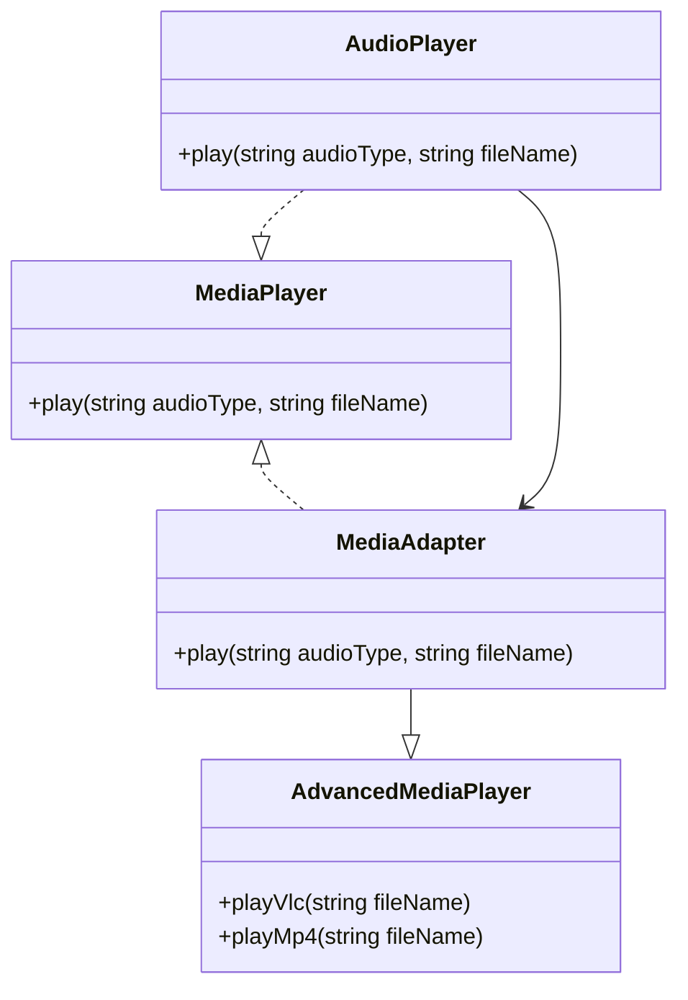
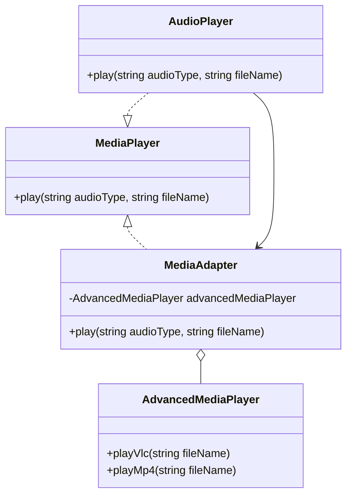

## 6.1 Adapter Pattern

### Intent

The Adapter Pattern is a structural design pattern that allows objects with incompatible interfaces to collaborate. It acts as a bridge between two incompatible interfaces, enabling them to work together without modifying their existing code. This pattern is particularly useful when integrating third-party libraries or APIs, or when working with legacy code that cannot be altered.

### Key Participants

1. **Target Interface**: Defines the domain-specific interface that the client uses.
2. **Client**: Collaborates with objects conforming to the Target interface.
3. **Adaptee**: Defines an existing interface that needs adapting.
4. **Adapter**: Implements the Target interface and translates requests from the client to the Adaptee.

### Applicability

- Use the Adapter Pattern when you need to use an existing class, and its interface does not match the one you need.
- When you want to create a reusable class that cooperates with unrelated or unforeseen classes, that is, classes that do not necessarily have compatible interfaces.
- When you need to integrate third-party libraries or APIs with different interfaces into your application.
- When working with legacy code that cannot be modified, and you need to adapt it to a new interface.

### Implementing Adapter in PHP

#### Class Adapter (Inheritance)

In a class adapter, the adapter inherits from the Adaptee and implements the Target interface. This approach uses inheritance to adapt one interface to another.

```php
<?php

// Target Interface
interface MediaPlayer {
    public function play(string $audioType, string $fileName);
}

// Adaptee Class
class AdvancedMediaPlayer {
    public function playVlc(string $fileName) {
        echo "Playing vlc file: " . $fileName . "\n";
    }

    public function playMp4(string $fileName) {
        echo "Playing mp4 file: " . $fileName . "\n";
    }
}

// Adapter Class
class MediaAdapter extends AdvancedMediaPlayer implements MediaPlayer {
    public function play(string $audioType, string $fileName) {
        if ($audioType === "vlc") {
            $this->playVlc($fileName);
        } elseif ($audioType === "mp4") {
            $this->playMp4($fileName);
        }
    }
}

// Client Code
class AudioPlayer implements MediaPlayer {
    private $mediaAdapter;

    public function play(string $audioType, string $fileName) {
        if ($audioType === "mp3") {
            echo "Playing mp3 file: " . $fileName . "\n";
        } elseif ($audioType === "vlc" || $audioType === "mp4") {
            $this->mediaAdapter = new MediaAdapter();
            $this->mediaAdapter->play($audioType, $fileName);
        } else {
            echo "Invalid media. " . $audioType . " format not supported\n";
        }
    }
}

// Usage
$audioPlayer = new AudioPlayer();
$audioPlayer->play("mp3", "song.mp3");
$audioPlayer->play("mp4", "video.mp4");
$audioPlayer->play("vlc", "movie.vlc");
$audioPlayer->play("avi", "clip.avi");

?>
```

#### Object Adapter (Composition)

In an object adapter, the adapter holds an instance of the Adaptee and delegates calls to it. This approach uses composition to adapt one interface to another.

```php
<?php

// Target Interface
interface MediaPlayer {
    public function play(string $audioType, string $fileName);
}

// Adaptee Class
class AdvancedMediaPlayer {
    public function playVlc(string $fileName) {
        echo "Playing vlc file: " . $fileName . "\n";
    }

    public function playMp4(string $fileName) {
        echo "Playing mp4 file: " . $fileName . "\n";
    }
}

// Adapter Class
class MediaAdapter implements MediaPlayer {
    private $advancedMediaPlayer;

    public function __construct(AdvancedMediaPlayer $advancedMediaPlayer) {
        $this->advancedMediaPlayer = $advancedMediaPlayer;
    }

    public function play(string $audioType, string $fileName) {
        if ($audioType === "vlc") {
            $this->advancedMediaPlayer->playVlc($fileName);
        } elseif ($audioType === "mp4") {
            $this->advancedMediaPlayer->playMp4($fileName);
        }
    }
}

// Client Code
class AudioPlayer implements MediaPlayer {
    private $mediaAdapter;

    public function play(string $audioType, string $fileName) {
        if ($audioType === "mp3") {
            echo "Playing mp3 file: " . $fileName . "\n";
        } elseif ($audioType === "vlc" || $audioType === "mp4") {
            $this->mediaAdapter = new MediaAdapter(new AdvancedMediaPlayer());
            $this->mediaAdapter->play($audioType, $fileName);
        } else {
            echo "Invalid media. " . $audioType . " format not supported\n";
        }
    }
}

// Usage
$audioPlayer = new AudioPlayer();
$audioPlayer->play("mp3", "song.mp3");
$audioPlayer->play("mp4", "video.mp4");
$audioPlayer->play("vlc", "movie.vlc");
$audioPlayer->play("avi", "clip.avi");

?>
```

### Diagrams

#### Class Adapter Diagram



#### Object Adapter Diagram



### Use Cases and Examples

#### Integrating Third-Party Libraries or APIs

When integrating third-party libraries or APIs, you might encounter interfaces that do not match your application's requirements. The Adapter Pattern allows you to create a wrapper that translates your application's requests into a format that the third-party library can understand.

#### Working with Legacy Code

Legacy code often comes with interfaces that are not compatible with modern systems. Instead of rewriting the entire codebase, you can use the Adapter Pattern to create a bridge between the old and new interfaces, allowing you to gradually modernize your application.

### Design Considerations

- **Class vs. Object Adapter**: Choose between class and object adapters based on your needs. Class adapters use inheritance, which can be limiting if the Adaptee class is final. Object adapters use composition, offering more flexibility.
- **Performance**: Consider the performance implications of using adapters, especially if they are used frequently in performance-critical sections of your application.
- **Complexity**: While adapters can simplify integration, they can also add complexity to your codebase. Ensure that the benefits outweigh the added complexity.

### PHP Unique Features

- **Traits**: PHP's traits can be used to share methods between classes, potentially simplifying the creation of adapters by reducing code duplication.
- **Type Declarations**: PHP's type declarations can help ensure that adapters correctly implement the Target interface, catching errors at compile time.

### Differences and Similarities

- **Adapter vs. Facade**: Both patterns provide a simplified interface to a complex system. However, the Adapter Pattern is used to make two incompatible interfaces work together, while the Facade Pattern provides a simplified interface to a set of interfaces in a subsystem.
- **Adapter vs. Proxy**: The Proxy Pattern provides a surrogate or placeholder for another object to control access to it, while the Adapter Pattern changes the interface of an existing object.

### Try It Yourself

Experiment with the provided code examples by modifying the `AdvancedMediaPlayer` class to support additional media formats, such as `avi` or `mkv`. Update the `MediaAdapter` and `AudioPlayer` classes to handle these new formats. This exercise will help you understand how the Adapter Pattern can be extended to accommodate new requirements.

### Knowledge Check

- Explain the difference between class and object adapters.
- Describe a scenario where the Adapter Pattern would be beneficial.
- How does the Adapter Pattern differ from the Facade Pattern?

### Embrace the Journey

Remember, mastering design patterns is a journey. As you continue to explore and implement these patterns, you'll gain a deeper understanding of how to create flexible, maintainable, and robust software solutions. Keep experimenting, stay curious, and enjoy the journey!

## Quiz: Adapter Pattern



### What is the primary intent of the Adapter Pattern?

- [x] To allow incompatible interfaces to work together
- [ ] To provide a simplified interface to a complex system
- [ ] To control access to another object
- [ ] To create a family of related objects

> **Explanation:** The Adapter Pattern is designed to allow incompatible interfaces to work together by acting as a bridge between them.

### Which of the following is a key participant in the Adapter Pattern?

- [x] Target Interface
- [ ] Facade
- [ ] Proxy
- [ ] Singleton

> **Explanation:** The Target Interface is a key participant in the Adapter Pattern, defining the interface that the client uses.

### In PHP, which approach does an object adapter use?

- [x] Composition
- [ ] Inheritance
- [ ] Aggregation
- [ ] Delegation

> **Explanation:** An object adapter uses composition to hold an instance of the Adaptee and delegate calls to it.

### What is a common use case for the Adapter Pattern?

- [x] Integrating third-party libraries with different interfaces
- [ ] Simplifying a complex subsystem
- [ ] Controlling access to a resource
- [ ] Managing object creation

> **Explanation:** The Adapter Pattern is commonly used to integrate third-party libraries or APIs with different interfaces into an application.

### How does the Adapter Pattern differ from the Facade Pattern?

- [x] Adapter changes interfaces, Facade simplifies them
- [ ] Adapter simplifies interfaces, Facade changes them
- [ ] Both change interfaces
- [ ] Both simplify interfaces

> **Explanation:** The Adapter Pattern changes interfaces to make them compatible, while the Facade Pattern simplifies interfaces to a subsystem.

### Which PHP feature can help ensure adapters correctly implement the Target interface?

- [x] Type Declarations
- [ ] Traits
- [ ] Namespaces
- [ ] Magic Methods

> **Explanation:** PHP's type declarations can help ensure that adapters correctly implement the Target interface, catching errors at compile time.

### What is a potential drawback of using the Adapter Pattern?

- [x] Increased complexity
- [ ] Reduced performance
- [ ] Limited flexibility
- [ ] Difficulty in testing

> **Explanation:** While adapters can simplify integration, they can also add complexity to your codebase.

### Which pattern is commonly confused with the Adapter Pattern?

- [x] Facade
- [ ] Observer
- [ ] Singleton
- [ ] Factory

> **Explanation:** The Facade Pattern is commonly confused with the Adapter Pattern, but they serve different purposes.

### True or False: The Adapter Pattern can be used to modernize legacy code.

- [x] True
- [ ] False

> **Explanation:** The Adapter Pattern can be used to create a bridge between legacy code and new interfaces, allowing for gradual modernization.

### What is the main difference between class and object adapters?

- [x] Class adapters use inheritance, object adapters use composition
- [ ] Class adapters use composition, object adapters use inheritance
- [ ] Both use inheritance
- [ ] Both use composition

> **Explanation:** Class adapters use inheritance to adapt interfaces, while object adapters use composition.


