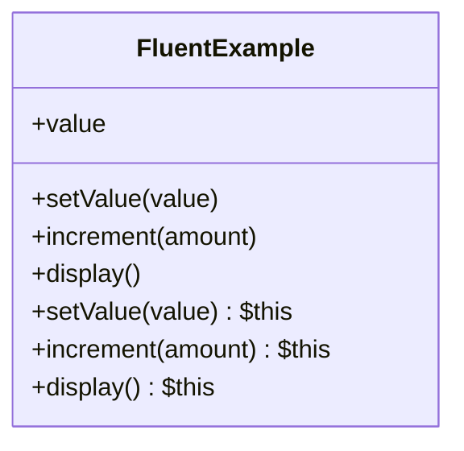

## 6.10 Fluent Interface Pattern

In the realm of software design patterns, the Fluent Interface Pattern stands out for its ability to enhance code readability and expressiveness. This pattern is particularly useful in PHP, where it allows developers to create more intuitive and human-readable code through method chaining. In this section, we will delve into the Fluent Interface Pattern, exploring its intent, implementation, use cases, and benefits in PHP development.

### Intent

The primary intent of the Fluent Interface Pattern is to create an interface that supports method chaining, thereby improving the readability and expressiveness of the code. By returning the same object instance (`$this`) from each method, developers can chain multiple method calls together in a single statement. This approach not only makes the code more concise but also aligns with the natural language flow, making it easier to understand and maintain.

### Implementing Fluent Interface in PHP

To implement the Fluent Interface Pattern in PHP, we need to design methods that return `$this` to enable chaining. Let's explore the steps involved in creating a fluent interface and how it can be applied to build expressive code flows.

#### Designing Methods to Return `$this`

The cornerstone of the Fluent Interface Pattern is the ability of methods to return the current object instance (`$this`). This allows subsequent method calls to be chained together seamlessly. Here's a simple example to illustrate this concept:

```php
class FluentExample {
    private $value;

    public function setValue($value) {
        $this->value = $value;
        return $this; // Return the current instance for chaining
    }

    public function increment($amount) {
        $this->value += $amount;
        return $this;
    }

    public function display() {
        echo $this->value;
        return $this;
    }
}

// Usage
$example = new FluentExample();
$example->setValue(10)->increment(5)->display(); // Outputs: 15
```

In this example, each method returns `$this`, allowing us to chain `setValue`, `increment`, and `display` in a single statement. This chaining results in a more readable and concise code.

#### Implementing Expressive Code Flows

The Fluent Interface Pattern is particularly effective in scenarios where we need to build complex queries or configurations. By chaining methods, we can create expressive code flows that are easy to read and understand. Consider the following example of a query builder:

```php
class QueryBuilder {
    private $query;

    public function select($fields) {
        $this->query = "SELECT " . implode(", ", $fields);
        return $this;
    }

    public function from($table) {
        $this->query .= " FROM " . $table;
        return $this;
    }

    public function where($condition) {
        $this->query .= " WHERE " . $condition;
        return $this;
    }

    public function getQuery() {
        return $this->query;
    }
}

// Usage
$query = (new QueryBuilder())
    ->select(['name', 'email'])
    ->from('users')
    ->where('age > 18')
    ->getQuery();

echo $query; // Outputs: SELECT name, email FROM users WHERE age > 18
```

In this example, the `QueryBuilder` class uses method chaining to construct a SQL query. Each method modifies the query string and returns the current instance, allowing for a fluent and readable query-building process.

### Use Cases and Examples

The Fluent Interface Pattern is versatile and can be applied in various scenarios to enhance code readability and maintainability. Let's explore some common use cases and examples where this pattern shines.

#### Building Complex Queries or Configurations

As demonstrated in the query builder example, the Fluent Interface Pattern is ideal for constructing complex queries or configurations. It allows developers to build queries incrementally, adding conditions and clauses in a natural and readable manner.

#### Enhancing Readability of Object Creation and Setup

Another common use case for the Fluent Interface Pattern is in the creation and setup of objects. By chaining method calls, we can configure objects in a single, cohesive statement. Consider the following example of a configuration builder:

```php
class ConfigBuilder {
    private $config = [];

    public function set($key, $value) {
        $this->config[$key] = $value;
        return $this;
    }

    public function enableFeature($feature) {
        $this->config['features'][$feature] = true;
        return $this;
    }

    public function getConfig() {
        return $this->config;
    }
}

// Usage
$config = (new ConfigBuilder())
    ->set('app_name', 'MyApp')
    ->enableFeature('dark_mode')
    ->getConfig();

print_r($config);
```

In this example, the `ConfigBuilder` class uses method chaining to set configuration options and enable features. The resulting code is concise and easy to read, making it clear what configuration options are being set.

### Design Considerations

When implementing the Fluent Interface Pattern, there are several design considerations to keep in mind:

- **Consistency:** Ensure that all methods in the fluent interface return `$this` to maintain a consistent chaining experience.
- **Readability:** While method chaining can enhance readability, excessive chaining can lead to long and unwieldy statements. Strive for a balance between conciseness and clarity.
- **Error Handling:** Consider how errors will be handled in a fluent interface. Returning `$this` may obscure errors, so it's important to implement appropriate error handling mechanisms.
- **Immutability:** In some cases, it may be beneficial to implement a fluent interface with immutable objects. This approach can prevent unintended side effects and improve code safety.

### PHP Unique Features

PHP offers several unique features that can enhance the implementation of the Fluent Interface Pattern:

- **Magic Methods:** PHP's magic methods, such as `__call`, can be used to dynamically handle method calls in a fluent interface. This can be useful for creating flexible and extensible interfaces.
- **Traits:** PHP traits can be used to encapsulate common fluent interface logic, allowing for code reuse across multiple classes.
- **Anonymous Classes:** PHP's support for anonymous classes can be leveraged to create lightweight and disposable fluent interfaces for specific use cases.

### Differences and Similarities

The Fluent Interface Pattern is often compared to the Builder Pattern, as both involve method chaining. However, there are key differences:

- **Fluent Interface:** Focuses on enhancing readability through method chaining, often used for configuring objects or building queries.
- **Builder Pattern:** A creational pattern that separates the construction of a complex object from its representation, often used for constructing objects step-by-step.

While both patterns use method chaining, the Fluent Interface Pattern is more focused on readability and expressiveness, whereas the Builder Pattern is concerned with the construction process.

### Visualizing the Fluent Interface Pattern

To better understand the Fluent Interface Pattern, let's visualize the flow of method chaining using a class diagram:



In this diagram, we see the `FluentExample` class with its methods returning `$this`, enabling method chaining. Each method modifies the internal state and returns the current instance, allowing for a fluent and expressive code flow.

### Try It Yourself

To fully grasp the Fluent Interface Pattern, try modifying the code examples provided. Experiment with adding new methods to the `QueryBuilder` or `ConfigBuilder` classes, and see how they can be chained together. Consider implementing error handling or immutability in your fluent interfaces to explore different design considerations.

### References and Links

For further reading on the Fluent Interface Pattern and related concepts, consider exploring the following resources:

- [PHP Manual: Classes and Objects](https://www.php.net/manual/en/language.oop5.php)
- [Martin Fowler's Article on Fluent Interface](https://martinfowler.com/bliki/FluentInterface.html)
- [PHP Traits](https://www.php.net/manual/en/language.oop5.traits.php)

### Knowledge Check

Before moving on, let's reinforce what we've learned about the Fluent Interface Pattern. Consider the following questions and challenges:

- What is the primary intent of the Fluent Interface Pattern?
- How does method chaining enhance code readability?
- What are some common use cases for the Fluent Interface Pattern?
- How can PHP's unique features, such as traits and magic methods, be leveraged in a fluent interface?
- Try implementing a fluent interface for a different use case, such as a form builder or an API client.

### Embrace the Journey

Remember, mastering design patterns is a journey. The Fluent Interface Pattern is just one tool in your PHP development toolkit. As you continue to explore and experiment with different patterns, you'll gain a deeper understanding of how to write clean, maintainable, and expressive code. Keep experimenting, stay curious, and enjoy the journey!

## Quiz: Fluent Interface Pattern



### What is the primary intent of the Fluent Interface Pattern?

- [x] To create an interface that allows for method chaining, improving code readability.
- [ ] To separate the construction of a complex object from its representation.
- [ ] To encapsulate a group of individual factories with a common goal.
- [ ] To provide a simplified interface to a complex subsystem.

> **Explanation:** The Fluent Interface Pattern is designed to enhance code readability by allowing method chaining.

### Which PHP feature is essential for implementing the Fluent Interface Pattern?

- [x] Returning `$this` from methods.
- [ ] Using static methods.
- [ ] Implementing interfaces.
- [ ] Using global variables.

> **Explanation:** Returning `$this` from methods is crucial for enabling method chaining in a fluent interface.

### What is a common use case for the Fluent Interface Pattern?

- [x] Building complex queries or configurations.
- [ ] Implementing a singleton pattern.
- [ ] Managing database connections.
- [ ] Handling user authentication.

> **Explanation:** The Fluent Interface Pattern is often used for building complex queries or configurations due to its readability.

### How can PHP traits be used in a fluent interface?

- [x] To encapsulate common fluent interface logic for reuse.
- [ ] To enforce method signatures.
- [ ] To manage database transactions.
- [ ] To handle exceptions.

> **Explanation:** PHP traits can encapsulate common logic, making it reusable across multiple classes in a fluent interface.

### What is a potential drawback of excessive method chaining?

- [x] It can lead to long and unwieldy statements.
- [ ] It increases memory usage.
- [ ] It reduces code execution speed.
- [ ] It complicates error handling.

> **Explanation:** Excessive method chaining can result in long statements that are difficult to read and maintain.

### How does the Fluent Interface Pattern differ from the Builder Pattern?

- [x] The Fluent Interface focuses on readability, while the Builder Pattern focuses on object construction.
- [ ] The Fluent Interface is a creational pattern, while the Builder Pattern is structural.
- [ ] The Fluent Interface uses static methods, while the Builder Pattern uses instance methods.
- [ ] The Fluent Interface is used for database interactions, while the Builder Pattern is not.

> **Explanation:** The Fluent Interface Pattern enhances readability, whereas the Builder Pattern is concerned with constructing complex objects.

### What is a benefit of using immutable objects in a fluent interface?

- [x] It prevents unintended side effects and improves code safety.
- [ ] It reduces the number of method calls.
- [ ] It simplifies error handling.
- [ ] It increases code execution speed.

> **Explanation:** Immutable objects prevent side effects, making the code safer and more predictable.

### Which PHP feature can dynamically handle method calls in a fluent interface?

- [x] Magic methods like `__call`.
- [ ] Static methods.
- [ ] Interfaces.
- [ ] Global variables.

> **Explanation:** Magic methods such as `__call` can dynamically handle method calls, providing flexibility in a fluent interface.

### What should be considered when implementing error handling in a fluent interface?

- [x] How errors will be communicated without breaking the chain.
- [ ] How to increase method chaining length.
- [ ] How to reduce the number of methods.
- [ ] How to use global variables for error tracking.

> **Explanation:** It's important to implement error handling that doesn't disrupt the method chaining process.

### True or False: The Fluent Interface Pattern is only applicable in PHP.

- [ ] True
- [x] False

> **Explanation:** The Fluent Interface Pattern is a general design pattern applicable in many programming languages, not just PHP.


