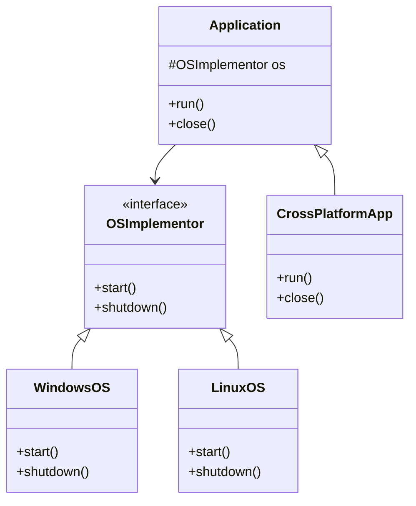

## 6.2 Bridge Pattern

The Bridge Pattern is a structural design pattern that plays a crucial role in software architecture by decoupling an abstraction from its implementation. This separation allows both the abstraction and the implementation to evolve independently, providing flexibility and scalability in software design.

### Intent

The primary intent of the Bridge Pattern is to separate the abstraction from its implementation so that both can be modified independently without affecting each other. This pattern is particularly useful when dealing with complex hierarchies that have multiple dimensions of variation.

### Key Participants

1. **Abstraction**: Defines the abstraction's interface and maintains a reference to an object of type Implementor.
2. **Refined Abstraction**: Extends the interface defined by Abstraction.
3. **Implementor**: Defines the interface for implementation classes.
4. **Concrete Implementor**: Implements the Implementor interface and defines its concrete implementation.

### Applicability

- Use the Bridge Pattern when you want to avoid a permanent binding between an abstraction and its implementation.
- Apply this pattern when both the abstractions and their implementations should be extensible by subclassing.
- Use it when changes in the implementation of an abstraction should not affect clients.

### Implementing Bridge in PHP

In PHP, the Bridge Pattern can be implemented using interfaces and composition. Let's explore how to achieve this with a practical example.

#### Example: Cross-Platform Application Development

Consider a scenario where we need to develop a cross-platform application that supports both Windows and Linux operating systems. We want to separate the abstraction of the application from the specific implementation details of each operating system.

```php
<?php

// Implementor Interface
interface OSImplementor {
    public function start();
    public function shutdown();
}

// Concrete Implementor for Windows
class WindowsOS implements OSImplementor {
    public function start() {
        echo "Starting Windows OS...\n";
    }

    public function shutdown() {
        echo "Shutting down Windows OS...\n";
    }
}

// Concrete Implementor for Linux
class LinuxOS implements OSImplementor {
    public function start() {
        echo "Starting Linux OS...\n";
    }

    public function shutdown() {
        echo "Shutting down Linux OS...\n";
    }
}

// Abstraction
abstract class Application {
    protected $os;

    public function __construct(OSImplementor $os) {
        $this->os = $os;
    }

    abstract public function run();
    abstract public function close();
}

// Refined Abstraction
class CrossPlatformApp extends Application {
    public function run() {
        echo "Running application on ";
        $this->os->start();
    }

    public function close() {
        echo "Closing application on ";
        $this->os->shutdown();
    }
}

// Client code
$windowsApp = new CrossPlatformApp(new WindowsOS());
$windowsApp->run();
$windowsApp->close();

$linuxApp = new CrossPlatformApp(new LinuxOS());
$linuxApp->run();
$linuxApp->close();

?>
```

In this example, the `OSImplementor` interface defines the operations that both `WindowsOS` and `LinuxOS` classes implement. The `Application` class acts as the abstraction, and `CrossPlatformApp` is a refined abstraction that uses the `OSImplementor` interface to perform operations.

### Design Considerations

- **Decoupling**: The Bridge Pattern effectively decouples the abstraction from its implementation, allowing both to vary independently.
- **Complexity**: While the pattern provides flexibility, it can introduce complexity by requiring additional classes and interfaces.
- **Performance**: The pattern might introduce a slight performance overhead due to the indirection between abstraction and implementation.

### PHP Unique Features

PHP's dynamic nature and support for interfaces and abstract classes make it well-suited for implementing the Bridge Pattern. The use of interfaces allows for flexible and interchangeable implementations.

### Differences and Similarities

The Bridge Pattern is often confused with the Adapter Pattern. While both patterns involve interfaces, the Adapter Pattern is used to make incompatible interfaces compatible, whereas the Bridge Pattern is used to separate abstraction from implementation.

### Visualizing the Bridge Pattern

To better understand the Bridge Pattern, let's visualize the relationship between the components using a class diagram.



This diagram illustrates how the `Application` class maintains a reference to the `OSImplementor` interface, allowing it to interact with different operating system implementations.

### Use Cases and Examples

The Bridge Pattern is particularly useful in scenarios where you need to manage complex hierarchies with multiple dimensions of variation. Some common use cases include:

- **Cross-Platform Applications**: As demonstrated in the example, the Bridge Pattern is ideal for developing applications that need to run on multiple platforms.
- **Graphic Libraries**: Separating the abstraction of graphic shapes from their rendering implementations.
- **Device Drivers**: Decoupling the abstraction of device operations from the specific hardware implementations.

### Try It Yourself

To deepen your understanding of the Bridge Pattern, try modifying the code example to add a new operating system, such as macOS. Implement the `OSImplementor` interface for macOS and test it with the `CrossPlatformApp` class.

### Knowledge Check

- What is the primary intent of the Bridge Pattern?
- How does the Bridge Pattern differ from the Adapter Pattern?
- What are the key participants in the Bridge Pattern?
- How can the Bridge Pattern be applied in cross-platform application development?

### Embrace the Journey

Remember, mastering design patterns is a journey. The Bridge Pattern is just one of many patterns that can enhance your PHP development skills. Keep experimenting, stay curious, and enjoy the process of learning and applying design patterns in your projects.

## Quiz: Bridge Pattern



### What is the primary intent of the Bridge Pattern?

- [x] To decouple an abstraction from its implementation
- [ ] To adapt incompatible interfaces
- [ ] To provide a simplified interface to a complex system
- [ ] To ensure a class has only one instance

> **Explanation:** The Bridge Pattern aims to decouple an abstraction from its implementation, allowing them to vary independently.

### Which of the following is a key participant in the Bridge Pattern?

- [x] Abstraction
- [ ] Adapter
- [ ] Facade
- [x] Implementor

> **Explanation:** The key participants in the Bridge Pattern include Abstraction and Implementor, among others.

### How does the Bridge Pattern differ from the Adapter Pattern?

- [x] The Bridge Pattern separates abstraction from implementation, while the Adapter Pattern makes incompatible interfaces compatible.
- [ ] The Bridge Pattern is used for creating singletons, while the Adapter Pattern is used for creating factories.
- [ ] The Bridge Pattern is used for simplifying interfaces, while the Adapter Pattern is used for creating complex systems.
- [ ] The Bridge Pattern is used for creating complex systems, while the Adapter Pattern is used for simplifying interfaces.

> **Explanation:** The Bridge Pattern focuses on separating abstraction from implementation, whereas the Adapter Pattern focuses on making incompatible interfaces compatible.

### In the provided PHP example, what role does the `OSImplementor` interface play?

- [x] It defines the interface for implementation classes.
- [ ] It acts as the abstraction.
- [ ] It is a concrete implementor.
- [ ] It is a refined abstraction.

> **Explanation:** The `OSImplementor` interface defines the interface for implementation classes in the Bridge Pattern.

### What is a common use case for the Bridge Pattern?

- [x] Developing cross-platform applications
- [ ] Creating singletons
- [ ] Simplifying complex interfaces
- [ ] Ensuring a class has only one instance

> **Explanation:** The Bridge Pattern is commonly used in developing cross-platform applications where abstraction and implementation need to vary independently.

### What is the role of the `CrossPlatformApp` class in the provided example?

- [x] It is a refined abstraction that uses the `OSImplementor` interface.
- [ ] It is a concrete implementor.
- [ ] It defines the interface for implementation classes.
- [ ] It acts as the abstraction.

> **Explanation:** The `CrossPlatformApp` class is a refined abstraction that uses the `OSImplementor` interface to perform operations.

### How can the Bridge Pattern help in managing complex hierarchies?

- [x] By separating abstraction from implementation, allowing them to vary independently.
- [ ] By adapting incompatible interfaces.
- [ ] By providing a simplified interface to a complex system.
- [ ] By ensuring a class has only one instance.

> **Explanation:** The Bridge Pattern helps manage complex hierarchies by separating abstraction from implementation, allowing them to vary independently.

### What is a potential drawback of using the Bridge Pattern?

- [x] It can introduce complexity by requiring additional classes and interfaces.
- [ ] It can lead to tight coupling between abstraction and implementation.
- [ ] It can make incompatible interfaces compatible.
- [ ] It can simplify complex interfaces.

> **Explanation:** While the Bridge Pattern provides flexibility, it can introduce complexity by requiring additional classes and interfaces.

### What PHP feature makes it well-suited for implementing the Bridge Pattern?

- [x] Support for interfaces and abstract classes
- [ ] Support for global variables
- [ ] Support for singletons
- [ ] Support for complex hierarchies

> **Explanation:** PHP's support for interfaces and abstract classes makes it well-suited for implementing the Bridge Pattern.

### True or False: The Bridge Pattern is often used to ensure a class has only one instance.

- [ ] True
- [x] False

> **Explanation:** False. The Bridge Pattern is not used to ensure a class has only one instance; that is the intent of the Singleton Pattern.




