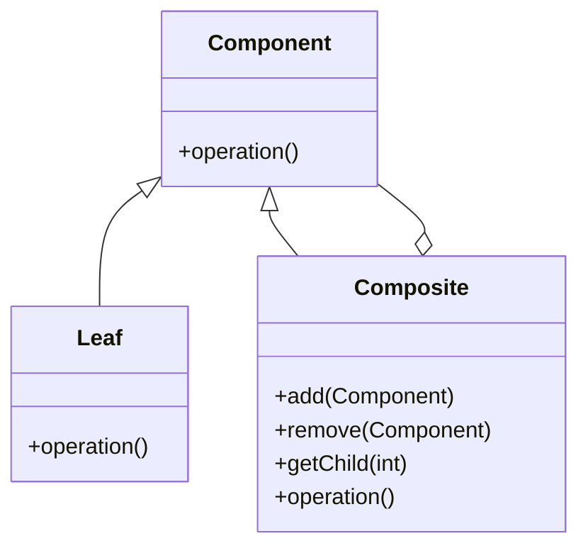

## 6.3 Composite Pattern

The Composite Pattern is a structural design pattern that allows you to compose objects into tree structures to represent part-whole hierarchies. This pattern enables clients to treat individual objects and compositions of objects uniformly. In this section, we will delve into the Composite Pattern, exploring its intent, structure, implementation in PHP, and practical use cases.

### Intent

The primary intent of the Composite Pattern is to allow clients to work with individual objects and compositions of objects uniformly. This is achieved by defining a common interface for both simple and complex objects. The Composite Pattern is particularly useful when you need to represent hierarchical structures, such as organizational charts, file systems, or UI components.

### Key Participants

1. **Component**: An interface or abstract class that defines the common operations for both leaf and composite objects.
2. **Leaf**: Represents the individual objects in the composition. A leaf has no children.
3. **Composite**: Represents a composite object that can have children. It implements the component interface and defines operations for managing child components.
4. **Client**: Interacts with the objects in the composition through the component interface.

### Diagrams

To better understand the Composite Pattern, let's visualize its structure using a class diagram.



**Diagram Description:** The diagram above illustrates the relationship between the Component, Leaf, and Composite classes. The Composite class can contain multiple Component objects, allowing for the creation of complex tree structures.

### Implementing Composite in PHP

To implement the Composite Pattern in PHP, follow these steps:

1. **Define a Component Interface**: Create an interface that declares the common operations for both leaf and composite objects.

```php
<?php

interface Component
{
    public function operation(): string;
}
```

2. **Implement Leaf Class**: Create a class that represents the leaf objects. This class implements the Component interface and provides an implementation for the operation.

```php
<?php

class Leaf implements Component
{
    private $name;

    public function __construct(string $name)
    {
        $this->name = $name;
    }

    public function operation(): string
    {
        return "Leaf: " . $this->name;
    }
}
```

3. **Implement Composite Class**: Create a class that represents the composite objects. This class implements the Component interface and maintains a collection of child components.

```php
<?php

class Composite implements Component
{
    private $children = [];

    public function add(Component $component): void
    {
        $this->children[] = $component;
    }

    public function remove(Component $component): void
    {
        $this->children = array_filter($this->children, function ($child) use ($component) {
            return $child !== $component;
        });
    }

    public function operation(): string
    {
        $results = [];
        foreach ($this->children as $child) {
            $results[] = $child->operation();
        }
        return "Composite: [" . implode(", ", $results) . "]";
    }
}
```

4. **Client Code**: Use the Component interface to interact with both leaf and composite objects.

```php
<?php

function clientCode(Component $component)
{
    echo $component->operation() . PHP_EOL;
}

$leaf1 = new Leaf("Leaf 1");
$leaf2 = new Leaf("Leaf 2");

$composite = new Composite();
$composite->add($leaf1);
$composite->add($leaf2);

clientCode($leaf1); // Output: Leaf: Leaf 1
clientCode($composite); // Output: Composite: [Leaf: Leaf 1, Leaf: Leaf 2]
```

### Use Cases and Examples

The Composite Pattern is versatile and can be applied in various scenarios. Here are some common use cases:

1. **File Systems**: Representing files and directories in a hierarchical structure.
2. **Organizational Structures**: Modeling departments and employees in a company.
3. **UI Components**: Building complex user interfaces with nested components.

#### Example: File System

Let's consider a file system where files and directories are represented using the Composite Pattern.

```php
<?php

interface FileSystemComponent
{
    public function display(): string;
}

class File implements FileSystemComponent
{
    private $name;

    public function __construct(string $name)
    {
        $this->name = $name;
    }

    public function display(): string
    {
        return "File: " . $this->name;
    }
}

class Directory implements FileSystemComponent
{
    private $name;
    private $children = [];

    public function __construct(string $name)
    {
        $this->name = $name;
    }

    public function add(FileSystemComponent $component): void
    {
        $this->children[] = $component;
    }

    public function display(): string
    {
        $results = [];
        foreach ($this->children as $child) {
            $results[] = $child->display();
        }
        return "Directory: " . $this->name . " [" . implode(", ", $results) . "]";
    }
}

$file1 = new File("file1.txt");
$file2 = new File("file2.txt");

$directory = new Directory("Documents");
$directory->add($file1);
$directory->add($file2);

echo $directory->display(); // Output: Directory: Documents [File: file1.txt, File: file2.txt]
```

### Design Considerations

When implementing the Composite Pattern, consider the following:

- **Uniformity**: Ensure that the Component interface is sufficiently general to accommodate both leaf and composite objects.
- **Efficiency**: Be mindful of the performance implications of recursive operations on large hierarchies.
- **Flexibility**: The Composite Pattern provides flexibility in managing complex structures, but it may introduce complexity in the implementation.

### PHP Unique Features

PHP offers several features that can enhance the implementation of the Composite Pattern:

- **Type Declarations**: Use type declarations to enforce the types of components in the hierarchy.
- **Anonymous Classes**: PHP's support for anonymous classes can be leveraged to create lightweight components on the fly.
- **Traits**: Use traits to share common functionality among components.

### Differences and Similarities

The Composite Pattern is often compared to other structural patterns, such as the Decorator Pattern. While both patterns involve composing objects, the Composite Pattern focuses on part-whole hierarchies, whereas the Decorator Pattern focuses on adding responsibilities to objects dynamically.

### Try It Yourself

Experiment with the Composite Pattern by modifying the code examples provided. Here are some suggestions:

- Add a method to count the number of leaf nodes in a composite structure.
- Implement a method to find a specific component by name.
- Extend the file system example to include additional file types, such as images or videos.

### Knowledge Check

- What is the primary intent of the Composite Pattern?
- How does the Composite Pattern enable uniform treatment of individual and composite objects?
- What are some common use cases for the Composite Pattern?

### Embrace the Journey

Remember, mastering design patterns is a journey. As you explore the Composite Pattern, consider how it can be applied to solve real-world problems in your PHP applications. Keep experimenting, stay curious, and enjoy the journey!

## Quiz: Composite Pattern



### What is the primary intent of the Composite Pattern?

- [x] To compose objects into tree structures to represent part-whole hierarchies.
- [ ] To add responsibilities to objects dynamically.
- [ ] To provide a way to create families of related objects.
- [ ] To define a one-to-many dependency between objects.

> **Explanation:** The Composite Pattern's primary intent is to compose objects into tree structures to represent part-whole hierarchies, allowing clients to treat individual objects and compositions uniformly.

### Which of the following is a key participant in the Composite Pattern?

- [x] Component
- [ ] Adapter
- [ ] Proxy
- [ ] Singleton

> **Explanation:** The Component is a key participant in the Composite Pattern, serving as the common interface for both leaf and composite objects.

### In the Composite Pattern, what does the Leaf class represent?

- [x] Individual objects in the composition.
- [ ] Composite objects that can have children.
- [ ] The client interacting with the objects.
- [ ] The interface defining common operations.

> **Explanation:** The Leaf class represents individual objects in the composition, which have no children.

### What is a common use case for the Composite Pattern?

- [x] Representing file systems.
- [ ] Implementing caching mechanisms.
- [ ] Managing database connections.
- [ ] Creating singleton instances.

> **Explanation:** A common use case for the Composite Pattern is representing file systems, where files and directories form a hierarchical structure.

### How does the Composite Pattern handle recursive operations?

- [x] By defining operations in the Composite class that iterate over child components.
- [ ] By using a separate recursive function outside the pattern.
- [ ] By relying on external libraries for recursion.
- [ ] By avoiding recursion altogether.

> **Explanation:** The Composite Pattern handles recursive operations by defining operations in the Composite class that iterate over child components, allowing for hierarchical processing.

### What PHP feature can enhance the implementation of the Composite Pattern?

- [x] Type Declarations
- [ ] Global Variables
- [ ] Static Methods
- [ ] Procedural Programming

> **Explanation:** Type Declarations in PHP can enhance the implementation of the Composite Pattern by enforcing the types of components in the hierarchy.

### Which pattern is often compared to the Composite Pattern?

- [x] Decorator Pattern
- [ ] Singleton Pattern
- [ ] Factory Pattern
- [ ] Observer Pattern

> **Explanation:** The Decorator Pattern is often compared to the Composite Pattern, as both involve composing objects, but they serve different purposes.

### What is a potential drawback of the Composite Pattern?

- [x] It may introduce complexity in the implementation.
- [ ] It cannot handle hierarchical structures.
- [ ] It is not suitable for object-oriented programming.
- [ ] It lacks flexibility in managing structures.

> **Explanation:** A potential drawback of the Composite Pattern is that it may introduce complexity in the implementation, especially for large hierarchies.

### True or False: The Composite Pattern allows clients to treat individual objects and compositions uniformly.

- [x] True
- [ ] False

> **Explanation:** True. The Composite Pattern allows clients to treat individual objects and compositions uniformly by defining a common interface for both.

### What is a benefit of using the Composite Pattern?

- [x] It provides flexibility in managing complex structures.
- [ ] It simplifies the creation of singleton instances.
- [ ] It enhances procedural programming.
- [ ] It reduces the need for object-oriented design.

> **Explanation:** A benefit of using the Composite Pattern is that it provides flexibility in managing complex structures, allowing for easy addition and removal of components.



---
