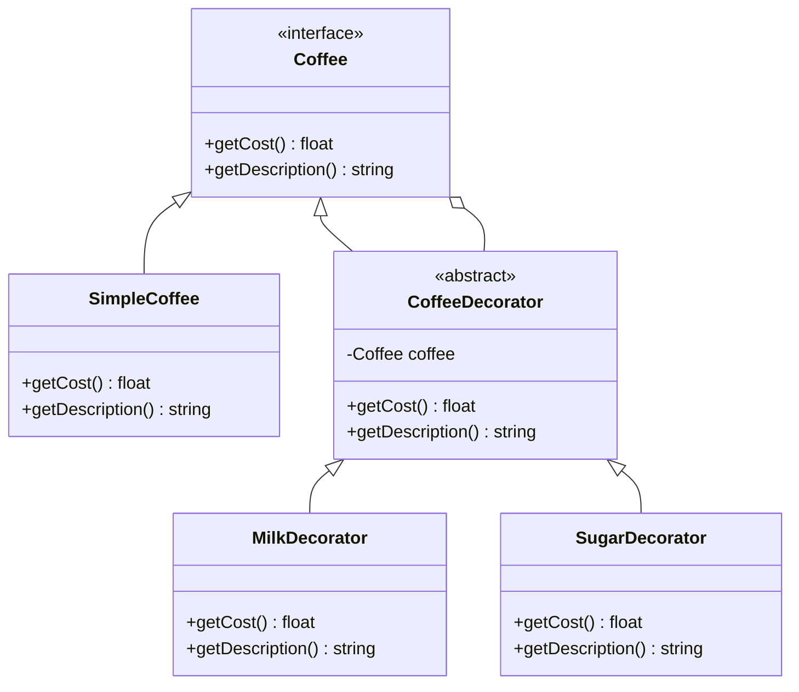

## 6.4 Decorator Pattern

The Decorator Pattern is a structural design pattern that allows behavior to be added to individual objects, either statically or dynamically, without affecting the behavior of other objects from the same class. This pattern is particularly useful in PHP for enhancing the functionality of objects in a flexible and reusable manner.

### Intent

The primary intent of the Decorator Pattern is to add new responsibilities to objects dynamically without altering their structure. This is achieved by creating a set of decorator classes that are used to wrap concrete components.

### Key Participants

1. **Component**: An interface or abstract class defining the object interface.
2. **ConcreteComponent**: A class that implements the Component interface.
3. **Decorator**: An abstract class that implements the Component interface and contains a reference to a Component object.
4. **ConcreteDecorator**: A class that extends the Decorator class and adds responsibilities to the Component.

### Applicability

Use the Decorator Pattern when:
- You want to add responsibilities to individual objects dynamically and transparently, without affecting other objects.
- You need to extend the functionality of classes in a flexible and reusable way.
- Subclassing would result in an explosion of subclasses to support every combination of features.

### Implementing Decorator in PHP

To implement the Decorator Pattern in PHP, follow these steps:

1. **Define the Component Interface**: This interface will be implemented by both the concrete component and the decorators.
2. **Create Concrete Components**: These are the objects to which additional responsibilities can be attached.
3. **Create the Decorator Class**: This class implements the component interface and holds a reference to a component object.
4. **Create Concrete Decorators**: These classes extend the decorator class and add additional responsibilities.

#### Example: Coffee Shop

Let's consider a coffee shop scenario where we want to dynamically add ingredients to a coffee order.

```php
<?php

// Component Interface
interface Coffee {
    public function getCost(): float;
    public function getDescription(): string;
}

// Concrete Component
class SimpleCoffee implements Coffee {
    public function getCost(): float {
        return 5.0;
    }

    public function getDescription(): string {
        return "Simple Coffee";
    }
}

// Decorator
abstract class CoffeeDecorator implements Coffee {
    protected $coffee;

    public function __construct(Coffee $coffee) {
        $this->coffee = $coffee;
    }

    public function getCost(): float {
        return $this->coffee->getCost();
    }

    public function getDescription(): string {
        return $this->coffee->getDescription();
    }
}

// Concrete Decorators
class MilkDecorator extends CoffeeDecorator {
    public function getCost(): float {
        return $this->coffee->getCost() + 1.5;
    }

    public function getDescription(): string {
        return $this->coffee->getDescription() . ", Milk";
    }
}

class SugarDecorator extends CoffeeDecorator {
    public function getCost(): float {
        return $this->coffee->getCost() + 0.5;
    }

    public function getDescription(): string {
        return $this->coffee->getDescription() . ", Sugar";
    }
}

// Client Code
$coffee = new SimpleCoffee();
echo $coffee->getDescription() . " costs $" . $coffee->getCost() . "\n";

$coffeeWithMilk = new MilkDecorator($coffee);
echo $coffeeWithMilk->getDescription() . " costs $" . $coffeeWithMilk->getCost() . "\n";

$coffeeWithMilkAndSugar = new SugarDecorator($coffeeWithMilk);
echo $coffeeWithMilkAndSugar->getDescription() . " costs $" . $coffeeWithMilkAndSugar->getCost() . "\n";

?>
```

### Visualizing the Decorator Pattern

Below is a class diagram representing the Decorator Pattern:



### Use Cases and Examples

The Decorator Pattern is widely used in scenarios where you need to add functionalities like logging, validation, or formatting to objects. Here are some common use cases:

1. **Logging**: Adding logging functionality to objects without modifying their code.
2. **Validation**: Applying validation rules to objects dynamically.
3. **Formatting**: Changing the format of data output by objects.

#### Example: Logging

Consider a scenario where we want to add logging to a data processing component.

```php
<?php

// Component Interface
interface DataProcessor {
    public function process(string $data): string;
}

// Concrete Component
class SimpleDataProcessor implements DataProcessor {
    public function process(string $data): string {
        return strtoupper($data);
    }
}

// Decorator
abstract class DataProcessorDecorator implements DataProcessor {
    protected $processor;

    public function __construct(DataProcessor $processor) {
        $this->processor = $processor;
    }

    public function process(string $data): string {
        return $this->processor->process($data);
    }
}

// Concrete Decorator
class LoggingDecorator extends DataProcessorDecorator {
    public function process(string $data): string {
        echo "Logging: Processing data...\n";
        return $this->processor->process($data);
    }
}

// Client Code
$processor = new SimpleDataProcessor();
$loggedProcessor = new LoggingDecorator($processor);

echo $loggedProcessor->process("Hello World");

?>
```

### Design Considerations

When using the Decorator Pattern, consider the following:

- **Transparency**: Ensure that decorators are transparent to the client. The client should not need to know whether it is dealing with a decorated or undecorated component.
- **Performance**: Be mindful of the performance overhead introduced by multiple layers of decorators.
- **Complexity**: Avoid creating too many decorators, as this can lead to a complex and hard-to-maintain codebase.

### PHP Unique Features

PHP offers several features that make implementing the Decorator Pattern straightforward:

- **Interfaces**: PHP's support for interfaces allows for flexible and consistent implementation of the Decorator Pattern.
- **Type Hinting**: PHP's type hinting ensures that decorators and components adhere to the same interface.
- **Anonymous Classes**: PHP's anonymous classes can be used to create decorators on-the-fly for quick and temporary use cases.

### Differences and Similarities

The Decorator Pattern is often confused with the Proxy Pattern. While both involve wrapping objects, the key difference is in their intent:

- **Decorator Pattern**: Focuses on adding responsibilities to objects dynamically.
- **Proxy Pattern**: Focuses on controlling access to objects.

### Try It Yourself

Experiment with the Decorator Pattern by modifying the code examples provided. Try adding new decorators, such as a `WhippedCreamDecorator` or a `CaramelDecorator`, to the coffee example. Observe how easily you can extend the functionality without altering the existing code.

### Knowledge Check

- What is the primary intent of the Decorator Pattern?
- How does the Decorator Pattern differ from subclassing?
- What are some common use cases for the Decorator Pattern?

### Embrace the Journey

Remember, mastering design patterns like the Decorator Pattern is a journey. As you continue to explore and experiment, you'll discover new ways to enhance your PHP applications. Keep learning, stay curious, and enjoy the process!

## Quiz: Decorator Pattern



### What is the primary intent of the Decorator Pattern?

- [x] To add new responsibilities to objects dynamically without altering their structure.
- [ ] To create a single instance of a class.
- [ ] To provide a simplified interface to a complex system.
- [ ] To separate the construction of a complex object from its representation.

> **Explanation:** The Decorator Pattern is designed to add new responsibilities to objects dynamically without altering their structure.

### Which of the following is a key participant in the Decorator Pattern?

- [x] Component
- [x] Decorator
- [ ] Singleton
- [ ] Factory

> **Explanation:** The key participants in the Decorator Pattern include the Component, ConcreteComponent, Decorator, and ConcreteDecorator.

### How does the Decorator Pattern differ from subclassing?

- [x] It allows adding responsibilities dynamically at runtime.
- [ ] It requires modifying the base class.
- [ ] It creates a new class for each feature.
- [ ] It is used only for logging purposes.

> **Explanation:** The Decorator Pattern allows adding responsibilities dynamically at runtime, unlike subclassing which requires static inheritance.

### What is a common use case for the Decorator Pattern?

- [x] Adding logging functionality to objects.
- [ ] Creating a single instance of a class.
- [ ] Simplifying a complex system.
- [ ] Separating construction from representation.

> **Explanation:** A common use case for the Decorator Pattern is adding logging functionality to objects.

### Which PHP feature is particularly useful for implementing the Decorator Pattern?

- [x] Interfaces
- [ ] Singleton
- [ ] Abstract Factory
- [ ] Iterator

> **Explanation:** PHP's support for interfaces is particularly useful for implementing the Decorator Pattern, as it allows for flexible and consistent implementation.

### What is the role of the ConcreteDecorator in the Decorator Pattern?

- [x] To add additional responsibilities to the Component.
- [ ] To define the object interface.
- [ ] To control access to the Component.
- [ ] To create a single instance of a class.

> **Explanation:** The ConcreteDecorator adds additional responsibilities to the Component in the Decorator Pattern.

### How can performance be affected by using the Decorator Pattern?

- [x] Multiple layers of decorators can introduce performance overhead.
- [ ] It always improves performance.
- [ ] It has no impact on performance.
- [ ] It reduces the number of classes.

> **Explanation:** Multiple layers of decorators can introduce performance overhead, so it's important to be mindful of this when using the Decorator Pattern.

### What is the difference between the Decorator Pattern and the Proxy Pattern?

- [x] The Decorator Pattern adds responsibilities, while the Proxy Pattern controls access.
- [ ] The Decorator Pattern controls access, while the Proxy Pattern adds responsibilities.
- [ ] Both patterns serve the same purpose.
- [ ] The Decorator Pattern is used for creating single instances.

> **Explanation:** The Decorator Pattern adds responsibilities to objects, while the Proxy Pattern controls access to objects.

### Can the Decorator Pattern be used to extend functionality without modifying existing code?

- [x] True
- [ ] False

> **Explanation:** True. The Decorator Pattern allows extending functionality without modifying existing code by wrapping objects with decorators.

### What is a potential drawback of using too many decorators?

- [x] It can lead to a complex and hard-to-maintain codebase.
- [ ] It always improves code readability.
- [ ] It simplifies the code structure.
- [ ] It reduces the number of classes.

> **Explanation:** Using too many decorators can lead to a complex and hard-to-maintain codebase, so it's important to use them judiciously.


