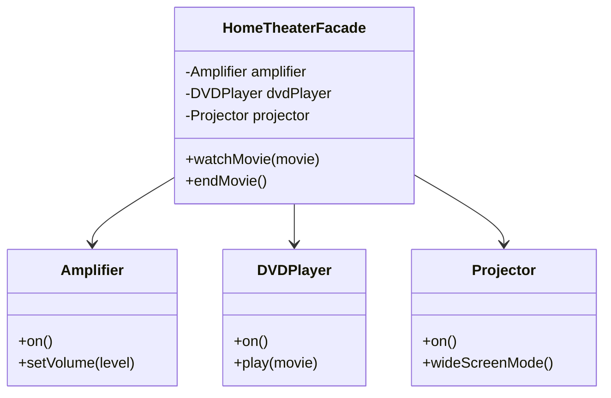

## 6.5 Facade Pattern

In the realm of software design patterns, the Facade Pattern stands out as a powerful tool for simplifying interactions with complex systems. By providing a unified interface, the Facade Pattern allows developers to interact with a subsystem in a more intuitive and manageable way. In this section, we will delve into the intricacies of the Facade Pattern, explore its implementation in PHP, and examine its practical applications.

### Intent of the Facade Pattern

The primary intent of the Facade Pattern is to offer a simplified interface to a complex subsystem. This pattern is particularly useful when dealing with intricate systems that consist of numerous classes and interactions. By encapsulating these complexities within a single facade class, developers can reduce the cognitive load on clients and promote cleaner, more maintainable code.

### Key Participants

1. **Facade**: The facade class provides a simple interface to the complex subsystem. It delegates client requests to appropriate subsystem objects.
2. **Subsystem Classes**: These are the classes that perform the actual work. The facade interacts with these classes to fulfill client requests.
3. **Client**: The client interacts with the facade instead of directly communicating with the subsystem classes.

### Applicability

The Facade Pattern is applicable in scenarios where:
- A complex subsystem needs to be simplified for client interaction.
- There is a need to decouple client code from the subsystem.
- A unified interface is required to manage multiple subsystem interfaces.

### Implementing the Facade Pattern in PHP

Let's explore how to implement the Facade Pattern in PHP by designing a facade class that exposes high-level methods while hiding the complexities of subsystem interactions.

#### Step 1: Define Subsystem Classes

First, we define the subsystem classes that perform the actual work. Consider a scenario where we have a complex system for managing a home theater.

```php
<?php

class Amplifier {
    public function on() {
        echo "Amplifier is on.\n";
    }

    public function setVolume($level) {
        echo "Setting volume to $level.\n";
    }
}

class DVDPlayer {
    public function on() {
        echo "DVD Player is on.\n";
    }

    public function play($movie) {
        echo "Playing movie: $movie.\n";
    }
}

class Projector {
    public function on() {
        echo "Projector is on.\n";
    }

    public function wideScreenMode() {
        echo "Projector in widescreen mode.\n";
    }
}

?>
```

#### Step 2: Create the Facade Class

Next, we create the facade class that provides a simplified interface to the home theater subsystem.

```php
<?php

class HomeTheaterFacade {
    private $amplifier;
    private $dvdPlayer;
    private $projector;

    public function __construct(Amplifier $amp, DVDPlayer $dvd, Projector $proj) {
        $this->amplifier = $amp;
        $this->dvdPlayer = $dvd;
        $this->projector = $proj;
    }

    public function watchMovie($movie) {
        echo "Get ready to watch a movie...\n";
        $this->projector->on();
        $this->projector->wideScreenMode();
        $this->amplifier->on();
        $this->amplifier->setVolume(5);
        $this->dvdPlayer->on();
        $this->dvdPlayer->play($movie);
    }

    public function endMovie() {
        echo "Shutting down the home theater...\n";
        // Add logic to turn off devices
    }
}

?>
```

#### Step 3: Use the Facade in Client Code

Finally, we use the facade in the client code to interact with the home theater system.

```php
<?php

$amp = new Amplifier();
$dvd = new DVDPlayer();
$proj = new Projector();

$homeTheater = new HomeTheaterFacade($amp, $dvd, $proj);
$homeTheater->watchMovie("Inception");

?>
```

### Design Considerations

When implementing the Facade Pattern, consider the following:

- **Simplicity vs. Flexibility**: The facade should simplify the interface without overly restricting access to subsystem functionalities.
- **Subsystem Independence**: The facade should not introduce tight coupling between the client and the subsystem.
- **Extensibility**: Ensure that the facade can be extended to accommodate new functionalities without breaking existing code.

### PHP Unique Features

PHP offers several features that can enhance the implementation of the Facade Pattern:

- **Type Declarations**: Use type declarations to enforce the types of subsystem classes in the facade constructor.
- **Traits**: Leverage traits to share common functionalities across multiple facade classes.
- **Namespaces**: Organize subsystem classes and the facade class into namespaces for better code organization.

### Differences and Similarities with Other Patterns

The Facade Pattern is often confused with the Adapter Pattern. While both patterns provide a simplified interface, the Adapter Pattern focuses on converting one interface into another, whereas the Facade Pattern provides a unified interface to a set of interfaces in a subsystem.

### Use Cases and Examples

The Facade Pattern is widely used in various scenarios:

- **Simplifying Complex APIs**: Use the facade to provide a simplified interface to complex third-party APIs or libraries.
- **Decoupling Client Code**: The facade can decouple client code from complex subsystems, making the codebase more maintainable.
- **Legacy System Integration**: When integrating with legacy systems, a facade can provide a modern interface to outdated subsystems.

### Visualizing the Facade Pattern

To better understand the Facade Pattern, let's visualize the interaction between the client, facade, and subsystem classes using a class diagram.



### Try It Yourself

Experiment with the Facade Pattern by modifying the code examples:

- Add more functionalities to the `HomeTheaterFacade` class, such as `pauseMovie` or `resumeMovie`.
- Introduce additional subsystem classes, like `Lights` or `PopcornMaker`, and integrate them into the facade.
- Create a facade for a different subsystem, such as a smart home system or a car control system.

### Knowledge Check

- What is the primary intent of the Facade Pattern?
- How does the Facade Pattern differ from the Adapter Pattern?
- What are some use cases for the Facade Pattern in PHP?

### Embrace the Journey

Remember, mastering design patterns is an ongoing journey. As you continue to explore and implement patterns like the Facade Pattern, you'll gain deeper insights into creating robust and maintainable PHP applications. Keep experimenting, stay curious, and enjoy the process!

## Quiz: Facade Pattern



### What is the primary intent of the Facade Pattern?

- [x] To provide a simplified interface to a complex subsystem.
- [ ] To convert one interface into another.
- [ ] To encapsulate a group of individual factories.
- [ ] To define a family of algorithms.

> **Explanation:** The Facade Pattern aims to simplify interactions with a complex subsystem by providing a unified interface.

### Which of the following is a key participant in the Facade Pattern?

- [x] Facade
- [ ] Singleton
- [ ] Observer
- [ ] Factory

> **Explanation:** The Facade Pattern involves a facade class that provides a simplified interface to subsystem classes.

### How does the Facade Pattern differ from the Adapter Pattern?

- [x] The Facade Pattern provides a unified interface to a set of interfaces in a subsystem.
- [ ] The Facade Pattern converts one interface into another.
- [ ] The Facade Pattern is used to define a family of algorithms.
- [ ] The Facade Pattern is used to encapsulate a group of individual factories.

> **Explanation:** The Facade Pattern provides a unified interface, while the Adapter Pattern focuses on converting interfaces.

### What is a common use case for the Facade Pattern?

- [x] Simplifying complex APIs
- [ ] Implementing a singleton instance
- [ ] Observing changes in state
- [ ] Creating objects without exposing instantiation logic

> **Explanation:** The Facade Pattern is often used to simplify complex APIs by providing a unified interface.

### Which PHP feature can enhance the implementation of the Facade Pattern?

- [x] Type Declarations
- [ ] Global Variables
- [ ] Singleton Pattern
- [ ] Observer Pattern

> **Explanation:** Type declarations can enforce the types of subsystem classes in the facade constructor, enhancing implementation.

### What should be considered when implementing the Facade Pattern?

- [x] Simplicity vs. Flexibility
- [ ] Singleton vs. Prototype
- [ ] Observer vs. Mediator
- [ ] Factory vs. Builder

> **Explanation:** The facade should simplify the interface without overly restricting access to subsystem functionalities.

### What is the role of the client in the Facade Pattern?

- [x] To interact with the facade instead of directly communicating with the subsystem classes.
- [ ] To convert one interface into another.
- [ ] To define a family of algorithms.
- [ ] To encapsulate a group of individual factories.

> **Explanation:** The client interacts with the facade, which simplifies communication with the subsystem classes.

### What is a benefit of using the Facade Pattern?

- [x] It decouples client code from complex subsystems.
- [ ] It ensures a single instance of a class.
- [ ] It allows objects to be notified of changes.
- [ ] It provides a way to create objects without exposing instantiation logic.

> **Explanation:** The Facade Pattern decouples client code from complex subsystems, promoting maintainability.

### Which of the following is NOT a key participant in the Facade Pattern?

- [x] Singleton
- [ ] Facade
- [ ] Subsystem Classes
- [ ] Client

> **Explanation:** The Singleton is not a key participant in the Facade Pattern.

### True or False: The Facade Pattern can be used to integrate with legacy systems.

- [x] True
- [ ] False

> **Explanation:** The Facade Pattern can provide a modern interface to outdated subsystems, making it useful for legacy system integration.


