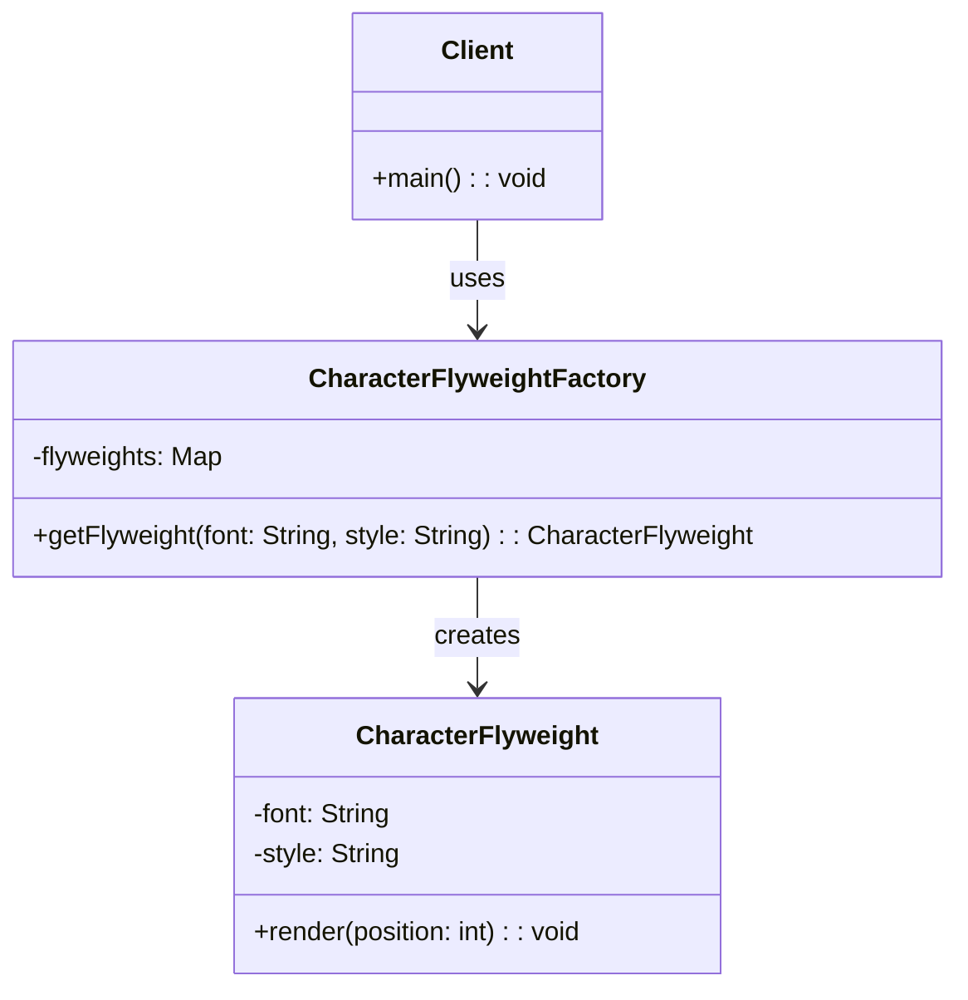

## 6.6 Flyweight Pattern

The Flyweight Pattern is a structural design pattern that focuses on minimizing memory usage by sharing as much data as possible with similar objects. This pattern is particularly useful when dealing with a large number of objects that share common data. By using the Flyweight Pattern, we can significantly reduce the memory footprint of our applications, leading to more efficient and scalable systems.

### Intent

The primary intent of the Flyweight Pattern is to reduce memory usage by sharing intrinsic state among multiple objects. This is achieved by separating the intrinsic state (shared data) from the extrinsic state (unique data) and managing shared flyweight objects through a factory.

### Key Concepts

- **Intrinsic State:** This is the shared data that is common across multiple objects. It is stored in the flyweight object and remains constant.
- **Extrinsic State:** This is the unique data that varies between objects. It is stored outside the flyweight object and passed to it when needed.
- **Flyweight Factory:** This is responsible for creating and managing flyweight objects. It ensures that shared objects are reused and not duplicated.

### Implementing Flyweight in PHP

To implement the Flyweight Pattern in PHP, we need to follow these steps:

1. **Identify Intrinsic and Extrinsic State:** Determine which parts of the object state can be shared and which parts are unique.
2. **Create Flyweight Objects:** Implement a class that represents the flyweight objects, containing the intrinsic state.
3. **Implement a Flyweight Factory:** Develop a factory class that manages the creation and reuse of flyweight objects.
4. **Use Flyweight Objects:** Utilize the flyweight objects in your application, passing extrinsic state as needed.

#### Step-by-Step Implementation

Let's walk through a practical example of implementing the Flyweight Pattern in PHP. We'll create a simple text editor that handles a large number of character objects.

**Step 1: Identify Intrinsic and Extrinsic State**

In our text editor example, the intrinsic state could be the character's font and style, while the extrinsic state could be the character's position in the document.

**Step 2: Create Flyweight Objects**

We'll create a `CharacterFlyweight` class to represent the flyweight objects.

```php
<?php

class CharacterFlyweight
{
    private $font;
    private $style;

    public function __construct($font, $style)
    {
        $this->font = $font;
        $this->style = $style;
    }

    public function render($position)
    {
        echo "Rendering character at position $position with font {$this->font} and style {$this->style}\n";
    }
}
```

**Step 3: Implement a Flyweight Factory**

Next, we'll create a `CharacterFlyweightFactory` class to manage the creation and reuse of flyweight objects.

```php
<?php

class CharacterFlyweightFactory
{
    private $flyweights = [];

    public function getFlyweight($font, $style)
    {
        $key = $this->getKey($font, $style);

        if (!isset($this->flyweights[$key])) {
            $this->flyweights[$key] = new CharacterFlyweight($font, $style);
        }

        return $this->flyweights[$key];
    }

    private function getKey($font, $style)
    {
        return md5($font . $style);
    }
}
```

**Step 4: Use Flyweight Objects**

Finally, we'll demonstrate how to use the flyweight objects in our text editor application.

```php
<?php

$factory = new CharacterFlyweightFactory();

$characters = [
    ['font' => 'Arial', 'style' => 'Bold', 'position' => 1],
    ['font' => 'Arial', 'style' => 'Bold', 'position' => 2],
    ['font' => 'Times New Roman', 'style' => 'Italic', 'position' => 3],
];

foreach ($characters as $char) {
    $flyweight = $factory->getFlyweight($char['font'], $char['style']);
    $flyweight->render($char['position']);
}
```

### Visualizing the Flyweight Pattern

To better understand the Flyweight Pattern, let's visualize the relationship between the flyweight objects, the factory, and the client code.



### Use Cases and Examples

The Flyweight Pattern is particularly useful in scenarios where a large number of similar objects are needed. Some common use cases include:

- **Text Editors:** Managing characters in a document where each character shares the same font and style.
- **Graphics Applications:** Handling graphical elements like shapes or icons that share common attributes.
- **Game Development:** Managing game objects like trees or buildings that have similar properties.

### Design Considerations

When using the Flyweight Pattern, consider the following:

- **Memory vs. Performance Trade-off:** While the Flyweight Pattern reduces memory usage, it may introduce additional complexity in managing extrinsic state.
- **Complexity:** The pattern can add complexity to your codebase, so it's important to weigh the benefits against the potential increase in code complexity.
- **Thread Safety:** If your application is multi-threaded, ensure that the flyweight objects are thread-safe.

### PHP Unique Features

PHP offers several features that can enhance the implementation of the Flyweight Pattern:

- **Associative Arrays:** PHP's associative arrays can be used to efficiently manage and retrieve flyweight objects.
- **Anonymous Functions:** PHP's support for anonymous functions and closures can be leveraged to manage extrinsic state dynamically.
- **Namespaces:** Use PHP namespaces to organize your flyweight classes and factory.

### Differences and Similarities

The Flyweight Pattern is often confused with other design patterns, such as:

- **Singleton Pattern:** While both patterns involve sharing instances, the Singleton Pattern ensures a single instance, whereas the Flyweight Pattern allows multiple shared instances.
- **Prototype Pattern:** The Prototype Pattern focuses on cloning objects, while the Flyweight Pattern focuses on sharing objects.

### Try It Yourself

To deepen your understanding of the Flyweight Pattern, try modifying the code examples:

- **Experiment with Different Fonts and Styles:** Add more fonts and styles to the `CharacterFlyweightFactory` and observe how the flyweight objects are reused.
- **Add Additional Extrinsic State:** Introduce new extrinsic state, such as color or size, and update the `CharacterFlyweight` class accordingly.

### Knowledge Check

- **What is the primary intent of the Flyweight Pattern?**
- **How does the Flyweight Pattern reduce memory usage?**
- **What is the role of the Flyweight Factory?**

### Embrace the Journey

Remember, mastering design patterns is a journey. The Flyweight Pattern is just one tool in your toolbox. As you continue to explore and experiment with design patterns, you'll become more adept at building efficient and scalable PHP applications. Keep experimenting, stay curious, and enjoy the journey!

## Quiz: Flyweight Pattern



### What is the primary intent of the Flyweight Pattern?

- [x] To reduce memory usage by sharing data among similar objects
- [ ] To increase performance by duplicating objects
- [ ] To simplify object creation
- [ ] To enhance security by encrypting data

> **Explanation:** The Flyweight Pattern aims to reduce memory usage by sharing as much data as possible with similar objects.

### Which of the following is considered intrinsic state in the Flyweight Pattern?

- [x] Shared data among objects
- [ ] Unique data for each object
- [ ] Data that changes frequently
- [ ] Data stored outside the flyweight

> **Explanation:** Intrinsic state refers to the shared data that remains constant across multiple objects.

### What is the role of the Flyweight Factory?

- [x] To manage the creation and reuse of flyweight objects
- [ ] To store extrinsic state
- [ ] To handle object destruction
- [ ] To encrypt flyweight data

> **Explanation:** The Flyweight Factory is responsible for creating and managing flyweight objects, ensuring they are reused.

### How does the Flyweight Pattern differ from the Singleton Pattern?

- [x] Flyweight allows multiple shared instances, while Singleton ensures a single instance
- [ ] Flyweight focuses on cloning objects, while Singleton focuses on sharing
- [ ] Flyweight is used for security, while Singleton is used for performance
- [ ] Flyweight is a creational pattern, while Singleton is a structural pattern

> **Explanation:** The Flyweight Pattern allows multiple shared instances, whereas the Singleton Pattern ensures a single instance.

### Which PHP feature can enhance the implementation of the Flyweight Pattern?

- [x] Associative arrays
- [ ] Global variables
- [ ] Static methods
- [ ] Dynamic typing

> **Explanation:** PHP's associative arrays can be used to efficiently manage and retrieve flyweight objects.

### What is an example of extrinsic state in a text editor?

- [x] Character position in the document
- [ ] Font type
- [ ] Text color
- [ ] Document size

> **Explanation:** Extrinsic state refers to unique data, such as the character's position in the document.

### Why might the Flyweight Pattern introduce complexity?

- [x] Due to managing extrinsic state
- [ ] Because it duplicates objects
- [ ] As it requires more memory
- [ ] Because it simplifies object creation

> **Explanation:** The Flyweight Pattern can introduce complexity due to the need to manage extrinsic state separately.

### In which scenario is the Flyweight Pattern most useful?

- [x] When handling a large number of similar objects
- [ ] When creating a single instance of an object
- [ ] When cloning objects
- [ ] When encrypting data

> **Explanation:** The Flyweight Pattern is most useful when dealing with a large number of similar objects that share common data.

### What is a potential trade-off when using the Flyweight Pattern?

- [x] Memory savings vs. increased complexity
- [ ] Performance vs. security
- [ ] Simplicity vs. scalability
- [ ] Speed vs. accuracy

> **Explanation:** The Flyweight Pattern offers memory savings but may introduce additional complexity in managing extrinsic state.

### True or False: The Flyweight Pattern is a creational design pattern.

- [ ] True
- [x] False

> **Explanation:** The Flyweight Pattern is a structural design pattern, not a creational one.


