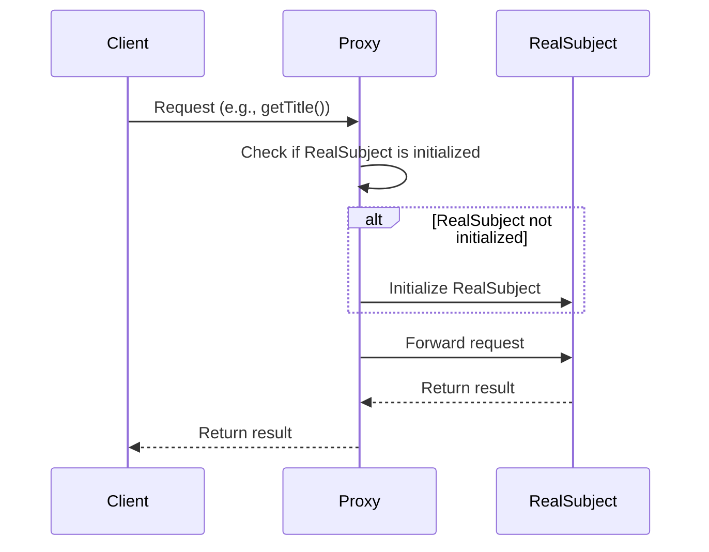

## 6.7 Proxy Pattern

The Proxy Pattern is a structural design pattern that provides a surrogate or placeholder for another object to control access to it. This pattern is particularly useful in scenarios where direct access to an object is either costly or undesirable. By using a proxy, you can introduce additional functionality such as lazy initialization, access control, logging, or even remote access to an object.

### Intent

The primary intent of the Proxy Pattern is to control access to an object. This can be achieved by creating a proxy class that acts as an intermediary between the client and the real subject. The proxy class can perform additional operations before or after forwarding the request to the real subject.

### Key Participants

- **Proxy:** The proxy class that controls access to the real subject. It implements the same interface as the real subject.
- **Real Subject:** The actual object that the proxy represents. The proxy forwards requests to this object.
- **Client:** The entity that interacts with the proxy instead of the real subject.

### Types of Proxies

1. **Virtual Proxy:** Controls access to a resource that is expensive to create. It initializes the resource only when it is needed.
2. **Remote Proxy:** Represents an object located in a different address space. It handles communication between the client and the remote object.
3. **Protective Proxy:** Controls access to a resource based on access rights.
4. **Smart Reference Proxy:** Provides additional functionality such as reference counting or logging.

### Implementing Proxy in PHP

Let's explore how to implement the Proxy Pattern in PHP by creating a proxy class that controls access to a real subject. We'll use a simple example of a `Book` class and a `BookProxy` class.

#### Step 1: Define the Subject Interface

First, define an interface that both the real subject and the proxy will implement. This ensures that the proxy can be used interchangeably with the real subject.

```php
<?php

interface BookInterface {
    public function getTitle(): string;
    public function getAuthor(): string;
}
```

#### Step 2: Implement the Real Subject

Next, implement the real subject class that performs the actual operations.

```php
<?php

class RealBook implements BookInterface {
    private $title;
    private $author;

    public function __construct(string $title, string $author) {
        $this->title = $title;
        $this->author = $author;
    }

    public function getTitle(): string {
        return $this->title;
    }

    public function getAuthor(): string {
        return $this->author;
    }
}
```

#### Step 3: Implement the Proxy Class

Now, implement the proxy class that controls access to the real subject. In this example, the proxy will perform lazy initialization of the `RealBook` object.

```php
<?php

class BookProxy implements BookInterface {
    private $realBook;
    private $title;
    private $author;

    public function __construct(string $title, string $author) {
        $this->title = $title;
        $this->author = $author;
    }

    private function initializeRealBook() {
        if ($this->realBook === null) {
            $this->realBook = new RealBook($this->title, $this->author);
        }
    }

    public function getTitle(): string {
        $this->initializeRealBook();
        return $this->realBook->getTitle();
    }

    public function getAuthor(): string {
        $this->initializeRealBook();
        return $this->realBook->getAuthor();
    }
}
```

#### Step 4: Use the Proxy in Client Code

Finally, use the proxy in your client code. The client interacts with the proxy as if it were the real subject.

```php
<?php

$bookProxy = new BookProxy("Design Patterns", "Erich Gamma");
echo "Title: " . $bookProxy->getTitle() . "\n";
echo "Author: " . $bookProxy->getAuthor() . "\n";
```

### Visualizing the Proxy Pattern

To better understand the Proxy Pattern, let's visualize the interaction between the client, proxy, and real subject using a sequence diagram.



### Use Cases and Examples

The Proxy Pattern is versatile and can be applied in various scenarios. Here are some common use cases:

1. **Lazy Initialization:** Use a virtual proxy to delay the creation of an expensive object until it is needed.
2. **Access Control:** Use a protective proxy to control access to a resource based on user permissions.
3. **Logging:** Use a smart reference proxy to log requests to an object.
4. **Remote Proxy:** Use a remote proxy to interact with an object located in a different address space, such as a web service.

#### Example: Logging with a Smart Reference Proxy

Let's extend our previous example to include logging functionality using a smart reference proxy.

```php
<?php

class LoggingBookProxy implements BookInterface {
    private $realBook;
    private $title;
    private $author;

    public function __construct(string $title, string $author) {
        $this->title = $title;
        $this->author = $author;
    }

    private function initializeRealBook() {
        if ($this->realBook === null) {
            $this->realBook = new RealBook($this->title, $this->author);
        }
    }

    public function getTitle(): string {
        $this->initializeRealBook();
        $this->logAccess("getTitle");
        return $this->realBook->getTitle();
    }

    public function getAuthor(): string {
        $this->initializeRealBook();
        $this->logAccess("getAuthor");
        return $this->realBook->getAuthor();
    }

    private function logAccess(string $method) {
        echo "Logging access to method: $method\n";
    }
}
```

### Design Considerations

When implementing the Proxy Pattern, consider the following:

- **Performance:** While proxies can improve performance through lazy initialization, they can also introduce overhead. Ensure that the benefits outweigh the costs.
- **Complexity:** Proxies add an additional layer of abstraction. Ensure that this complexity is justified by the use case.
- **Security:** Protective proxies can enhance security by controlling access to sensitive resources.

### PHP Unique Features

PHP offers several features that can enhance the implementation of the Proxy Pattern:

- **Magic Methods:** Use PHP's magic methods (e.g., `__get`, `__set`, `__call`) to intercept and handle method calls dynamically.
- **Traits:** Use traits to share common proxy functionality across multiple proxy classes.
- **Anonymous Classes:** Use anonymous classes to create lightweight proxies on the fly.

### Differences and Similarities

The Proxy Pattern is often confused with other patterns such as the Decorator and Adapter patterns. Here are some distinctions:

- **Proxy vs. Decorator:** Both patterns involve wrapping an object, but the Proxy Pattern focuses on controlling access, while the Decorator Pattern focuses on adding behavior.
- **Proxy vs. Adapter:** The Adapter Pattern is used to make two incompatible interfaces compatible, while the Proxy Pattern is used to control access to an object.

### Try It Yourself

To deepen your understanding of the Proxy Pattern, try modifying the code examples:

- Implement a protective proxy that restricts access based on user roles.
- Create a remote proxy that simulates interaction with a web service.
- Experiment with PHP's magic methods to handle dynamic method calls in the proxy.

### Knowledge Check

- What is the primary intent of the Proxy Pattern?
- How does a virtual proxy differ from a remote proxy?
- What are some common use cases for the Proxy Pattern?
- How can PHP's magic methods be used in a proxy implementation?

### Embrace the Journey

Remember, mastering design patterns is a journey. As you experiment with the Proxy Pattern, you'll gain insights into how to control access to objects effectively. Keep exploring, stay curious, and enjoy the process of becoming a more skilled PHP developer!

## Quiz: Proxy Pattern



### What is the primary intent of the Proxy Pattern?

- [x] To control access to an object
- [ ] To add behavior to an object
- [ ] To make interfaces compatible
- [ ] To encapsulate object creation

> **Explanation:** The Proxy Pattern's primary intent is to control access to an object, providing a surrogate or placeholder for it.

### Which type of proxy is used for lazy initialization?

- [x] Virtual Proxy
- [ ] Remote Proxy
- [ ] Protective Proxy
- [ ] Smart Reference Proxy

> **Explanation:** A Virtual Proxy is used for lazy initialization, delaying the creation of an expensive object until it is needed.

### How does a protective proxy differ from a smart reference proxy?

- [x] A protective proxy controls access based on permissions, while a smart reference proxy adds functionality like logging.
- [ ] A protective proxy adds functionality like logging, while a smart reference proxy controls access based on permissions.
- [ ] Both proxies serve the same purpose.
- [ ] Neither proxy controls access.

> **Explanation:** A protective proxy controls access based on permissions, while a smart reference proxy adds functionality like logging.

### What PHP feature can be used to intercept method calls in a proxy?

- [x] Magic Methods
- [ ] Traits
- [ ] Anonymous Classes
- [ ] Interfaces

> **Explanation:** PHP's magic methods (e.g., `__get`, `__set`, `__call`) can be used to intercept and handle method calls dynamically in a proxy.

### Which pattern focuses on adding behavior to an object?

- [ ] Proxy Pattern
- [x] Decorator Pattern
- [ ] Adapter Pattern
- [ ] Singleton Pattern

> **Explanation:** The Decorator Pattern focuses on adding behavior to an object, while the Proxy Pattern focuses on controlling access.

### What is a common use case for a remote proxy?

- [x] Interacting with an object in a different address space
- [ ] Logging requests to an object
- [ ] Restricting access based on user roles
- [ ] Delaying object creation

> **Explanation:** A remote proxy is commonly used to interact with an object located in a different address space, such as a web service.

### How can traits be used in a proxy implementation?

- [x] To share common functionality across multiple proxy classes
- [ ] To intercept method calls dynamically
- [ ] To create lightweight proxies on the fly
- [ ] To control access based on permissions

> **Explanation:** Traits can be used to share common functionality across multiple proxy classes, promoting code reuse.

### What is the difference between a proxy and an adapter?

- [x] A proxy controls access, while an adapter makes interfaces compatible.
- [ ] A proxy makes interfaces compatible, while an adapter controls access.
- [ ] Both serve the same purpose.
- [ ] Neither controls access.

> **Explanation:** A proxy controls access to an object, while an adapter makes two incompatible interfaces compatible.

### Which PHP feature allows for the creation of lightweight proxies on the fly?

- [x] Anonymous Classes
- [ ] Magic Methods
- [ ] Traits
- [ ] Interfaces

> **Explanation:** Anonymous classes in PHP allow for the creation of lightweight proxies on the fly.

### True or False: The Proxy Pattern can introduce performance overhead.

- [x] True
- [ ] False

> **Explanation:** While proxies can improve performance through lazy initialization, they can also introduce overhead due to the additional layer of abstraction.


