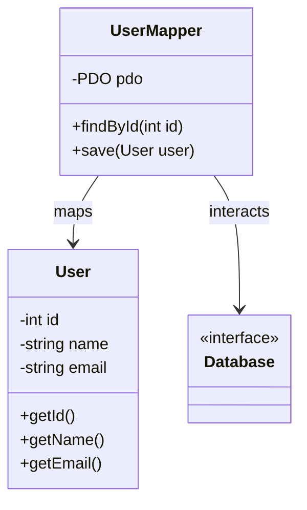

## 6.8 Data Mapper Pattern

The Data Mapper Pattern is a structural design pattern that provides a layer of separation between in-memory objects and the database. This pattern is particularly useful in applications where complex data interactions occur, and there is a need to decouple domain logic from persistence logic. By implementing the Data Mapper Pattern, developers can achieve a clean separation of concerns, enhancing the maintainability and testability of their code.

### Intent

The primary intent of the Data Mapper Pattern is to separate the in-memory representation of data from the database. This separation allows for a more flexible and maintainable codebase, as changes to the database schema do not directly affect the domain logic. The pattern involves creating mapper classes that are responsible for transferring data between objects and storage.

### Key Participants

- **Domain Objects:** These are the in-memory representations of the data. They contain the business logic and are independent of the database.
- **Data Mapper:** This component is responsible for mapping domain objects to database records and vice versa. It handles the persistence logic and ensures that domain objects remain unaware of the database structure.
- **Database:** The storage system where data is persisted. The Data Mapper interacts with the database to perform CRUD (Create, Read, Update, Delete) operations.

### Applicability

The Data Mapper Pattern is applicable in scenarios where:

- There is a need to decouple domain logic from persistence logic.
- The application involves complex data interactions that require a clean separation of concerns.
- Enhancing testability is a priority, as data mappers can be easily mocked during testing.
- The domain model is complex and requires a flexible mapping strategy.

### Implementing Data Mapper in PHP

To implement the Data Mapper Pattern in PHP, follow these steps:

1. **Define Domain Objects:** Create classes that represent the domain entities. These classes should contain the business logic and be independent of the database.

2. **Create Mapper Classes:** Develop mapper classes that handle the mapping between domain objects and database records. These classes should contain methods for CRUD operations.

3. **Implement Persistence Logic:** Within the mapper classes, implement the logic for interacting with the database. This includes establishing database connections, executing queries, and handling transactions.

4. **Ensure Independence:** Ensure that domain objects do not contain any persistence logic. All database interactions should be handled by the mapper classes.

#### Example: Implementing a Data Mapper in PHP

Let's consider a simple example where we have a `User` domain object and a corresponding `UserMapper` class.

```php
<?php

// Domain Object
class User {
    private $id;
    private $name;
    private $email;

    public function __construct($id, $name, $email) {
        $this->id = $id;
        $this->name = $name;
        $this->email = $email;
    }

    // Getters and setters for the properties
    public function getId() {
        return $this->id;
    }

    public function getName() {
        return $this->name;
    }

    public function getEmail() {
        return $this->email;
    }
}

// Data Mapper
class UserMapper {
    private $pdo;

    public function __construct(PDO $pdo) {
        $this->pdo = $pdo;
    }

    public function findById($id) {
        $stmt = $this->pdo->prepare('SELECT * FROM users WHERE id = :id');
        $stmt->execute(['id' => $id]);
        $row = $stmt->fetch();

        if (!$row) {
            return null;
        }

        return new User($row['id'], $row['name'], $row['email']);
    }

    public function save(User $user) {
        if ($user->getId()) {
            $stmt = $this->pdo->prepare('UPDATE users SET name = :name, email = :email WHERE id = :id');
            $stmt->execute([
                'name' => $user->getName(),
                'email' => $user->getEmail(),
                'id' => $user->getId()
            ]);
        } else {
            $stmt = $this->pdo->prepare('INSERT INTO users (name, email) VALUES (:name, :email)');
            $stmt->execute([
                'name' => $user->getName(),
                'email' => $user->getEmail()
            ]);
            $user->setId($this->pdo->lastInsertId());
        }
    }
}

// Usage
$pdo = new PDO('mysql:host=localhost;dbname=test', 'user', 'password');
$userMapper = new UserMapper($pdo);

// Finding a user by ID
$user = $userMapper->findById(1);
echo $user->getName();

// Saving a new user
$newUser = new User(null, 'John Doe', 'john@example.com');
$userMapper->save($newUser);

?>
```

### Design Considerations

- **When to Use:** The Data Mapper Pattern is ideal for applications with complex domain models that require a clear separation between domain logic and persistence logic.
- **Performance:** While the pattern provides a clean separation of concerns, it may introduce additional complexity and overhead. Consider the performance implications when implementing this pattern.
- **Complexity:** The pattern can increase the complexity of the codebase, especially in large applications. Ensure that the benefits of using the pattern outweigh the added complexity.

### PHP Unique Features

PHP offers several features that can enhance the implementation of the Data Mapper Pattern:

- **PDO (PHP Data Objects):** A database access layer providing a uniform method of access to multiple databases. It is used in the example above to interact with the database.
- **Type Declarations:** PHP allows for type declarations, which can be used to enforce type safety in method parameters and return values.
- **Anonymous Classes:** PHP supports anonymous classes, which can be useful for creating lightweight data mappers in scenarios where a full class definition is not necessary.

### Differences and Similarities

The Data Mapper Pattern is often compared to the Active Record Pattern. While both patterns deal with data persistence, they have key differences:

- **Data Mapper:** Separates domain logic from persistence logic, providing a clean separation of concerns. Domain objects are unaware of the database.
- **Active Record:** Combines domain logic and persistence logic within the same class. Domain objects are responsible for their own persistence.

### Visualizing the Data Mapper Pattern

To better understand the Data Mapper Pattern, let's visualize the interaction between the domain objects, data mapper, and database.



### Use Cases and Examples

The Data Mapper Pattern is particularly useful in the following scenarios:

- **Complex Data Interactions:** Applications with complex data interactions benefit from the separation of domain and persistence logic.
- **Testability:** By decoupling domain logic from persistence logic, the pattern enhances testability. Data mappers can be easily mocked during testing, allowing for isolated unit tests.
- **Flexibility:** The pattern provides flexibility in changing the database schema without affecting the domain logic.

### Try It Yourself

To deepen your understanding of the Data Mapper Pattern, try modifying the code example provided:

- **Add New Methods:** Implement additional methods in the `UserMapper` class, such as `delete()` or `findByEmail()`.
- **Extend Domain Logic:** Add more properties and methods to the `User` class to simulate a more complex domain model.
- **Experiment with Different Databases:** Modify the `UserMapper` class to work with a different database, such as PostgreSQL or SQLite.

### Knowledge Check

Before we conclude, let's reinforce our understanding with a few questions:

- What is the primary intent of the Data Mapper Pattern?
- How does the Data Mapper Pattern enhance testability?
- What are the key differences between the Data Mapper and Active Record patterns?

### Embrace the Journey

Remember, mastering design patterns is a journey. As you continue to explore and implement patterns like the Data Mapper, you'll gain a deeper understanding of software architecture and design principles. Keep experimenting, stay curious, and enjoy the journey!

## Quiz: Data Mapper Pattern



### What is the primary intent of the Data Mapper Pattern?

- [x] To separate in-memory objects from the database
- [ ] To combine domain logic and persistence logic
- [ ] To enhance database performance
- [ ] To simplify database queries

> **Explanation:** The primary intent of the Data Mapper Pattern is to separate in-memory objects from the database, ensuring a clean separation of concerns.

### Which component is responsible for mapping domain objects to database records in the Data Mapper Pattern?

- [x] Data Mapper
- [ ] Domain Object
- [ ] Database
- [ ] Controller

> **Explanation:** The Data Mapper is responsible for mapping domain objects to database records and vice versa.

### How does the Data Mapper Pattern enhance testability?

- [x] By decoupling domain logic from persistence logic
- [ ] By combining domain logic and persistence logic
- [ ] By simplifying database queries
- [ ] By reducing code complexity

> **Explanation:** The Data Mapper Pattern enhances testability by decoupling domain logic from persistence logic, allowing for easier mocking and testing.

### What is a key difference between the Data Mapper and Active Record patterns?

- [x] Data Mapper separates domain and persistence logic, while Active Record combines them
- [ ] Data Mapper is faster than Active Record
- [ ] Active Record is more flexible than Data Mapper
- [ ] Data Mapper is easier to implement than Active Record

> **Explanation:** The key difference is that the Data Mapper separates domain and persistence logic, while Active Record combines them within the same class.

### Which PHP feature is commonly used in implementing the Data Mapper Pattern?

- [x] PDO (PHP Data Objects)
- [ ] cURL
- [ ] GD Library
- [ ] XML Parser

> **Explanation:** PDO (PHP Data Objects) is commonly used for database interactions in the Data Mapper Pattern.

### What is the role of domain objects in the Data Mapper Pattern?

- [x] To represent in-memory data and contain business logic
- [ ] To handle database interactions
- [ ] To map data between objects and storage
- [ ] To simplify database queries

> **Explanation:** Domain objects represent in-memory data and contain business logic, independent of the database.

### Which of the following is a benefit of using the Data Mapper Pattern?

- [x] Enhanced testability
- [x] Clean separation of concerns
- [ ] Simplified database queries
- [ ] Reduced code complexity

> **Explanation:** The Data Mapper Pattern provides enhanced testability and a clean separation of concerns.

### What should be avoided in domain objects when using the Data Mapper Pattern?

- [x] Persistence logic
- [ ] Business logic
- [ ] Data validation
- [ ] Method overloading

> **Explanation:** Persistence logic should be avoided in domain objects to maintain a clean separation of concerns.

### Which of the following scenarios is the Data Mapper Pattern particularly useful for?

- [x] Complex data interactions
- [ ] Simple CRUD operations
- [ ] Static websites
- [ ] Real-time applications

> **Explanation:** The Data Mapper Pattern is particularly useful for complex data interactions that require a clean separation of domain and persistence logic.

### True or False: The Data Mapper Pattern combines domain logic and persistence logic within the same class.

- [ ] True
- [x] False

> **Explanation:** False. The Data Mapper Pattern separates domain logic from persistence logic, ensuring a clean separation of concerns.


