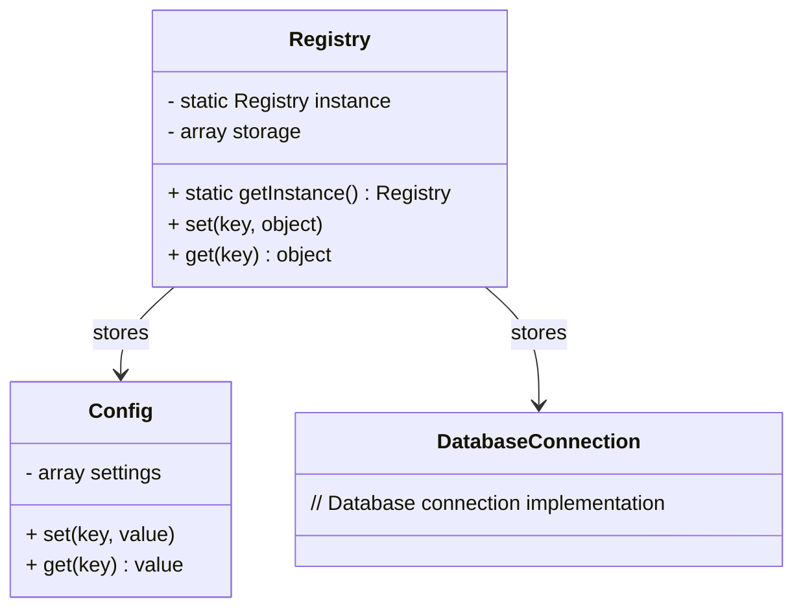

## 6.9 Registry Pattern

The Registry Pattern is a structural design pattern that provides a centralized location for storing and retrieving shared objects and services. It acts as a global object that other objects can use to find common objects and services. This pattern is particularly useful in managing global states in an application and accessing configuration settings or shared resources without resorting to global variables.

### Intent

The primary intent of the Registry Pattern is to provide a well-known object that other objects can use to find common objects and services. By centralizing the storage and retrieval of these objects, the Registry Pattern helps in managing global states and avoiding the use of global variables, which can lead to tightly coupled code and maintenance challenges.

### Implementing Registry in PHP

Implementing the Registry Pattern in PHP involves creating a registry class with static methods to store and retrieve objects. This class acts as a container for shared objects and services, providing a global point of access.

#### Step-by-Step Implementation

1. **Define the Registry Class:**
   Create a class that will act as the registry. This class should have static methods for setting and getting objects.

2. **Store Objects in the Registry:**
   Use an associative array to store objects, with keys representing the object names.

3. **Retrieve Objects from the Registry:**
   Provide methods to retrieve objects from the registry using their keys.

4. **Ensure Singleton Behavior:**
   The registry itself should be a singleton to ensure that there is only one instance of the registry throughout the application.

#### Example Code

Below is an example implementation of the Registry Pattern in PHP:

```php
<?php

class Registry
{
    private static $instance = null;
    private $storage = [];

    // Private constructor to prevent direct instantiation
    private function __construct() {}

    // Get the singleton instance of the registry
    public static function getInstance()
    {
        if (self::$instance === null) {
            self::$instance = new self();
        }
        return self::$instance;
    }

    // Set an object in the registry
    public function set($key, $object)
    {
        $this->storage[$key] = $object;
    }

    // Get an object from the registry
    public function get($key)
    {
        if (isset($this->storage[$key])) {
            return $this->storage[$key];
        }
        throw new Exception("No entry found in registry for key: $key");
    }
}

// Usage
$registry = Registry::getInstance();
$registry->set('config', new Config());
$config = $registry->get('config');

?>
```

### Key Participants

- **Registry Class:** The central class that stores and retrieves objects.
- **Stored Objects:** The objects or services that are stored in the registry.
- **Client Code:** The code that interacts with the registry to store or retrieve objects.

### Applicability

The Registry Pattern is applicable in scenarios where:

- You need a centralized location for storing and retrieving shared objects or services.
- You want to avoid using global variables for managing global states.
- You need to access configuration settings or shared resources across different parts of an application.

### Design Considerations

- **Singleton Nature:** The registry should be a singleton to ensure that there is only one instance of the registry throughout the application.
- **Global State Management:** While the registry provides a way to manage global states, it should be used judiciously to avoid creating tightly coupled code.
- **Performance:** Accessing objects through the registry can introduce a slight performance overhead, so it should be used only when necessary.

### PHP Unique Features

PHP offers several unique features that can be leveraged when implementing the Registry Pattern:

- **Static Methods:** PHP's support for static methods allows for easy implementation of the singleton pattern within the registry.
- **Associative Arrays:** PHP's associative arrays provide a convenient way to store and retrieve objects using keys.
- **Exception Handling:** PHP's exception handling can be used to manage errors when retrieving non-existent objects from the registry.

### Differences and Similarities

The Registry Pattern is often confused with the Singleton Pattern. While both patterns involve a single instance, the Registry Pattern is focused on providing a centralized location for storing and retrieving shared objects, whereas the Singleton Pattern is about ensuring a single instance of a class.

### Use Cases and Examples

#### Accessing Configuration Settings

A common use case for the Registry Pattern is accessing configuration settings across different parts of an application. By storing configuration objects in the registry, you can easily retrieve them wherever needed.

```php
<?php

class Config
{
    private $settings = [];

    public function set($key, $value)
    {
        $this->settings[$key] = $value;
    }

    public function get($key)
    {
        return $this->settings[$key] ?? null;
    }
}

// Store configuration in the registry
$config = new Config();
$config->set('db_host', 'localhost');
$registry->set('config', $config);

// Retrieve configuration from the registry
$config = $registry->get('config');
echo $config->get('db_host'); // Outputs: localhost

?>
```

#### Managing Shared Resources

Another use case is managing shared resources, such as database connections or service instances, which can be stored in the registry for easy access.

```php
<?php

class DatabaseConnection
{
    // Database connection implementation
}

// Store database connection in the registry
$dbConnection = new DatabaseConnection();
$registry->set('db_connection', $dbConnection);

// Retrieve database connection from the registry
$dbConnection = $registry->get('db_connection');

?>
```

### Visualizing the Registry Pattern

To better understand the Registry Pattern, let's visualize it using a class diagram:



### Try It Yourself

To get a better grasp of the Registry Pattern, try modifying the code examples above:

- Add a method to remove objects from the registry.
- Implement a method to check if an object exists in the registry before retrieving it.
- Experiment with storing different types of objects in the registry.

### Knowledge Check

- What is the primary intent of the Registry Pattern?
- How does the Registry Pattern help in managing global states?
- What are the key differences between the Registry Pattern and the Singleton Pattern?

### Embrace the Journey

Remember, the Registry Pattern is just one of many design patterns that can help you write more maintainable and robust PHP code. As you continue to explore design patterns, you'll find that each pattern has its strengths and weaknesses. Keep experimenting, stay curious, and enjoy the journey!

## Quiz: Registry Pattern



### What is the primary intent of the Registry Pattern?

- [x] To provide a well-known object that other objects can use to find common objects and services.
- [ ] To ensure a single instance of a class.
- [ ] To manage object creation.
- [ ] To encapsulate a group of individual factories.

> **Explanation:** The Registry Pattern provides a centralized location for storing and retrieving shared objects and services.

### How does the Registry Pattern help in managing global states?

- [x] By providing a centralized location for storing shared objects.
- [ ] By using global variables.
- [ ] By creating multiple instances of objects.
- [ ] By using local variables.

> **Explanation:** The Registry Pattern centralizes the storage of shared objects, avoiding the use of global variables.

### What is a key difference between the Registry Pattern and the Singleton Pattern?

- [x] The Registry Pattern focuses on storing and retrieving shared objects, while the Singleton Pattern ensures a single instance of a class.
- [ ] The Registry Pattern is used for object creation, while the Singleton Pattern is not.
- [ ] The Registry Pattern is a creational pattern, while the Singleton Pattern is not.
- [ ] The Registry Pattern is used for managing object lifecycles, while the Singleton Pattern is not.

> **Explanation:** The Registry Pattern centralizes object storage, whereas the Singleton Pattern ensures a single instance.

### Which PHP feature is particularly useful for implementing the Registry Pattern?

- [x] Static methods
- [ ] Dynamic typing
- [ ] Anonymous functions
- [ ] Namespaces

> **Explanation:** Static methods allow for easy implementation of the singleton pattern within the registry.

### What is a common use case for the Registry Pattern?

- [x] Accessing configuration settings
- [ ] Managing object creation
- [ ] Implementing complex algorithms
- [ ] Handling user input

> **Explanation:** The Registry Pattern is commonly used for accessing configuration settings across an application.

### How can you ensure that the registry itself is a singleton?

- [x] By using a private constructor and a static method to get the instance.
- [ ] By using global variables.
- [ ] By creating multiple instances of the registry.
- [ ] By using local variables.

> **Explanation:** A private constructor and a static method ensure that there is only one instance of the registry.

### What is a potential drawback of using the Registry Pattern?

- [x] It can introduce a slight performance overhead.
- [ ] It makes code less maintainable.
- [ ] It increases code complexity.
- [ ] It requires global variables.

> **Explanation:** Accessing objects through the registry can introduce a slight performance overhead.

### How can you retrieve an object from the registry?

- [x] By using a key to access the object from the storage array.
- [ ] By using a global variable.
- [ ] By creating a new instance of the object.
- [ ] By using a local variable.

> **Explanation:** Objects are retrieved from the registry using keys to access the storage array.

### What should you do if an object does not exist in the registry?

- [x] Throw an exception.
- [ ] Return a default object.
- [ ] Create a new instance of the object.
- [ ] Use a global variable.

> **Explanation:** Throwing an exception is a common way to handle errors when an object does not exist in the registry.

### True or False: The Registry Pattern is a creational pattern.

- [ ] True
- [x] False

> **Explanation:** The Registry Pattern is a structural pattern, not a creational pattern.


