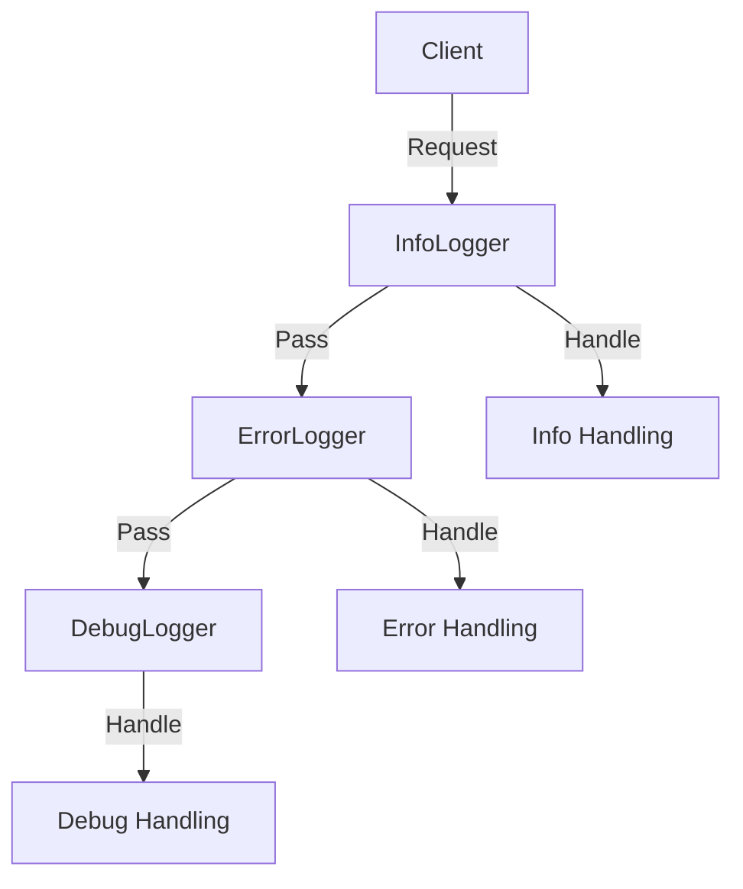

## 7.1 Chain of Responsibility Pattern

The Chain of Responsibility pattern is a behavioral design pattern that allows an object to pass a request along a chain of potential handlers until one of them handles it. This pattern promotes loose coupling in your code by allowing you to chain multiple handlers together without the sender needing to know which handler will process the request.

### Intent

The primary intent of the Chain of Responsibility pattern is to decouple the sender of a request from its receivers by allowing more than one object to handle the request. This is achieved by chaining the receiving objects and passing the request along the chain until an object handles it.

### Key Participants

1. **Handler**: Defines an interface for handling requests and optionally implements the successor link.
2. **ConcreteHandler**: Handles requests it is responsible for and forwards requests to the next handler if it cannot handle the request.
3. **Client**: Initiates the request to a handler in the chain.

### Applicability

Use the Chain of Responsibility pattern when:

- You have multiple objects that can handle a request, and you want to leave it to the handler objects to decide who handles the request.
- You want to issue a request to one of several objects without specifying the receiver explicitly.
- The set of objects that can handle a request should be specified dynamically.

### Implementing Chain of Responsibility in PHP

Let's explore how to implement the Chain of Responsibility pattern in PHP by creating a simple logging system where different loggers handle different levels of logging messages.

#### Step 1: Define the Handler Interface

First, we define a `Logger` interface that declares a method for handling requests and a method for setting the next handler in the chain.

```php
<?php

interface Logger
{
    public function setNext(Logger $logger): Logger;
    public function log(string $message, int $level): void;
}
```

#### Step 2: Create Concrete Handlers

Next, we create concrete handlers that implement the `Logger` interface. Each handler will process the request if it meets certain criteria or pass it to the next handler.

```php
<?php

class InfoLogger implements Logger
{
    private ?Logger $nextLogger = null;

    public function setNext(Logger $logger): Logger
    {
        $this->nextLogger = $logger;
        return $logger;
    }

    public function log(string $message, int $level): void
    {
        if ($level === 1) {
            echo "Info: $message\n";
        } elseif ($this->nextLogger !== null) {
            $this->nextLogger->log($message, $level);
        }
    }
}

class ErrorLogger implements Logger
{
    private ?Logger $nextLogger = null;

    public function setNext(Logger $logger): Logger
    {
        $this->nextLogger = $logger;
        return $logger;
    }

    public function log(string $message, int $level): void
    {
        if ($level === 2) {
            echo "Error: $message\n";
        } elseif ($this->nextLogger !== null) {
            $this->nextLogger->log($message, $level);
        }
    }
}

class DebugLogger implements Logger
{
    private ?Logger $nextLogger = null;

    public function setNext(Logger $logger): Logger
    {
        $this->nextLogger = $logger;
        return $logger;
    }

    public function log(string $message, int $level): void
    {
        if ($level === 3) {
            echo "Debug: $message\n";
        } elseif ($this->nextLogger !== null) {
            $this->nextLogger->log($message, $level);
        }
    }
}
```

#### Step 3: Configure the Chain

Now, we configure the chain of loggers. The client will initiate the request to the first logger in the chain.

```php
<?php

$infoLogger = new InfoLogger();
$errorLogger = new ErrorLogger();
$debugLogger = new DebugLogger();

$infoLogger->setNext($errorLogger)->setNext($debugLogger);

// Client code
$infoLogger->log("This is an information.", 1);
$infoLogger->log("This is an error.", 2);
$infoLogger->log("This is a debug message.", 3);
```

### Visualizing the Chain of Responsibility Pattern

Below is a diagram illustrating the flow of a request through the chain of responsibility:



### Use Cases and Examples

The Chain of Responsibility pattern is widely used in various scenarios, including:

- **Event Handling Systems**: In GUI applications, event handling can be managed by passing events through a chain of handlers until one of them processes the event.
- **Logging Mechanisms**: As demonstrated in the example above, different loggers can handle different levels of logging messages.
- **Middleware in Web Applications**: HTTP requests can be processed by a chain of middleware components, each performing a specific task such as authentication, logging, or data transformation.

### Design Considerations

- **Flexibility**: The Chain of Responsibility pattern provides flexibility in assigning responsibilities to objects. You can easily add or remove handlers from the chain.
- **Performance**: Be cautious of performance implications, as requests may pass through many handlers before being processed.
- **Error Handling**: Ensure that requests are eventually handled, or provide a default handler to catch unhandled requests.

### PHP Unique Features

PHP's dynamic nature and support for anonymous functions and closures make it easy to implement the Chain of Responsibility pattern. You can use closures to define handlers inline, providing a more concise and flexible implementation.

### Differences and Similarities

The Chain of Responsibility pattern is often confused with the Decorator pattern. While both involve chaining objects, the Decorator pattern focuses on adding behavior to objects, whereas the Chain of Responsibility pattern focuses on passing requests along a chain of handlers.

### Try It Yourself

Experiment with the Chain of Responsibility pattern by modifying the code examples:

- Add a new logger for a different log level.
- Change the order of the loggers in the chain.
- Implement a default handler that logs unhandled requests to a file.

### Knowledge Check

- What is the primary intent of the Chain of Responsibility pattern?
- How does the Chain of Responsibility pattern promote loose coupling?
- What are some common use cases for the Chain of Responsibility pattern?

### Embrace the Journey

Remember, this is just the beginning. As you progress, you'll build more complex and interactive applications using the Chain of Responsibility pattern. Keep experimenting, stay curious, and enjoy the journey!

## Quiz: Chain of Responsibility Pattern



### What is the primary intent of the Chain of Responsibility pattern?

- [x] To decouple the sender of a request from its receivers by allowing more than one object to handle the request.
- [ ] To add new functionality to an object without altering its structure.
- [ ] To ensure a class has only one instance and provide a global point of access to it.
- [ ] To define a family of algorithms, encapsulate each one, and make them interchangeable.

> **Explanation:** The Chain of Responsibility pattern allows multiple objects to handle a request, promoting loose coupling between the sender and receivers.

### Which of the following is a key participant in the Chain of Responsibility pattern?

- [x] Handler
- [ ] Singleton
- [ ] Factory
- [ ] Observer

> **Explanation:** The Handler is a key participant that defines an interface for handling requests and optionally implements the successor link.

### In the Chain of Responsibility pattern, what happens if no handler processes the request?

- [x] The request may go unhandled unless a default handler is provided.
- [ ] The request is automatically handled by the first handler.
- [ ] The request is discarded.
- [ ] The request is sent back to the client.

> **Explanation:** If no handler processes the request, it may go unhandled unless a default handler is provided to catch such cases.

### How does the Chain of Responsibility pattern promote flexibility?

- [x] By allowing easy addition or removal of handlers from the chain.
- [ ] By enforcing a strict order of handler execution.
- [ ] By requiring all handlers to process every request.
- [ ] By using a single handler for all requests.

> **Explanation:** The pattern allows easy addition or removal of handlers, providing flexibility in assigning responsibilities.

### Which PHP feature can enhance the implementation of the Chain of Responsibility pattern?

- [x] Anonymous functions and closures
- [ ] Global variables
- [ ] Static methods
- [ ] Inheritance

> **Explanation:** PHP's support for anonymous functions and closures allows for concise and flexible handler definitions.

### What is a common use case for the Chain of Responsibility pattern?

- [x] Middleware in web applications
- [ ] Database connection pooling
- [ ] Singleton instance management
- [ ] Object serialization

> **Explanation:** Middleware in web applications often uses the Chain of Responsibility pattern to process HTTP requests through a series of components.

### How does the Chain of Responsibility pattern differ from the Decorator pattern?

- [x] The Chain of Responsibility focuses on passing requests, while the Decorator focuses on adding behavior.
- [ ] Both patterns are used for adding behavior to objects.
- [ ] The Decorator pattern passes requests along a chain of handlers.
- [ ] The Chain of Responsibility pattern adds behavior to objects.

> **Explanation:** The Chain of Responsibility pattern focuses on passing requests along a chain, whereas the Decorator pattern focuses on adding behavior to objects.

### What should you consider when implementing the Chain of Responsibility pattern?

- [x] Performance implications due to requests passing through multiple handlers.
- [ ] Ensuring all handlers process every request.
- [ ] Using global variables for handler references.
- [ ] Avoiding the use of interfaces.

> **Explanation:** Consider performance implications, as requests may pass through many handlers before being processed.

### Which of the following is not a benefit of the Chain of Responsibility pattern?

- [x] Ensures a single handler processes every request.
- [ ] Promotes loose coupling between sender and receivers.
- [ ] Provides flexibility in assigning responsibilities.
- [ ] Allows dynamic specification of request handlers.

> **Explanation:** The pattern does not ensure a single handler processes every request; it allows multiple handlers to potentially process it.

### True or False: The Chain of Responsibility pattern is often used in event handling systems.

- [x] True
- [ ] False

> **Explanation:** True. The Chain of Responsibility pattern is commonly used in event handling systems to pass events through a chain of handlers.




