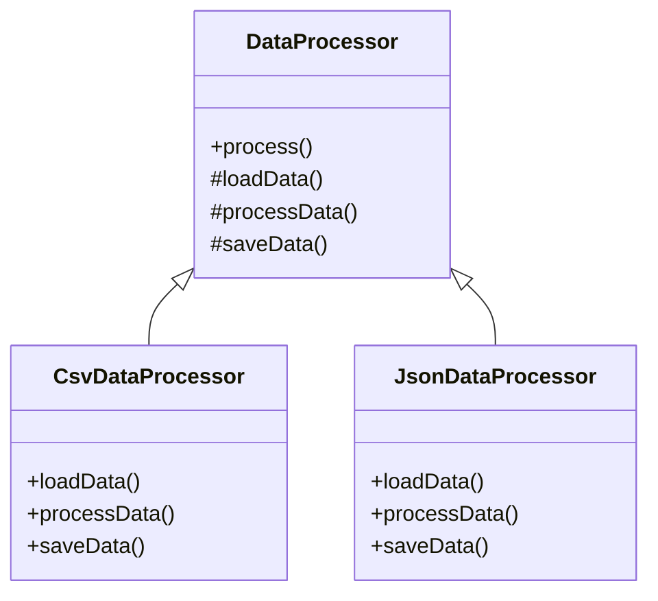

## 7.10 Template Method Pattern

The Template Method Pattern is a fundamental behavioral design pattern that defines the skeleton of an algorithm in a base class, allowing subclasses to override specific steps of the algorithm without changing its structure. This pattern is particularly useful in scenarios where you want to enforce a consistent algorithm structure while allowing flexibility in certain steps.

### Intent

The primary intent of the Template Method Pattern is to define the overall structure of an algorithm in a base class and allow subclasses to provide specific implementations for certain steps. This promotes code reuse and ensures that the algorithm's structure remains consistent across different implementations.

### Implementing Template Method in PHP

In PHP, the Template Method Pattern is typically implemented using abstract classes and methods. The base class defines the template method, which outlines the algorithm's structure. Subclasses then override specific methods to provide custom behavior for certain steps.

#### Abstract Classes and Template Methods

To implement the Template Method Pattern, start by defining an abstract class that contains the template method. This method should call other methods, some of which are abstract and must be implemented by subclasses.

```php
<?php

abstract class DataProcessor
{
    // Template method
    public function process()
    {
        $this->loadData();
        $this->processData();
        $this->saveData();
    }

    // Abstract methods to be implemented by subclasses
    abstract protected function loadData();
    abstract protected function processData();
    abstract protected function saveData();
}

class CsvDataProcessor extends DataProcessor
{
    protected function loadData()
    {
        echo "Loading CSV data...\n";
    }

    protected function processData()
    {
        echo "Processing CSV data...\n";
    }

    protected function saveData()
    {
        echo "Saving processed CSV data...\n";
    }
}

class JsonDataProcessor extends DataProcessor
{
    protected function loadData()
    {
        echo "Loading JSON data...\n";
    }

    protected function processData()
    {
        echo "Processing JSON data...\n";
    }

    protected function saveData()
    {
        echo "Saving processed JSON data...\n";
    }
}

// Client code
$csvProcessor = new CsvDataProcessor();
$csvProcessor->process();

$jsonProcessor = new JsonDataProcessor();
$jsonProcessor->process();
```

In this example, the `DataProcessor` class defines the `process` method, which is the template method. It outlines the steps of the algorithm: loading data, processing data, and saving data. The `CsvDataProcessor` and `JsonDataProcessor` classes provide specific implementations for these steps.

### Use Cases and Examples

The Template Method Pattern is ideal for scenarios where you have multiple classes that share a common algorithm structure but differ in specific steps. Here are some common use cases:

1. **Data Processing Pipelines:** When processing different types of data (e.g., CSV, JSON, XML), you can use the Template Method Pattern to define a consistent processing pipeline while allowing customization for each data type.

2. **Game Development:** In game development, you might have different types of game levels or characters that follow a similar initialization and update process. The Template Method Pattern allows you to define this process in a base class and customize specific steps for each level or character.

3. **UI Components:** When building UI components, you can use the Template Method Pattern to define a common rendering process while allowing customization for specific components.

### Visualizing the Template Method Pattern

To better understand the Template Method Pattern, let's visualize it using a class diagram.



In this diagram, the `DataProcessor` class is the abstract base class that defines the template method `process()`. The `CsvDataProcessor` and `JsonDataProcessor` classes inherit from `DataProcessor` and provide specific implementations for the abstract methods.

### Key Participants

- **Abstract Class (DataProcessor):** Defines the template method and declares abstract methods for steps that need customization.
- **Concrete Classes (CsvDataProcessor, JsonDataProcessor):** Implement the abstract methods to provide specific behavior for each step.

### Applicability

Consider using the Template Method Pattern when:

- You have multiple classes that share a common algorithm structure but differ in specific steps.
- You want to enforce a consistent algorithm structure across different implementations.
- You want to promote code reuse by defining the algorithm's structure in a base class.

### Design Considerations

When using the Template Method Pattern, keep the following considerations in mind:

- **Flexibility vs. Consistency:** The pattern provides flexibility in specific steps while maintaining consistency in the overall algorithm structure.
- **Inheritance Hierarchy:** The pattern relies on inheritance, so it may not be suitable for scenarios where composition is preferred over inheritance.
- **Code Maintenance:** Changes to the algorithm's structure require modifications to the base class, which can impact all subclasses.

### PHP Unique Features

PHP's support for abstract classes and methods makes it well-suited for implementing the Template Method Pattern. Additionally, PHP's dynamic nature allows for flexible and dynamic method overriding, which can be leveraged in this pattern.

### Differences and Similarities

The Template Method Pattern is often compared to the Strategy Pattern. While both patterns involve defining a family of algorithms, the Template Method Pattern defines the algorithm's structure in a base class, whereas the Strategy Pattern encapsulates the algorithm in separate strategy classes.

### Try It Yourself

To deepen your understanding of the Template Method Pattern, try modifying the code examples provided. For instance, add a new data processor class for XML data or introduce additional steps in the processing pipeline.

### Knowledge Check

- How does the Template Method Pattern promote code reuse?
- What are some common use cases for the Template Method Pattern?
- How does the Template Method Pattern differ from the Strategy Pattern?

### Embrace the Journey

Remember, mastering design patterns is a journey. As you continue to explore and apply the Template Method Pattern, you'll gain valuable insights into creating flexible and maintainable code. Keep experimenting, stay curious, and enjoy the journey!

## Quiz: Template Method Pattern



### What is the primary intent of the Template Method Pattern?

- [x] To define the skeleton of an algorithm and allow subclasses to override specific steps.
- [ ] To encapsulate a family of algorithms and make them interchangeable.
- [ ] To provide a way to access elements of an aggregate object sequentially.
- [ ] To define a one-to-many dependency between objects.

> **Explanation:** The Template Method Pattern defines the skeleton of an algorithm in a base class, allowing subclasses to override specific steps.

### Which of the following is a key participant in the Template Method Pattern?

- [x] Abstract Class
- [ ] Interface
- [ ] Singleton
- [ ] Factory

> **Explanation:** The abstract class defines the template method and declares abstract methods for steps that need customization.

### How does the Template Method Pattern promote code reuse?

- [x] By defining the algorithm's structure in a base class and allowing subclasses to customize specific steps.
- [ ] By encapsulating algorithms in separate strategy classes.
- [ ] By providing a way to access elements of an aggregate object sequentially.
- [ ] By defining a one-to-many dependency between objects.

> **Explanation:** The pattern promotes code reuse by defining the algorithm's structure in a base class and allowing subclasses to customize specific steps.

### What is a common use case for the Template Method Pattern?

- [x] Data processing pipelines
- [ ] Singleton pattern implementation
- [ ] Accessing elements of an aggregate object sequentially
- [ ] Defining a one-to-many dependency between objects

> **Explanation:** The Template Method Pattern is commonly used in data processing pipelines where the overall algorithm structure remains constant.

### How does the Template Method Pattern differ from the Strategy Pattern?

- [x] The Template Method Pattern defines the algorithm's structure in a base class, while the Strategy Pattern encapsulates the algorithm in separate strategy classes.
- [ ] The Template Method Pattern encapsulates a family of algorithms and makes them interchangeable, while the Strategy Pattern defines the algorithm's structure in a base class.
- [ ] The Template Method Pattern provides a way to access elements of an aggregate object sequentially, while the Strategy Pattern defines a one-to-many dependency between objects.
- [ ] The Template Method Pattern defines a one-to-many dependency between objects, while the Strategy Pattern provides a way to access elements of an aggregate object sequentially.

> **Explanation:** The Template Method Pattern defines the algorithm's structure in a base class, while the Strategy Pattern encapsulates the algorithm in separate strategy classes.

### What is the role of the concrete class in the Template Method Pattern?

- [x] To implement the abstract methods and provide specific behavior for each step.
- [ ] To define the template method and declare abstract methods.
- [ ] To encapsulate a family of algorithms and make them interchangeable.
- [ ] To provide a way to access elements of an aggregate object sequentially.

> **Explanation:** The concrete class implements the abstract methods to provide specific behavior for each step.

### Which PHP feature is particularly useful for implementing the Template Method Pattern?

- [x] Abstract classes and methods
- [ ] Interfaces
- [ ] Traits
- [ ] Namespaces

> **Explanation:** PHP's support for abstract classes and methods makes it well-suited for implementing the Template Method Pattern.

### What is a potential drawback of using the Template Method Pattern?

- [x] It relies on inheritance, which may not be suitable for scenarios where composition is preferred.
- [ ] It encapsulates a family of algorithms and makes them interchangeable.
- [ ] It provides a way to access elements of an aggregate object sequentially.
- [ ] It defines a one-to-many dependency between objects.

> **Explanation:** The pattern relies on inheritance, which may not be suitable for scenarios where composition is preferred.

### True or False: The Template Method Pattern allows for flexibility in specific steps while maintaining consistency in the overall algorithm structure.

- [x] True
- [ ] False

> **Explanation:** The Template Method Pattern provides flexibility in specific steps while maintaining consistency in the overall algorithm structure.

### Which of the following is NOT a step in implementing the Template Method Pattern?

- [x] Defining a one-to-many dependency between objects
- [ ] Defining an abstract class with a template method
- [ ] Declaring abstract methods for steps that need customization
- [ ] Implementing concrete classes that provide specific behavior for each step

> **Explanation:** Defining a one-to-many dependency between objects is not a step in implementing the Template Method Pattern.


