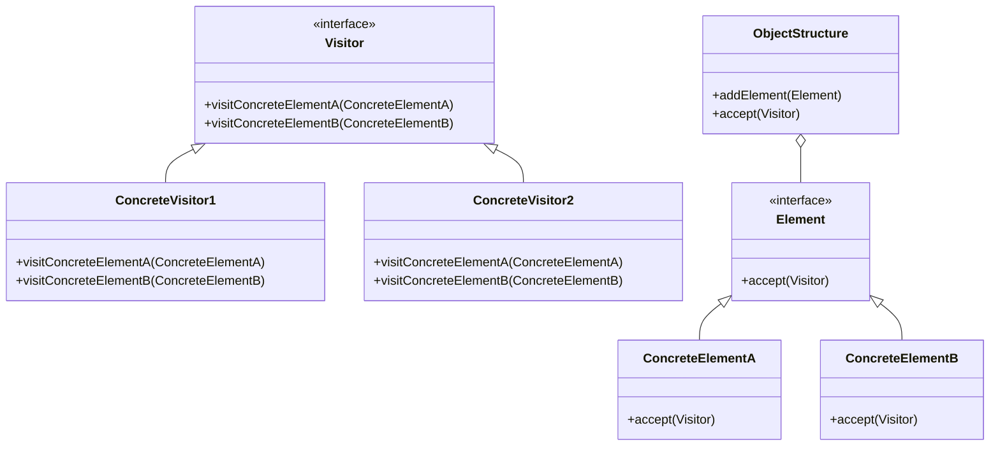

## 7.11 Visitor Pattern

The Visitor Pattern is a behavioral design pattern that allows you to add new operations to existing object structures without modifying their classes. This pattern is particularly useful when dealing with complex object structures, such as those found in compilers or syntax trees, where you need to perform various operations on elements of the structure.

### Intent

The primary intent of the Visitor Pattern is to separate an algorithm from the object structure it operates on. This separation allows you to add new operations without changing the classes of the elements on which it operates. By defining a new visitor, you can implement a new operation over the elements of the object structure.

### Key Participants

1. **Visitor Interface**: Declares a visit operation for each type of concrete element in the object structure.
2. **Concrete Visitor**: Implements the operations defined in the Visitor interface.
3. **Element Interface**: Declares an accept operation that takes a visitor as an argument.
4. **Concrete Element**: Implements the accept operation, which calls the appropriate visit operation on the visitor.
5. **Object Structure**: A collection of elements that can be iterated over, allowing visitors to perform operations on them.

### Applicability

- Use the Visitor Pattern when you need to perform operations on elements of a complex object structure and want to avoid modifying the classes of these elements.
- It is particularly useful when the object structure is stable, but you need to frequently add new operations.
- Ideal for scenarios where operations need to be performed on a composite object structure, such as a file system or a document object model (DOM).

### Implementing Visitor in PHP

Let's explore how to implement the Visitor Pattern in PHP by defining visitor interfaces, concrete visitor classes, and elements that accept visitors to perform operations.

#### Step 1: Define the Visitor Interface

The Visitor interface declares a visit operation for each type of concrete element in the object structure.

```php
<?php

interface Visitor {
    public function visitConcreteElementA(ConcreteElementA $element);
    public function visitConcreteElementB(ConcreteElementB $element);
}
```

#### Step 2: Create Concrete Visitor Classes

Concrete visitors implement the operations defined in the Visitor interface. Each visitor can perform a different operation on the elements.

```php
<?php

class ConcreteVisitor1 implements Visitor {
    public function visitConcreteElementA(ConcreteElementA $element) {
        echo "ConcreteVisitor1: Visiting ConcreteElementA\n";
    }

    public function visitConcreteElementB(ConcreteElementB $element) {
        echo "ConcreteVisitor1: Visiting ConcreteElementB\n";
    }
}

class ConcreteVisitor2 implements Visitor {
    public function visitConcreteElementA(ConcreteElementA $element) {
        echo "ConcreteVisitor2: Visiting ConcreteElementA\n";
    }

    public function visitConcreteElementB(ConcreteElementB $element) {
        echo "ConcreteVisitor2: Visiting ConcreteElementB\n";
    }
}
```

#### Step 3: Define the Element Interface

The Element interface declares an accept operation that takes a visitor as an argument.

```php
<?php

interface Element {
    public function accept(Visitor $visitor);
}
```

#### Step 4: Create Concrete Element Classes

Concrete elements implement the accept operation, which calls the appropriate visit operation on the visitor.

```php
<?php

class ConcreteElementA implements Element {
    public function accept(Visitor $visitor) {
        $visitor->visitConcreteElementA($this);
    }
}

class ConcreteElementB implements Element {
    public function accept(Visitor $visitor) {
        $visitor->visitConcreteElementB($this);
    }
}
```

#### Step 5: Implement the Object Structure

The object structure is a collection of elements that can be iterated over, allowing visitors to perform operations on them.

```php
<?php

class ObjectStructure {
    private $elements = [];

    public function addElement(Element $element) {
        $this->elements[] = $element;
    }

    public function accept(Visitor $visitor) {
        foreach ($this->elements as $element) {
            $element->accept($visitor);
        }
    }
}
```

#### Step 6: Demonstrate the Visitor Pattern

Let's see how the Visitor Pattern works in practice by creating an object structure and applying different visitors to it.

```php
<?php

// Create elements
$elementA = new ConcreteElementA();
$elementB = new ConcreteElementB();

// Create object structure and add elements
$objectStructure = new ObjectStructure();
$objectStructure->addElement($elementA);
$objectStructure->addElement($elementB);

// Create visitors
$visitor1 = new ConcreteVisitor1();
$visitor2 = new ConcreteVisitor2();

// Apply visitors to the object structure
echo "Applying ConcreteVisitor1:\n";
$objectStructure->accept($visitor1);

echo "\nApplying ConcreteVisitor2:\n";
$objectStructure->accept($visitor2);
```

### Design Considerations

- **When to Use**: The Visitor Pattern is best used when you have a stable object structure and need to add new operations frequently.
- **Complexity**: The pattern can introduce complexity due to the need to create multiple visitor classes and interfaces.
- **Double Dispatch**: The pattern relies on double dispatch, where the operation to be executed depends on both the visitor and the element.

### PHP Unique Features

- **Type Hinting**: PHP's type hinting can be used to enforce the types of elements and visitors, ensuring that the correct operations are performed.
- **Anonymous Classes**: PHP's support for anonymous classes can be leveraged to create lightweight visitor implementations for simple operations.

### Differences and Similarities

- **Similar Patterns**: The Visitor Pattern is often compared to the Strategy Pattern, but while the Strategy Pattern focuses on encapsulating algorithms, the Visitor Pattern focuses on operations on object structures.
- **Differences**: Unlike the Strategy Pattern, the Visitor Pattern allows adding new operations without modifying existing classes.

### Use Cases and Examples

The Visitor Pattern is widely used in scenarios where operations need to be performed on complex object structures. Some common use cases include:

- **Compilers**: In compilers, the Visitor Pattern is used to traverse and manipulate syntax trees.
- **Document Processing**: The pattern can be used to apply operations such as formatting, exporting, or analyzing documents.
- **Graphics Rendering**: In graphics applications, the Visitor Pattern can be used to apply rendering operations to different types of graphical elements.

### Visualizing the Visitor Pattern

To better understand the Visitor Pattern, let's visualize the interaction between visitors and elements using a class diagram.



### Try It Yourself

Now that you have a solid understanding of the Visitor Pattern, try modifying the code examples to add new types of elements or visitors. Experiment with different operations and see how the pattern allows you to extend functionality without altering existing classes.

### Knowledge Check

- What is the primary intent of the Visitor Pattern?
- How does the Visitor Pattern differ from the Strategy Pattern?
- What are some common use cases for the Visitor Pattern?

### Embrace the Journey

Remember, mastering design patterns is a journey. The Visitor Pattern is just one of many tools in your software development toolkit. Keep experimenting, stay curious, and enjoy the process of learning and applying new patterns to your projects.

## Quiz: Visitor Pattern



### What is the primary intent of the Visitor Pattern?

- [x] To separate an algorithm from the object structure it operates on
- [ ] To encapsulate algorithms within a single class
- [ ] To allow objects to change their behavior dynamically
- [ ] To simplify complex object structures

> **Explanation:** The Visitor Pattern separates an algorithm from the object structure it operates on, allowing new operations to be added without modifying existing classes.

### Which of the following is a key participant in the Visitor Pattern?

- [x] Visitor Interface
- [ ] Strategy Interface
- [ ] Singleton Class
- [ ] Factory Method

> **Explanation:** The Visitor Interface is a key participant in the Visitor Pattern, declaring visit operations for each type of concrete element.

### When should you consider using the Visitor Pattern?

- [x] When you have a stable object structure and need to add new operations frequently
- [ ] When you need to encapsulate algorithms within a single class
- [ ] When you want to allow objects to change their behavior dynamically
- [ ] When you need to simplify complex object structures

> **Explanation:** The Visitor Pattern is ideal for scenarios where the object structure is stable, but new operations need to be added frequently.

### What is a common use case for the Visitor Pattern?

- [x] Compilers and syntax tree traversals
- [ ] Dynamic behavior changes in objects
- [ ] Simplifying complex object structures
- [ ] Encapsulating algorithms within a single class

> **Explanation:** The Visitor Pattern is commonly used in compilers for traversing and manipulating syntax trees.

### How does the Visitor Pattern differ from the Strategy Pattern?

- [x] The Visitor Pattern focuses on operations on object structures, while the Strategy Pattern encapsulates algorithms
- [ ] The Visitor Pattern allows objects to change behavior dynamically, while the Strategy Pattern does not
- [ ] The Visitor Pattern simplifies complex object structures, while the Strategy Pattern does not
- [ ] The Visitor Pattern encapsulates algorithms, while the Strategy Pattern focuses on operations on object structures

> **Explanation:** The Visitor Pattern focuses on operations on object structures, whereas the Strategy Pattern encapsulates algorithms.

### What is the role of the Concrete Visitor in the Visitor Pattern?

- [x] To implement the operations defined in the Visitor interface
- [ ] To declare the accept operation for elements
- [ ] To encapsulate algorithms within a single class
- [ ] To allow objects to change their behavior dynamically

> **Explanation:** Concrete Visitors implement the operations defined in the Visitor interface, performing specific actions on elements.

### Which PHP feature can be leveraged to create lightweight visitor implementations?

- [x] Anonymous Classes
- [ ] Singleton Pattern
- [ ] Factory Method
- [ ] Dynamic Typing

> **Explanation:** PHP's support for anonymous classes can be leveraged to create lightweight visitor implementations for simple operations.

### What is the purpose of the accept operation in the Visitor Pattern?

- [x] To allow elements to accept a visitor and perform the appropriate operation
- [ ] To encapsulate algorithms within a single class
- [ ] To allow objects to change their behavior dynamically
- [ ] To simplify complex object structures

> **Explanation:** The accept operation allows elements to accept a visitor and perform the appropriate operation defined by the visitor.

### What is double dispatch in the context of the Visitor Pattern?

- [x] A mechanism where the operation to be executed depends on both the visitor and the element
- [ ] A technique for encapsulating algorithms within a single class
- [ ] A method for allowing objects to change their behavior dynamically
- [ ] A process for simplifying complex object structures

> **Explanation:** Double dispatch is a mechanism where the operation to be executed depends on both the visitor and the element, allowing the correct operation to be performed.

### True or False: The Visitor Pattern is ideal for scenarios where the object structure changes frequently.

- [ ] True
- [x] False

> **Explanation:** False. The Visitor Pattern is best suited for scenarios where the object structure is stable, but new operations need to be added frequently.


