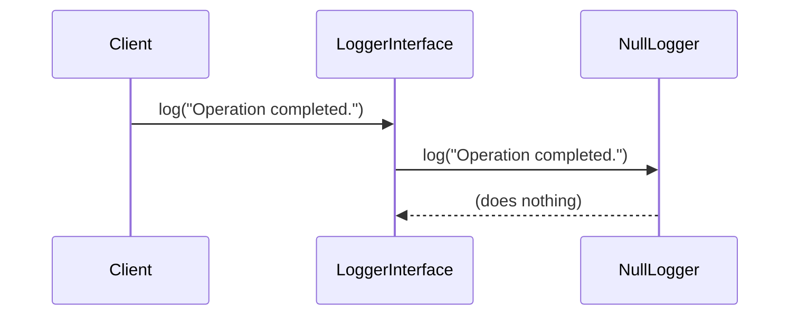

## 7.12 Null Object Pattern

In the realm of software design, handling null references is a common challenge that can lead to cumbersome code filled with null checks. The Null Object Pattern offers a solution by providing a default object that adheres to the expected interface but performs no action. This pattern simplifies code and enhances maintainability by eliminating the need for repetitive null checks.

### Intent

The primary intent of the Null Object Pattern is to provide a default object that does nothing, thereby avoiding null checks. This pattern is particularly useful in scenarios where an object is expected to perform an action, but in some cases, no action is required. By using a null object, we can ensure that the code behaves consistently without the need for conditional logic to handle null references.

### Implementing Null Object in PHP

Implementing the Null Object Pattern in PHP involves creating classes that implement the expected interface but with empty behaviors. Instead of returning null references, we return instances of these null objects. This approach ensures that the client code can interact with the object without worrying about null checks.

#### Step-by-Step Implementation

1. **Define the Interface**: Start by defining an interface that outlines the expected behavior of the objects.

    ```php
    <?php

    interface LoggerInterface {
        public function log(string $message): void;
    }
    ```

2. **Create Concrete Implementations**: Implement the interface with concrete classes that perform the actual behavior.

    ```php
    <?php

    class FileLogger implements LoggerInterface {
        public function log(string $message): void {
            // Code to log message to a file
            echo "Logging to file: $message\n";
        }
    }
    ```

3. **Create the Null Object**: Implement the interface with a null object that performs no action.

    ```php
    <?php

    class NullLogger implements LoggerInterface {
        public function log(string $message): void {
            // Do nothing
        }
    }
    ```

4. **Use the Null Object**: In the client code, use the null object instead of null references.

    ```php
    <?php

    function process(LoggerInterface $logger) {
        // Perform some operations
        $logger->log("Operation completed.");
    }

    $logger = new NullLogger();
    process($logger); // No logging will occur
    ```

### Use Cases and Examples

The Null Object Pattern is particularly useful in scenarios where null checks are prevalent. By using a null object, we can simplify the code and make it more readable.

#### Simplifying Code by Removing Null Checks

Consider a scenario where we have a system that processes various types of notifications. Some notifications require logging, while others do not. Without the Null Object Pattern, we might write code like this:

```php
<?php

function processNotification(?LoggerInterface $logger) {
    // Perform some operations
    if ($logger !== null) {
        $logger->log("Notification processed.");
    }
}

$logger = null; // No logger available
processNotification($logger);
```

With the Null Object Pattern, we can eliminate the null check:

```php
<?php

$logger = new NullLogger();
processNotification($logger); // No logging will occur
```

### Visualizing the Null Object Pattern

To better understand the Null Object Pattern, let's visualize the interaction between the client code and the null object using a sequence diagram.



In this diagram, we see that the client interacts with the `LoggerInterface`, which delegates the call to the `NullLogger`. The `NullLogger` performs no action, effectively ignoring the log request.

### Key Participants

- **Client**: The code that interacts with the object, expecting it to perform certain actions.
- **Interface**: Defines the expected behavior of the objects.
- **Concrete Implementation**: A class that implements the interface and performs the actual behavior.
- **Null Object**: A class that implements the interface but performs no action.

### Applicability

The Null Object Pattern is applicable in scenarios where:

- You want to avoid null checks and simplify code.
- You have optional behavior that can be represented by a default object.
- You want to provide a consistent interface for clients, regardless of whether an action is required.

### Design Considerations

When using the Null Object Pattern, consider the following:

- **Performance**: While the null object performs no action, it still incurs the overhead of method calls. Ensure that this overhead is acceptable in your application.
- **Consistency**: Ensure that the null object adheres to the interface and behaves consistently with other implementations.
- **Documentation**: Clearly document the behavior of the null object to avoid confusion among developers.

### PHP Unique Features

PHP offers several features that can enhance the implementation of the Null Object Pattern:

- **Type Declarations**: Use type declarations to enforce the use of interfaces and ensure that null objects are used consistently.
- **Anonymous Classes**: Consider using anonymous classes for simple null objects that do not require a separate class definition.
- **Traits**: Use traits to share common behavior among null objects, reducing code duplication.

### Differences and Similarities

The Null Object Pattern is often compared to other patterns, such as:

- **Strategy Pattern**: Both patterns involve interchangeable objects that adhere to a common interface. However, the Strategy Pattern focuses on different behaviors, while the Null Object Pattern focuses on no behavior.
- **Decorator Pattern**: The Decorator Pattern adds behavior to objects, while the Null Object Pattern removes behavior by providing a default object.

### Try It Yourself

To gain a deeper understanding of the Null Object Pattern, try modifying the code examples:

- **Add Logging**: Implement a `ConsoleLogger` that logs messages to the console. Use it in place of the `NullLogger` to see the difference in behavior.
- **Extend the Interface**: Add a new method to the `LoggerInterface` and implement it in both the `FileLogger` and `NullLogger`.
- **Use Anonymous Classes**: Replace the `NullLogger` with an anonymous class that implements the `LoggerInterface`.

### Knowledge Check

- What is the primary intent of the Null Object Pattern?
- How does the Null Object Pattern simplify code?
- What are the key participants in the Null Object Pattern?
- How can PHP's type declarations enhance the implementation of the Null Object Pattern?
- What are the differences between the Null Object Pattern and the Strategy Pattern?

### Embrace the Journey

Remember, the Null Object Pattern is just one of many design patterns that can enhance your PHP development skills. As you continue to explore design patterns, you'll discover new ways to simplify code, improve maintainability, and create robust applications. Keep experimenting, stay curious, and enjoy the journey!

## Quiz: Null Object Pattern



### What is the primary intent of the Null Object Pattern?

- [x] To provide a default object that does nothing, avoiding null checks.
- [ ] To enhance performance by reducing method calls.
- [ ] To add behavior to objects dynamically.
- [ ] To simplify the creation of complex objects.

> **Explanation:** The Null Object Pattern provides a default object that adheres to the expected interface but performs no action, thereby avoiding null checks.

### How does the Null Object Pattern simplify code?

- [x] By removing the need for null checks.
- [ ] By adding additional logging functionality.
- [ ] By reducing the number of classes needed.
- [ ] By enhancing the performance of method calls.

> **Explanation:** The Null Object Pattern simplifies code by removing the need for null checks, allowing the client code to interact with objects without conditional logic.

### Which of the following is a key participant in the Null Object Pattern?

- [x] Null Object
- [ ] Singleton
- [ ] Factory
- [ ] Proxy

> **Explanation:** The Null Object is a key participant in the Null Object Pattern, providing a default implementation that performs no action.

### How can PHP's type declarations enhance the implementation of the Null Object Pattern?

- [x] By enforcing the use of interfaces.
- [ ] By reducing the number of method calls.
- [ ] By adding additional logging functionality.
- [ ] By simplifying the creation of complex objects.

> **Explanation:** PHP's type declarations can enforce the use of interfaces, ensuring that null objects are used consistently and adhere to the expected behavior.

### What is a difference between the Null Object Pattern and the Strategy Pattern?

- [x] The Null Object Pattern focuses on no behavior, while the Strategy Pattern focuses on different behaviors.
- [ ] The Null Object Pattern adds behavior to objects, while the Strategy Pattern removes behavior.
- [ ] The Null Object Pattern is used for object creation, while the Strategy Pattern is used for object behavior.
- [ ] The Null Object Pattern is a structural pattern, while the Strategy Pattern is a creational pattern.

> **Explanation:** The Null Object Pattern focuses on providing a default object with no behavior, while the Strategy Pattern involves interchangeable objects with different behaviors.

### Which PHP feature can be used to create simple null objects without a separate class definition?

- [x] Anonymous Classes
- [ ] Traits
- [ ] Namespaces
- [ ] Magic Methods

> **Explanation:** Anonymous classes in PHP can be used to create simple null objects without the need for a separate class definition.

### What is a potential performance consideration when using the Null Object Pattern?

- [x] Method calls to the null object still incur overhead.
- [ ] The null object may add additional logging functionality.
- [ ] The null object may reduce the number of classes needed.
- [ ] The null object may enhance the performance of method calls.

> **Explanation:** While the null object performs no action, method calls to the null object still incur overhead, which should be considered in performance-sensitive applications.

### Which of the following is NOT a benefit of the Null Object Pattern?

- [ ] Simplifies code by removing null checks.
- [ ] Provides a consistent interface for clients.
- [x] Enhances performance by reducing method calls.
- [ ] Improves code readability and maintainability.

> **Explanation:** The Null Object Pattern does not enhance performance by reducing method calls; it simplifies code by removing null checks and providing a consistent interface.

### What is a common use case for the Null Object Pattern?

- [x] Providing a default object for optional behavior.
- [ ] Creating complex objects with multiple dependencies.
- [ ] Adding behavior to objects dynamically.
- [ ] Enhancing performance by reducing method calls.

> **Explanation:** A common use case for the Null Object Pattern is providing a default object for optional behavior, allowing the client code to interact with objects without conditional logic.

### True or False: The Null Object Pattern is often used to add behavior to objects.

- [ ] True
- [x] False

> **Explanation:** False. The Null Object Pattern is used to provide a default object with no behavior, not to add behavior to objects.


