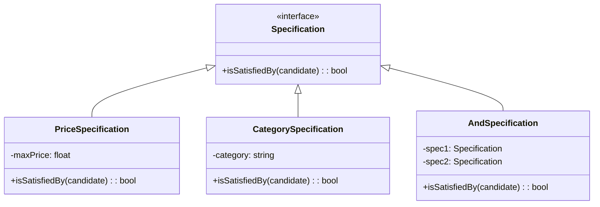

## 7.13 Specification Pattern

The Specification Pattern is a powerful tool in the realm of behavioral design patterns, particularly useful in PHP for encapsulating business rules that can be easily combined and reused. This pattern allows developers to create flexible and maintainable code by defining rules as objects, which can then be combined using logical operators. Let's delve into the intricacies of the Specification Pattern, its implementation in PHP, and explore practical use cases with examples.

### Intent

The primary intent of the Specification Pattern is to encapsulate business rules in a way that allows them to be easily combined, reused, and modified. This pattern is particularly useful when dealing with complex validation logic or filtering criteria. By representing rules as objects, the Specification Pattern enables developers to create a more modular and flexible codebase.

### Key Concepts

- **Specification Interface:** Defines a contract for specifications with an `isSatisfiedBy` method.
- **Composite Specifications:** Combine multiple specifications using logical operators like AND, OR, and NOT.
- **Reusability and Flexibility:** Specifications can be reused across different parts of the application, promoting code reuse and flexibility.

### Implementing Specification in PHP

Let's explore how to implement the Specification Pattern in PHP. We'll start by defining a basic specification interface and then build upon it with composite specifications.

#### Defining the Specification Interface

The first step is to define a specification interface with an `isSatisfiedBy` method. This method will take an object as a parameter and return a boolean indicating whether the object satisfies the specification.

```php
<?php

interface Specification {
    public function isSatisfiedBy($candidate): bool;
}
```

#### Creating Concrete Specifications

Next, we'll create concrete specifications that implement the `Specification` interface. For example, let's consider a scenario where we have a `Product` class, and we want to filter products based on certain criteria.

```php
<?php

class Product {
    private $price;
    private $category;

    public function __construct($price, $category) {
        $this->price = $price;
        $this->category = $category;
    }

    public function getPrice() {
        return $this->price;
    }

    public function getCategory() {
        return $this->category;
    }
}

class PriceSpecification implements Specification {
    private $maxPrice;

    public function __construct($maxPrice) {
        $this->maxPrice = $maxPrice;
    }

    public function isSatisfiedBy($candidate): bool {
        return $candidate->getPrice() <= $this->maxPrice;
    }
}

class CategorySpecification implements Specification {
    private $category;

    public function __construct($category) {
        $this->category = $category;
    }

    public function isSatisfiedBy($candidate): bool {
        return $candidate->getCategory() === $this->category;
    }
}
```

#### Combining Specifications

To combine specifications, we can create composite specifications using logical operators. Let's implement an `AndSpecification` that combines two specifications.

```php
<?php

class AndSpecification implements Specification {
    private $spec1;
    private $spec2;

    public function __construct(Specification $spec1, Specification $spec2) {
        $this->spec1 = $spec1;
        $this->spec2 = $spec2;
    }

    public function isSatisfiedBy($candidate): bool {
        return $this->spec1->isSatisfiedBy($candidate) && $this->spec2->isSatisfiedBy($candidate);
    }
}
```

#### Using the Specification Pattern

Let's see how we can use the Specification Pattern to filter products based on price and category.

```php
<?php

$product1 = new Product(100, 'Electronics');
$product2 = new Product(200, 'Books');
$product3 = new Product(150, 'Electronics');

$priceSpec = new PriceSpecification(150);
$categorySpec = new CategorySpecification('Electronics');
$andSpec = new AndSpecification($priceSpec, $categorySpec);

$products = [$product1, $product2, $product3];
$filteredProducts = array_filter($products, function($product) use ($andSpec) {
    return $andSpec->isSatisfiedBy($product);
});

foreach ($filteredProducts as $product) {
    echo "Product Price: " . $product->getPrice() . ", Category: " . $product->getCategory() . "\n";
}
```

### Visualizing the Specification Pattern

To better understand the Specification Pattern, let's visualize the structure using a class diagram.



### Use Cases and Examples

The Specification Pattern is particularly useful in scenarios where complex validation or filtering logic is required. Here are some common use cases:

- **Complex Validations:** Use the Specification Pattern to encapsulate complex validation logic, such as user input validation or business rule enforcement.
- **Filtering Criteria:** Apply the pattern to filter collections of objects based on dynamic criteria, such as filtering products in an e-commerce application.
- **Business Rules:** Implement business rules as specifications, allowing for easy modification and extension of rules without altering existing code.

### Design Considerations

When using the Specification Pattern, consider the following:

- **Complexity:** While the pattern provides flexibility, it can introduce complexity if overused. Use it judiciously for scenarios where it adds value.
- **Performance:** Combining multiple specifications can impact performance, especially with large datasets. Optimize specifications to minimize performance overhead.
- **Reusability:** Design specifications to be reusable across different parts of the application, promoting code reuse and maintainability.

### PHP Unique Features

PHP offers several unique features that can enhance the implementation of the Specification Pattern:

- **Anonymous Classes:** Use anonymous classes to create specifications on-the-fly without defining separate classes.
- **Traits:** Leverage traits to share common logic among specifications, reducing code duplication.
- **Type Declarations:** Utilize PHP's type declarations to enforce type safety in specifications, improving code reliability.

### Differences and Similarities

The Specification Pattern is often compared to other patterns like the Strategy Pattern and the Composite Pattern. Here are some key differences and similarities:

- **Specification vs. Strategy:** Both patterns encapsulate logic, but the Specification Pattern focuses on business rules, while the Strategy Pattern focuses on algorithms.
- **Specification vs. Composite:** The Composite Pattern is used to treat individual objects and compositions uniformly, while the Specification Pattern is used to combine business rules.

### Try It Yourself

To deepen your understanding of the Specification Pattern, try modifying the code examples:

- **Add a new specification:** Create a new specification for filtering products based on a different attribute, such as brand or rating.
- **Combine specifications:** Experiment with combining multiple specifications using different logical operators, such as OR or NOT.
- **Optimize performance:** Implement caching or other optimization techniques to improve the performance of specifications with large datasets.

### Knowledge Check

- **What is the primary intent of the Specification Pattern?**
- **How can you combine multiple specifications in PHP?**
- **What are some common use cases for the Specification Pattern?**

### Embrace the Journey

Remember, mastering design patterns is a journey. The Specification Pattern is just one of many tools in your toolkit. As you continue to explore and experiment, you'll gain a deeper understanding of how to create flexible and maintainable code. Keep experimenting, stay curious, and enjoy the journey!

## Quiz: Specification Pattern



### What is the primary intent of the Specification Pattern?

- [x] To encapsulate business rules that can be combined easily.
- [ ] To encapsulate algorithms that can be swapped easily.
- [ ] To provide a way to create objects without specifying their concrete classes.
- [ ] To define a family of algorithms, encapsulate each one, and make them interchangeable.

> **Explanation:** The Specification Pattern is designed to encapsulate business rules that can be easily combined and reused.

### How can you combine multiple specifications in PHP?

- [x] Using logical operators like AND, OR, and NOT.
- [ ] Using inheritance to extend specifications.
- [ ] By implementing a factory method.
- [ ] By using a singleton pattern.

> **Explanation:** Specifications can be combined using logical operators like AND, OR, and NOT to create composite specifications.

### Which method is typically defined in a specification interface?

- [x] isSatisfiedBy
- [ ] execute
- [ ] validate
- [ ] combine

> **Explanation:** The `isSatisfiedBy` method is typically defined in a specification interface to determine if a candidate satisfies the specification.

### What is a common use case for the Specification Pattern?

- [x] Complex validations and filtering criteria.
- [ ] Creating objects without specifying their concrete classes.
- [ ] Defining a family of algorithms.
- [ ] Managing object lifecycles.

> **Explanation:** The Specification Pattern is commonly used for complex validations and filtering criteria.

### Which PHP feature can enhance the implementation of the Specification Pattern?

- [x] Anonymous Classes
- [ ] Singleton Pattern
- [ ] Factory Pattern
- [ ] Observer Pattern

> **Explanation:** PHP's anonymous classes can be used to create specifications on-the-fly without defining separate classes.

### What is a potential drawback of using the Specification Pattern?

- [x] It can introduce complexity if overused.
- [ ] It cannot be combined with other patterns.
- [ ] It is not suitable for encapsulating business rules.
- [ ] It is not reusable.

> **Explanation:** While the Specification Pattern provides flexibility, it can introduce complexity if overused.

### How does the Specification Pattern differ from the Strategy Pattern?

- [x] The Specification Pattern focuses on business rules, while the Strategy Pattern focuses on algorithms.
- [ ] The Specification Pattern focuses on algorithms, while the Strategy Pattern focuses on business rules.
- [ ] Both patterns focus on encapsulating algorithms.
- [ ] Both patterns focus on creating objects without specifying their concrete classes.

> **Explanation:** The Specification Pattern focuses on encapsulating business rules, while the Strategy Pattern focuses on encapsulating algorithms.

### What is the role of the `isSatisfiedBy` method in the Specification Pattern?

- [x] To determine if a candidate satisfies the specification.
- [ ] To execute a strategy.
- [ ] To create a new object.
- [ ] To manage object lifecycles.

> **Explanation:** The `isSatisfiedBy` method is used to determine if a candidate satisfies the specification.

### Which pattern is often compared to the Specification Pattern?

- [x] Composite Pattern
- [ ] Factory Pattern
- [ ] Observer Pattern
- [ ] Singleton Pattern

> **Explanation:** The Composite Pattern is often compared to the Specification Pattern because both involve combining components.

### True or False: The Specification Pattern is used to create objects without specifying their concrete classes.

- [ ] True
- [x] False

> **Explanation:** The Specification Pattern is not used for creating objects; it is used for encapsulating and combining business rules.



---
