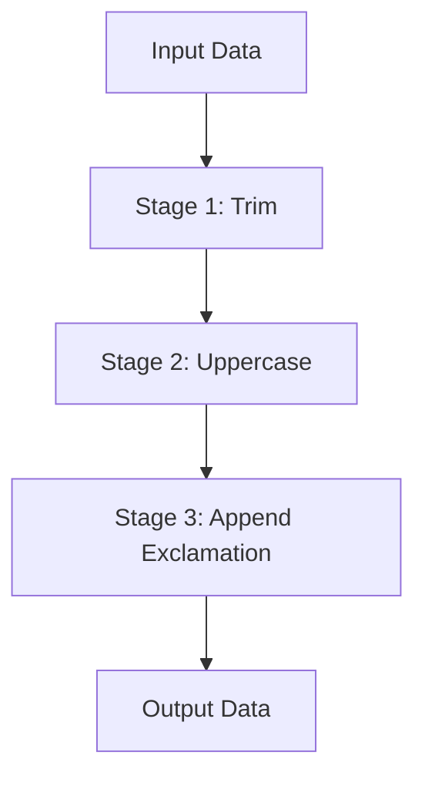

## 7.14 Pipeline Pattern

The Pipeline Pattern is a powerful design pattern that allows developers to process data through a series of stages, each transforming the data in some way. This pattern is particularly useful in scenarios where data needs to be processed in a sequential and modular manner. By breaking down the processing into discrete stages, the Pipeline Pattern promotes code reusability, maintainability, and scalability.

### Intent

The primary intent of the Pipeline Pattern is to process data through a sequence of stages, where each stage performs a specific transformation or operation on the data. This pattern is akin to an assembly line in a factory, where each station performs a specific task, and the product moves from one station to the next until it is complete.

### Implementing Pipeline in PHP

To implement the Pipeline Pattern in PHP, we need to create pipeline stages as callable functions or methods and chain these stages to process data sequentially. Let's explore how to achieve this step-by-step.

#### Step 1: Define the Pipeline Interface

First, we define an interface for our pipeline. This interface will ensure that all pipelines have a consistent method for processing data.

```php
<?php

interface PipelineInterface
{
    public function pipe(callable $stage): self;
    public function process($payload);
}
```

#### Step 2: Implement the Pipeline Class

Next, we implement the `Pipeline` class that adheres to the `PipelineInterface`. This class will manage the stages and execute them in sequence.

```php
<?php

class Pipeline implements PipelineInterface
{
    private $stages = [];

    public function pipe(callable $stage): self
    {
        $this->stages[] = $stage;
        return $this;
    }

    public function process($payload)
    {
        return array_reduce(
            $this->stages,
            function ($carry, $stage) {
                return $stage($carry);
            },
            $payload
        );
    }
}
```

**Explanation:**

- **`pipe` Method:** Adds a stage to the pipeline. Each stage is a callable that takes the current payload and returns a transformed payload.
- **`process` Method:** Uses `array_reduce` to sequentially apply each stage to the payload, passing the result of one stage as the input to the next.

#### Step 3: Create Pipeline Stages

Pipeline stages are simply callables (functions or methods) that perform a specific transformation on the data. Let's create a few example stages.

```php
<?php

function trimStage($input)
{
    return trim($input);
}

function uppercaseStage($input)
{
    return strtoupper($input);
}

function appendExclamationStage($input)
{
    return $input . '!';
}
```

#### Step 4: Use the Pipeline

Now that we have our pipeline and stages, we can use them to process data.

```php
<?php

$pipeline = new Pipeline();

$result = $pipeline
    ->pipe('trimStage')
    ->pipe('uppercaseStage')
    ->pipe('appendExclamationStage')
    ->process('  hello world  ');

echo $result; // Outputs: HELLO WORLD!
```

### Use Cases and Examples

The Pipeline Pattern is versatile and can be applied to various scenarios in PHP development. Here are some common use cases:

#### Data Processing

In data processing applications, the Pipeline Pattern can be used to clean, transform, and analyze data in a structured manner. For example, processing a CSV file might involve stages for parsing, validating, and transforming data before storing it in a database.

#### Middleware Layers

In web applications, middleware layers can be implemented using the Pipeline Pattern. Each middleware component acts as a stage that processes the request and response objects, adding functionality such as authentication, logging, or caching.

### Visualizing the Pipeline Pattern

To better understand the flow of data through a pipeline, let's visualize the process using a Mermaid.js diagram.



**Diagram Explanation:**

- **Nodes:** Represent the input data, stages, and output data.
- **Edges:** Indicate the flow of data from one stage to the next.

### Design Considerations

When implementing the Pipeline Pattern, consider the following:

- **Stage Independence:** Ensure that each stage is independent and focuses on a single responsibility. This makes it easier to test and maintain.
- **Error Handling:** Implement robust error handling within each stage to manage exceptions and ensure the pipeline can recover or fail gracefully.
- **Performance:** Be mindful of the performance impact of each stage, especially in data-intensive applications.

### PHP Unique Features

PHP offers several unique features that can enhance the implementation of the Pipeline Pattern:

- **Anonymous Functions and Closures:** Use anonymous functions and closures to define pipeline stages inline, making the code more concise and readable.
- **Type Declarations:** Leverage PHP's type declarations to enforce input and output types for stages, improving code reliability.
- **Traits:** Use traits to share common functionality across multiple pipeline stages.

### Differences and Similarities

The Pipeline Pattern is often compared to the Chain of Responsibility Pattern. While both involve passing data through a series of handlers, the key difference is that the Pipeline Pattern always processes all stages, whereas the Chain of Responsibility Pattern may stop processing once a handler has dealt with the request.

### Try It Yourself

To deepen your understanding of the Pipeline Pattern, try modifying the code examples:

- **Add a New Stage:** Create a new stage that reverses the string and add it to the pipeline.
- **Change the Order:** Experiment with changing the order of stages to see how it affects the output.
- **Handle Errors:** Introduce error handling in one of the stages and observe how it impacts the pipeline.

### Knowledge Check

- **Question:** What is the primary intent of the Pipeline Pattern?
- **Exercise:** Implement a pipeline that processes an array of numbers, filtering out odd numbers and doubling the even numbers.

### Embrace the Journey

Remember, mastering design patterns like the Pipeline Pattern is a journey. As you continue to explore and apply these patterns, you'll develop more robust and maintainable PHP applications. Keep experimenting, stay curious, and enjoy the process!

## Quiz: Pipeline Pattern



### What is the primary intent of the Pipeline Pattern?

- [x] To process data through a sequence of stages, each transforming the data.
- [ ] To handle requests by passing them through a chain of handlers.
- [ ] To create a single instance of a class.
- [ ] To separate the construction of a complex object from its representation.

> **Explanation:** The Pipeline Pattern is designed to process data through a series of stages, each performing a specific transformation.

### How are pipeline stages typically implemented in PHP?

- [x] As callable functions or methods.
- [ ] As classes with a single method.
- [ ] As global variables.
- [ ] As static methods.

> **Explanation:** Pipeline stages are implemented as callable functions or methods that transform the data.

### What method is used to add a stage to a pipeline in the provided example?

- [x] `pipe`
- [ ] `addStage`
- [ ] `append`
- [ ] `include`

> **Explanation:** The `pipe` method is used to add a stage to the pipeline.

### Which PHP feature can be used to define pipeline stages inline?

- [x] Anonymous functions and closures.
- [ ] Global variables.
- [ ] Static methods.
- [ ] Constants.

> **Explanation:** Anonymous functions and closures allow defining pipeline stages inline, making the code concise.

### What is a key difference between the Pipeline Pattern and the Chain of Responsibility Pattern?

- [x] The Pipeline Pattern always processes all stages, while the Chain of Responsibility may stop processing once a handler has dealt with the request.
- [ ] The Pipeline Pattern is used for creating objects, while the Chain of Responsibility is used for handling requests.
- [ ] The Pipeline Pattern is specific to PHP, while the Chain of Responsibility is not.
- [ ] The Pipeline Pattern is used for data processing, while the Chain of Responsibility is used for data storage.

> **Explanation:** The Pipeline Pattern processes all stages, whereas the Chain of Responsibility may stop processing once a handler has dealt with the request.

### What is a common use case for the Pipeline Pattern in web applications?

- [x] Middleware layers.
- [ ] Database connections.
- [ ] User authentication.
- [ ] Session management.

> **Explanation:** Middleware layers in web applications often use the Pipeline Pattern to process requests and responses.

### Which PHP feature can enhance the implementation of the Pipeline Pattern by enforcing input and output types?

- [x] Type declarations.
- [ ] Global variables.
- [ ] Static methods.
- [ ] Constants.

> **Explanation:** Type declarations enforce input and output types, improving code reliability.

### What is a benefit of using the Pipeline Pattern?

- [x] It promotes code reusability, maintainability, and scalability.
- [ ] It simplifies database connections.
- [ ] It reduces the need for error handling.
- [ ] It eliminates the need for testing.

> **Explanation:** The Pipeline Pattern promotes code reusability, maintainability, and scalability by breaking down processing into discrete stages.

### True or False: The Pipeline Pattern can only be used for data processing.

- [ ] True
- [x] False

> **Explanation:** The Pipeline Pattern can be used for various scenarios, including data processing and middleware layers.

### Which method is used to execute the pipeline and process the data?

- [x] `process`
- [ ] `execute`
- [ ] `run`
- [ ] `start`

> **Explanation:** The `process` method is used to execute the pipeline and process the data.




