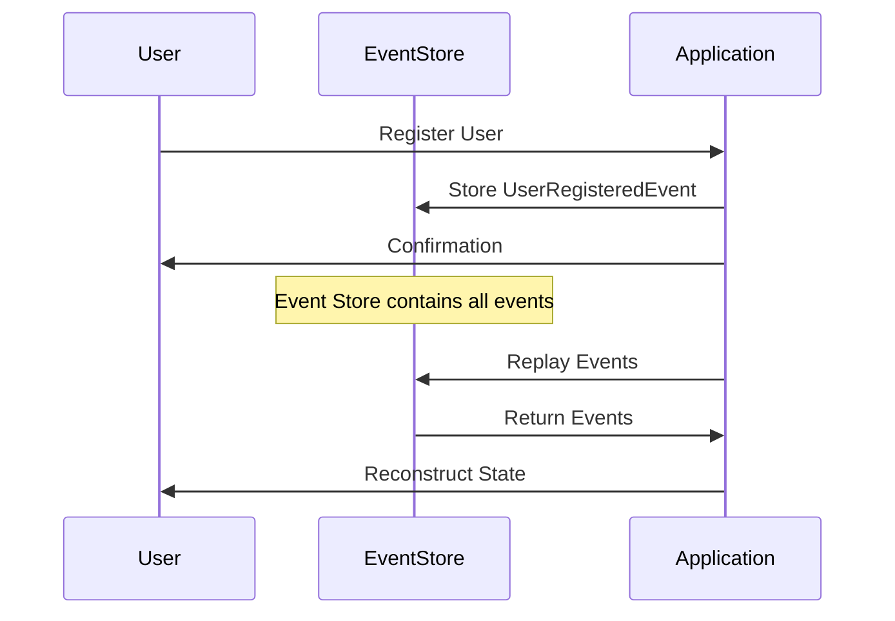

## 7.15 Event Sourcing Pattern

### Intent

The Event Sourcing Pattern is a powerful design pattern that focuses on storing changes to an application's state as a sequence of events. This approach allows developers to reconstruct the state of an application at any point in time by replaying these events. It is particularly useful for applications that require auditing, temporal queries, and complex data histories.

### Understanding Event Sourcing

Event Sourcing is a design pattern where state changes are captured as a series of events. Instead of storing just the current state of an entity, every change is recorded as an event. This allows for a complete history of changes, enabling the reconstruction of past states and the ability to audit changes over time.

#### Key Concepts

- **Event**: A record of a change in state. Events are immutable and represent facts that have occurred in the system.
- **Event Store**: A database or storage system that holds all events. It acts as the source of truth for the application's state.
- **Event Replay**: The process of reconstructing the current state by replaying all events from the event store.
- **Projection**: A derived view of the event data, often used to create read models or views for querying.

### Implementing Event Sourcing in PHP

Implementing Event Sourcing in PHP involves several steps, including recording events, storing them in an event store, and replaying them to reconstruct the state.

#### Recording Events

Events are typically recorded as objects that encapsulate the details of the change. Each event should include information such as the type of change, the entity affected, and any relevant data.

```php
<?php

class UserRegisteredEvent
{
    private string $userId;
    private string $email;
    private DateTimeImmutable $occurredOn;

    public function __construct(string $userId, string $email)
    {
        $this->userId = $userId;
        $this->email = $email;
        $this->occurredOn = new DateTimeImmutable();
    }

    public function getUserId(): string
    {
        return $this->userId;
    }

    public function getEmail(): string
    {
        return $this->email;
    }

    public function getOccurredOn(): DateTimeImmutable
    {
        return $this->occurredOn;
    }
}
```

#### Storing Events

Events are stored in an event store, which can be implemented using a database or a specialized event storage system. Each event is stored with its metadata, such as the timestamp and event type.

```php
<?php

class EventStore
{
    private array $events = [];

    public function append(Event $event): void
    {
        $this->events[] = $event;
    }

    public function getEvents(): array
    {
        return $this->events;
    }
}
```

#### Replaying Events

To reconstruct the state of an entity, events are replayed in the order they occurred. This involves applying each event to an initial state to derive the current state.

```php
<?php

class User
{
    private string $userId;
    private string $email;

    public function apply(UserRegisteredEvent $event): void
    {
        $this->userId = $event->getUserId();
        $this->email = $event->getEmail();
    }
}

function replayEvents(array $events): User
{
    $user = new User();
    foreach ($events as $event) {
        $user->apply($event);
    }
    return $user;
}
```

### Use Cases and Examples

Event Sourcing is particularly beneficial in scenarios where a detailed history of changes is required. Some common use cases include:

- **Auditing**: Event Sourcing provides a complete audit trail of changes, making it easy to track who made changes and when.
- **Temporal Queries**: By replaying events, you can reconstruct the state of the system at any point in time, enabling temporal queries.
- **Complex Data Histories**: Applications with complex data histories, such as financial systems, can benefit from the detailed event logs.

### Visualizing Event Sourcing

To better understand how Event Sourcing works, let's visualize the process using a sequence diagram.



### Design Considerations

When implementing Event Sourcing, consider the following:

- **Event Versioning**: As your application evolves, you may need to change the structure of events. Implement versioning to handle changes gracefully.
- **Performance**: Replaying a large number of events can be resource-intensive. Consider using snapshots to reduce the number of events that need to be replayed.
- **Consistency**: Ensure that events are stored consistently and that the event store is the single source of truth.

### PHP Unique Features

PHP offers several features that can be leveraged when implementing Event Sourcing:

- **Anonymous Classes**: Use anonymous classes to create lightweight event handlers.
- **Traits**: Use traits to share common event handling logic across multiple classes.
- **Namespaces**: Organize your event classes and handlers using PHP namespaces for better code organization.

### Differences and Similarities

Event Sourcing is often confused with the Command Query Responsibility Segregation (CQRS) pattern. While both patterns can be used together, they serve different purposes. Event Sourcing focuses on storing state changes as events, while CQRS separates read and write operations.

### Try It Yourself

To deepen your understanding of Event Sourcing, try modifying the code examples provided. For instance, add new event types, implement a projection to create a read model, or explore using a database as an event store.

### Knowledge Check

- What is the primary benefit of using Event Sourcing?
- How does Event Sourcing differ from traditional state storage?
- What are some common use cases for Event Sourcing?

### Embrace the Journey

Remember, mastering Event Sourcing is a journey. As you continue to explore this pattern, you'll discover new ways to leverage it in your applications. Keep experimenting, stay curious, and enjoy the journey!

## Quiz: Event Sourcing Pattern



### What is the primary benefit of using Event Sourcing?

- [x] It provides a complete history of changes.
- [ ] It simplifies database queries.
- [ ] It reduces storage requirements.
- [ ] It eliminates the need for backups.

> **Explanation:** Event Sourcing provides a complete history of changes by storing every state change as an event, allowing for detailed auditing and temporal queries.

### How does Event Sourcing differ from traditional state storage?

- [x] It records changes as events rather than storing the current state.
- [ ] It uses less storage space.
- [ ] It requires a relational database.
- [ ] It eliminates the need for data validation.

> **Explanation:** Event Sourcing records changes as events, enabling the reconstruction of past states, unlike traditional storage which only keeps the current state.

### What is an event in the context of Event Sourcing?

- [x] A record of a change in state.
- [ ] A database transaction.
- [ ] A user action.
- [ ] A system error.

> **Explanation:** In Event Sourcing, an event is a record of a change in state, representing a fact that has occurred in the system.

### What is the role of an event store?

- [x] To hold all events as the source of truth.
- [ ] To execute database queries.
- [ ] To manage user sessions.
- [ ] To store application logs.

> **Explanation:** The event store holds all events and acts as the source of truth for the application's state.

### Which of the following is a common use case for Event Sourcing?

- [x] Auditing
- [ ] User authentication
- [x] Temporal queries
- [ ] Static content delivery

> **Explanation:** Event Sourcing is commonly used for auditing and temporal queries due to its ability to store a complete history of changes.

### What is a projection in Event Sourcing?

- [x] A derived view of event data.
- [ ] A database index.
- [ ] A user interface component.
- [ ] A network protocol.

> **Explanation:** A projection is a derived view of event data, often used to create read models or views for querying.

### How can performance be improved when replaying events?

- [x] By using snapshots.
- [ ] By increasing server memory.
- [x] By reducing event size.
- [ ] By using a faster network.

> **Explanation:** Using snapshots can improve performance by reducing the number of events that need to be replayed to reconstruct the state.

### What is a key consideration when implementing Event Sourcing?

- [x] Event versioning
- [ ] Database normalization
- [ ] User interface design
- [ ] Network latency

> **Explanation:** Event versioning is important to handle changes in event structure as the application evolves.

### Can Event Sourcing be used with CQRS?

- [x] Yes
- [ ] No

> **Explanation:** Event Sourcing can be used with CQRS, as they complement each other by separating read and write operations and storing state changes as events.

### True or False: Event Sourcing eliminates the need for backups.

- [ ] True
- [x] False

> **Explanation:** Event Sourcing does not eliminate the need for backups. While it provides a complete history of changes, backups are still necessary for data recovery and protection against data loss.




